##### cuộc SÔNG NAM GIỚI

Kết hôn, con cái, công việc, các khoản vay ngân hàng, hóa đơn v.v -có vẻ như như là những việc lâu bền kê’ từ khi bạn mang mốì quan tâm đến một phụ nữ. Nhưng với trách nhiệm không tránh khỏi của tuổi tác khiến cho bạn gặp trở ngại để chu toàn các vấn đề trên đây.

HÃY KIỂM SOÁT cuộc ĐỜI CỦA BẠN

Đê’ kiểm soát cuộc đời của bạn có nghĩa là trước hết bạn phải hiểu lý do vì sao có lúc bạn cảm thây mất kiểm soát.

Phải chăng thời biểu của bạn quá dày đặc đến nỗi việc đi lấy quần áo giặt ủi hay sửa cũng làm cho bạn trở nên cáu kỉnh. Nếu như bạn than phiền về những việc nhỏ nhặt mà bạn dược yêu cầu làm để giúp đỡ gia đình hay bạn bè khi cần thiết, hãy ngẫm nghĩ lại xem tại sao. Nếu như đô’ rác hoặc nấu bữa tối có vẻ như chiếm quá nhiều thời gian của bạn, hãy tưởng tượng xem sẽ ra sao nếu một thảm họa như cơn bạo bệnh, sự tan vỡ xảy ra. Một cuộc khủng hoảng sẽ thử thách sự ưu tiên của bạn và

cách duy nhất để làm chủ cuộc đời là hiểu và hành động theo những thứ tự ưu tiên này.

Chơi đùa với trẻ em: một người đàn ông khỏe mạnh, có câm xúc phải quân bình cuộc sống gia đình và nhu cầu công việc.

ĐẾN LÚC ĐÁNH GIÁ

Trước tiên đê’ hiểu việc bạn định giá trị như thế nào là đánh giá chúng. Đặt bàn tay lên trái tim, nhiều đàn ông xem gia đình và bạn bè là trên hết. Nhưng làm thì tốt hơn là chỉ nói suông. Cách thức bạn sử dụng thời gian và tiên bạc cho biết bạn đạt tầm quan trọng ở đâu.

Hãy khảo sát các chi phiếu và nhật ký của bạn . Tới một mức nào đó, công việc sẽ thay thế gia đình và bạn bè vì đó là điều mà nhiều người trong chúng ta tôn thờ và yêu quí. Nhưng nếu đê’ công việc điều khiển cuộc đời bạn thì bạn sẽ không bao giờ mãn nguyện.

có phải BẠN LÀ MỘT KẺ NGHIỆN CÔNG VIỆC KHÔNG?             I

Lằm việc cật lực, tận tâm, cống hiến, những điều này từng là chìa khóa đem đến sự thịnh vượng; tuy nhiên, vấn đề này đã càng ngày càng là một nỗi ám ảnh tệ hại cho nhiều nam giới. Những tay nghiện việc tự thú đã sử dụng công việc như một cách để thích nghi với cuộc sống giống như kẻ nghiện rượu sử dụng chất cồn. Bạn có thể là một người nghiện việc nếu như:

- • Bạn làm việc khuya; làm cuối tuần và luôn mang việc về nhà.

- • Bạn mang việc vào giường ngủ.

- • Bạn cảm thấy tội lỗi khi không làm việc.

- • Bạn thường từ chối đi nghỉ.

- • Danh sách ưu tiên của bạn không có gia đình, bạn bè, và thư giãn giải trí.

- • Bạn bắt đầu quên cả sinh nhật trọng đại trong gia đình và các ngày lễ kỷ niệm.

- • Bạn có ít bạn bè và sở thích. Không tham dự sinh hoạt xã hội bên ngoài công việc.

- • Bạn chủ yếu sống bằng thức ăn vặt.

- • Công việc làm bạn nhức đầu, đau lưng và đau dạ dày.

- • Bạn bị cột chặt vào giấy tờ điện thoại dị động, và máy laptop

- • Bất kể là việc lớn hay việc nhỏ mà người khác nhờ bạn giúp đỡ đều khiến bạn cảm thấy phiền toái.

- • Bạn cho là công việc không thể hoằn thành trừ khi bạn tự làm nó.

- • Sự kỳ vọng của bạn chỉ là nguồn căng thẳng

- • Bạn chấp nhận thêm việc ngay cả khi bạn ngập đầu với công việc.

- • Công việc là một loại thuốc gây nghiện. Sự thử thách lên cao đến nỗi bạn không thể có mối quan hệ hoặc hoạt động nào khác

Điều đó có vẻ nghịch lý nhưng văn phòng không phải là môi trường mà phần lớn nam giới có thể kiểm soát được mặc dù đó là nơi họ dành nhiều thời gian nhất. Tại nơi làm việc, phần lớn nam giới học cách kiểm soát xúc cảm trong khi cố tranh giành quyền lực, sự thăng tiến, danh vọng và tiền tài. Một số bắt đầu lơ là đến việc chăm sóc vẻ bề ngoài sao cho phù hợp để có vẻ ưa nhìn trước người khác. Thường thì đàn ông cũng sẽ hy sinh để phát huy những cái khác nữa, những cái mang giá trị nhân văn hơn để làm xao động người khác, để kiếm nhiều tiền và địa vị hơn.

Tuy nhiên, một cuộc sống mất cân đối sẽ dẫn đến hàng loạt các vấn đề bao gồm việc ngăn bạn phát triển những kỹ năng xã hội mà bạn có thể rất cần để đạt được tầm quan trọng của nghề nghiệp mà bạn đang khao khát. Suy cho cùng tất cả chúng ta đều muốn hưởng thụ ngay bây giờ và khi kết thúc cuộc hành trình của cuộc đời - sự ra đi vĩnh viễn là điều không thể tránh khỏi.

###### HÃY HỌC CÁCH CHẤP NHẬN

Hãy nghiêm túc đánh giá các mối quan hệ chính yếu của bạn đặc biệt là quan hệ gia đình. Đàn ông đôi lúc hay ra oai với các thành viên khác trong gia đình và cách tiếp cận độc đáo của họ thường làm cho người thân cảm thấy bị xúc phạm vì những lời đao to búa lớn.

Hãy cố nhân từ với sự hay thay đổi và sự nhập nhằng của cuộc sống mà đừng áp đặt nó theo ý mình. Hãy cho phép vợ, con bạn theo lối sống riêng của họ. Để trở nên một người tốt bụng hòa nhã cần đòi hỏi thực hành các kỹ năng khác với những điều bạn đã học và áp dụng tại nơi làm việc.

HÃY Tự CHO PHÉP MÌNH ĐƯỢC THƯ GIÃN

Cũng nên học cách chăm sóc bản thân tốt hơn. Hãy học cách thưởng thức lợi ích của việc thư giãn và thời gian nhàn rỗi nếu không vì bất cứ lý do nào khác để trầm trọng hóa vai trò của bạn trong công việc. Hãy đi nghỉ định kỳ để tái tạo năng lượng. Theo đuổi một sở thích mà bạn dam mê nếu chỉ mất vài giờ mỗi tuần.

Nghiên cứu cho thây thao tác trong công việc bị suy giảm đối với những người không thư giãn đều đặn hằng ngày. Hãy cố thay đổi môi trường của bạn trong mỗi 15 hay 30 phút mỗi ngày. Hãy đi dạo hoặc nếu bạn không thể tìm ra một nơi thoải mái, hãy tưởng tượng mình đang ở một nơi yêu thích chẳng hạn như tại bờ biển Địa Trung Hải hoặc đang chơi bóng đá. Bạn cần có thời gian thư giãn ngắn nhưng hoàn toàn không tách rời với nơi làm việc. Nếu như bạn chỉ dừng lại ở việc sứ dụng thời gian giải lao chỉ để nghỉ cách giải quyết một vấn đề trong công việc thì bạn sẽ không có được giây phút thư giãn cần thiết.

Phần thưởng cho bạn sẽ là một cuộc sống trường thọ hơn và hoàn hảo hơn. Trong vòng 80 năm qua, tuổi thọ của nam giới đã tăng lên từ 52 đến 74 theo thông kê của các chính phủ trên thế giới nhờ vào việc ngày càng nhiều nam giới tham gia chăm sóc sức khỏe tinh thần, thể chất của mình tốt hơn.

BẠN CÓ BIẾT?

Hôn nhân tốt cho sức khỏe của bạn. Một cuộc nghiên cứu tại 16 nước phương Tây cho thấy rằng tỉ lệ người chết trong số những người đằn ông không kết hôn cao gấp hai lần những người đàn ông có kết hôn. Những người đàn ông kết hôn ít bị những bệnh về thể xác và tâm thần hơn, đồng thời họ sống hạnh phúc hơn những người không kết hôn.

TẠI SAO PHỤ Xứ SỐNG LÂl HƠN ĐÀX ÔNG?

Chúng ta đã trãi qua một thời gian dài từ 1919, khi đó đàn ông ở nước Anh chỉ sông tới 52 tuổi và phụ nữ là 55. Sự cải tiến trong lĩnh vực y khoa, hệ thống vệ sinh và nhà ở đã làm tăng tuổi thọ trung bình của đàn ông lên tới 72 và phụ nữ là 79. Dĩ nhiên, đôi với nhiều nước đang phát triển vẫn còn cả một đoạn đường dài chẳng hạn như ở một phần của châu Phi, đàn ông và phụ nữ phải may mắn lắm mới đạt tới độ tuổi 40.

Phổ biến trên thế giới với một ít ngoại lệ đó là đàn bà thọ hơn đàn ông. Tại sao? Thật ra ít nhất là tại các nước phương Tây có vẻ như đàn ông lại có kẻ thù đáng sợ nhất chính là bản thân họ. Họ thích hút thuốc và uống rượu nhiều hơn phụ nữ và cũng thường có lối sống kém lành mạnh hơn. Phụ nữ thường dễ tìm sự hỗ trợ y tế hơn đàn ông. Sự căng thẳng cũng lại là một tác

nhân đi kèm với sát thủ đáng sợ nữa của đàn ông - đó chính lằ bệnh tim

mạch. Nhiều người đàn ông tìm sự thư giãn qua rượu - thứ đem lại hậu quả đen tốì cho sức khỏe của họ. Và trong khi chúng ta ca ngợi sự quả cảm của kẻ đóng thế, đó cũng chính là nguy cơ tương tự có thể đưa nam giởi đến thảm

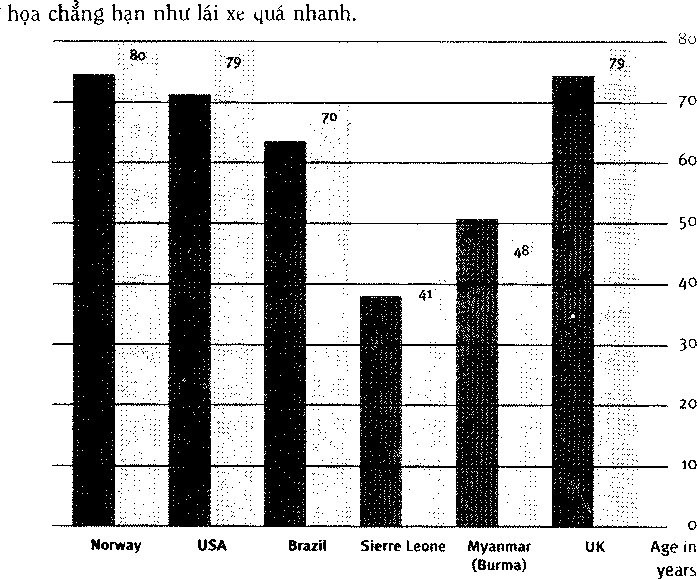

Tại các nước giàu cũng như nghèo, tuổi thọ cũa phụ nữ thường cao hơn đần ông. ở đây Myanmar là một ngoại lệ, có lẽ do bởi tỉ lệ trẻ sơ sinh chết cao.                                   . Men Women

##### Mộ T LỐI SỐNG LÀNH MẠNH

Duy trì một lối sống lành mạnh có nghĩa là có một cách sống cân bằng, và tìm thấy niềm vui hài hòa về thể chất và tinh thần mà không bỏ qua bất kỳ điều gì trong đó.

Hỏi: Đôi vồi người bị nhồi máu cơ tim, hoạt động nào có nguy cơ gây ra cơn nhồi máu cơ tim khác - hoạt động tình dục hay hoạt động ra khỏi giường vào buổi sáng.

Trả lời: Nguy cơ là ngang nhau trên 1/50000 người.

Hỏi: Loại nước ngọt phổ biến nào được dùng để trị nhức đau?

Trả lời: Coca - cola.

LOẠI Bỏ THÓI QUEN XẤU

Nhiều người trong chúng ta phát triển một loạt thói quen không lành mạnh để thích nghi với sự căng thẳng trong cuộc sống hằng ngày. Ngay cả khi chúng ta muốn thay đổi, chúng ta thường lập lại sai lầm này trong giai đoạn khủng hoảng.

Một phần quan trọng trong cuộc sống lành mạnh là loại bỏ thói quen xấu. Và điều đó cần có thời gian. Để có được thói quen mới cần ít nhất hai hoặc ba tuần mới thấy được sự tiến bộ. Tốt hơn hết là nên bình tĩnh cố gắng thực hành thói quen lành mạnh mới trong vòng 90 ngày. Nếu bạn làm được như thế, bạn sẽ có được một cuộc sống lành mạnh hơn và thích đáng hơn.

###### ĐỪNG ĐỂ KHÓI VÀO MẮT BẠN

Điều quan trọng trên hết là nếu bạn là người hút thuốc, hãy bỏ thuốc ngay lập tức. Đó là cách tốt nhất và an toàn nhất để cải thiện sức khỏe của bạn. Không nghi ngờ gì bạn đã quen thuộc với tất cả những tranh luận về việc chống hút thuốc vì vậy, chúng ta hãy có một quyết định sáng suốt cho cuộc đời mình. Bạn suy nghĩ thử xem , liệu các công ty thuốc lá quyền lực chi hàng tỷ đồng lại đồng ý cho in cảnh báo "thuốc lá có hại cho sức khỏe" trên mỗi gói thuốc của nó không nếu thuốc lá ít có khả năng gây hại hoặc giết người? Nghiên cứu cho thấy rằng, bạn bỏ thuốc càng sớm - tuổi thọ của bạn càng cao.

###### ĂN UỐNG THẬN TRỌNG VÀ sức KHỎE

Thức ăn kém, đạt biệt là một chế độ ăn toàn nhiều chất béo bão hòa - sản phẩm sữa, thịt đỏ, thức ăn vặt sẽ dẫn đến bệnh tim mạch -sát thủ hàng đầu đối với nam giới. Dùng các chất béo bão hòa đưa đến kết quả bị gia tăng lượng cholesterol trong máu - chất lỏng chứa chất béo này bắt đầu hình thành ở các mạch máu dẫn đến hậu quả là làm tắt nghẽn mạch máu và làm xơ vữa động mạch.

Ăn quá nhiều chất béo làm bạn trông giống gã khổng lồ, thậm chí tiêu hao sinh lực và gây những vấn đề về tim. Phải xem xét thức ăn hiện nay của bạn:

- • Có quá nhiều thức ăn chứa chất béo hay không?

- • Bạn có ăn vặt nhiều hay không?

- • Rau và trái cây tươi có nằm trong danh sách thực phẩm của bạn hay không?

Hãy thận trọng với chế độ ăn uống của bạn. Một chế độ ăn uống bổ dưỡng nói chung dựa trên thực phẩm giàu năng lượng như nuôi, mỳ ống, bánh mỳ, gạo và trái cây và rau tươi. Đốì với chất đạm, hãy chọn thịt (thịt phần nạc), cá, hạt và đậu như đậu tây và đậu nành và các sản phẩm sữa ít béo. Tránh bơ và giám sát lượng chất béo vừa phải trong sản phẩm từ sữa, kem, Yaghout và pho mát. Hạn chế dùng dầu ăn bằng cách chọn loại dầu có chứa chất béo không bão hòa đơn như dầu olive, sản phẩm ít béo, sản phẩm từ dầu như margarine.

Đừng quên uống nước trắng khi khát. Vì chúng ta thường xuyên bị mat nước thông qua việc đổ mồ hôi, đi tiểu và thở nên ta cần bổ sung để tránh bị mất nước. Hãy đảm bảo bạn luôn uốhg nước khi khát vì khát kiểm soát như cầu chất lưu nhiều hơn của cơ thể bạn. Bác sỹ khuyên nên uống từ 6 đến 8 ly nước loại 225 ml mỗi ngày. Hãy giữ ly hoặc chai nước lọc lớn bên bạn suốt cả ngày. Bạn sẽ ngạc nhiên khi biết mình uống nhiều nước thế nào.

Tỉíực DƠN HÔM XAY có GÌ?

I..................1  .................................—......................................- - ...................................................——-———

Bạn sẵn sàng ăn trưa chưa? Ăn món châu chấu xào nhé? Hay bạn muốn một tô đất sét mặn, hay châu chấu hầm?

ở khắp thế giới, mọi hên văn hóa đều có các món ăn ưa thích riêng (chẳng hạn như các món ăn trên thực đơn ở trên), cũng như những điều cấm kỵ. Một sô lựa chọn có vẻ không ngoan và dựa vào sự sống còn, từ chối các món ăn độc, khó tiêu, hoặc nếm trải tai họa rõ ràng.

Các lựa chọn khác thì không thích hợp. Vị của đất sét ở một số quốc gia Trung Đông thúc đẩy bệnh thiếu máu và chậm phát triển ở trẻ em; trong khi kỵ cá ở nhiều nơi ồ châu Phi và Mexico khiến cho người dân địa phương thiếu protein.

Nhưng chẳng có lý do gì đê’ cảm nhận tư cách bề trên, ở phương Tây, chúng ta có thể chọn lựa giữ rất nhiều loại thức ăn - sự ghen tỵ của những vùng còn lại trên thế giới, vấn đề là chúng ta thường chọn lựa giữa những điều sai trái: quá nhiều thịt đỏ, muối và đường, và không đủ chất xơ.

Bài học là việc suy nghĩ về nền văn hóa của chúng ta không phải lúc nào cũng đúng. Cố gắng không vô ý nuốt những gì mà nền văn hóa dọn ra. Hãy lấy sáng kiến và quyết định chọn thực đơn thích hợp sức khỏe tốt của bạn.

###### TẬP THỂ DỤC ĐỂ SỐNG LÂU

Tập thể dục giúp bạn sông lâu hơn, giảm căng thẳng, phòng ngừa các bệnh chẳng hạn như cảm lạnh và cúm - và thậm chí nó có thể khuấy động đời sống tình dục của bạn. Tất cả những gì bạn phải làm là tìm 30 phút ba lần một tuần để thực hiện một bài tập thể dục nhịp điệu nào đó như đi bộ, chạy bộ, bơi lội hoặc đi xe đạp.

Trước khi bạn bắt đầu một chương trình tập thể dục, đặc biệt là nếu đã qua nhiều năm kể từ khi bạn nhìn thây phía bên trong phòng tập thể dục, hãy chắc chắn rằng bạn cần hỏi ý kiến bác sĩ đa khoa.

10 LỜI KHUYÊN HÀNG DAL ĐE có sức khóe TốT

Danh sách sau đây trình bày các bước mà bạn có thể thực hiện để có sức khỏe tích cực. Đây là các lĩnh vực mà các bác sĩ đề nghị bạn nên tập trung để có lối sống lành mạnh hơn.

- 1\. Đùng hút thuốc. Nó không tốt cho phổi hoặc tim của bạn, hoặc của bất cứ ai khác.

- 2\. Cắt giảm calo, hạn chế chất béo, đường và muối trong chế độ ăn của bạn, thêm chất xơ, và ăn nhiều carbohydrate phức tạp.

- 3\. Tập điều độ ở tất cả mọi thứ, đặc biệt là sự tiêu dùng rượu.

- 4\. Tập thể dục thường xuyên - và kiên trì.

- 5\. Duy trì một trọng lượng tốt cho sức khỏe; tình trạng quá cân sẽ làm cho huyết áp ao và bệnh tim trở nên trầm trọng.

- 6\. Tập luyện tinh thần: Đọc, hàn huyên với bạn bè, học điều mới v.v sẽ tạo nhiều năng lượng hơn cho chính bạn.

- 7\. Có thái độ tích cực, học cách cười xòa với các phiền toái vặt vãnh.

- 8\. Chăm sóc sức khỏe của bạn, đến bác sĩ khi có triệu chứng đáng lo ngại và tự kiểm tra hàng tháng.

- 9\. Tương tự, hãy kiểm tra răng miệng và đến nha sĩ khi cần - chải răng, lưỡi và vòng họng.

- 10\. Ngủ đủ. Các chuyên gia cho rằng nam giới cần ngủ từ 7 đến 10 tiếng tùy theo bản chất.

###### HÃY Tự BẢO VỆ MINH DƯỬI ÁNH NẮNG MẶT TRỪI

Bệnh ung thư da đa phần dễ tránh bằng cách dùng kem chống nắng và tránh nắng gay gắt của mặt trời từ 10 giờ sáng đến 4 giờ chiều - vì đây là lúc tia cực tím gây bệnh ung thư da có bức xạ mạnh nhất. Nếu bạn phải ra ngoài, hãy đảm bảo đội mũ rộng vành và thoa kem chống nắng. Không bao giờ nắng phơi nắng dưới ánh nắng gắt -tia cực tím có thể gây hại cho bạn

KHÔNG ĐỂ Ánh sáng mặt trời rán bạn

Một trong những thú vui tuyệt vời nhất là tắm nắng trên bãi biển hoang sơ, cảm nhận tia nắng ấm áp rọi trên mặt. Tắm nắng cũng có thể gây nghiện nhưng cũng giống như các loại gây nghiện khác. Tốt hơn hết là hãy loại bỏ thói quen này.

Ánh nắng chứa tia cực tím (UV) tia phóng xạ có thể gây tổn hại nghiêm trọng đến mắt và da gây ra các bệnh như đục thủy tinh thể, ung thư và lão hóa sớm. Bất cứ ai sở hữu một làn da sáng nên tránh nắng mặt trời nhất là lúc mạnh nhất - từ 10 giờ sang đến 4 giờ chiều. Đối với người khác cũng như đối với người có làn da sáng hãy đội nón, mang kính râm chống tia cực tím và thoa kem chống nắng sẽ giúp bảo vệ bạn.

Các loại kem chông nắng và kem dưỡng chông nắng có chứa hóa chất phần nào ngăn tia cực tím nên giúp bạn có thể ở dưới mặt trời lâu hơn mà không bị ăn nắng. Dùng loại có chứa chất bảo vệ dưới ánh nắng mặt trời (gọi tắt là SPF) và thoa ít nhất 30 phút trước khi ra nắng. Chỉ số SPF càng cao nghĩa là bạn có thể ở ngoài nắng lâu hơn. Thoa kem chống nắng lên toàn bộ bề mặt da tiếp xúc với ánh mặt trời kể cả đỉnh đầu bạn (nếu bạn bị hói) 30 phút trước khi ra nắng và lặp lại sau 2 giờ.

(tia cực tím bưởc sóng A, hay gọi là sóng dài hay "ánh sáng đen") xâu hơn tia UVB, những tia này không được tầng ozone ngăn lại. Chúng có thể gây sạm da hơn là làm cháy da, và chúng gây ra lão hóa da.

(tia cực tím bước sóng B) là những tia được tầng ozone lọc đi phần nào. Chúng gây cháy da nếu bạn không cẩn thận và vết nám sẽ làm tăng nguy cơ phát triển ung thư da.

(tia cực tím bước sóng C) là loại uv rất mạnh -may thay tia này hoàn toàn bị tầng ozone chặng lạ i.

Tia nắng mặt trời mạnh nhất

- • Từ 10 giờ sáng đến 4 giờ chiều

- • Vào giữa hè

- • ở vùng cao so với mực nước biển

- • Gần đường xích đạo

Ánh mắt mặt trời chứa ba loại tia cực tím UVA, UVB, UVC; hai trong ba loại này đã được tầng ozone ngăn chặn phần nào. Tuy nhiên, các loại xuyên qua được tầng ozone có thể gây rám nắng, lão hóa da và ung thư da. Bạn phải tự phòng ngừa cho chính mình.

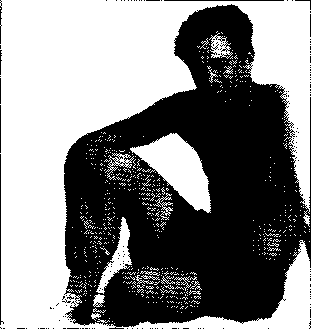

###### UỐNG RƯựU BIA ĐIỀU ĐỘ

Một ít rượu râ't tốt cho sức khỏe, thêm vào đó việc uống rượu điều độ còn giúp tránh các bệnh tim mạch. Nhưng việc uống hơn liai ly bia rượu mỗi ngày sẽ phản tác dụng và gây hại cho sức khỏe của bạn. Nghiện rượu một thời gian dài sẽ ảnh hưởng xấu đến thể chất tinh thần, nghề nghiệp, gia đình và cả sự yên vui của xã hội. Hãy giữ việc uống rượu trong phạm vi an toàn.

HÃY TĂNG CƯỜNG sức DÊ KHÁNG

Hãy chăm sóc tốt hệ miễn nhiễm của bạn và nó sẽ triệt tiêu mọi nổ lực xâm nhập của sinh vật lạ và sự thay đổi của các tế bào ung thư.

Hệ miễn nhiễm được hình thành từ những tế bào đặc biệt (bao gồm bạch cầu) và protein (được gọi là kháng thể) có thể chống lại vật thể xâm nhập chẳng hạn như vi khuẩn, nấm, vi rút và một số chất độc. Hệ thống này cũng giữ vai trò kiểm soát bệnh ung thư bằng cách nhận ra và hủy diệt các tế bào phát triển bất thường.

Một trong các chế độ ăn uống ít béo là một trong những cách chính yếu để duy trì một hệ miễn dịch mạnh mẽ. Điều này có nghĩa là ăn nhiều ngũ cốc, trái cây và rau củ. Bạn cũng nên xem xét đến một chế độ bảo đảm bổ sung đầy đủ các chất bao gồm vitamins B cùng với A, c và E và sắt, kẽm.

Một cách sống lành mạnh ỆỂ&L

nữa: đó là vui vẻ. Đây là một

yếu tố khác trong việc giữ gìn              ■ ->            -Ị ,^it. # .

hệ miễn nhiễm. Điều này bao                                   . ■

gôm việc giám căng thăng               V         \_\_\_\_

bằng cách học cách thư giãn, tập thê’ dục điều đặn.

Giống như một sinh vật lạ, bạch cầu bắt đầu nuốt chửng kẻ xâm nhập ở đây là một men bào tử. Men bào tử này sắp sửa bị nuốt chững.

###### TƯ VÂN BÁC Sĩ

Bệnh tim và bệnh ung thư là hai sát thủ số một của con người và nguy cơ bị nhiễm hai bệnh này có thể được giảm đáng kê’ với biện pháp chăm sóc phòng ngừa y tế. Tuy nhiên đối với nhiều người, đi khám bệnh giống như chuyện bị nhô’ răng mà không dung thuốc mê. Ai mà không rung rẩy khi chờ đợi được khám ruột hay nghe năm từ kinh hoàng "quay đầu và đằng hắng" trong khi một bàn tay lạnh chạm xung quanh tinh hoàn của bạn?

Bạn cần phải cảm thây thoải mái với bác sĩ của mình, vì vậy việc chọn bác sĩ phù hợp nhất với nhu cầu của bạn là điều rất quan trọng. Hỏi nhờ bạn bè tư vâ’n.

Một bác sĩ đa khoa giỏi là người sẽ dành thời gian giải thích nguyên nhân gây bệnh của bạn theo cách giúp bạn có thể hiểu được lý do tại sao phải điều trị như vậy. Nếu bác sĩ khám cho bạn quá vội vã tiến hành khám cho bệnh nhân tiếp theo trước khi làm điều này, hãy thử khám bác sĩ khác và tiếp tục cho đến khi tìm ra người bạn thích.

BÁC Sĩ Nữ: CÓ TỐT CIỈO sức KHỎE CỨA BẠX KHÔNG?

Phụ nữ luôn đến khám với bác sĩ nam ngay cả khi cần khám ỗ chỗ nhạy cảm như khám nhũ, khám phụ khoa, triệu chứng mãn kinh. Nhưng trái ỉại, nam giới không đến khám với nữ bác sĩ cho dù là bệnh cúm. Sự câu nệ hay định kiến dù là vì bất cứ lý do gì đi nữa, họ đã đánh mất rất nhiều cơ hội.

Nữ bác sĩ đa khoa chú tâm đến bệnh nhân nhiều hơn là bác sĩ nam. Nghiên cứu cho thấy rằng nữ bác sĩ thường linh hoạt hơn đồng nghiệp nam của họ khi cần đến kỹ năng giao tiếp. Họ dành nhiều thời gian cho bệnh nhân hơn và hỏi người bệnh không chỉ về bệnh tật mà còn về hoàn cảnh xã hội có ảnh hưỏng đến sức khỏe của họ chẳng hạn như công việc hoặc các mối quan hệ. Họ cũng thường cười và gật đầu nhiều hơn và dường như bệnh nhân nam có khuynh hướng trò chuyện thoải mái với bác sĩ nữ hơn. Chẳng hạn như một cuộc khảo sát do các nhà nghiên cứu thực hiện, bệnh nhân nam đến khám bác sĩ nữ được bác sĩ cung cấp thông tin nhiều gấp đôi so với bác sĩ nam.

Nữ bác sĩ đa khoa cũng có khuynh hướng ngừa bệnh cao hơn so với các đồng nghiệp nam của mình. Một nghiên cứu với khoảng 2000 bệnh nhân cho thấy rằng những người đến khám bác sĩ nữ thì có đến hơn 56% được khám cholesterol trong máu hơn là khám bác sĩ nam.

###### HÃY HIỂU RÕ VỂ Cơ THỂ BẠN

Nhiều người trong chúng ta quan tâm đến cơ thể mình như quan tâm đến bữa trưa ta ăn tuần trước. Điều này nghĩa là rất ít quan tâm hoặc không bận tâm đến. Thái độ này sẽ hình thành khuynh hướng phớt lờ hoặc bỏ qua những dấu hiệu xấu mà cơ thể thể hiện. Chúng ta chỉ tìm đến sự trợ giúp y tế khi cơn đau nghiêm trọng như bị dầm trong mắt cần lấy ra, khi bị thương nghiêm trọng hoặc bệnh trầm trọng đến nỗi phụ nữ thấy cũng ngất xỉu còn trẻ em thấy cảnh này cũng phải bỏ chạy.

Nếu bạn có cơn đau kéo dài và phát triển bướu bất thường, những chỗ đau, cơn đau nhiều không hết trong một vài ngày hãy đi khám bác sĩ đa khoa. Ngay cả khi bạn thấy bình thường hãy dành giờ tự khám cho mình mỗi tháng. Kiểm tra khôi u ở tinh hoàn, xem xét nốt ruồi của bạn cả về sự thay đổi kích thước và màu sắc. Mọi bất thường đảm bảo việc đến khám bác sĩ xem có cần phải làm phẫu thuật hay không.

Hãy đảm bảo bạn và bác sĩ đa khoa của bạn biết rõ lịch sử bệnh của gia đình. Kiến thức này sẽ giúp bạn biết liệu có bất cứ triệu chứng nào bạn cần quan tâm kiểm soát một cách cẩn thận.

###### HÃY NGỦ ĐỦ

Đừng chia nhỏ giấc ngủ của bạn. Nghiên cứu cho thấy cạn như nửa số nam giới ngủ ít hơn 8 tiếng một đêm mà phần lớn họ cần. Nếu bạn dễ ngủ gục vào ban ngày - bạn có thể gục đầu xuống và chợp mắt trong chốc lát như vậy nghĩa bạn bị thiếu ngủ. Nếu vì lí do nào đó bạn không thể ngủ thêm vào ban đêm thì hãy cố gắng ngủ một chút vào buổi trưa dù chỉ cần khoảng 30 phút, điều này sẽ giúp bạn tươi tỉnh và hồi phục lại bộ não.

###### CUỐN THEO DÒNG ĐỜI

Sau cùng, đừng bỏ qua sức khỏe tinh thần của bạn , hãy học cách thư giãn. Hãy dành một ít thời gian mỗi ngày cho mình ở một nơi yên tĩnh nào đó để đọc và hồi tưởng lại những sự kiện xảy ra trong ngày của bạn. Theo đuổi một sở thích mà bạn luôn muốn có để có niềm vui một mình hay cùng người khác.

Hãy bớt nghiêm trọng hóa vấn đề và hãy biết mỉm cười với những sự ngớ ngẩn. Sự hài hước là một liều giải độc tuyệt vời cho những áp lực và phiền muộn trong phần lớn cuộc sống của chúng ta. Và đừng sợ trở thành chính mình. Nghiên cứu cho thây rằng người nào ít cổ hủ và cố chấp, sống thoải mái thì khỏe mạnh hơn.

❖

5\|í

TÌNH DỤC, THUỐC VÀ RƯỢư bia có lội cho sức khóe của bạn?

Liệu tình dục, thuốc và rượu bia có lợi cho sức khỏe của bạn không? Sao lại không khi bạn chọn rượu, thuốc cũng như bạn tình một cách thận trọng.

Tình dục có thể giảm căng thẳng, giúp cơ thể thư giãn, cơ thể, hỗ trợ giấc ngủ cho bạn, kích thích hệ thần kinh tăng cường hệ thống miễn dịch và giữ cho tâm trạng bạn ổn định. Tuy nhiên, hãy thận trọng khi chọn bạn tình.

Các bệnh da liễu liên quan đến tình dục và AIDS có thể biến tình một đêm thành nỗi ám ảnh suốt cuộc đời bạn. Vì thế, hãy dùng bao cao su.

Các chuyên gia y tế cho biết rằng những người có nguy cơ bị nghẽn động mạch, mỗi liều thuốc aspirin dành cho trẻ em (75mg) mỗi ngày có thê làm giảm nguy cơ bệnh tim do máu bị đóng cục. Nó cũng giúp giảm nguy cơ bị bệnh ung thư ruột kết và một số hậu quả xấu khác của việc hút thuốc. Tuy nhiên, trước khi bắt đầu dung thuốc aspirin, hãy trao đổi với bác sĩ. Với bất cớ dược phẩm nào, phải luôn thận trọng nghe theo lời chỉ dẫn của bác sĩ của bạn.

Nhiều nghiên cứu cho thấy rằng rượu có thể giúp bạn chống lại bệnh tim. Điều mấu chốt là ở chỗ điều độ trong việc uống rượu bia. Bạn không nên uống quá hai đơn vị rượu bia mỗi ngày.

NGƯỜI BẠN TỐT CUA BẠN - CAFFEINE

Nhiều người trong chúng ta không thể bắt đầu mỗi ngày mà thiếu cà phê. Không gì thú vị bằng có một tách cà phê làm tim đập năng động vào buổi sáng phải không? Chất Caffeine - thành phần kì diệu trong cà phê là một chất kích thích nhẹ cũng có thể có trong trà, nước ngọt, thuốc giảm đau và thức phẩm ăn kiêng. Nghiên cứu cho thấy rằng chất này có thể cải thiện sự tỉnh táo, phản xạ thời gian, tăng sự tập trung, lí luận và trí nhớ. Nó có thê’ làm giảm một số cơn đau đầu do co thắt mạch máu não.

Tuy nhiên, nó cũng có mặt tiêu cực. Caffeine cũng có thể gây cho bạn cảm giác hồi hộp lo âu, khó ngủ, dễ bị kích thích, căng cơ, mệt tim thiếu tập trung và bệnh tiêu chảy và nhiều dấu hiệu tiềm ẩn khác. Những người nghiện cà phê kinh niên xuất hiện một số triệu chứng như đau đầu, buồn nôn, ói mửa và thiếu năng lượng khi họ ngừng uống cà phê. Cuối cùng, caffeine gây ảnh hưởng bất lợi lên một số người khi họ dùng chung với một số loại thuốc.

Có nên cắt giảm caffeine không? Thật là khó để đưa ra lượng giới hạn cà phê tiêu thụ mỗi ngày vì tác dụng của nó rất riêng lẻ lên từng người. Một số người một tách cà phê mỗi ngày là quá nhiều nhưng một số người lại có thề uống rất nhiều tách cà phê nhưng không vấn đề gì. Lời khuyên tốt nhất đó là hãy giảm lượng cà phê khi bạn thấy cà phê làm bạn bị hồi hộp căng thẳng bực nhọc hoặc nếu bạn thấy khó ngủ.

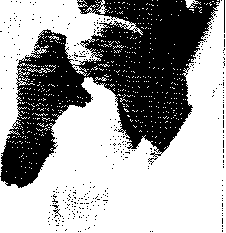

##### THAY ữôl LỔ!SỐNG CỦA BẠN

•

Phần lớn chúng ta có thể hưởng lợi từ sự thay đổi trong lôi sông ngay cả khi từ những thay đổi nhỏ nhặt chẳng hạn như cắt giảm thực phẩm nhiều chất béo. Tuy nhiên, đôi khi cần có những thay đổi lớn đáng kể để thay đổi cuộc đời bạn, chẳng hạn như lúc đầu việc thay đổi các thói quen trong quá khứ là râ't khó khăn, nhưng về lâu về dài bạn sẽ nhận được phần thưởng xứng đáng.

“Cuộc sổhg không có nghĩa chỉ duy trì cuộc sống của bản thân mình mà nó còn tự mồ rộng ra. Bằng không, sống chỉ biết thở mà thôi”

Simone de Beauvoir, nhà văn Pháp

PHẢI CHĂNG ĐÓ LÀ MỘT sự THAY ĐÔÌ KHẢ THI?

Nếu bạn chọn bỏ hút thuốc,ăn uống theo chế độ dinh dưỡng, tập thể dục, đi khám bênh định kỳ, bạn sẽ có cơ hội thu về được những lợi ích lớn lao và một cuộc sống trường thọ hơn. Tương tự nếu như bạn tự chăm sóc mình, bạn có thể làm tốt mọi việc và nhờ đó đạt được nhiều sự hài lòng hơn.

Tuy nhiên, một số đàn ông cần nhiều hơn những loại thay đổi này. Nhà văn kiêm triết gia người Mỹ Henry David Thoreau từng nhận định rằng "phần lứn đàn ông sống một cuộc sống tuyệt vọng". Nếu như câu này nghe có vẻ đúng với tâm trạng của bạn thì không có lý do gì bạn cứ tiếp tục cảm xúc như thế. Đàn ông thường tức giận khi hành động của họ không phản ánh đúng giá trị của bản thân. Hãy biết được thứ tự xíu tiên trong cuộc sống của mình và nỗ lực để sống theo điều gì bạn cho là quan trọng nhất. Đây chính là bước đầu tiên để hướng tới cuộc sống lành mạnh.

Tuy nhiên, nếu bạn đã chọn làm việc 12 giờ mỗi ngày, ngồi phịch ngay trước ti vi khi về nhà, và nhai ngấu nghiên các miếng bánh pizza thì sự tuyệt vọng của bạn là không thể tránh khỏi. Điều quan trọng cần nhớ đó là: chính bạn chịu tránh nhiệm với cuộc đời mình chứ không ai khác, và bạn có thể lựa chọn để sông khác đi.

BẠN CÓ CÂN THAY ĐOI cuộc SốNG CỦA MÌNH KHÔNG?

Cách bạn sử dụng thời gian cho biết bạn xem điều gì quan trọng nhất. Nghiên cứu các câu trả lời cho những câu hỏi sau đây. Nếu bạn trả lời “Có” từ 5 câu trở lên, có lẽ bạn nên mong muốn thực hiện thay đổi đời mình:

- • Bạn có cảm thấy nhàm chán không?

- • Bạn có nghĩ người khác cảm thấy bạn nhàm chán không?

- • Bạn có từ chối các buổi sinh hoạt xã hội nhiều đến nỗi bạn bị loại trừ tra khỏi danh sách mời hay không?

- • Bạn có dành hơn 10 tiếng mỗi ngày để ngủ không?

- • Bạn có thường xuyên xem ti vi hơn 1 tiếng mỗi ngày không?

- • Bạn có quên tựa đề quyển sách cuối cùng bạn đọc để giải trí không?

- • Bạn có tranh thủ ngày nghỉ như là dịp để bạn làm kịp công việc dang dở không?

- • Bạn có thường ăn thức ăn bạn cầm trong tay khi đang viết, nói chuyện điện thoại hoặc lái xe không?

- • Lịch và đồng hồ của bạn có ghi chú nơi bạn đi và bạn làm gì mỗi khi bạn thức giấc không?

- • Bạn có quên tên và tuổi của các con bạn không? Các con bạn có gọi bạn là “ông bố” không? Bạn có quên ngày sinh của mẹ, của vợ và của các con bạn không? Bạn có quên ngày kỷ niệm ngày cưới của mình không?

- • Bạn có gặp khó khăn nhớ lại lần gần đây nhất bạn nhìn thấy hàng xóm của mình vào ban ngày không?

- • Bạn có ghiền - thuốc lá, rượu bia, thức ăn, ăn vặt - làm việc quá sức hoặc tiêu thụ quá mức thức ăn không?

- • Bạn có tình nguyện làm việc ngoài giờ hơn là về nhà vằ đối mặt với việc nhà hay không?

- • Bạn có uống thuốc aspirin, thuốc giảm acid trong dạ dày, thuốc giảm đau hoặc loại thuốc không kê toa đê’ chữa bệnh thông thường nào không?

- • Bạn có thể phân biệt giữa đói lã và lo âu không?

- • Bạn có quá lo lắng nếu công việc được phân công cho mọi người trừ bạn ra không?

- • Bạn có phớt lờ các cơn đau nhức có thê’ cần phải được điều trị không? Bạn có lẫn tránh các kỳ kiểm tra sức khỏe có thê’ giúp phát hiện ra bệnh tình của bạn không?

- • Bạn có cảm thấy thiếu thốn điều gì .đó trong cuộc đời mình không?

- • Bạn có quên lần cuối bạn xem phim , đi đến rạp hát, hoặc sự kiện thê’ thao nào đó không?

BẠN VÀ CẢM XÚC CỦA MÌNH

Lựa chọn sông một cuộc sống tốt đẹp hơn, khỏe mạnh hơn gần như còn đòi hỏi về những mục tiêu tinh thần.

Trước tiên, bạn cần phải chú ý đến cảm xúc của mình. Một nhà tâm lý học cho rằng nhiều đàn ống đã đánh mất sự tiếp xúc về mặt xúc cảm và họ tìm kiếm sự trợ giúp từ các chuyên viên tư vâ’n khi họ đang bị tổn thương vì những mối quan hệ khô khan và vì sự không hài lòng trong cuộc sống và trong công việc. Lý do đơn giản đó là hầu hết đàn ông đều cống hiến hết mình cho công việc.

###### SỐNG TRONG TẬP THỂ

Ngày nay, môi trường làm việc tập thể cạnh tranh thù địch hay khốc liệt đã qua, hầu hết chúng ta nghiệm ra rằng tồn tại có râ’t ít liên quan đến việv Dày tỏ sự quan tâm được gia đình và người thân đánh giá.

Con người trong tình huống này thường có xu hướng dẹp bỏ cảm xúc. Họ trở nên cứng rắn, khô khan hơn. Nhưng đó là một hành vi ảnh hưởng nghiêm trọng đến mối quan hệ. Sau cùng những người như thế sẽ trở nên máy móc trong sự tương tác.

Nếu kiếm tiền là giá trị duy nhất bạn quan tâm, thì rồi đây bạn sẽ đạt được điều đó. Nhưng nếu bạn cũng đặt tầm quan trọng về giá trị của việc trải nghiệm niềm vui bên người thân và bạn yêu quý, hoặc nếu bạn muốn ngắm hoàng hôn hay nắm tay người thân và cảm thây hạnh phúc? Nếu tất cả điều đó cũng quan trọng với bạn, rồi đây bạn sẽ ý thức rằng việc nuôi dưỡng cảm xúc của mình là cần thiết.

Nếu như bạn coi trọng việc dành thời gian cho người thân và bạn bè, có lẽ bạn phải lựa chọn việc cắt giảm công việc hoặc chuyện thăng tiến vốn đòi hỏi bạn dành hơn 12 tiếng một ngày. Dù nhiều người chọn lương bổng cao để đảm bảo có một cuộc sống an toàn hơn, tuy nhiên có mức lương cao hơn sẽ không đảm bảo được sự bình an hoặc cảm giác an lành.

CÁCH «Ể THOÁT RA KHỎI QLÁN TÍNH

- • Đừng nhọc nhằn vì những chuyện vớ vẩn. Hãy giao những quyết định ít quan trọng cho người khác, và để họ tự hoàn thành công việc. Đừng cố xen vào.

- • Học cách nói “Không” với những yêu cầu vô lí. Mọi thứ có thể được hoàn thành không nhất thiết phải do chính bạn thực hiện. Hãy thiết lập giới hạn và bám vào đó.

- • Hãy phân biệt rõ sự khác biệt giữa đòi hỏi công việc và đòi hỏi do chính bản thân bạn tạo ra. Hãy thoải mái với bản thân một chút.

- • Trong công việc, đừng cố kiêm thêm việc không thuộc trách nhiệm của mình. Nếu tăng thêm nhiều nhiệm vụ nửa trong phần trách nhiệm công việc đã quá tải của bạn, hãy trao đổi ngay với sếp đế tìm giải pháp và nói “không” với điều này.

- • Hãy đặt ra những mục tiêu thực tiễn cho bản thân và bám vào nó.

- • Hãy tận hưởng một cuộc sống thực sự. Hãy lên kế hoạch để dành thời gian cho gia đình và bạn bè.

- • Hãy ra ngoài đi chơi. Đi dạo, bơi lội, chạy bộ, đạp xe, trượt banh, rửa xe hay làm bất cứ hoạt động nào khiến bạn cảm thấy thư giãn. Có rất nhiều trò chơi vận động mọi người tham gia để giúp giảm căng thẳng, củng cố sức khỏe cho tim và cơ thể, và tạo cho bạn cảm giác hăng hái khỏe mạnh.

- • Hãy bỏ hút thuốc, giảm rượu bia, ăn các loại thực phẩm lành mạnh, giảm cân và cười nhiều.

- • Hãy tìm một công việc làm bạn vui và hài lòng. Làm công việc mà bạn yêu thích rất ít khi khiến bạn bị căng thẳng.

- • Đừng mong chờ có thời gian để tận hưởng cuộc sống. Hãy tận dụng thời gian ngay. Đừng bỏ lỡ những điều quan trọnng trong cuộc đời. Hãy mỉm cười với các bạn đồng nghiệp, ôm con cái, hôn vự và gọi điện thoại cho cha mẹ. Không có gì có thể thay thế được mối quan hệ mạnh khỏe vầ bền chặt.

###### cứu CÁNH TÌNH CẢM

Đàn ông quan niệm rằng gia đình họ quan tâm đến lương bổng đem về nhà hơn trong khi thật sự điều vợ con họ cần là có được nhiều thời gian của người đàn ông họ yêu thương nhiều hơn chứ không phải là có được nhiều tiền hơn. Nhiều người chọn việc theo đuổi danh vọng bởi vì điều này làm cho họ thỏa mãn được nhận thức chưa trưởng thành của họ về sự mạnh mẽ của nam giới. Trong thực tế, người đàn ông mạnh nhất là người có ý thức tự tạo ra giá trị cho chính mình và phát huy giá trị đó.

Sở thích có thể thỏa nguyện nhu cầu của con người. Nếu như bạn dành hầu hết thời gian trong ngày cho công việc, thì hãy cố gắng dành thời gian khám phá điều mới hoặc hoàn thiện chính mình như là những việc thợ mộc, sửa chữa động cơ xe, hoặc tạo mô hình máy bay mới - bất cứ việc gì miễn là đưa bạn ra khỏi công việc.

XĂM CÁCH Ỉ)Ể CHIAN bị cuo việc thay Dổi LÔÌ sóng -------■\_ ’\_\_\_\_\_

- 1\. Đặt ra giới hạn và bám theo. Nếu bạn quyết định dành nhiều thời gian hơn với gia đình, hãy tự nhắc bản thân về các ưu tiên của bạn. Hãy tưởng tượng xem vợ con bạn vui biết bao nhiêu khi thấy bạn về nhà đúng giờ, và thất vọng biết bao nhiêu khi bạn gọi về và cho biết bạn sẽ về trễ.

- 2\. Quyết định xem bạn muốn làm việc bao nhiêu tiếng một tuần, sau đó đừng lại khi bạn sắp vượt tới giới hạn của mình. Nếu bạn khám phá ra mình rất khó để bám theo giới hạn 40 tiếng một tuần, hãy đánh giá lại cách bạn sử dụng thời gian của mình. Nếu bạn hiệu quả (không mất thời gian cho chuyện pha cà phê hoặc trò chuyện phím), hãy tìm sự hỗ trợ từ sếp của bạn.

Ị 3\. Khi bạn bắt đầu nhận ra cuộc sống của mình lại vượt ra khỏi sự kiểm soát lần nữa, hãy tự nhắc nhở rằng chính mình là người lèo lái, làm chủ cuộc đời chứ

I không phải ông chủ của mình. Nếu như sếp bạn thông báo công việc của bạn đòi hỏi 60 hoặc 70 giờ một tuần, và bạn chỉ muốn 40 tiếng một tuần,

I hãy cân nhắc đến việc thay đổi công việc.

I 4. Hãy tự nhắc nhở bạn chọn sự thay đổi phù hợp - sự thay đổi mà bạn kiểm Ị soát được, thay đổi nhắm vào mục tiêu làm cho chất lượng cuộc sống bạn trở I nên tốt hơn, tràn trề sinh lực và sôi nổi chứ không sầu não.

I 5. Nhiều người cảm thấy điều này rất khó thực hiện: cân nhắc đến việc bỏ lỡ cơ hội thăng tiến, đặc biệt nếu như vị trí quan trọng hơn cũng có nghĩa là nhiều

I /                                      '         ,

giờ làm việc hoặc di chuyên hơn.

##### ÒM CHÂM QUÁ TRÌNH LÃO HÓA

Cảm thấy xơ xác. Chẳng phải chúng ta ai cũng thế sao. Giống như sự ri sét thời gian không bao giờ dừng lại Đồng hồ cứ luôn chạy cho dù chúng ta có thích hay không- vậy chúng ta hãy đối diện với nó. Bạn không thể ngăn bước thời gian nhưng bạn có thể làm chậm đi ảnh hưởng không thể tránh khỏi của nó trên thể xác và tinh thần của bạn.

(ị ■                                                                      .....

“Tôi nghĩ đó chính là thức ăn. Tôi ăn bắp, cơm, rau - không có nhiều thịt. Tôi thức dậy sôm và đi ngủ trưởc 9 giờ. Tôi không uống rượu hay hút thuốc, nhưng một số người già khác thì có.”

Huang Bohan, ở Bama, Trung Quốc, nói về cách ông sống đến 105 tuổi.

CHÚNG TA GIÀ ĐI NHƯ THÊ' NÀO

Sợi tóc bạc đầu tiên, nếp nhăn đầu tiên, sự bắt đầu tăng kích cỡ vòng eo, đa sô' chúng ta không ai quan tâm nhưng dấu hiệu khởi đầu của sự lão hóa tại thời điểm nào đó có thể là vào cuối những năm ba mươi hay đầu những năm bốn mươi tuổi.

Tóc bạn bây giờ (nếu có) đã trở thành tóc muối tiêu, bạn không thể liên tục leo cầu thang được nữa và phụ nữ trẻ nơi công sở không thèm nhìn bạn nữa. Đó là khi tuổi già đã gõ cửa. Vậy điều gì xảy ra khi chúng ta già?

Nhiều khía cạnh lão hóa vẫn chưa thật sự được hiểu biết một cách đầy đủ nhưng về mặt cơ bản cơ thể bạn bắt đầu kiệt sức. Các tế bào không thê’ tái sính lại như trước đây.

Lâ’y ví dụ về làn da, khi bạn còn trẻ, da bạn bị tróc và lập tức nó được thay bằng một lớp da mới. Nhưng khi bạn đã bước vào độ tuổi 30 da cũ bắt đầu bám riết ngày một lâu hơn. Di truyền học và xu hướng tắm nắng quyết định các đường nứt trên mặt và cơ thể bạn sâu như thế nào.

Tóc bạn bắt đầu phai màu vào lúc bạn bước vào độ tuổi trung niên, khi đó nguồn cung câp sắc tố của cơ thê’ giảm sút. Và chẳng bao lâu những nắm tóc trắng đó trở thành một đầu bạc.

Vào cuối những năm hai mươi tuổi, tốc độ quá trình trao đổi chất của cơ thể bắt đầu chậm lại cùng với tốc độ đốt cháy calo. Bạn có thể duy trì cùng chế độ dinh dưỡng và tập luyện vào độ tuổi 30 những gì đã thực hiện từ những năm 20 tuổi mà vẫn bị dư cân. Trước khi bạn nhận ra nó, bạn đã bị bụng mỡ ở độ tuổi trung niên.

Cái khó thấy hơn là do nhiều cơ quan nội tạng then chốt của bạn đang bị suy yếu. Các tế bào cấu tạo nên thận, não, cơ tim và thủy tinh thể của mắt là không thể tự phục hồi được, vì vậy một khi các tế bào này già yếu thì cơ thể không thê’ sản sinh tế bào mới để thay thế chúng.

Con người còn bị lão hóa là kết quả của sự thay đổi hóc môn. Bắt đầu từ cuối những năm 40 tuổi, lúc đó cơ thể có một sự giảm sút rất dễ nhận biết của testosterone. Sự suy giảm testosterone này vẫn tiếp diễn trong những năm sau đó. Trong cơ thể người, testosterone đóng vai trò là một chất kích thích tố: đi vào hệ xương, hệ cơ và não đê’ kích thích sự tăng trưởng. Khi lượng testosterone sụt giảm thì xương và cơ sẽ dần suy yếu.

Căng thẳng hay stress cũng là một nguyên nhân khác dẫn đến lão hóa. Cơ thê’ chúng ta chỉ có thê’ tự phục hồi/điều chỉnh khi có những rối loạn nhỏ, tuy nhiên chúng ta không được trang bị đê’ đối phó với những căng thẳng dồn dập của cuộc sông hiện đại. Nhiều nam giới phải chịu đựng stress hằng ngày, cả trong công việc lẫn trong cuộc sông gia đình. Điều này làm tổn thương tim và các mô cơ, làm cho mức độ lão hóa tự nhiên càng thêm tệ hại.

NGỌN SUỐI TRƯỜNG SINH Ảo

Vào thế kỷ thứ 16, Ponce de leon đi thuyền buồm đến Bắc Mỹ để tìm đảo Bimini nơi ông ấy hi vọng tìm thấy suối nước làm trẻ lại. Thay vào đó ông tìm thấy Florida. Kể từ đó trở đi, những kẻ hám lợi và những tay buôn rắn khắp nơi trên thế giới đã bán loại dược phẩm vô dụng với lời hứa hão huyền về công dụng là tuổi trẻ và trường sinh bất tử.

Những phương thuốc chữa bệnh lão hóa xếp loại từ Kicapoo Ân Độ đến mật ong, dầu thầu đâu, dấm, sữa chua, mật đường, tỏi, mầm lúa mì, sữa ong chúa, sữa, men bia. Những liều thuốc vitamin gây chết người, chế độ ăn chay, trà được làm từ cây thổ phục linh và nhân sâm qua một thời gian dài tất cả đã được chào hàng như là nguồn cung cấp năng lượng vô tận cho vẻ trẻ trung. Vừa mới đây, những dịch vụ cung cấp hàng hóa đa dạng - của những hệ thống bảo tồn công nghệ cao đã hứa đem đến sự bất tử thực sự.

Nhiều người ủng hộ việc dùng biện pháp đông lạnh đê’ giữ người chết chằng hạn như đặt xác người trong đá chờ đến khi khoa học tìm ra phương thuốc chữa bệnh đã giết họ. Tuy nhiên, khách hàng nên thận trọng điều này. Trừ khi có cuộc sống lành mạnh, sự thật là có rất ít cơ hội giúp bạn thoát ra khỏi sự tàn phá của thời gian.

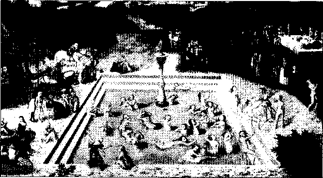

Trong nhiều thế kỷ các nhà thấm hiểm đã tìm ra suôi trường sính bất tử. Bức họa trên mô tả quang cảnh lạ kỳ của thế kỷ 16 về cách một dòng nước phun lầm trẻ hóa người già.

GIỚI HẠN BÊX NG()?\\I CÚA sự LÃO IIÓA

Có một niềm tin phổ biến cho rằng tiến bộ y học đã có thể kéo dài tuổi thọ con người. Không may, điều đó không đúng. Thực tế là cấu tạo cơ thê’ người chỉ cho phép chúng ta sống khoảng 120 năm. Rất ít người trong chúng ta có thể sống đến chừng đó tuổi do bệnh tật và tai nạn.

Những gì mà y khoa đã làm được, kết hợp với điều kiện vệ sinh vằ nhà ở được cải thiện là làm tăng tuổi thọ bình quân của con người. Giờ đây, con người có nhiều điều kiện để sống lâu hơn thế hệ của ông bà mình ngày trước. Tuy nhiên vẫn còn điều gì đó là lực cản đối với tuổi thọ chúng ta dù cho tiến bộ y khoa đã cho phép con người có thê’ sống lâu hơn. Đến nay, việc gia tăng tuổi thọ con người vẫn là một điều viễn vông.

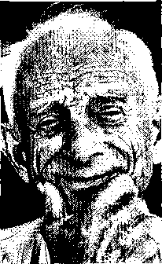

Ngày càng có nhiểu người trong chúng ta sống viên mãn đến tuổi già, tuy nhiên tuổi thọ con người vẫn có giới hạn cho dù khoa học có tiến bộ đến đâu đi chăng nữa.

LUÔN GIỮ PHONG CÁCH VÀ CẢM GIÁC TRẺ TRUNG

Không có cách nào để ngăn chặn quá trình lão hóa một cách triệt để. Tuy nhiên, bạn có thể làm chậm quá trình này để ở bất cứ độ tuổi nào bạn cũng có thể có một cơ thể khỏe cả bên trong lẫn bên ngoài. Bí quyết để duy trì tuổi xuân rất đơn giản: đó là chế độ ăn uống điều độ với ít chất béo, tập luyện thể dục thường xuyên, tránh ánh nắng mặt trời, giảm căng thẳng, giữ trí óc minh mẫn và nhớ dành thời gian để nghỉ ngơi và thư giãn.

###### GIẢM CHẤT BÉO

Từ cuối những năm 20 tuổi trở đi, sự trao đổi châT diễn ra chậm hơn đồng nghĩa với việc là vòng eo càng tăng lên nếu như bạn không cắt giảm năng lượng tiêu thụ. Hãy chuyển qua chế độ ăn ít chất béo. Điều đó không có nghĩa là bạn không còn được ăn thức ăn, hamburger hay món beef steak (thịt bò bít tết) nữa. Bạn vẫn có thể ăn chúng với một lượng vừa phải. Điều mà bạn nên làm là chuyển ngay chế độ ăn từ chất béo và đạm sang ngũ cốc, trái cây tươi và rau xanh.

###### TẬP THỂ DỤC

Có một điều đáng ngạc nhiên là chỉ cần dành ra rất ít thời gian duy trì các bài thể dục để ức chế lão hóa, cụ thể, duy trì tập thể dục 5 ỉần mỗi tuần, mỗi lần tối thiểu 30 phút để giúp tăng nhịp tim thêm 20%. Cũng không quá khó để dành chút thì giờ cho việc tập luyện này. Bạn có thể tranh thủ tập thể dục lúc làm việc và bạn cũng có thể xem xét việc đi bộ khoảng 45 phút vào buổi trưa thay vì phải ra ngoài ăn bữa trưa đầy chát béo. Tập thể dục sẽ giúp bạn cảm thấy thoải mái và yêu đời hơn và nó còn giúp bạn ngủ ngon hơn nữa.

LÀM THẾ NÀO ĐỀ KHÁNG CÁC NÊP NHĂN?

\-\-\--------------------:

Yếu tố di truyền và việc chọn lựa lối sống của mỗi người sẽ là dấu hiệu quan trọng nhất để biết nếp nhăn sẽ xuất hiện sớm như thế nào và liệu các nếp nhăn trên gương mặt hay cơ thể của bạn có trở nên tồi tệ hơn không.

Bạn có tiếp xúc nhiều với ánh nắng không? Bạn có hút thuốc hay uống rượu bia không? Bạn có sống ở thành phố hay thị xã có mức độ ô nhiễm không khí nặng nề không? Có phải bạn da trắng không? Với mỗi câu trả lời của bạn là có thì khả năng làm chậm quá trình khởi tạo nếp nhăn của bạn giảm đi đáng kể.

Ánh nắng mặt trời là kẻ thù tồi tệ nhất cho lằn da

bất kể điều kiện thời tiết hoặc mùa nào trong năm. ....Ị    '§1^.

Bạn có thể làm chậm quá quá trình nhăn da nếu bạn

sử dụng kem chống nắng với chỉ số chống nắng (SPF)

từ 30 trở lên quanh năm suốt tháng trên mọi vùng da -ja

có tiếp xúc với nắng.                                    ~ zdSk'

Vẻ đẹp khắc khổ: yếu tố di truyền và phơi nắng là hai nhân tố chính quyết định mức độ nhăn da của bạn.

###### PHƠI NẮNG ĐỒNG NGHĨA VỚI NẾP NHĂN

Càng phơi nhiều với các tia cực tím của ánh sáng mặt trời thì da càng bị lão hóa nặng hơn. Cách tốt nhất và hiệu quả nhất để ngăn ngừa sự xuất hiện của nếp nhăn là phải luôn che kín khi ra ngoài, có thể mặc quần áo bao phủ hay đội nón hoặc thoa kem chông nắng có chỉ số chống nắng (SPF) từ 30 trở lên.

###### LOẠI Bỏ STRESS

Để giảm căng thẳng, đơn giản thôi, bạn chỉ cần dành ra thỉnh thoảng khoảng 15 phút để nghỉ ngơi trong lúc làm việc. Bạn cũng có thể ra ngoài đi tản bộ. Tuy nhiên nếu bạn bị stress nặng hơn, thì cần phải tìm ra nguyên nhân để chữa trị. Phải chăng là bạn đang quá tham vọng kiếm thật nhiều tiền hoặc để thăng tiến trong công việc, cái bạn cần là đánh giá lại giá trị chính mình. Chẳng hạn như, có thật sự bạn cần ô tô đắt tiền như vậy không? Hoặc cần tiví màn hình lớn? Hoặc cần nhà cửa xa hoa? Hay ăn uống ở những nơi đẳng cấp? Thay vào đó bạn hãy thử đi dạo, trên bãi biển chẳng hạn, rất có thể bạn sẽ sống thọ hơn để tận hưởng những điều thật sự ý nghĩa.

###### GIỮ TINH THẦN LUÔN TRẺ TRUNG

Ăt hẳn bạn đã từng gặp những người, dường như bị già trước tuổi, không phải là ở dáng vẻ bên ngoài mà là ở sự nhận thức: như là thái độ, cách nhìn cuộc sống, sở thích, sự hiểu biết - chính những điều này làm họ trở nên già dặn trước tuổi.

Hãy tránh xa những nguy cơ này bằng cách tập thể dục cho tâm trí bạn. Hãy tranh thủ đọc càng nhiều càng tốt, luôn cập nhật thông tin những sự kiện xung quanh bạn, tham gia tranh luận về đề tài chính trị hay tôn giáo nào đó, trải nghiệm thêm những thú vui hay các trò giải trí có tính mạo hiểm. Tất cả sự rèn luyện tinh thần này sẽ giúp bạn duy trì tâm trí luôn minh mẫn và nâng cao khả năng tiếp thu, học hỏi.

BẠN BIẾT GÌ VE CÁC Gốc Tự DO

Hãy liên tưởng các gốc tự do như là những chiến binh thầm lặng xâm nhập vào cơ thể của bạn theo lệnh của tử thần. Các gốc tự do có cấu trúc không ổn định và dễ phản ứng và cần có các phân tử electron đê’ tồn tại. Vì vậy chúng lấy các phân tử electron từ các mô của cơ thể, gây tổn thương cho các tế bào. Những tế bào bị tổn thương này là nguyên nhân chính yếu của các loại bệnh lão hóa: như tắt nghẽn động mạch, đục thủy tinh thể, bệnh ung thư và còn nhiều bệnh khác.

Tin tốt lành về các chất chống oxy hóa:

Bạn có thể ức chế hoạt động của các gốc tự do bằng một nhóm các vitamin được gọi là chất chống oxy hóa, là một chất xúc tác tự nhiên giúp loại bỏ các gốc tự do. Một số nhà nghiên cứu đã tìm thấy những bằng chứng sơ bộ rằng chất chống oxy hóa này có khả năng chống lại quá trình oxy hóa các mô cơ thê’ do các gốc tự do gây ra.

Chất chống oxy hóa chủ yếu là các vitamin c và E; beta-carotene (hay còn gọi lại tiền sinh tố A); và khoáng chất selenium, hoạt động cùng với vitamin E. Các chất chống oxy hóa khác bao gồm vitamin E, thiamin, lecithin và kẽm.

Các chuyên gia tin rằng, khi được dùng vởi một lượng nhiều hơn chút ít so với lượng dùng hàng ngày được cơ quan chức năng khuyến cáo, các chất này sẽ giúp làm giảm mức độ lão hóa của cơ thể.

Chất chống oxy hóa tìm thấy ở đâu?

Các chất chống oxy hóa được tìm thấy chủ yếu trong trái cây, các loại rau và ngũ cốc nguyên hạt, mặc dù vậy, một số thực phẩm có nguồn gốc động vật cũng có một lượng đáng kể chất chống oxy hóa. Nhiều thực phẩm trong tự nhiên bao gồm: các loại rau có màu tự nhiên như đỏ, cam, vàng và xanh đậm; yến mạch, lúa mì, gạo và ngô; tỏi và hành tây; gan, thận, cá, sò, các loại thịt đỏ và thịt gia cầm; và trái cây họ cam quýt.

Chất chống oxy hóa có thể tlm thấy khắp nơi, trong nhiều loại thực phẩm. Hãy thử thưởng thức bữa trưa hấp dẫn với các thức ãn chống oxy hóa bao gổm: thịt gà (vitamin B6), rau diếp (beta-carotene) và cà chua (beta-caratene và vitamin C) dùng với bánh mì làm từ ngũ cốc nguyên hạt (vitamin B6 và E) và trái cây tươi (vitamin C), tráng miệng với 1 ly nước mất có chứa chất selenium.

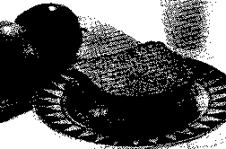

NẾU BẠN MUỐN CHE GIẤU sự LÃO HÓA

Không phải ai cũng dễ dàng chấp nhận là mình đang già đi vì lão hóa. Vậy tại sao chúng ta không cho rằng việc tóc bị bạc hay da có nếp nhăn là bằng chứng của sự từng trải và điều đó giúp chúng ta trở nên thật sự khác biệt. Tuy nhiên, nếu bạn muốn che giấu chúng thì cũng dễ thôi, sau đây là một số gợi ý.

lAm cho eo thon

Nếu chỗ phình quanh thắt lưng của bạn không còn kiểm soát được nữa, có lẽ bạn muốn thực hiện các thay đổi lâu dài cho vóc dáng của bạn. Đê’ chống lại vòng eo không mong muốn đó, hãy thử các biện pháp sau đây:

- • Chuyển sang một chế độ ăn có hàm lượng béo thấp gồm có nhiều carbohydrate, trái cây và rau.

- • Đứng thẳng lên và ép vào ruột. Các cơ bụng được làm cho khỏe mạnh có thể cải thiện vóc dáng và ngược lại.

- • Tập bài thể dục nhịp điệu đốt cháy chất béo: thử chơi tennis, chạy bộ, bơi lội, chèo thuyền.

- • Bắt đầu thực hiện các bài tập bụng.

###### SAN BẰNG NẾP NHĂN

Một số hãng mỹ phẫm cho rằng sản phẩm chăm sóc da của họ có thể cải thiện hoặc ngăn chặn sự xuất hiện của nếp nhăn. Tuy nhiên có một loại sản phẩm có tác dụng: kem đặc trị Retin-A giúp làm giảm và làm mờ đi những vết nhăn nếu sử dụng hằng ngày. Nhưng lại có một nhược điểm là Retin-A khiến da bạn trở nên cực kì nhạy cảm với tia cực tím, và bạn dễ bị ung thư da.

###### CHE ĐI TÓC BẠC

Màu tóc của bạn sẽ không còn bạc nữa. Một chuyên gia chăm sóc tóc sẽ làm việc này tốt hơn bạn. Nhưng nếu bạn muốn tự làm thì cố gắng đừng mắc sai lầm như nhiều người đã làm đó là nhuộm tóc quá đậm màu. Hãy chọn loại thuốc nhuộm có màu nhạt hơn màu tóc bạn mong muốn, và nếu bạn vẫn nghĩ màu quá sáng thì hãy nhuộm tông màu dậm hơn một chút.

###### ĐIỀU NÊN LÀM ĐỐI vtfl CHỬNG HÓI ĐẦU

Hói sẽ khiến cánh mày râu trông già hơn. Nếu bạn thực sự lo lắng về điều này, thì đừng nên rẽ tóc lệch về phía bị hói; như thế trông rất giả tạo. Thay vào đó, tốt nhất hãy thử cắt một kiểu tóc phù hợp - thường thì ngắn hơn. Nếu bạn muốn che đi phần tóc thưa thì có hai lựa chọn: cấy tóc (đắt tiền) hoặc dùng thuốc mọc tóc minoxidil (thường không hiệu quả) hay thuốc propecia dạng uống.

GIỮ TRÍ Lực NHANH NHẠY

Trước lúc 45 tuổi, mỗi ngày não bộ mất đi 50.000 tế bào từ vỏ não là nơi tồn tại trí lực. Hồi hải mã là một mô nhỏ trong não bộ, là nơi xử lí trí nhớ đã bắt đầu suy giảm. Bạn nhận thấy bản thân quên đi ngày tháng và các cuộc hẹn, phân vân làm thế nào đi đến một nơi mà cách đây một tháng mình đã đến. Dù không lo lắng đi chăng nữa; trí nhớ sẽ vẫn đáp ứng yêu cầu của bạn, chỉ có điều là sẽ đến chậm hơn. Và ngoài ra, khi các tế bào giảm đi, thì những kinh nghiệm và kiến thức trong đầu bạn - được gọi là những hiểu biết - vẫn tiếp tục phát triển.

Cũng nên nhớ lằng việc kích thích thần kinh có thể giúp duy trì chức năng trí não. Chơi đoán từ, giải câu đố, đọc báo, học nghề mộc hay học ngoại ngữ. Đem đến những trải nghiệm mới cho trí não như đi du lịch; tham gia lớp học ban đêm, câu lạc bộ, hay các tổ chức công dân; học cách thích nghi để thay đổi; giao tiếp với những người sáng dạ hơn bạn.

Vì căng thẳng, lo lắng, và tràm cảm đang làm suy giảm trí óc, hãy cố gắng

điều chỉnh lại thái độ của mình khi bạn cảm thấy bắt đầu buồn chán. Hãy dành

thời gian để thư giãn. Hãy làm lúc bạn rãnh rỗi. Xem một bộ phim hay, nghĩ đến điều gì đó vui, ngân nga một bài hát tươi vui - bất kì điều gì giúp bạn thoát khỏi nỗi sợ hãi.

Một chế độ ăn cân bằng hợp lí và một chương trình luyện tập phù hợp giúp duy trì chức năng tế bào não ở mức tôt nhất. Và cũng nên nhổ rằng không được sợ hãi. Trí nhớ của bạn có thể sẽ chậm hơn, nhưng dần dần bạn sẽ gợi lại nhiều thông tin trong quá khứ.

TIÊP TỤC: việc đọc báo được coi như là một phẩn của chương trình luyện tập trí não.

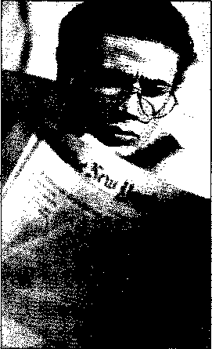

NG

BẠC

Một vài nghiên cứu đã cho thấy hút thuốc lá góp phần gia tăng quá trình bạc tóc, nhưng cũng chẳng có bằng chứng xác đáng nào cả. Các nhà nghiên cứu biết chắc rang melanin tạo màu cho tóc cũng giảm dần theo năm tháng. Một khi chất melanin ngừng hoạt động thì tóc sẽ mất màu, chuyển sang màu trắng, trở nên khô ráp và đục màu.

Những ai muốn trở lại như trước thì có lẽ điều đầu tiên phải làm là bỏ thuốc, sau đó hây thử một vài cách không truyền thống như nhuộm tóc. Dù biết là vậy nhưng việc dùng thuốc nhuộm tóc - chỉ là biện pháp tạm thời hay lâu dài - có nghiã là bạn phải nhuộm luôn cả râu hoặc giữ cho đến khi cạo râu. Kế sách cuối cùng là những người đàn ông can đảm muốn thử cạo trọc đầu mình. Tuy nhiên, ngoài nhũng phương án trên có lẽ cách tốt nhất để giải quyết tóc bạc là chải chuốt cho thật đẹp.

Richard Gere chứng minh rằng tóc bạc cũng có sức hút riêng. Một kiểu tóc khoẻ đẹp có thể giúp bạn trông thật cuốn hút.

ữỄNGỦ

Chúng ta dành ra 1/3 cuộc đời để ngủ, thế nhưng các nhà khoa học cũng không chắc chắn rằng tại sao chúng ta cần ngủ. Điều mà chúng ta biết được là nếu chúng ta sông mà thiếu giấc ngủ, thì óc sáng tạo, trí nhớ, sự đánh giá và kết quả làm việc sẽ giảm sút. Đây là những lý do đầy sức thuyết phục, tại sao chúng ta cần có một giấc ngủ ngon.

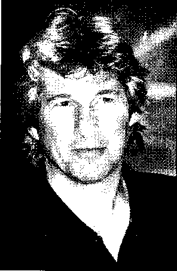

TRIỆU CHỨNG MẤT NGỦ

- • Lo lắng

- • Mệt mỏi

- • Mất trí

- • Ngáy

- • Tâm trạng thất thường

- • Ao giác

- • Say sóng

- • Ngủ lịm.

TẠI SAO LẠI CẦN NGỦ

Bạn giải thích rằng "khi chết tôi sẽ có đủ thời gian để ngủ", đôi mắt đỏ ngầu của bạn liếc nhìn bản báo cáo phải đọc đến 1 giờ sáng. Hẳn là bạn không chắc bài báo cáo đó đang viết về điều gì bởi vì tầm nhìn mờ hẳn và khó có thể tập trung cũng như suy nghĩ thông suốt.

Đó là những triệu chứng của việc thiếu ngủ. Điều lạ là bạn phải phụ thuộc vào đồng hồ báo thức. Nếu bạn cần có một chiếc đồng hồ để đánh thức vào mỗi sáng, thì đơn giản là bạn ngủ không đủ giấc.

Chính xác thì tại sao giấc ngủ lại quan trọng như vậy? Các nhà nghiên cứu cho biết, nếu ngủ không đủ giấc, thì hoạt động của con người trở nên trì trệ đáng kể. Các nhà khoa học vẫn chưa lí giải được tại sao giấc ngủ lại vô cùng quan trọng như vậy, nhưng họ biết điều gì sẽ xảy ra khi bạn thiếu ngủ. Đầu tiên, bạn cảm thấy buồn ngủ. Rồi đầu óc, những hoạt động, khả năng sáng tạo, và đánh giá nhanh chóng giảm sút. Trong những điều kiện đặc biệt, chẳng có sức mạnh ý chí nào giúp con người tỉnh táo cả.

Cho đến nay, chưa có ai chết vì không ngủ, dù nhiều động vật thí nghiệm đã chết vì thiếu ngủ khi các nhà nghiên cứu cố làm chúng không ngủ được.

10 CÁCH ĐỂ có giấc ngủ ngon

- 1\. Hằng ngày phải đi ngủ và thức dậy đúng giờ, bất kể những lúc bạn phải làm việc.

- 2\. Không được uống rượu và thuốc lá ít nhất 2 tiếng trước khi ngủ. Không được uống cà phê trước khi đi ngủ 5 tiếng.

- 3\. Đảm bảo giường ngủ thoải mái vằ yên tĩnh. Không được ăn uống, làm việc hay xem tivi trên giường.

- 4\. Nếu bạn thấy khó ngủ, thì đừng nằm trăn trở. Hãy ra khỏi giường, vào một phòng khác và đọc sách hay tập thể dục thư giãn đến khi bạn buồn ngủ.

- 5\. Nếu có thể thì cố gắng đừng dùng thuốc ngủ. Dùng thuốc khiến bạn cứ giữ mãi những thói quen xấu, do đó, nên cố gắng tránh dùng thuốc.

- 6\. Không nên ăn nhiều trước khi đi ngủ.

- 7\. Tập thể dục thường xuyên giúp khỏi mệt mỏi, làm tăng thêm giấc ngủ ngon. Phải chắc chắn bạn thôi tập thể dục ít nhất 3 tiếng trước khi đi ngủ.

- 8\. Chơi vài bản nhạc thư giãn, hãy để phòng ngủ tràn ngập không khí tự nhiên, tắt điện thoại, và cho phép cơ thê’ cũng như đầu óc của bạn được thư giãn ít nhất 30 phút trước khi ngủ.

- 9\. Dành ra khoảng 15 đến 30 phút ngủ trưa nếu bạn cảm thấy buồn ngủ.

- 10\. Đừng lấy đi thời gian nghỉ ngơi sau một ngày làm việc mệt nhọc. Khi bạn hết khả năng chịu đựng thì hãy nói chúc ngủ ngon.

NGỦ BAO NHIÊU?

Giấc ngủ tốt nhất cho người trưởng thành trung bình tôi thiểu là một giờ nhiều hơn những gì bạn từng biết. Một người đàn ông bình quân một đêm ngủ khoảng bảy tiếng. Ngược lại, hầu hết nam giới đều cần ngủ khoảng 8 đến 9 tiếng để duy trì trạng thái tỉnh táo hoàn toàn - ít nhiều phụ thuộc vào yếu tố di truyền. Khi bạn cố xoay sở, bạn sẽ quên đi chu kì giấc ngủ quan trọng nhất. Giấc ngủ diễn ra vào khoảng giờ thứ bảy và giờ thứ tám.

Trong suốt thời gian đó, bạn bước vào giai đoạn cuối của giấc ngủ, khi mạng lưới nơtron thần kinh của não bị kich thích - năng lượng tương đương của não được bổ sung. Sự bổ sung cho phép bạn duy trì và thu được ý tưởng và tự thị mới, tăng cường trí nhớ, và đạt được những loại vật chất tinh thần khác nhau. Nếu bạn quên kích thích mạng lưới nơtron thì não bộ sẽ bắt đầu hư hỏng đi.

Trong suốt quá trình làm việc vâ't vả, bạn cần phải có thời gian để đầu óc được thoải mái, một đêm bạn cần có 4 hoặc 5 giấc ngủ 90 phút, cũng như có một sự kết hợp giữa giâ’c ngủ sâu và giâ’c ngủ chợp mắt (REM), hay còn gọi là ngủ nháy mắt nhanh.

Một nhóm các chuyên gia cho rằng giấc ngủ REM giúp kích thích quá trình chuyển hoá giải phóng những vật chất trong não, là những chất giúp học tập dễ dàng hơn. Những người tin rằng họ khó ngủ thì chính họ đang lấy đi năng suất làm việc cao nhất của mình, vì họ quên đi việc kích thích thần kinh cần thiết để ghi nhớ và giải quyết vấn đề.

NÃO BỘ LÀM GÌ KHI BẠN DANG NGỦ

Điện não vẫn hoạt động trong khi bạn ngủ, phụ thuộc vào giai đoạn giấc ngủ. Khi được đo bằng máy điện đề, hoạt động này giống cơn sóng. Do đó, chúng ta trải qua hai loại giấc ngủ được gọi là giấc ngủ sóng chậm (sâu), và giấc ngủ REM (nháy mắt nhanh), kèm với chiêm bao.

Khi bạn ngủ, bạn trải qua giấc ngủ sóng ngắn (cũng được gọi là ngủ không nháy mắt), thường được chia thành bốn giai đoạn giấc ngủ sâu tăng dần, khi đó tần số sóng điện não thường chậm hơn. Đồng thời, thân nhiệt, quá trình trao đổi chất, huyết áp, nhịp tim, và hô hấp đều giảm.

Cứ 90 phút sau giai đoạn thứ tư của giấc ngủ sóng chậm thì bạn trải qua một chu kì giấc ngủ REM kéo dài từ 5 đến 30 phút. Giấc ngủ REM ít thoải mái hơn giấc ngủ sóng chậm - hoạt động của sóng điện não cũng tương tự như khi bạn thức giấc. Nhịp tim, huyết áp, hô hấp trồ nên bất thường và mắt bạn nhanh chóng khép mí mắt lại.

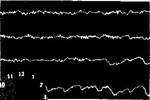

Với giấc ngủ vào ban đêm, hầu hết mọi người đều trải qua bốn hoặc năm giấc, cho dù bệnh tật hay rối loạn giấc ngủ có thể quấy rốì và ngăn bạn đạt đến giấc ngủ sâu nhất là giai đoạn ngủ thoải mái nhất.

Khi thức giấc, một người có sóng điện não nén

ùhặt (hai dòng trên, dưới). Hầu hết mọi người đểu thức dậy ở thời gian ngắn (xem vùng có màu đỏ trên đồng hồ).

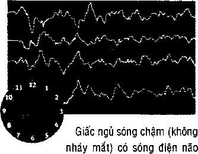

cao và rộng. ít nháy mắt (hai dòng cuối). Giai đoạn thứ tư là giai đoạn ngủ sâu nhất (màu đỏ).

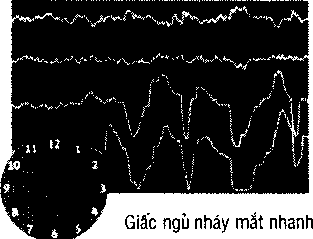

(chiêm bao) xảy ra bốn hay

năm lần mỗi đêm (chỉ ra ở vùng màu đỏ). Sóng điện nãotuơng tự với những sóng phát sinh khi thức dậy. Mắt di chuyển nhanh.

GIẢI QUYẾT NHỮNG RẮC RÔÌ VỀ GIẤC NGỦ

Nếu bạn trả lời có cho một hoặc nhiều câu hỏi dưới đây thì có lẽ bạn cần ngủ nhiều hơn nữa:

- • Bạn có mất tinh thần vào buổi chiều không? Bạn có cảm thấy buồn ngủ, bắt đầu ngáp dài và khó tập trung vào công việc không?

- • Bạn có ngủ thiếp đi trong 5 phút khi bạn vào giường không? Những người có trạng thái tốt thường ngủ thiếp đi khoảng từ 10 đến 20 phút.

- • Bạn có tắt đồng hồ báo thức vào cuối tuần và tự cho mình ngủ thêm vài tiếng nữa không?

Sau đây là một vài gợi ý để bạn tìm ra cách nghỉ ngơi. Trước hết phải chắc chắn rằng hằng ngày bạn đi ngủ và thức dậy đều đúng giờ kể cả những ngày cuối tuần. Mỗi tối phải ngủ sớm hơn 20 phút vào những ngày bạn không có giấc ngủ trưa. Và đó là cách tìm ra giấc ngủ hằng ngày tốt nhất. Khi bạn không còn đặt báo thức nữa, nếu đã ngủ đủ giấc rồi thì bạn sẽ tự động thức dậy vào buổi sáng. Nếu bạn muôn dậy sớm, thì hãy lấy thời gian bạn thức dậy trừ cho khoảng thời gian bạn phải ngủ và đi ngủ đúng ngay thời điểm đó.

GIẤC XGÚ QI A Cl ỘC ĐÒÌ

Khoảng 6 tuổi, tuyến yên ở đáy não bài tiết lượng lớn nhất chất melatonin gây ngủ vào mạch máu, tính đến loại giấc ngủ sau mà ai cũng muốn nhưng lại ít khi xảy ra.

LuỢng bài tiết chất melatonin vẫn duy trì suốt thời thơ ấu, nhưng lại bắt đầu giảm dần ở tuổi thiếu niên. Khoảng 30 tuổi, giấc ngủ trở nên ít hơn. Giấc ngủ sâu và bước sóng chậm giảm đi. Các chuyên gia cho biết, trong giấc ngủ sóng chậm, cơ thể tạo ra nhiều hoocmon giúp trẻ hóa cơ thể và lấy lại năng lượng đã hao mòn của ngày trước, cũng như quá trình tuần hoàn đạt đến mức cao nhất.

Dù vậy, nhiều nam giới ở độ tuổi 65 và những người khác ghi nhận rằng họ cần ngủ ít hơn, nhưng các chuyên gia lại không đồng ý điều này. Các chuyên gia cho biết yêu cầu về giấc ngủ của người lớn tuổi cũng giống như của những người trung niên, thế nhưng bệnh tật, thuốc men, và bệnh tuổi già đặc biệt là bệnh xơ vữa động mạch đều làm giảm khả năng chịu đựng giai đoạn dài của giấc ngủ sâu. Trước 65 tuổi, nhiều nam giới có giấc ngủ sóng chậm chưa tới 30 phút mỗi đêm.

Nếu hiện tại bạn có lối sống lành mạnh, với chế độ ăn ít béo và tập thể dục đều đặn, thì bạn sẽ có thể duy trì tốt hơn mức độ giấc ngủ mà cơ thể bạn đòi hồi để tự tái tạo.

##### ÙM THẾ NÀO ĐĨGIÀM CĂNG THANG VÀ TIẾT KIỆM THỜ! GIAN

Sống nhanh chết sớm, chỉ để lại cái xác điển trai: đó là câu châm ngôn của kẻ điên. Và lại cũng rất chính xác. Cứ mỗi phút bạn nghĩ làm vội vàng để tiết kiệm thời gian thì có thể dẫn đến giảm thọ hơn một phút. Mỗi phút bạn nghỉ ngơi thì sẽ sống lâu hơn trong những năm xế chiều.

BẠN CÓ BIẾT?

“Bạn trao cho tôi một vết loét”. Sự diễn đạt thông thường ấy phản ánh một thực tế rằng rõ rằng gần đây, sự căng thẳng được cho là nguyên nhân chủ yếu của bệnh loét dạ dày. Tuy nhiên, vào những năm 1980, các nhà nghiên cứu thuốc phát hiện ra vi khuẩn được gọi là Helicobacter pylori thường sinh sôi trong vết loét. Trong trường hợp như thế, các bác sĩ sẽ kê thuốc kháng sinh. Tuy nhiên, hãy giữ tinh thần khỏi những căng thẳng triền miên, có thể làm vết loét trầm trọng hơn.

X\_\_\_\_\_\_\_\_\_\_\_\_\_\_\_\_\_\_\_\_\_\_\_\_\_\_\_\_\_\_\_\_\_\_\_\_\_\_\_\_\_\_\_\_\_\_\_\_\_\_\_\_\_\_\_\_\_\_\_\_\_\_;\_\_\_\_\_\_\_\_\_\_\_\_\_\_/

CÂNG THẲNG LÀ GÌ?

Căng thẳng là hậu quả của sự buồn bực, nóng giận, thất vọng hoặc kinh tởm. Bâ't cứ thứ gì tạo áp lực và không chắc chắn, như là lo lắng về những điều bạn cần phải làm ngay bây giờ, hay lo lắng về điều những đồng nghiệp sẽ nghĩ đến nếu bạn không được thăng tiến trong công việc, hoặc là mọi thứ bạn không thể làm trong ngày hôm nay mà cần đến ngày mai để giải qu-yết.

Mọi người đều có áp lực trong cuộc sống mà họ cảm thây căng thẳng, thoát khỏi từ những chỉ trích của sếp và tiếng khóc thét của con trẻ đến những tính toán vượt mức của ngân hàng và đồng nghiệp thiếu kỹ năng. Nếu việc tận hưởng cuộc sống của bạn bị căng thẳng gián đoạn, thì cơ thể sẽ thông báo cho bạn những dấu hiệu cảnh báo khi bị dồn nén quá mức.

###### TRIỆU CHỨNG CẢNH BÁO

Sau đây là một vài dấu hiệu cảnh báo sớm của những căng thẳng có hại. Hãy lưu ý đến chúng; bỏ lơ các dấu hiệu sẽ khiến chúng trở nên tồi tệ hơn:

- • Khó ngủ.

- • Không có khả năng tập trung.

- • Những nhầm lẫn khi tập trung.

- • Giảm ham muốn tình dục.

- • Ăn khi không đói.

- • Hút thuốc nhiều hơn.

- • Uống rượu bia nhiều hơn.

- • Những cơn đau đầu tái phát.

- • Dễ nổi cáu, không kiên nhẫn, và mất bình tĩnh.

- • Thường cảm thấy lờ đờ.

Kill BẠN LO SỢ KHÔNG có NƠI NÀO ĐI

Đáp ứng với những tình thái bất thường đặt bạn trong tình trạng báo động đỏ: tim đập nhanh, huyết áp thay đổi đột ngột, và các cơ căng lên. Bạn tập trung hoạt động. Nhưng hầu hết các trường hợp ngày nay thì phản ứng theo bản năng không còn phù hợp nữa, khi nguyên nhân đe dọa không tự nhiên. Chẳng hạn như căng thẳng do lo lắng về giới thiệu việc làm không dễ giải phóng cơ thể. Căng thẳng luôn thường trực bên bạn khiến sức khỏe của bạn có nguy cơ gặp rủi ro cao.

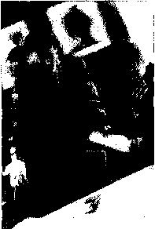

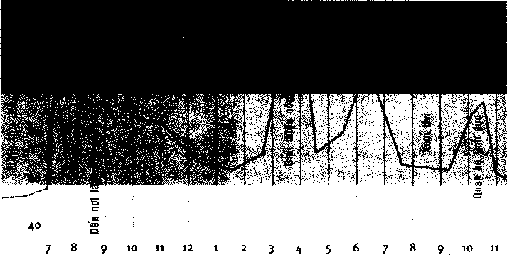

Thời gian trong ngày

Biểu đồ thể hiện nhịp tim - một phương phấp điều trị đáp ứng những tình thái bất thường cả vể nguyên nhân cơ thể lẫn xúc cảm trong một ngày làm việc cụ thể.

BÀI KIỂM tra Mức độ căng thẳng

Cuộc đời là kết quả của những lựa chọn. Có phải bạn đang chọn sự căng thẳng và lo lắng không? Hay bạn chọn cảm giác thư giãn và trong tầm kiểm soát? Hãy tiến hành kiểm tra căng thẳng dưới đây để biết được. Nếu bạn trả lời có cho hầu hết các câu hỏi “Sự lựa chọn tốt cho sức khỏe” thì chúc mừng bạn! Bạn đã kiểm soát căng thẳng rất tốt. Tuy nhiên, nếu bạn thấy bạn trả lời có hơn năm lần với “sự lựa chọn có hại cho sức khỏe”, thì đây là lúc nên nghĩ đến việc thực hiện một vài thay đổi quan trọng cho cuộc sống.

Sụ lụa chọn ct> hại (ho súc khoe t

lụa (họn tói tho SIK khoe

Bạn có hay lo lắng, tức giận, hay buồn phiền vđi nhưng that vọng hoặc vấn đề nhỏ nhặt không?

Bạn tin chắc rằng bản thân đang nỗ lực hết mình, và điểm tốt nhất của bạn vừa đủ?

Bạn có sống trong cảm giác lo sợ về cuộc sống trở nên túng quẫn không? Bạn có chịu đựng nỗi sợ hãi, lo Lắng, hay đau đớn hay không?

Bạn có nhớ là mình đứng dậy ra khỏi ghế vì lí do khác hay vì tiếng gọi của tự nhiên, làm việc nhiều hơn, hoặc đến máy bán hàng tự động?

Bạn có phải chịu đựng những cơn đau đầu tái pha't không? Bạn có thường xuyên đau lưng và cơ cổ không?

Bạn có thường suy nghĩ, hay tham gia bát kì các hoạt động thư giãn như yoga hoặc khí công không?

Bạn có hút thuốc liên tục cả ngây không?

Bạn có những mục tiêu và dự định hợp lí cho cuộc đời mình không?

Bạn có làm việc quá sức, cô đơn, bị cô lập không?

Bạ n có sẵn lòng nhờ đến sự giúp đỡ không?

Bạn có từng cố tăng năng lượng bằng cách uống những chất có chứa caffein và đường không?

Bạn có hôn vợ, ôm con cái, hay vuốt ve thú cưng khi về đến nhà không?

Bạn có thây bản thân thường xuyên phải chịu đựng những cơn mâtngủ, thở nông, có vâ'n đề về dạ dày hoặc ruột, và huyết áp cao?

Bạn có sở thích không? Đọc sách hay nghe nhạc? Có khi nào bạn trêu đùa hoặc cười với người khác không? Bạ n có thấy hài lòng với những thứ trong cuộc sống không dù là những thứ nhỏ nhặt?

Bạn thường chỉ trích hay tìm lỗi của người khác không? Mọi người sợ phải làm việc vđi bạn phải không? Bạn gặp khó khăn phải xoay sở ?

Bạn có phải là một tài xê giỏi không? Bạn có tránh lái xe hâ'p táp, phản kháng những người lái xe máy, và tàu cao tô'c không?

Bạn có lên giọng khi nói chuyện với người khác không?

Bạn có để công việc qua một bên khi về nhà vào buổi tối không? »

'Jự íựa chọn có hại cho sức khóe

Lựa chọn tốt cho súc khoe              1

Sự tức giận của bạn thưởng vượt quá tình huống?

Bạn có biết hạn chếcủa mình không? Bạn có chấp nhận những hạn chê’đó không?

Hầu như bạn không thể thừa nhậ n những thiếu sót hay chủ động xin lỗi người khác phải không?

Bạ n có danh sách ưu tiên gồm có gia đình, bạn bè và niềm vui không? Bản thân bạn đứng vị trì nào trong danh sách?

Bạn cảm thây cồng việc như một gánh nặng hơn là một sự thử thách?

Bạn có dành thời gian trong ngày cho luyện tập thể dục, ăn uống và thưgiãn không?

Bạn có làm việc cách miễn cưỡng không? Bạn có hay bị a'm a’nh những điều sai trái mà bạn nghĩ là người khác gây ra cho bạn không? Bạn cảm thây mình bị trù dập phải không?

Bạn có muôn đi làm không? Bạn có tình nguyện giúp đỡ ngưởi khác không? Bạn có phụ thuộc vào những lời khen ngợi và khuyến khích không?

CHIÊN ĐẤU HAY Đẩu HÀNG?

Áp dụng vào mọi người là câu trả lời chiến đấu hay đầu hàng. Khi não nghĩ rằng một cuộc khủng hoảng đang đến, thì não sẽ gởi những dấu hiệu cảnh báo dưới dạng' tin nhắn hóa chất được biết đến như là những chất dẫn truyền thần kinh. Những chất này kích hoạt quá trình sản xuất hoocmon với mục đích là đặt cơ thể trong tình trạng báo động đỏ. Và đây là những điều sẽ xảy ra:

- • Nhịp tim tăng và mạch máu giãn ra.

- • Huyết áp tăng.

- • Các cơ yếu đi.

- • Hệ tiêu hóa ngừng hoạt động.

- • Bạn bắt đầu đổ mồ hôi nhiều hơn.

- • Nhịp thở nhanh hơn.

Não bộ điều khiển cơ thể để qua đó hoặc là chiến đấu với những đe dọa hoặc là trốn chạy.

Người tiền sử đã đối phó với việc này rất tốt. Chẳng hạn như, khi đối diện với mãnh hô’ hay đánh nhau với những người thượng cổ ở bộ lạc kế cận, thì khẩu hiệu chiến đâ’u hay đầu hàng đã cho tô’ tiên chúng ta một cơ hội sinh tồn.

Những ngày đó vẫn cẩn thiết để sống sót qua những hoàn cảnh đe dọa đến tính mạng. Ví dụ, nói rằng bạn đang ở trong trường hợp ách tắt giao thông và ai đó quay đầu xe trước mặt bạn. Căng thẳng làm tăng các phản ứng và ngay lập tức bản năng tự bảo vệ mình phát huy, làm cho phản ứng của bạn nhanh nhạy hơn bình thường. Phản ứng chiến đấu hay đầu hàng trở thành phương thế để giải quyết những thử thách của công việc như là những cuộc gặp mặt làm ăn quan trọng hoặc hạn chót sắp đến.

Tuy nhiên, phản ứng tự nhiên của cơ thể chúng ta đốì với những căng thẳng thì ít phù hợp khi giải, quyết những căng thẳng từng ngày và những căng thẳng của cuộc sống thành thị. Ví dụ, không có cách để giảm căng thẳng đã bộc phát khi tàu hỏa đến trễ 20 phút hay bị kẹt xe. Áp lực thân thể được tạo ra nhưng lại không được giải phóng thì sẽ dẫn đến đau bệnh.

Ví dụ, các nhà nghiên cứu thuốc đã nhận thấy mức căng thẳng trải qua trong thời gian dài sẽ dần phá hủy hệ miễn dịch, gây tổn hại đến hàng loạt nhiễm trùng nhẹ, và có thể hình thành các dạng ung thư.

Căng thẳng triền miên cũng có thể làm bệnh tình thêm trầm trọng hay trực tiếp gây ra hàng loạt bệnh tật và đau đớn, gồm có huyết áp cao, tiểu đường, mụn trứng cá, rối loạn tiêu hóa, vô sinh, đau đầu, liệt dương, lở loét, khó ngủ, đau lưng, và hen suyễn. Căng thẳng quá mức cũng khiến bạn rốì loạn cảm giác, gây ảnh hưởng đến các mối quan hệ và sức khỏe tinh thần của bản thân. Trong trường hợp đặc biệt, có thể dẫn đến rối loạn thần kinh lo âu và trầm cảm.

CĂNG THANG \\ì vòng eo

, ■■ ■ ■ ..... ..... ... . . .

Hãy ra ngoài, đi bộ dọc fê đường trong giờ cao điểm và bạn sẽ thấy kết quả khả năng chịu đựng căng thẳng của cơ thê’ người đàn ông ăn uống quá độ. Chế độ ăn có hằm lượng chất béo cao và thiếu vận động kết hợp với căng thẳng có thể so sánh như một lốp xe thừa lồi ra - Tại sao?.

Khi não nhận ra một mối đe dọa, ngay lập tức não điều khiển tuyến thượng thận gởi đi sự tiếp nhận. Tuyến thượng thận ồ trên đỉnh quả thận, tiết ra hoocmon gọi là cortisol vào mạch máu. Hoạt động của cortisol là đưa chất béo vào cơ thể, tức là sản sinh năng lượng cần thiết để né tránh hay chiến đấu với mối nguy hiểm.

Thử thách và áp lực của nạn kẹt xe thời hiện đại, mối quan hệ không tốt đẹp, sếp chỉ trích - có thể khiến tuyến thượng thận gọi nhiều chất béo hơn. Nếu chất béo không dùng đến thì sẽ tích tụ xung quanh bụng. Những ai có vòng bụng lớn (giông quả táo) có nguy cơ các bệnh tim mạch cao hơn những người có vòng mông hay đùi to (quả lê).

THÁI Độ CỦA BẠN ĐỐI VỚI sự CĂNG THANG

Các chuyên gia cho biết, căng thẳng cũng là một vấn đề cần được làm sáng tỏ. Nếu bạn sắp xếp cuộc sống không chặt chẽ, cứ để bản thân bị ám ảnh bởi công việc, tiền tài hay địa vị, thì những thử thách ,của cuộc đời sẽ đè nặng lên đôi vai của bạn hơn những người khác. Điều đó lí giải tại sao những yêu cầu nghề nghiệp đối với một người lại nặng nề, nhưng lại kích thích người khác.

Lượng công việc càng nhiều bạn càng phải tổ chức tốt hơn, đồng thời tìm ra cách quản lý lượng công việc một cách hợp lý. Căng thẳng vì công việc nhàm chán và bế tắt có lẽ thúc đẩy bạn phấn đâu nhiều hơn. Mỗi khi bạn có cảm giác bị sa thải, thì tâm lý sợ nghèo đói hoặc thất bại có thể thôi thúc bạn đăng ký một khóa học để nâng cao trình độ chuyên môn, hay là làm việc cật lực hơn.

Tương tự, lo lắng cho căn bệnh hiểm nghèo mai sau có lẽ buộc bạn phải đến gặp bác sĩ hoặc nha sĩ thường xuyên.

Và rồi, căng thẳng và những phản ứng của bạn cũng giống như ván bài cuộc đời: có thể một người xui xẻo nào đó đã chia bài cho bạn, nhưng làm thế nào bạn chơi xong ván bài đó.

có PHAI CĂNG THẮNG KHIÊN BẠN PHÁT Ốm?

Những ảnh hưởng của căng thẳng không tốt cho sức khỏe xuất hiện trên cơ thể, bất kì nơi đâu, từ làn da đến các cơ quan nội tạng. Căng thẳng liên tục cũng có thể làm giảm hệ miễn dịch, khiến bạn dễ bị viêm nhiễm nhẹ như là cảm lạnh, cảm cúm.

- • Đau tim. Lo lắng có thể gây nghẽn mạch máu và tăng nhịp tim, dần dần dẫn đến huyết áp cao và bệnh tim.

- • Rối loạn tiêu hóa. Căng thẳng góp phần và thậm chí có thể là nguyên nhân gây rối loạn dạ dày như hội chứng kích thích ruột, kèm theo các triệu chứng như tiêu chảy, rút ruột, hơi, và ợ nóng.

- • Vấn đề về răng miệng. Căng thẳng khiến vài người nghiến chặt răng, thường dẫn đến rạn nứt, viêm nhiễm đau nhức và điều trị răng miệng đắt tiền.

- • Đau nhức. Căng thẳng có thể khiến bệnh đau lưng càng trầm trọng, kéo dài tình trạng căng ở cổ và vai có thể gây đau đầu.

- • Vấn đề thần kinh, ở giai đoạn cao hơn, căng thẳng khiến thiếu tập trung hay mất trí.

- • Những khó khăn về giới tính. Căng thẳng làm giảm ham muôn tình dục và vấn đề cương thêm trầm trọng.

- • Mùi hương cơ thể. Căng thẳng làm tăng quá trình bài tiết mề hôi khiến vi khuẩn sinh sôi ồ vùng dưới cánh tay

và chân, do đó gây ra mùi hôi.                           WHB

- • Rối loạn về da. Đối với một số người, căng thẳng khiến da nổi mụn.

LÀM THẾ NÀO DỂ GIẢM CĂNG THANG

Tập thể dục thường xuyên, ăn uống đủ châì và nghỉ ngơi hợp lí là ba yếu tố hình thành lối sống lành mạnh đảm bảo cho cơ thể và tinh thần có khả năng chống lại những căng thẳng và lo lắng. Kết hợp ba yếu tố đó lại với nhau, bạn có thể bắt tay vào chương trình ngăn chặn căng thẳng, bao gồm việc xác định vấn đề, xem xét tình trạng, và tìm ra cách kéo dài thời gian.

CƯỜI i)Ế niư GIÃN

Tiếng cười là liều thuốc làm dịu đi tâm hồn đầy những căng thẳng. Các nhà nghiên cứu thuốc dùng tiếng cười thật sự để tiến hành nghiên cứu. Họ cho biết người trưởng thành chì cười trung bình 15 lần một ngày, trong khi đó hằng ngày trẻ em cười 400 lần.

Điều để trẻ em cười một cách tự nhiên mà người lớn lại quên mất? Điều đó chính là phải chơi như thế nào. Khi người lổn quên vui chơi và tập trung hoàn toàn vào công việc, kết quả là căng thẳng dẫn đến vô số triệu chứng gồm có đau cơ. Khi bạn chơi giỡn, cười đùa thì tiếng cười giải phóng những hóa chất trong não gọi là endorphin giúp thả lỏng cơ bắp và làm dịu cơn đau.

Vì bạn không thể kiểm soát những gì xảy ra trong cuộc đời, nên hãy cố gắng thay đổi sự tập trung của bạn đê điều khiển những phản ứng của bản thân đối với thử thách và những vấn đề nan giải. Hãy dùng sự hài hước để xoa dịu tình huống khó khăn, và cố gắng không quấy rầy.

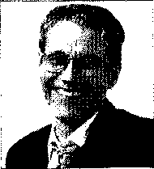

Chất endorphin làm giảm căng thẳng được não giải phóng bất cứ lúc nào bạn cười.

###### THỂ DỤC, NGHỈ NGƠI VÀ CHÊ ĐỘ ĂN UỐNG

Tập thể dục thường xuyên không chỉ giúp giữ gìn vóc dáng mà còn giải quyết được những căng thẳng có liên quan đến hoocmon. Tập thể dục khoảng 30 phút một tuần ba lần, chọn một việc nào đó bạn thích như đạp xe, bơi lội, chơi gôn, đánh quần vợt, chạy bộ, đi bộ hoặc làm vườn. Giấc ngủ giống như một liều thuốc giải trừ những căng thẳng. Mặc dù nhiều nam giới xem thường mức độ quan trọng của giấc ngủ, nhưng các cuộc nghiên cứu đã cho thấy thiếu ngủ có thể khiến bạn kiệt sức và giảm năng suất công việc. Nếu bạn không thể ngủ đủ giấc thì hãy chợp mắt một lát. Thậm chí chỉ cần chop mắt trong 30 phút, bạn sẽ cảm thấy khoan khoái và tỉnh táo hơn.

Với một chế độ ăn cân bằng, chắc chắn rằng bạn sẽ nạp đủ năng lượng cần thiết. Và một ít rượu có thể là một cách giải tỏa những căng thẳng hữu hiệu: nó giúp thả lỏng cơ bắp và thay đổi nhận thức để bạn nhìn nhận những khủng hoảng với cách nhìn tích cực hơn. Đây là lí do sau khi uống rượu mọi người đều có xu hướng thấy những việc vốn tiêu cực được nhìn nhận tích cực nhiều hơn. Nhưng bạn cũng nên biết rằng rượu có thể trở thành vấn đề gây vấp ngã, đặc biệt nếu bạn không kết hẹp vấn đề gây căng thẳng.

Ax UÔNG KHỎE MẠNH GIÚP GIẢI TỎA CĂNG THANG

I Bạn có thể giảm thiểu những ảnh hưởng của căng thẳng bẵng cách ăn những thực phẩm phục hồi chất dinh dưỡng bị cạn kiệt. Carbohydrate phức và đạm Ị được cho là giúp tăng cường hoạt động trí não trong trường hợp căng thẳng.

Một vài người tránh những thực phẩm có cafein và nhiều đường, mặc dù những thành phần này cung cấp năng lượng đốt cháy, nhưng khiến bạn nhanh chóng mệt mỏi và khó ngủ trong vài giờ sau đó. Cũng vây, rượu bia che lấp đi những triệu chứng căng thẳng nhưng làm cho bạn cảm thấy tệ hơn khi tác dụng thực của bia rượu bào mòn cơ thể bạn.

ị Thực phẩm nên ăn:

ị • Đường phức (tinh bột) như gạo, mì, khoai tây, bánh mì và bắp tạo ra quá Ị trình sản sinh serotonin trong não giúp giải tỏa những căng thẳng và tạo I cho cơ thể một nguồn năng lượng ổn định.

I • Đạm có trong thịt, cá và gia cằm giúp tăng cường hoạt động trí não và cung ị     cấp axit amin cho quá trình tái tạo các tế bào hư tổn của cơ thể.

I  • Trái cây như cam quýt, chuối, chanh, dâu tây, kiwi, đào, mơ, và cà chua là

I những thực phẩm giàu vitamin và betacaroten. Chúng cung cấp các dưỡng Ị    chất thiết yếu và phục hôi những tốn thương của cơ thế do căng thắng.

I  • Rau củ quả như tiêu, củ cải đường, đậu tắm, bí đỏ, bông cải xanh, cà rốt,

Ị     rau bina, mùi tây, và các loại rau xanh khác giúp cung cấp vitamin và các

ị    dưỡng chất. Sữa (hàm lượng chất béo thấp được ưa chuộng hơn) nguyên

I    cám, hạnh nhân, và mầm lúa mạch là nguồn cung cấp kali và khoáng chất

Ị giúp các cơ thả lỏng.

Ị Các thực phẩm cân tránh khi gặp căng thẳng:

I • Các sản phẩm chứa cafein như socola, cà phê, và nước có ga. Cafein có thê’ I phân hủy các vitamin B và c.

Ị • Thực phẩm chứa đường giúp tăng cường năng lượng nhưng lại khiếiì cơ thể I nhanh chóng mệt mỏi và dễ cáu gắt. Thừa calo dẫn đến thừa cân, tiểu đường, và những tình trạng có hại đên sức khỏe khác.

I • Rượu bia làm giảm khả năng phán đóan và phản ứng chậm. Những chất đó I gây mất cân bằng hóa học khiến những căng thẳng vằ lo ầu tăng cao.

###### XÁC ĐỊNH VẤN ĐỂ

Rất dễ để nhận thấy nguyên nhân gây bệnh. Công việc của bạn có nhịp độ quá nhanh, và bạn kì vọng vào công việc cũng quá nhiều. Tuy nhiên, không phải ai sống vội vã cũng đều căng thẳng. Những người sông nhàn hạ hay nghề nghiệp bậc thấp thì ít bị chi phôi bởi công việc mang tính cạnh tranh và không theo ý muốn. Đôi khi rất khó để xác định chính xác đâu là nguyên nhân gây căng thẳng. Để định rõ vấn đề, lần sau nếu bạn cảm thấy lo lắng hãy ghi chú lại những trường hợp đó và xem xét nếu những gì đã ghi chú xuất hiện.

###### GIẢI QUYẾT VẤN ĐỂ

Thường thì nữ giới đối phó với những căng thẳng tốt hơn nam giới. Đó là vì họ có thể chia sẻ vấn đề ấy với những người khác. Ngược lại, nam giới có xu hướng che giấu những rắc rối, giỏi như một tay chơi bài cừ khôi vậy, chính điều đó làm tăng sự phiền muộn. Do đó, khi bạn đang làm việc mà có ai hoặc điều gì khiến bạn căng thẳng, hãy nói vấn đề đó ra với đồng nghiệp hoặc bạn bè, hay là với người gây ra vấn đề đó. Hãy tích cực lên và bạn sẽ có thể thực hiện giải pháp mang tính xây dựng.

Giả định rằng ý kiến của bạn không được lắng nghe ở nơi làm việc và bạn chán nản với công việc hiện tại. Bạn sẽ không giải quyết được gì nếu đối diện với sếp và nói "tôi chán rồi" hoặc "tôi muốn một công việc khác thú vị hơn". Thay vào đó, hãy đưa ra một đề xuất cụ thể và khả thi.

###### HÃY ĐÁNH GIÁ ĐÚNG NHỮNG GIÁ TRỊ CỦA BẢN THÂN

Nếu một công việc tốt lại khó hơn chơi bóng bàn, thì có lẽ đây là lúc bạn nên thay đổi lôi sống. Đây là một bước quan trọng đòi hỏi bạn nhận xét những gì bạn đánh giá cao nhất trong đời. Tự hỏi bản thân những câu hỏi sau:

- • Bạn muốn rút ra điều gì trong cuộc sống?

- • Vấn đề thực sự của bạn là gì? Xe hơi sang trọng? Nhà nghỉ mát đắt tiền?

- • Bạn có tính toán thời gian dành cho vợ con, hoặc những theo đuổi của bản thân hay những-mạo hiểm về sức khỏe không?

LÀM THẾ NÀO ĐỂ QUÂN LÍ THỜI GIAN HIỆU QUẢ

Quản lí thời gian là phương pháp ngăn ngừa căng thằng và là một cách điều khiển cuộc sống của mình. Nếu bạn không có ý kiến gì về nơi bạn sống, thì bạn là ứng cử viên sáng giá cho danh hiệu bạn sử dụng thời gian 24 tiếng như thê nào. Cô gắng xác định những nguyên nhân gây lãng phí thời gian. Sau đây là một vài nguyên nhân quan trọng nhất:

- • Những gián đoạn, đặc biệt là các cuộc điện thoại.

- • Do dự.

- • Không có lịch trình cụ thể cho từng ngày.

- • Không có ban tổ chức.

- • Không thể nói không vởi nhũng yêu cầu vô lí.

- • Không thể yêu cầu hay đồng ý giúp đỡ khi được yêu càu.

- • Chúyển công tác mà không kết thúc bất kì nhiệm vụ nào.

- • Tán gẫu quá nhiều.

- • Giao tiếp kém.

- • Các cuộc hẹn kéo dài quá lâu.

Hãy tìm ra nguyên nhân hàng đầu gây lãng phí thời gian và bắt đầu làm điều gì đó. Hương dẫn bạn làm theo các nguyên tắc sau đây:

- • Đừng trì hoãn. Lập một danh sách các nhiệm vụ càn phải hoàn thành, theo thứ tự quan trọng, đặt ra mục tiêu thực sự, do đó bạn càn có kế hoạch cho từng ngày. Sau đó hoàn thành kế hoạch, phải kết thúc công việc trước khi chuyển sang việc khác.

- • Bất kì công việc chưa hoàn thành nên chuyển qua kế hoạch ngày hôm sau Ghi lại bất kì nhưng gì gây trở ngại đến công việc của bạn và cách đối phó với chúng. Ví dụ, bạn có thể cằn đến sự giúp đỡ của thư ký nhiều hơn nữa.

- • Phân chia những dự án lớn thành các công đoạn có thể quản lí được và nếu có thể hãy giao việc cho người khác.

- • Giải lao đều đặn suốt ngày làm việc, bạn sẽ trở lại làm việc với cảm giác khoan khoái, thậm chí có thể tìm ra một phương án mơi để giải quyết vấn đề mà trước đó đã làm bạn thất vọng. Chẳng hạn như thay đổi cảnh trí bằng cách đi dạo.

Hãy viết ra những ưu tiên, sau đó lập danh sách những điều bạn dành thời gian. So sánh hai danh sách. Có phải cách bạn dành thời gian phản ánh những ưu tiên của bạn? Nếu những danh sách đó nghiêng hẳn về một bên, thì bạn cần phải điều chỉnh thái độ, bao gồm thay đổi nghề nghiệp.

###### Tự PHÂN CHIA THỜI GIAN

Một phần quan trọng trong việc quản lí thời gian là tự cho mình thời gian. Cố gắng hạn chế xem tivi khoảng 5 hoặc 6 tiếng một tuần và thay thế bằng những hoạt động sáng tạo, phong phú và vui vẻ, tránh những thứ gây căng thẳng và cạnh tranh. Cố gắng tạo thói quen làm việc gì đó giúp rèn luyện bản thân.

Nguyên tắc ấy cũng được áp dụng cho những ngày nghỉ. Nhiều nam giới có công việc quan trọng thì có ngày nghỉ quan trọng, họ buộc mình phải dậy sớm, lịch trình dày đặc những cuộc hẹn, hoạt động hoặc cuộc thi, thường kết thúc một ngày với những cuộc điện thoại đến văn phòng và vài bản fax trước khi đi ngủ.

Kỳ nghỉ là lúc thư giãn và nạp lại năng lượng. Đừng gắng sức. Hãy ngồi ở nơi mát mẻ và đọc sách. Dặn trước nhân viên chỉ gọi điện trong trường hợp khẩn cấp. Tốt hơn hết đừng nói với họ mình đang ở đâu - hãy tận hưởng kỳ nghỉ cùng với người bạn thân hay gia đình và đưa ra một bảng Hệt kê các cuộc gọi của văn phòng từ cuộc gọi khẩn cấp đến cúộc gọi làm phiền.

###### NHỮNG BÀI TẬP THƯ GIÃN

Cách tốt nhất chống lại những căng thẳng là một cuộc tấn cống mạnh mẽ. Có vài bài tập điều chỉnh căng thẳng đơn giản và nhanh giúp giảm những hậu quả căng thẳng nếu bạn thực hiện thường xuyên và đều đặn.

Ngừng làm việc và bắt đầu đếm ngược từ 40. Thực hiện một ngày năm lần. Sau khi đọc mỗi số, hãy lặp lại từ thư giãn. Giống như: 40 thư giãn, 39 thư giãn, 38 thư giãn.v.v..Cuối cùng khi đếm đến số 0, hãy lặp lại việc đó bốn lần nữa. Mất khoảng 5 phút và giúp bạn trút bỏ mọi công việc mà không cần phài bước ra khỏi ghế. Bài tập thở ngắn cũng có ích.

NHỮNG MẸO NHỎ ĐE có cuộc SốNG không còn căng thăng

- • Hãy tự thưởng cho mình một ngày nghỉ cùng với gia đình để vui chơi và thư giãn. Nên nhớ rằng, mọi công việc và cuộc chơi đều tồn tạo nguy cơ kèm theo.

- • Ăn những thực phẩm tốt cho sức khỏe, luyện tập thể thao, ngủ đủ giấc, hạn chế những sản phẩm chứa cafein và rượu, bỏ thuốc lá.

- • Không phải mỗi cuộc chiến đấu đều giành chiến thắng. Giữ vững lập trường khi bạn đúng, nhưng cũng phải học cách nhún nhường.

- • Nói ra mọi điều. Nếu bạn lo lắng hoặc chịu áp lực, hãy chia sẻ với một người bạn thân, gia đình, giáo viên hướng dẫn, hay linh mục.

- • Học hỏi những kĩ năng mới. Giữ tinh thần luôn tỉnh táo và năng động.

- • Lập danh sách những việc cần làm. Hãy suy nghĩ về những điều bạn thực sự làm được trong khoảng thời gian cho phép. Hãy chắc chắn là bạn phân bổ thời gian hợp lí cho từng công việc, sau đó gia thêm vào một ít thời gian cho những việc ngoài mong đợi.

- • Đặt ra mục tiêu cụ thể cho cuộc sống, và quan sát xem bạn dùng những nguồn lực như thế naò. Tiêu xài trong phạm vi mình kiếm được.

- • Nếu bạn muốn khóc, tìm một nơi riêng tư và hãy thoải sức khóc. Điều đó giúp trút hết mọi áp lực.

- • Làm điều gì đó với một người khác; sẽ giúp đầu óc bạn thóat khỏi những rắc rối. Tình nguyện làm việc trong nhà hoặc trong cộng đồng.

Hít một hơi thật sâu rồi thở ra, rồi lặp lại 4 hoặc 5 lần. Cứ hai tiếng thực hiện một lần.

Mặc dù rất khó tìm ra nơi được ở một mình cả ngày, nhưng xem xét đến việc đến phòng dành cho nam giới và ngồi trong nhà vệ sinh, hay ngồi suy nghĩ một vài phút trong xe trước hoặc sau khi làm việc, hoặc trong buổi hẹn. Những cách thức suy nghĩ lâu hơn giúp công việc của bạn tốt hơn, gồm có yoga, khí công, và ngồi thiền. Tham khảo "10 cách thư giãn" để có nhiều phương pháp thư giãn hơn.

1 (I CÁCH THƯ GIÃN

- 1\. Hít thở sâu, hít vào bằng mũi. Giữ im trong 10 giây, rồi thở ra. Bạn nên cảm giác dạ dày của mình giãn ra theo từng nhịp thở. Thỉnh thoảng hãy nhắm mắt lại hoặc tập trung vào một nơi thư thái hay một cái nhìn giúp đỡ.

- 2\. Cười. Không có nghĩa là chúng ta cười khúc khích hay cười duyên, nhưng là một nụ cười thực sự phát xuất từ trong dạ dày và tự đẩy ra ngoài. Để giúp bạn cười, hãy xem một diễn viên hài, đọc một mẩu chuyện vui, xem phim hay chương trình hài kịch.

- 3\. Hãy loại bỏ những suy nghĩ tiêu cực. Khi bạn tan sở, hãy tự nhủ: “Mình đã trải qua một ngày”. Đừng mang những rắc rói của công việc về nhà. Nếu những vấn đề đó vẫn cứ bám theo suy nghĩ của bạn, hãy nói “dừng lại”, “bỏ đi” hay “hủy bỏ” và tự nhắc nhở mình xua trừ những điều làm công việc thêm trầm trọng ra khỏi suy nghĩ của bạn.

- 4\. Suy nghĩ hoặc vẽ tranh. Dồn hết tâm trí vằo những hoạt động tinh thần. Dành ra từ 20 đến 30 phút mỗi ngày để cầu nguyện với Thiên Chúa, thiên nhiên hoặc điều gì đó mà bạn đặt niềm tin vào vũ trụ.

- 5\. Thư giãn từng bộ phận của cơ thể, bắt đầu với chân. Tập trung suy nghĩ và chú ý đến việc giãn chân. Khi các ngón chân có cảm giác thoải mái rồi, hãy di chuyển mắt cá chân, hai chân, v.v... cho tới khi đến đầu.

  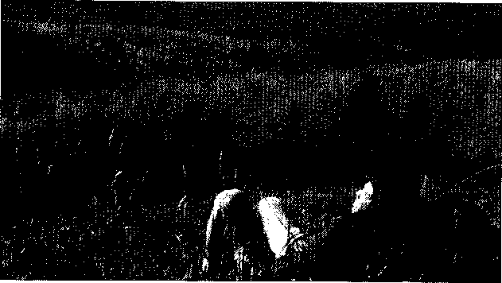

  Chống lai căng thẳng với hoạt động thư giãn. Một ngày dài không chỉ mang lại cho bạn bầu không khí trong lành và hoạt động thể thao, mà còn giúp bỏ lại sau lưng những lo lắng, phiền muộn.

- 6\. Thức dậy và duỗi thẳng người sẽ giúp cơ thể khỏi căng nhức. Đứng lên, đi lại quanh bàn hay phòng làm việc. Lắc nhẹ đầu từ bên này sang bên kia. Xoay vai từ sau ra trước rồi ngược lại.

- 7\. Đưa các ngón tay lên đầu, xoa bóp nhẹ nhàng.

- 8\. Chọn một cái gối. một chiếc gối êm ái sẽ giúp giải tỏa những căng thẳng, hoặc hét vào gối đê’ giải tỏa những căng thẳng bị dồn nén.

- 9\. Thả lồng cơ thể bằng cách ngâm mình trong nước ấm khoảng 15 phút hoặc lâu hơn.

- 10\. Tìm một hoạt động mà bạn thích. Chạy bộ, đi bộ, viết lách hay bất cứ việc gì miễn là bạn chọn vì thích thú. Tránh chọn những gì liên quan đến công việc hoặc gây căng thẳng.

M DFP

•

Đó là bộ phận lớn nhất trong cơ thể, và thường bị thâm tím, trầy xước, méo mó và rám nắng. Da cũng là vùng kích thích cảm giác chính. Nếu có cơ hội, có lẽ bạn sẽ suy nghĩ rõ ràng về làn da của mình. Có thể đây là lúc nên thay đổi suy nghĩ. Xét cho cùng thì cách làm thế nào để bạn đẹp hơn phụ thuộc vào việc bạn quan tâm đến làn da như thế nào.

BẠN ĐÃ TỪNG LỘT DA

Da chiếm 16% trọng lượng cơ thể. Một centimet vuông có khoảng 600 tuyến mồ hôi, 100 tuyến dầu, hơn 60 sợi lông, 20 mạch máu và vô số nút thần kinh. Da không thấm nước; co giãn mọi cỡ; và tự tái tạo. Với một ống xúc giác, thì da là một cầu nối chính giúp kết nối với môi trường bên ngoài. Và da cũng là lớp bảo vệ.

Chăm sóc da là một trong những điều được phân chia theo giới tính: phụ nữ bỏ ra nhiều giờ và khoản tiền lớn cho các sản phẩm làm đẹp, trong khi đó, đàn ông ít khi nghĩ đến những chuyện đó. Nhưng các quý ông chỉ cần hiểu: mình thuộc loại da nào và làm theo một vài bước nhỏ để bảo vệ da luôn khỏe mạnh.

MẸO NHỎ CHO LÀN DA KHÓE MẠNH

- • Giữ da sạch sẽ. Rửa mặt bằng sữa rửa mặt dịu nhẹ và nước. Tránh chà xát hoặc kéo da. Dùng tay rửa mặt tốt hơn dùng khăn, bọt biển, bàn chải hay mướp. Rửa cả cổ và tai nữa.

- • Nguyên tắc sức khỏe tốt cũng được áp dụng để bảo vệ da: không hút thuốc (gây lão hóa da), hạn chế sử dụng rượu bia, tập thể dục nhịp điệu, và ăn uống hợp lí gồm có trái cây, rau xanh và ngũ cốc. uống từ 6 đến 8 li nưởc mỗi ngày.

- • Giảm mức độ căng thẳng bằng cách tập thê’ dục thả lỏng cơ thể hoặc ngồi thiền 15 phút mỗi ngày.

- • Phơi nắng gây hủy hoại và lão hóa da. Hạn chế tổn thương da do việc ra ngoài nắng bất kì lúc nào có thể. Thoa kem sunscreen (SPF 30 hoặc cao hơn) khi ra ngoài dù trời có nắng hay không. Bảo vệ da - môi, mắt (dùng kính râm ngăn kia UV), tai, tay. Không có điều gì sánh được với cho làn da rám nắng khoe mạnh.

- • Kiểm tra định kì các nốt ruồi trên mặt hoặc các dấu hiệu ung thư da khác. Nếu da xuất hiện nhiều nốt ruồi hay bị đổi màu thì hãy gặp bác sĩ đa khoa.

GIỚI THIỆU VỀ LÀN DA

Da bao gồm vài lớp. Lớp biểu bì, hay là lớp ngoài cùng, nằm trên cùng của da. Da chứa mạch máu nuôi dưỡng da, nang lông, và tuyến bã nhờn (dầu) cũng như tuyến mồ hôi.

Lớp da trên cùng là lớp tế bào chết bong ra tạo, thành bề mặt dai và không thấm nước. Da luôn tự lột ra - ước tính khoảng 180kg (4001b) một đời người - và được bổ sung lớp da mới bên dưới. Bất kì các sản phẩm bôi lên da, như kem dưỡng ẩm, đều không làm thay đổi tính chất hóa học của lớp tế bào sống trên da, dù chỉ tạm thời làm căng lớp tế bào chết.

Sản PHAM phủ hợp cho da

Trước kia người ta thường cho rằng, các công ty sản xuất mỹ phẩm chỉ dành cho phụ nữ. Nhưng sau đó, họ nhận ra rằng họ đang bỏ qua một thị trường chưa mở cửa và rộng lớn dành cho đàn ông. Và chính vì vậy, một cuộc tấn công dữ dội trước hết là vào giới truyền thông, quảng cáo các sản phẩm chăm sóc da dành cho nam. Mặc dù vậy các loại dược phẩm không bán theo toa của bác sĩ hoàn toàn có thể đem lại các tác dụng phụ như phá hủy làn da hoặc hình thành vết chân chim. Những sản phẩm này thường không có tác dụng lâu dài và thường thì cánh mày râu không để ý nhiều đến làn da của mình.

t

Kem làm ẩm da sẽ thường làm cho da họ ẩm hơn và giảm đi vết nhăn. Tuy nhiên chế độ chăm sóc làn da tốt nhất vẫn là một chế độ ăn uống hợp lí. Bên cạnh đó, một lời khuyên khác đó là hãy chọn lựa loại xà phòng trung tính và thường là những loại không có mùi thơm quá nồng. Những ai hay gặp vấn đề về mùi cơ thể nên sử dụng loại xà phòng kháng khuẩn ở vùng bộ phận sinh dục và kể cả vùng dưới cánh tay. Sau đây là một số mẹo nhỏ:

• Nếu làn da của bạn khô và dễ bị bong ra hãy sử dụng xà phòng kháng khuẩn loại trang tính.

• Đối với những người mắc phải chứng chàm bội nhiễm trung tính - một loại viêm da - bạn nên chọn những sản phẩm có thành phàn chủ yếu là chất béo và nước. Hãy lựa chọn loại sản phẩm phù hợp theo tư vấn của bác si

• Nếu da bạn dễ kích ứng, hãy thử dùng loại sản phẩm làm sạch da trung tính. Hãy xin lời khuyên của bác sĩ để'chọn được sản phẩm có hiệu quả. Tránh việc sử dụng các íoại xà phòng có chất béo và bất kì các chất làm

mềm da nào khác hay kể cả kem lạnh. Đặc biệt nếu da của bạn không thấm dầu. Chất làm mềm da thường gây bít lỗ chân lông và chính điều này tạo điều kiện cho việc nổi mụn.

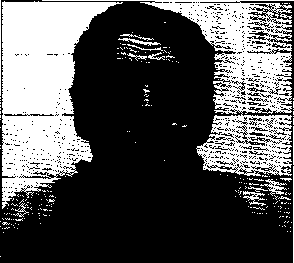

Cách chăm sóc làn da cho nam giới: Hãy rửa mặt bằng nước sạch VỚI xà phòng hay các sản phẩm trung tính.

SAC DÂY LÀ MÔ TẢ CỦA LÁT CAT DỌC BÊ mặt da

Làn da được chia ra thành ba lớp. Lớp bên ngoài cùng được gọi là lớp biểu bì. Lớp biểu bì chịu mọi sự tác động của môi trường bên ngoài, chẳng hạn như ánh nắng mặt trời và các yếu tố khác như vết thâm tím do chơi thể thao hay bất cẩn va đập, khi đó lớp biểu bì bên ngoài sẽ tạo thành lớp tế bào chết. Các tế bào chết này sẽ dằn được bong ra và thay vào lớp tế bào mới. Phần tiếp theo trên lớp cắt chính là lớp chân bì-phân dày nhất của làn da. Lớp chân bì gồm các chất cấu tạo dạng sợi tên gọi là chất co-la-gen, chất này duy trì tính mềm dẻo, đàn hồi của làn da. Lớp chân bì cũng gồm các nang lông, các tuyến mồ hôi, tuyến nhờn, tuyến ngoại tiết, dây thần kinh, mạch máu và lớp mỡ. (Tuyến nhờn bao gồm các chất bã nhờn giúp bôi trơn da và tóc trong lúc tiết mồ hôi). Lớp nhỏ nhất của làn da nằm bên dưới lớp chân bì chính là lớp mỡ dưới da.

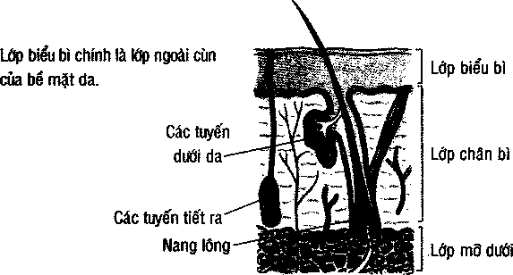

TRÔNG BẠN ĐẸP NHÂÌ

Chăm sóc da không khó, cũng không cần sử dụng những loại nước hoa đắt tiền.

Khói thuốc và tia tử ngoại là hai mối nguy hiểm lớn nhất ảnh hưởng đến làn da, chưa kể đến sức khỏe của bạn. vì thế, hãy lưu tâm đến làn da cũng như bản thân bạn: nếu bạn hút thuốc lá thì đừng hút nữa; hạn chế phctì nắng. Toàn bộ những lời khuyên để có làn da khỏe mạnh ở mục tham khảo "Mẹo nhỏ cho làn da đẹp".

###### stf cứu CHO NHỮNG VẤN ĐỀ VỀ DA

Chữa trị các vết đứt nhỏ, vết cạo và cháy xén với kem chông khuẩn không theo đơn (tham khảo ý kiến dược sĩ). Đối với những trường hợp cháy nắng nhẹ, tránh các sản phẩm xịt hay kem. Thay vào đó, hãy ngâm mình trong bồn nước ấm. Đối với trường hợp cháy nắng nặng nên nhờ dến sự chữa trị của bác sĩ.

NHỮNG LO LẮNG VỀ DA

Có lẽ bạn nghĩ về những phải chịu đau đớn vì mụn nhọt sẽ là một kí ức xa xôi, thế nhưng làn da dầu có thể bùng phát mụn trứng cá trên mặt và ngực của người nam khi 30, 40, thậm chí là 50 tuổi. Nếu vẫn còn nổi mụn, hãy gặp bác sĩ da liễu. Những vấn đề về da khác như mụn trứng ca đỏ và viêm da sẽ do bác sĩ chuyên khoa chuẩn đoán.

Mụn trứng cá đỏ khiến mạch máu nổi lên mũi, dù chẳng có ai biết vì nguyên nhân gì. Tình trạng xảy ra ở cả nam giới lẫn nữ giới. Mụn trứng cá đỏ điều trị dễ dàng bằng kem đặc trị và kháng sính dạng uống.

Viêm da là tên chung cho những loại viêm nhiễm da. Có hàng trăm dạng viêm nhiễm như vậy, bao gồm vảy nến và chàm. Hãy đến gặp bác sĩ nếu phát ban trở lại liên tục và không có tác dụng với thuốc không theo đơn.

###### SẸO

Chủ yếu là do vết đứt, đặc biệt là những vết thương nhỏ lành không để lại sẹo. Nếu vết thương lớn nhưng điều trị không đúng cách, thì nó sẽ để lại sẹo - thịt có sớ và da đổi màu. Bạn có thể ngừa sẹo bằng cách không đụng đến vết thương và gặp bác sĩ nếu vết thương sâu và lở loét ra.

MỤN TRỦX'G CÁ: ĐÁY KHÔNG CHỈ LÀ VẨN ĐÊ ở LỨA TLổI THANH THIÊU NIÊN 

Những đốm mụn trứng cá đáng ghét này có thể khiến bạn mất tự tin trong lứa tuổi dậy thì. Nhưng đối với một số nam giới, mụn trứng cá không thể hết sau khi qua lứa tuổi dậy thì: cứ khoảng 100 người đàn ông ở tuổi 40 thì lại có một người bị mụn ở phần lưng, ngực và mặt. Chính vì thế mụn nhọt và các đốm mụn nhỏ luôn xuất hiện, điều này phụ thuộc vào các yếu tô' chẳng hạn như lúc đau ốm, căng thẳng hoặc những người da nhờn.

Mụn trứng cá chính là khi bã nhờn nhét đầy lỗ chân lông và nang lông. Vi khuẩn bắt đầu tấn công, các lỗ chần lông sẽ bị viêm nhiễm. Bã nhờn tăng lên là sản phẩm của hóc môn nam giới, vì thế các cậu con trai thường bị mụn nhiều hơn con gái vào lứa tuổi dậy thì.

Vấn đề về cách lựa chọn thực phẩm như sô-cô-la, khoai tây chiên,các chất ngọt liệu có làm mụn trứng cá tăng lên nhiều hay không? Các nghiên cứu khoa học đều cho thấy việc ăn uống các chất này và mụn trúng cá hoàn toàn không liên quan đến nhau và cũng không thể làm tăng số lượng trứng cá. Hầu như sẽ không điều gì chứng minh được việc bạn ăn sô-cô-la, cá hay khoai tây chiên vào đêm trước đó sẽ là nguyên nhân của những đốm mụn vào sáng ngày hôm sau.

Khi bạn bị nểi quá nhiều mụn, hãy đến gặp bác sĩ, họ sẽ kê toa thuốc kháng sinh cho bạn giúp da bạn đỡ bị viêm nhiễm hơn. Các bác sĩ đa khoa sẽ hướng dẫn bạn đến gặp bác sĩ da liễu, họ sẽ kê toa thuốc trị mụn trứng cá nang làm thu nhỏ đi các tuyến dưới da và hạn chế các chất bã nhờn. Đê’ tránh bị mụn trứng cá, bạn nên dự phòng các loại thuốc có chất benzol peroxide, nhất là đối với loại da nhờn. Tránh nặn mụn trứng cá vì bạn có thể làm cho da bị nhiễm trùng và dễ để lại sẹo.

