##### HÃY CHĂM SÓC CHO MÁI TÓC CỦA MÌNH

Bạn sẽ nói rằng "Tôi không có bị hói mà do trán tôi cao". Tóc rụng là điều không thể tránh được ở mỗi chúng ta nhưng bạn vẫn có thể tránh được tình trạng hói đầu. Bạn hãy tìm cách hồi phục lại những phần tóc bị rụng.

NGUYÊN NHÂN GÂY TÓC RỤNG

Tóc là một dạng prô-tê-in dạng sợi hay còn là ke-ra-tin mọc từ các nang lông, chỉ có các chân chân tóc là phần còn sống, phần thân tóc và đuôi tóc là chất sừng đã chết. Nam giới thường rụng khoảng 30 đến 100 sợi tóc mỗi ngày và những sợi tóc mới lại tiếp tục mọc.

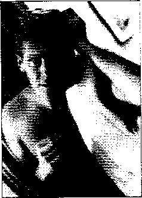

Mái tóc mểm mại, bóng mượt cũng là một dấu hiệu của tình trạng sức khỏe.

Việc rụng số tóc này chẳng có gì quá quan trọng vì bạn có cả hàng trăm ngàn sợi. Rụng tóc chỉ đáng chú ý khi bạn rụng hơn 200 sợi một vài ngày trong tháng.

Những nguyên nhân sau cũng có thể gây rụng tóc chẳng hạn như căng thẳng, đau ốm, da đầu bị viêm nhiễm hay là do việc sử dụng thuốc. Nhưng nguyên nhân chủ yếu nhất ở nam giới thường được xác định là do gen di truyền. Nếu bố của bạn bị hói đầu thì bạn cũng sẽ dễ có nguy cơ bị hói.

Testosterone - hóc môn nam giới - là nguyên nhân của vấn đề. Đốì với những ai bị hói do di truyền chính là do sự chuyển đổi hóc-môn testosterone thành dihydrotestosterone. Chất này khiến các nang lông chỉ sản sinh ra được một lượng tóc yếu, mảnh và dễ rụng vậy nên dẫn đến hói đầu.

###### BẠN CÓ THỂ LÀM GÌ ĐỂ TRÁNH TÌNH TRẠNG HÓI ĐẦU?

Đa phần cánh mày râu chỉ biết chấp nhận, số người còn lại thường chọn cách che đậy phần đầu bị hói lại, đi cấy tóc hay dùng thuốc mọc tóc. Những cách làm này cũng chỉ là cách để "ngụy trang".

CÁCH GIÁí QUYẾT TÌNH TRẠNG RỤNG TÓC

Trước ki bạn tước mỏng những sợi tóc còn lại của mình, lựa chọn sau đây giúp bạn cảm thấy tự tin hơn và trông bắt mắt hơn. Các nhà tạo mẫu tóc chuyên nghiệp cho rằng cách tốt nhất để che phần tóc bị hói đó chính lằ uốn cong mái tóc, cách này giúp mái tóc bạn trở nên dày hơn. Họ cũng đề nghị nên sử dụng các sản phẩm chăm sóc tóc, các sản phẩm này giúp tóc giảm rụng. Nếu như tóc bạn chẳng còn bao nhiêu thì hãy cạo luôn phần ít ỏi đó và bắt đầu một kiểu tóc mới theo phong cách của thám tử Kojak.

Ngoài ra, bạn cũng có thể thay tóc nhưng đòi hỏi phải có bác sĩ chuyên môn cao. Thay tóc tốn rất nhiều thời gian và tiền bạc tuy nhiên kết quả là bạn sẽ có được mái tóc dày hơn.

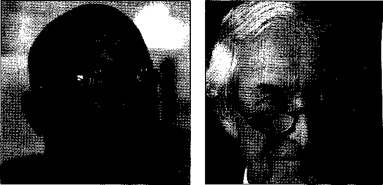

Cạo đi một phẩn tóc hay cạo hốt cả mái tóc để thể hiện nét nam tính là đặc trưng từ xưa tới giờ.

Kiểu tóc này thể hiện một mái tóc ấn tượng nhưng lại không thích hợp với những mái tóc quá thưa.

Phải tôn rất nhiều thời gian và công sức mới "ngụy trang" được phần đầu bị hói. Những người tóc sợi mảnh thường dễ bị rụng tóc. Hãy sử dụng những sản phẩm đặc trưng. Đừng lo ngại về vấn đề giá thành rẻ hay được sản xuất hàng loạt.

Phương pháp điều trị thay thế trở thành một liệu pháp lâu dài giúp tóc mọc lại. Trước khi. công nghệ trở nên hiện đại hơn, những người mắc chứng hói đầu sau đợt điều trị họ cũng giông với tư thế của một người vừa phải trải qua một cuộc phẫu thuật não bộ. Ngày nay nam giới hoàn toàn có thể dùng dầu gội đặc trị. Tuy nhiên việc điều trị để có được kết quả cũng mất khá tốn kém.

Minoxidil là một loại thuốc được một phần ba nam giới sử dụng có hiệu quả được bán rộng rãi trên thị trường. Trong số người còn lại có người tóc cũng mọc ra nhưng lại bị xơ và số khác thì vẫn không cải thiện được. Loại thuốc điều trị này dường như chỉ thích hợp với những người vừa mới bị rụng tóc hay là với những ai có mái tóc sợi dày và không ảnh hưởng hoàn toàn tới phần bị hói. Loại thuốc Propecia sẽ ngăn chặn tình trạng rụng tóc và giúp mọc tóc ở những phần bị hói. Cả hai loại thuốc này đều phải dùng vĩnh viễn.

CÁCH LựA CHỌN TốT NHÂT CHO MÁI TÓC BỊ HÓI

Tất cả nam giới bị hói đầu thường vẫn cứ để nguyên chỏm tóc giông như hình móng ngựa từ phần thái dương cho đến phần cổ áo.

Nếu bạn không bị hói thì đừng cố gắng mặc những chiếc áo cổ cao phủ kín cả phần đuôi tóc. Theo các nhà tạo kiểu tóc, bạn càng cố gắng che phần tóc bị hói lại thì sẽ càng làm nổi bật lên phần da đầu hói.-

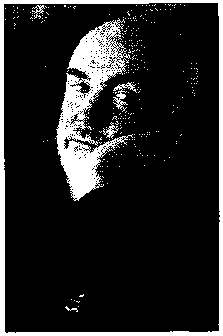

Đê’ tóc không rụng quá nhiều tốt nhất bạn nên để tóc ngắn. Hãy nhờ các nhà tạo mẫu tóc tạo kiểu tóc phù hợp nhất với bạn. Làm tóc xoăn nhẹ và nhuộm màu sẽ làm mái tóc trông nổi bật và dằy hơn.

Những người thích mạo hiểm sẽ thử cạo hết tóc

\- đây là cách thay thế ngày càng phổ biến. Kiểu đầu cạo trọc là phong cách phổ biến với các nhạc sĩ và các DJs (người giới thiệu băng đĩa).

Sean Connery-nam diễn viên người Ấn Độ thể hiện hình ảnh quyến rũ bằng cách kết hợp mình với một cái trán lán cóng.

CÁCH CHĂM SÓC CHO TÓC ĐƯỢC KHỎE MẠNH

Theo một nhà tạo mẫu tóc "có rất nhiều cách để chăm sóc tóc hơn là việc chỉ giữ cho mái tóc dài." Tóc cũng là một dấu hiệu nhận biết, khi tóc trông có vẻ theo nếp và bóng khỏe, thậm chí có một vài sợi tóc trên đỉnh đầu không theo nếp, điều này có thể báo cho bạn biết được tình trạng sức khỏe ổn định và cho mọi người biết được bạn là người chửi chu. Tuy nhiên đối với đa phần nam giới, họ chỉ cho rằng một mái tóc khỏe là không bị rụng đi quá nhiều.

Bạn sẽ có được một mái tóc đẹp và khỏe nếu làm theo những lời khuyên sau: cắt bỏ phần tóc bị hư tổn, gội rửa thường xuyên, chăm sóc cho tóc và dùng những sản phẩm thích hợp cho mái tóc chẳng hạn như kem vuốt tóc giữ cho mái tóc được vào nếp.

###### LựA CHỌN KIỂU TÓC PHÙ Hựp

Bạn nên để kiểu tóc theo lời khuyên của các nhà tạo mẫu tóc chuyên nghiệp. Hãy chọn lựa một mái tóc phù hợp với bạn về kiểu cọ, màu sắc, cách rẽ mái, cách gỢn sóng. Một mái tóc có kiểu cọ đàng hoàng cũng dễ dàng chăm sóc hơn. Bạn cũng nên cắt tóc thường xuyên - cứ sau 4 đến 6 tuần thì bạn nên cắt tóc - để giữ cho mái tóc vẫn theo nếp và cắt bỏ phần tóc bị xơ. Các nhà tạo mẫu tóc cũng sẽ khuyên bạn các loại sản phẩm chăm sóc tóc phù hợp cũng như lựa chọn kiểu tóc phù hợp với khuôn mặt bạn.

###### HÃY GIỮ CHO MÁI TÓC LUÔN ĐƯỢC SẠCH SẼ

Phụ nữ cho rằng mái tóc phái mạnh thường hay bị bóng nhờn vì thế hãy thường xuyên gội đầu nếu như da đầu của bạn không quá khổ. Gội đầu thường xuyên không những khiến tóc trông có vẻ dày hơn mà còn có nguy cơ sinh gàu.

Vì thế hãy chọn lựa loại dầu gội trung tính bằng cách xem độ pH ghi trên nhãn. Một số sản phẩm có thê’ gây hại tóc sẽ làm tóc khô và dễ bị gãy. Với quá nhiều loại dầu gội, dầu dưỡng tóc, keo xịt tóc, kem ủ tóc, kem vuốt tóc, thuốc mọc tóc được bày bán trên thị trường ngày nay chúng ta cũng khó biết lựa chọn sản phẩm nào cho phù hợp. Hãy tham khảo ý kiến bạn bè và các nhà làm tóc về những sản phẩm chăm sóc tóc họ ưa dùng rồi dùng thử cho đến khi tìm được loại thích hợp nhẩt.

HƯỚNG DAN sử DỤNG CÁC SẢN PHAM CHĂM sóc TÓC CHO NAM GIỚI

Việc lựa chọn loại dâu gội nào cũng được tranh luận rất nhiều. Một số bác sĩ da liễu tin rằng dùng bất là loại dầu gội nào cũng được nhưng hầu hết các nhà tạo mẫu tóc chuyên nghiệp lại phản đối. Theo một nhà tạo mãu tóc, loại dầu gội bạn mua ồ các cửa hàng nhỏ lẻ thường rẻ và tất nhiên là tiền nào của đó. Một số sản phẩm như vậy thường khiến tóc khô và mất màu. Những sản phẩm tốt hơn được bày bán ở nhũng cửa hàng bán mỹ phẩm hay theo sự hướng dẫn của chuyên gia tạo mẫu tóc sẽ có chất lượng hơn. Những nhà tạo mẫu tóc hàng đầu thường tự sản xuất và bán sản phẩm của mình. Dù bất kì trường hợp nào bạn cũng hãy luôn tin rằng các nhà tạo mẫu tóc luôn đề ra những sản phẩm phù hợp.

Hệ thống sản phẩm tốt nhất sẽ đem lại dòng sản phẩm được chế tạo theo công thức đặc biệt để phù hợp với từng loại tóc và da đầu, từ da khô đến da dầu, từ tóc khỏe đến tóc dễ bị tổn thương, tóc dễ bị gàu hay tóc đã qua tẩy nhuộm màu. Dưới đây là hưởng dẫn cho các loại sản phẩm chăm sóc tóc:

• Dầu gội. Đây được xem giống như một loại nước giặt rửa của mái tóc. Dầu gội làm bóng mượt tóc thường được dùng để gội sạch bám bẩn bởi các sản phẩm tạo kiểu tóc. Hãy nhớ dùng loại dầu gội trung hòa có chứa lượng pH thấp.

• Dầu dưỡng tóc. Cũng giống như kem giữ ẩm da, dầu dưỡng tóc giúp tóc mềm hơn. Bạn có thể dùng dầu dưỡng tóc hàng ngày cũng có thể là hàng tuần tùy

thuộc vào loại tóc của mình. Một mái tóc khỏe càn được ủ dầu dưỡng tóc hàng tuần trong khi đó mái tóc thô xơ cần dầu dưỡng tóc nhiều hơn.

• Kem vuốt tóc và kem giữ nếp tóc. cả hai loại kem này đều được dùng để tạo kiểu tóc. Kem vuốt tóc thường nặng hơn kem giữ nếp tóc yà thường tạo cảm giác dính. Kem giữ nếp tóc thường nhẹ và dễ tạo bọt hơn. Hãy kiểm tra thành phần trước khi mua và lựa chọn các nhãn hiệu không chứa cồn, cồn có thể gây khô tóc.

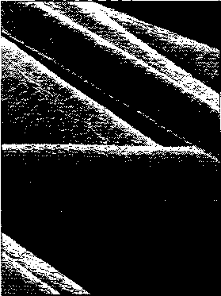

HÃY LựA CI1ỌX CÁCH CAT TÓC PHÙ HỢP

Bạn hãy nhớ lại lúc nhỏ mình cắt tóc như thế nào? Khi bạn đến cắt tóc mà không hẹn trước, bạn phải đợi một lát cho tới khi có ghế trống, bạn hy vọng và nhìn theo từng động tác của người thợ cắt tóc. Sau một vài phút, bạn cùng bố trở về nhà với đầu tóc mới.

Hầu hết nam giới đều chỉ cần để tóc sao cho phù hợp. Chính vì vậy mà họ không muốn phải tạo kiểu tóc quá phức tạp. Họ chỉ cần để tóc sao cho phù hợp với khuông mặt của mình. Dưới đây là một số kiểu tóc phù hợp với những khuôn mặt đặc trưng:

- • Với khuôn mặt vuông, bạn nên để nhiều tóc ở phần đỉnh, trống ở hai bên và cũng nên để tóc dài ra phía sau gáy.

  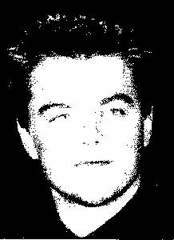

- • Đối vởi khuôn mặt dạng hình tam giác, một

khuôn mặt tam giác rộng ỗ phần cằm và hẹp dần ở phần trán nên để tóc dài và dày thêm ở hai bên tai.

Mái tóc chải bung kết hợp với tóc mái hơi lệch tâm của Leonardo DiCaprio - một diễn viên và nhà sản xuất phim người Mỹ - tạo nên vẻ cân bằng cho khuôn mặt hlnh trái tim của anh.

- • Đối vối khuôn mặt hình trái tim, bạn không nên để tóc phủ qua mắt, nên vuốt ngược tóc mái ra sau hoặc để tóc mái lệch sang một bên.

- • Đối vởi khuôn mặt có dạng kim cương, bạn nên để kiểu tóc sao cho bù lại phần cằm hẹp,

  đê’ tóc mái lệch sang một bên để che lại phần trán bị hẹp.

  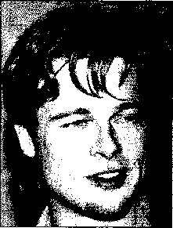

Khuôn mặt vuông của Brad Pitt - nam diễn viên và cũng là nhà sản xuất phim Mỹ -được tôn thêm phần hấp dẫn bởi lối đê’ tóc dày ở phẩn đỉnh và cắt mỏng và ngắn ở hai bên tai.

- • Đối với khuôn mặt tròn, bạn có thể để được hai kiểu tóc, thứ nhất để tóc dài và cắt cao phần tóc hai bên tai đê’ làm cho khuôn mặt dài hơn, thứ hai là cắt tóc thật ngắn.

- • Vổi khuôn mặt dạng hình chữ nhật, nên để phần tóc hai bên tai nhiều hơn phần tóc trên đỉnh.

Mái tóc cực ngắn của Will Smith - một diễn viên và ca sĩ nhạc rap của Mỹ trông thể thao và hợp với khuôn mặt tròn của mình.

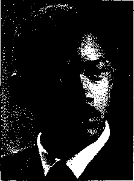

• Đối với khuôn mặt có dạng viên ngọc bạn nên để tóc nhiều ồ phần đỉnh đầu và trải rộng dần về phía trán. Phần tóc mai cũng có thể làm tăng độ rộng của khuôn mặt.

• Đối vổi khuôn mặt hình chữ nhật hẹp, hãy thử để một kiểu tóc không cân đốì làm rộng khuôn mặt hơn. Hãy đê’ tóc dày hai bên tai và cắt ngắn ỗ phần sau gáy, nên để thêm phần tóc rìa.

John Travolta - nam vũ công cũng là một ca sĩ người Mỹ - sở hữu khuôn mặt hình chữ nhật hẹp. Kiểu tóc ngắn và tóc mai dài làm khuôn mặt của ông có bề rộng hơn.

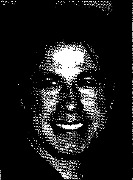

###### TẠI SAO LẠI CẦN DẦU DƯ0NG TÓC

Thậm chí tóc ngắn cũng cần phải dùng đến dầu dưỡng tóc hàng tuần. Phái mạnh thường phải tiếp xúc nhiều với ánh nắng nên cần phải dùng kem dưỡng tóc hàng ngày để hạn chế tình trạng tóc xơ và khô ráp. Tuy nhiên việc sử dụng quá nhiều kem dưỡng tóc cũng có thể khiến sợi tóc yếu, mỏng manh và khó tạo kiểu, với những tóc dầu và khỏe chỉ cần dùng mỗi tuần một lần. Dùng lượng dầu dưỡng tóc bao nhiêu và mức độ sử dụng thường xuyên phụ thuộc vào mái tóc và da đầu của bạn. Nếu tóc bạn quá mỏng manh thì không cần phải dùng dầu dưỡng tóc, nếu như mái tóc quá thô cứng và khô thì nên sử dụng dầu dưỡng.

###### HÃY CHĂM SÓC TÓC CẨN THẬN

Kéo giật tóc quá mạnh hay buộc tóc quá chặt cũng có thể gây tổn thương cho tóc, nhất là phần đuôi tóc. sấy tóc cũng sẽ khiến tóc bị hư tổn. Bạn nên dùng loại khăn bông mềm tốt để lau khô tóc và tránh chà sát mạnh vào vùng da đầu. Nếu bạn dùng máy sấy tóc thì hãy chọn chế độ sấy mức độ trung bình nhưng vẫn đảm bảo cho tóc được sấy khô và tốt nhất là nên để máy sấy cách xa mái tóc 15 cm hoặc 6 inch.

###### GIỮ CHO MÁI TÓC Đùực THEO NẾP

Xịt kem vuốt tóc hay kem giữ nếp cùng với máy sấy giúp bạn dễ dàng tạo kiểu tóc nhưng hãy nhớ gội sạch vào cuối ngày. Bạn hãy lựa chọn lượng kem phù hợp với kiểu tóc bạn muốn tạo và với loại da đầu. Kem giữ nếp tóc phù hợp với mái tóc dài gợn sóng. Kem vuốt tóc lại phù hợp cho các mái tóc ngắn.

Dẫu vậy bạn cũng nên cẩn thận khi sử dụng sản phẩm phù hợp. Kem vuốt tóc, kem giữ nếp tóc và keo xịt tóc cũng có thể nuôi dưỡng tóc, giúp tóc giảm xỉn màu và mảnh. Dùng dầu gội làm bóng tóc mỗi tuần một lần cũng giúp lột bỏ được lớp bám. Nếu bạn hay dùng các sản phẩm tạo kiểu tóc, các nhà tạo mẫu tóc cũng sẽ khuyên bạn nên dùng dầu gội làm bóng tóc hai lần mỗi tuần, các vết bám bẩn có thể dẫn đến các vảy gàu. Tuy nhiên cũng không nên dùng dầu gội làm bóng mượt tóc thay thế cho dầu gội trung tính vì việc sử dụng quá nhiều sẽ làm khô tóc khiến tóc khó tạo được kiểu.

MỘT GIẢI PHÁP LÂU DÀI

Việc nam giới nhuộm tóc là một ý tưởng không được nhắc đến nhiều. Ngày nay phái mạnh cũng dần chấp nhận việc làm này và mặt hàng này ngày càng tăng lên để đáp ứng nhu cầu này. Hễ bạn muốn tạo kiểu hay làm gì với mái tóc của mình thì tốt nhất hãy tham khảo ý kiến của các chuyên gia tạo mẫu tóc, họ sẽ khuyên bạn nên làm gì và nhược điểm ra sao.

Khi tạo kiểu tóc thẳng có thể bị xoăn hoặc gỢn sóng. Mặc dù bạn không cần phải làm cho tóc xoăn trở lại thẳng lại như ban đầu. uốn nhẹ mái tóc chính là cách khéo léo làm cho bạn trông xinh hơn mái tóc thẳng, mảnh.

Thuốc nhuộm là sản phẩm nhuộm bôi trực tiếp lên tóc. Thuốc nhuộm được dùng khiến mái tóc trông tự nhiên và nổi bật. Bạn có thể tìm mua những loại thuốc nhuộn được bày bán rát nhiều trên thị trường, hãy nhớ luôn đọc kĩ hướng dẫn ghi trên bao bì sản phẩm.

Tẩy màu tóc là phần khó nhất trong việc thay đổi kiểu tóc. Thuốc tẩy màu làm tóc nhạt màu đi. Bạn có thể sẽ gặp một số rắc rối trong khi tẩy màu tóc. Thuốc tẩy màu tóc thường được dùng ở các tiệm giặt ủi thường có tính ăn mòn da và dễ làm tổn thương làn da, da đầu kể ca mắt. Nếu như tẩy không cẩn thận, tóc có thể chuyển sang màu cam hoặc màu vàng.

CÁCH CHỌN LựA NHĂ TẠO KIEL TÓC PHỪ HỢP\_\_\_\_\_\_\_\_\_\_\_\_\_\_\_\_\_

- • Hãy tham khảo ý kiến của bạn bè.

- • Bạn cũng có thể đến các tiệm cắt tóc hoặc thẩm mỹ viện đê’ được tư vấn. Nếu bạn có hứng thú, hãy thử tìm hiểu về các kinh nghiệm của các nhà tạo mẫu tóc về cách tạo màu và làm gọn sóng mái tóc.

- • Hãy tìm đến các nhà tạo mẫu biết lắng nghe cách chăm sóc tóc của bạn, cách bạn muốn tóc mình trở nên như thế nào. Hãy lắng nghe một số lời khuyên từ họ. Bạn có thể cho rằng đây chỉ đơn giản là một cuộc nói chuyện thông thường hay là bạn sẽ áp dụng những lời khuyên đó?

- • Bạn hãy tìm đến nhà tạo kiểu tóc khiến bạn thấy thoải mái nhất khi trò chuyện. Một nhà tạo mẫu tóc giỏi thường có thái độ rất niềm nồ với khách khiến bạn cảm thấy thật thoải mái. Nếu như bạn cảm thấy nơi bạn đến làm tóc không có được thái độ như vậy thì lần khác hãy tìm đến một tiệm khác tốt hơn.

- • Hãy giữ quan hệ với nhà tạo mẫu của bạn. Nếu bạn thích những gì mà người này làm cho mái tóc của bạn hãy lui tới với họ và theo thời gian bạn thấy rằng mình đã tìm đúng người.

CÁCH LOẠI Bỏ LÔNG cơ THE

..........................................................................r.-aì...............

Đa phần nam giới thường khó chịu về việc lông mọc quá nhiều ở phần gáy hoặc phần ngực, đặc biệt là đối với những vận động viên thể hình đê’ họ có thê’ thi đấu dễ dằng. Một số khác cũng không thích tóc ở phần gáy mọc ra quá nhiều.

Nam giới thường mọc lông mũi, tai và chân mày theo tuổi. Cách dễ nhất và an toàn nhất đó dùng kéo cắt hết. Chân mày thường ít và khó cắt hơn.

Đối với những chỗ khó dùng kéo cắt được, bạn có những lựa chọn sau đây: cạo, tẩy mầu, dùng thuốc làm rụng lông, dùng nhíp, dùng sáp ong hoặc dùng kỹ thuật cắt bỏ bằng điện. Chỉ có kỹ thuật điện mới có thể làm sạch lông vĩnh viễn. Chọn lựa cách tẩy lông hoàn toàn phụ thuộc vào mỗi cá nhân. Bạn có thể xem qua một số thông tin sau đây:

- • Cạo có thể sẽ khiến lông mọc ngược vào phía trong và thậm chí vẫn mọc lại dày và thô cứng hơn.

- • Cắt có thể loại bỏ đi những sợi lông khó coi nhưng lại rất khó để cắt được chẳng hạn như lông mũi.

- • Tẩy trắng lông thường được xem là phương án không thích hợp. Một làn da rám nắng với một mái tóc trắng trông chẳng tự nhiên tẹo nào.

- • Thuốc làm rụng lông là một hóa chất có thể hòa tan tuy nhiên lại có thể làm sót lại những sơi quá thô cứng. Nếu như ta sử dụng không đúng thì có thể gây bỏng.

- • Dùng nhíp có thể nhổ được từng sợi.

- • Sáp ong cũng giông như dùng nhíp nhưng có thể nhổ được nhiều sợi hơn. Các chuyên gia chăm sóc da bôi một lớp ong sáp nóng lên vùng cần tẩy lông, đợi cho phần sáp này nguội dần cho đến khi lạnh lại rồi lột miếng sáp này ra.

- • Dùng kỹ thuật điện có thể vĩnh viễn tẩy được hết lông tuy nhiên nguồn điện sẽ làm ảnh hưởng đến các nang lông. Cách tẩy lông này hầu như không đau nhưng lại phải tẩy trong một thời gian nhất định và khá đắt tiền.

##### LÀM CÁCH NÀO ĐỂ KHÔNG có MÙI cơ THỂ KÀ Glữ CHO Cơ THỂ LUÔN THƠM MÁ T

Các nhà khoa học ước tính phải mất 6 đến 12 giây để tạo ấn tượng ban đầu. Tất nhiên là không phải người ta dùng mùi cơ thê’ để tạo ấn tượng hay chỉ cần một luồng hơi là có thể tạo được ấn tượng. Đây là cách giúp bạn luôn có được ấn tượng tốt đẹp dù có là lần thứ nhất hay lần thứ mười lăm đi nữa.

—

HỎI VÀ ĐÁP

Hỏi: Cơ thể có mùi nặng nhât vào thời điểm nào trong ngày?

Đáp: Đó là buổi chiều. Bạn nên chú ý điều này khi chọn mua những loại nước hoa hoặc lăn khử mùi.

Hỏi: Ta có thể nhận biết được bao nhiêu mùi cơ thể?

Đáp: Câu trả lời là 4000 mùi.

LÀM THƠM Cơ THỂ BẠN

Ở những người có mùi cơ thể quá nặng họ thường sẽ cố gắng chịu đựng và mùi sẽ càng nặng hơn. Vì thế những người xung quanh có thể ngửi thấy được. Cũng giống như hơi thở nặng mùi, người khác cũng sẽ không muốn nhắc khéo bạn về vấn đề mùi cơ thể. Họ thường sẽ rỉ tai với các nhân viên cùng phòng, nhưng không ai trực tiếp nhắc nhở bạn về vấn đề này.

Nếu bạn nghi ngờ về mùi cơ thể của mình hãy kiểm tra lại. Một giải pháp rất đơn giản đó chính là hãy tắm rửa và giặt giũ quần áo mỗi ngày.

Bạn phải hiểu rằng bạn phải cố gắng giữ vệ sinh. Hạn chế tiết mồ hôi cũng là cách giúp cơ thể bạn không có mùi hôi. Mùi cơ thể do các vi khuẩn nhân đôi lên trong mồ hôi. Vùng dưới cánh tay và bộ phận sinh dục - nơi hội tụ các tuyến tiết ra nhiều nhất - là nơi nặng mùi nhất. Không giống như mồ hôi tiết ra ở những vùng khác, khi mồ hôi tiết ra mang theo một lượng muối và không phải là môi trường thuận lợi để vi khuẩn triển, các tuyến rụng đầu sẽ tiết ra một chất dịch sữa. Chất dịch này chứa đủ các loại prôtêin và chất béo giúp vi khuẩn phát triển mạnh mẽ.

Khi cơ thể phải tiết mồ hôi trong một thời gian càng dài thì mùi cơ thể của bạn sẽ càng hăng. Đó là lý do tại sao bạn phải tắm gội hằng ngày. Nếu lối sống hay thời tiết khiến bạn phải tiết mồ hôi nhiều thì hãy thường xuyên tắm gội hơn.

Vệ sinh hàng ngày với xà phòng diệt khuẩn chính là cách giải quyết hiệu quả nhất cho đấng mày râu. Tuy nhiên bạn tuyệt đối không dùng xà phòng diệt khuẩn để rửa mặt. Những loại xà phòng diệt khuẩn có thể khiến da mặt bị dính các chất bám bẩn hay làm cho da trở nên khô ráp. Bạn cũng không cần phải chà xát thật mạnh làn da của mình, các vết trầy xướt cũng là cơ hội cho các vi khuẩn tân công. Nếu bạn quá béo, hãy chú ý tắm gội thật kỹ ở phần này vì đây là nơi vi khuẩn có thể dễ dàng sinh sôi.

Béo phì và ăn quá nhiều các thực phẩm không tốt cho sức khỏe hoàn toàn làm tăng khả năng tiết mồ hôi và mùi cơ thể. Thực phẩm đem lại lượng chất protein và chất béo trong quá trình tiết mồ hôi ra ngoài lỗ chân lông, tạo môi trường cho vi khuẩn độc hại phát triển. Bao gồm các thực phẩm cay nóng nóng và tanh kể cả hành và tỏi.

~ ;

GIÚP CHÂN KHÔNG BỊ HÔI

\\_\\_\\\_\_\_\_\_\_\_\_\_\_\_\_\_\_\_\_\_\_\_\_\_\_\_\_

Tuy nhiên, khi đi bộ thì mồ hôi ở phần chân sẽ tiết ra nhiều hơn so với vùng dưới cánh tay. Cùng với chất giữ ẩm, mồ hôi trong giày thể thao sẽ tiết ra và sẽ tạo điều kiện cho hàng triệu loại vi khuẩn xâm nhập cũng sẽ gây ra mùi hôi. Nguyên nhân chính gây ra mùi hôi này là do giày của bạn, là môi trường thích hợp cho vi khuẩn sinh sôi. Đây là cách hay nhất giúp chân của bạn hạn chế được mùi hôi:

• Nếu chân của bạn bị nặng mùi mân tính, rửa chần hàng ngày bằng xà phòng kháng khuẩn.

• Lau chân thật khô, chú ý các kẽ ngón chân. Nhớ mang tất trước khi mang giày.

- • Có thể dùng thêm phấn thoa chân và thuốc xịt chống ra mồ hôi hoặc chất kháng khuẩn để loại bỏ mùi hôi.

  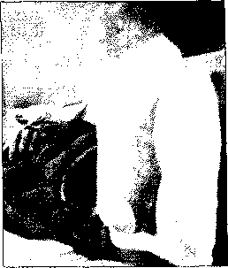

- • Mang loại tất vải sợi bông và các loại vải sợi thiên nhiên và nhớ khử mùi cho đôi giày.

- • Phơi giày của bạn ở ngoài nắng trong vòng 24 tiếng hoặc lâu hơn càng tốt sau mỗi lần mang.

Tất và giày bị ẩm dễ tạo điều kiện cho các vi khuẩn nâ'm xâm hại.

NHƯNG hướng dẩn sứ dụng NƯỞC hoa SAI' KĨU CẠO RÂl’V\ NTƠC HOA CO-LO-NIIƠ CHO NAM GIỚI

Cũng giống như động vật, mùi hương giúp phân biệt từng người trong chúng ta. Nển công nghiệp mỹ phẩm đã nắm ■                    bắt rất rõ điều này và đã kết hợp mối

liên hệ cốt yếu giữa mùi hương và giới tính bằng cách tung ra hàng trăm sản phẩm nước hoa co-lo-nhơ và nước hoa sau khi cạo râu dành cho nam giới. Thời tiền sử, người ta đã dựa vào mùi hương kỳ lạ của mình để thu hút bạn tình bằng cách này hay cách khác - đó chính là ■jjfe sự kết hợp giữa mùi cơ thể với da động vật chết và mùi thức ăn thối rửa. Ngày nay, chắc chắn chúng ta sẽ không thể chịu được sự kết hợp mùi hương như vậy. Vậy làm thế nào để lựa chọn đúng mùi hương đặc trưng cho riêng mình?

Hãy tìm một người có phong cách và môi trường sống phù hợp với bạn. Chẳng hạn, mùi hương gợi tình và quyến rũ có lẽ là một thông điệp không phù hợp cho các đồng nghiệp.

Nơi văn phòng làm việc, nên thử dùng mùi gì đó nhẹ nhàng như là hương cam, và lưu lại hương thơm nồng hơn khi hẹn hò và tiệc tùng. Các mẫu nước hoa có hương thơm lôi cuốn khác như hương cây cối, gia vị và hương trái cây.

Mùi tự nhiên trên cơ thể bạn hoà lẫn với hương thơm của nước hoa co-lo-nhơ hay nước hoa dùng khi cạo râu sẽ tạo nên mùi hương đặc trưng của bạn. Đó chính là lý do tại sao mỗi người nên thử một vài mùi hương trước khi quyết định dùng nước hoa. Thử một loại nước hoa cũng đơn giản như cách bạn tìm đến quầy mỹ phẩm và nhờ nhân viên giúp đỡ. Nhân viên sẽ nhỏ vài giọt nước hoa lên tay bạn, đợi vài giây cho khô rồi ngửi. Hãy thử một vài nhãn hiệu khác trứơc khi quyết định mua.

^Mẩu nước hoa dùng sau khi cạo râu tốt là có mùi hương phù hợp với phong cách và môi trường xung quanh bạn.

Mài cứ thể

Bạn đã từng thắc mắc về câu hỏi làm thế nào để phân biệt chất khử mùi và chất ngăn tiết mồ hôi hay chưa? Hương thơm khử mùi kết hợp với nước hoa dịu nhẹ và có cả những hợp chất hoá học giúp kìm hãm vi khuẩn phát triển, nhưng không làm giảm lượng mồ hôi tiết ra.

Chất ngăn tiết mồ hôi làm giảm bài tiết mồ hôi lên đến 40%. Thành phần hoạt tính có trong chất ngăn tiết mồ hôi thường là nhôm clorua tác dụng với protein có trong mồ hôi tạo ra một loại dung dịch làm bịt khí lỗ chân lông.

Vì chất khử mùi và chất ngăn tiết mồ hôi có thể làm da hư tổn, cho nên hãy ngừng sử dụng khi thấy bất kì dấu hiệu mẫn đỏ đầu tiên. Thay đổi các loại nước hoa cho đến khi tìm được một nhãn hiệu tương ứng với làn da của mình. Và hãy nhớ rằng, đừng bao giờ dùng chất khử mùi hoặc chất ngăn tiết mồ hôi gây kích ứng da.

Nếu tất cả các loại chất khử mùi và chất ngăn tiết mồ hôi đều khiến da sưng tấy lên, thì hãy dùng thử một trong những loại kem chống khuẩn không cần theo đơn kê của bác sĩ để diệt vi khuẩn. Đôi với phương pháp tự nhiên, bạn nên dùng thuốc muối hoặc baking soda. Baking soda không chỉ diệt các vi khuẩn gây mùi mà còn ngăn tiết mồ hôi hiệu quả. Cách thứ nhất là dùng trực tiếp lên vùng da dưới cánh tay hoặc trộn baking soda với bột tan. Cách thứ hai, bạn thử làm sạch vùng da dưới cánh tay, vì lông là môi trường thuận lợi cho vi khuẩn sinh sôi.

Có phải vì quần áo của bạn không?

Nếu bạn tắm gội hằng ngày mà cơ thể vẫn có mùi, thì ắt hẳn việc giặt giũ và thay quần áo có vấn đề. Vi khuẩn cũng sinh sôi trong quần áo. Và rồi những vi khuẩn này lan rộng khắp các tuyến trong cơ thể và vòng đời cứ tái diễn đến lúc quần áo của bạn bắt đầu có mùi hôi. Đó chính là lí do tại sao mẹ luôn nhắc bạn thay đồ lót và vớ hằng ngày. Trong trường hợp đó bạn nên thay cả áo sơ mi và quần tây.

Đừng bỏ qua việc giặt đồ đúng quy trình. Hãy làm theo những chỉ dẫn của máy giặt. Bạn càng nhét nhiều quần áo vào máy giặt thì quần áo càng có ít khả năng toả mùi thơm mát, sạch sẽ và sạch khuẩn.

PHEROMONES : MỦI HƯƠNG GIỚI TÍNH

í ’ ........\_ \_    r^~77,—\_.......■ ... rr

Bạn đã từng gặp ai đó và cảm thấy có chât kích thích nào đó giữa hai người không? Có lẽ đó là pheromones. Trong tự nhiên, các chất hoá học hấp dẫn này được động vật sử dụng để thu hút bạn tình.

Vậy nó có giống với thứ mà bạn đang dùng không? Khoa học chưa thể hiểu hết các hợp chất hấp dẫn của con người, nhưng có bằng chứng cho rằng pheromones đóng vai trò trong việc hấp dẫn đối phương. Các nhà nghiên cứu nhận thấy những mùi hương ấy rất quan trọng để cơ quan khướu giác- chất vomeronasal trong mũi- phát

I hiện ra mùi hương.

I   Pheromones tiết ra bởi tuyến tiết đầu nằm ở vùng dưới cánh tay và

I   vùng sinh dục. Nếu tắm rửa hằng ngày thì ảnh hưởng mùi cơ thể do

tuyến tiết đầu gây ra sẽ giảm đáng kể . Nhưng phải cẩn thận khi cơ thể nặng mùi thêm nếu không tắm rửa và ranh giới giữa mùi hương quyến rũ và mùi khó chịu của cơ thể rất mong manh.

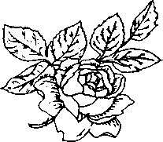

### Làm thế nào dể có hơi thở thơm mát?

Tối qua bạn vừa ăn món yêu thích có tỏi và giờ bạn phải gánh chịu hậu quả. Bất cứ lúc nào bạn nói chuyện với ai đó mà họ cau mày lại và cuộc trò chuyện lắng xuống. Hơi thở nặng mùi là rắc rối chung trong những thời điểm quan trọng nhất, đối với người khác thì đó quả là một tai hoạ. Làm thế nào để loại bỏ hơi thở nặng mùi ra khỏi người bạn. Miệng là nơi xuất phát những lời ngọt ngào. Hãy giữ miệng luôn thơm mát.

Làm thế nào để không phải ngửi những mùi khó chịu ấy?

Mảng bám thức ăn thường là nguyên nhân khiến hơi thở có mùi. Thức ăn có cá, gia vị (gồm hành, thịt bò hun khói có nhiều gia vị, tiêu nóng, xúc xích Ý, xúc xích bò, heo rắc thêm tiêu và một thứ quen thuộc nữa là tỏi) hoặc chất béo, đặc biệt là các sản phẩm từ sữa và thịt sẽ kích thích phản ứng hoá học trong dạ dày khiến phổi sản sinh mùi hôi.

Mùi hôi kinh khủng ấy lại kéo dài từ 24-48 giờ. Đánh răng và dùng nước súc miệng chỉ là cách loại bỏ mùi hôi tức thời, nhưng chắc chắn không kéo dài được lâu.

Những bệnh về nướu như viêm nướu và viêm nha chu cũng khiến hơi thở có mùi. Nếu bạn chưa từng mắc các bệnh về răng miệng, thì hãy tiếp tục các thói quen đánh răng đúng cách. Chải lưỡi cũng như đánh răng và nướu. Ngậm và đảo đều nước khắp miệng. Chĩ dùng một loại nước súc miệng không chứa cồn. Và nếu bạn hút thuốc thì hơi thở có mùi là lý do để bạn bỏ thuốc lá.

Hôi miệng trầm trọng

Điều gì sẽ xảy ra nếu bạn ở giữa hàng triệu người bị hôi miệng trầm trọng? Làm thế nào bạn biết được? Đó là một câu hỏi thú vị.

Một người mắc chứng hôi miệng dần bị mọi người xa lánh - thậm chí là bạn thân và vợ hoặc chồng, hơn là chính người đó nhận ra rắc rối ấy. Vì vậy hãy thử một cuộc thử nghiệm nhỏ, dùng một cuộn len cotton rồi chà xát khắp lưỡi, nướu và miệng. Giờ thì hãy ngửi thử. Bạn cảm thấy bàng hoàng đúng không? Nếu đúng vậy thì có lẽ bạn đã thấy được lí do cho mọi cuộc hẹn bị huỷ mà không được giải thích và những lần trò chuyện kết thúc vội vàng.

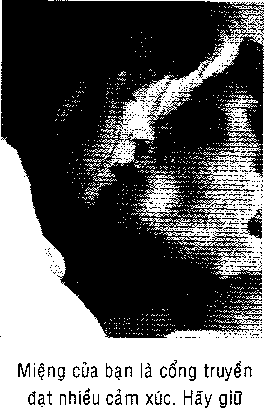

NĂM MẸO VẶT ĐỂ HƠI THỞ THƠM THO HƠN

- 1\. Súc miệng với 225ml nước hoà cùng 2,5ml muôi để điều trị tức thời vấn đề hơi thở ở nơi làm việc.

- 2\. Một muỗi cà phê baking soda hoà với một cốc nước là một loại nước súc miệng có thể làm tại nhà giúp bạn có hơi thở thơm mát. Bạn cũng có thể trộn baking soda với nước để đánh răng.

- 3\. Chải răng đều đặn với kem đánh răng có chứa flour (một ngày ba lần), vệ sinh cả phần lưỡi và vòm miệng. Đừng quên dùng chỉ nha khoa. Bạn nên đi kiểm tra răng miệng định kì và làm sạch răng chuyên nghiệp.

- 4\. Pha tỉ lệ cân bằng 3% oxy già và

nước đảo đều khắp miệng trong 30 giây giúp trung hoà vi khuẩn có tính axit góp phần làm hôi miệng, (nha sĩ khuyên nên hạn chế sử dụng dung dịch oxy già tốt nhát là hai lần

một tuần)                                   miệng thơm tho.

- 5\. Nước súc miệng, kẹo bạc hà không đường, kẹo hoặc kẹo cao su và nước súc miệng giúp hơi thơ thơm mát chỉ làm giảm mùi tạm thời.

Khoảng 90% nguyên nhân khiến hơi thở nặng mùi là do vi khuẩn gây mùi hình thành ở lưỡi và đó cũng là nơi mà mọi người quên chải sạch. Thứ bạn ngửi thấy là hợp chất lưu huỳnh bay hơi có mùi giống mùi trứng thối. Vi khuẩn thích ẩn náu và sinh sôi nảy nở ở những nơi tốì tăm, những nơi khó chạm đến và đó cũng là lí do tại sao chỉ nha khoa rất quan trọng. Chỉ nha khoa lấy đi các mảng bám và vi khuẩn sinh sôi ở kẽ răng là nơi bàn chải khó chạm tới.

Hãy đảm bảo rằng bạn đến bác sĩ nha khoa một năm hai lần để làm sạch răng miệng. Những lời khuyên của nha sĩ sẽ ngăn ngừa các bệnh về nướu là nguyên nhân thông thường khiến hơi thở có mùi. Những mẩu thức ăn thừa trở thành mảng bám và cao răng trong miệng - vi khuẩn phân huỷ và gây ra mùi hôi.

Với một khoang miệng khoẻ mạnh, các tế bào chết thường bong tróc trong một ngày bị cuốn theo nước bọt, bị nuốt và tiêu hoá mà không gây mùi hôi. Còn đối với khoang miệng không khoẻ mạnh, có quá nhiều mảng bám làm giảm nước bọt khiến miệng khô và có mùi.

Các nha sĩ đưa ra bốn bước hằng ngày cho những người hôi miệng để có hơi thở thơm mát.

- • Đánh răng đúng cách.

- • Dùng chĩ nha khoa hằng ngày.

- • Đánh răng một ngày ba lần.

- • Dùng que cạo lưỡi.

LÀM THẾ NÀO DỂ DÙNG CHỈ NHA KHOA CHO RĂNG

Chỉ nha khoa là một khâu vệ sinh răng miệng quan trọng: nó lấy đi các mảng bám mà bàn chải không thể chạm tới được. Có rất nhiều loại chỉ nha khoa trên thị trường. Tất cả đều tốt vì vậy hãy chọn cho mình một loại. Chỉ nha khoa lớn còn được gọi là dây răng miệng rất phù hợp nếu răng của bạn có khoảng trống lớn hay nhiều cầu răng. Bôi sáp vào chỉ nha khoa để dễ dàng trượt • giữa những răng sát nhau. Loại chỉ nha khoa “xốp” ít cọ sát hơn các loại chỉ khác.

1 ''

Chỉ “xốp”; dây răng miệng; chỉ sáp i                 /

- 1\. Lấy một đoạn chỉ dài 45cm (18 in) và cuộn chung quanh ngón giữa khoảng 15-20 cm (6-8 in), cẩn thận để không làm gián .             •

đoạn máu lưu thông. Quân đoạn '                  ■ J,

còn lại vào ngón giữa ở tay bên • \_ kia. Giữ sợi chỉ bằng ngón trỏ và ngón cái. Di chuyển sợi chỉ nhẹ nhàng khoảng 2.5 cm (lin) giữa hai răng, sau đó uốh sợi chỉ quanh chân răng theo hình chữ C.

- 2\. Di chuyển chỉ giữa răng đến nướu, và nhẹ nhàng đến dưới đường viền nướu. Đưa sợi chỉ lên xuống giữa kẽ răng và đường viền nướu, nhưng không được di chuyển mạnh. Kéo sợi chỉ khỏi kẽ răng và tháo đoạn chỉ sạch ra khỏi các ngón tay. Luồn sợi chỉ giữa kẽ răng, rồi lặp lại các thao tác như trên.

Nước súc miệng giúp hơi thỗ thơm mát.

Nước súc miệng được quảng cáo chỉ giải quyết tạm thời mùi hôi chứ chẳng có ích lợi gì hơn. Chĩ những nha sĩ mới có sản phẩm đánh bay mùi hơn là ngăn mùi. Hãy hỏi nha sĩ về sản phẩm này. Theo ý định thì bạn muốn một loại sản phẩm diệt khuẩn và trung hoà hợp chất lưu huỳnh dễ bay hơi.

Những nguyên nhân khác khiến hơi thở có mùi.

Hơi thở có mùi thỉnh thoảng do gen di truyền. Có lẽ cần phải có một loại nước súc miệng chuyên dụng và một chương trình chăm sóc răng tỉ mĩ chỉ có sẵn ở nha sĩ. Cũng nên nhận thức việc hút thuốc và những căn bệnh khác như tiểu đường và suy gan, và các điều trị bằng thuốc cũng gây hôi miệng trầm trọng.

Nha sĩ là người tốt nhất để chỉ ra liệu tình trạng của bạn là do có vấn đề về thuốc hay về gen. Nhờ những tiến bộ kỹ thuật, nha sĩ sẽ xác định vấn đề và quan sát những cải thiện răng miệng bằng các thiết bị đặc biệt điều trị lượng hoá chất lưu huỳnh bay hơi trong miệng của bạn.

NGUYÊN NHÂN ĐANG SAU CỦA HƠI THỞ có MÙI?

Nếu không mắc bệnh hay các yếu tố di truyền, thì những nguyên nhân gây hôi miệng chủ yếu được tìm thấy trong miệng. Đây là cuộc kiểm tra về răng miệng.

Viêm nưổu

Nướu trở nên đỏ, mềm, sưng húp và thường chảy máu. Gây ra bởi một lớp mảng bám và cao răng hình thành ở đường viền nướu hoặc do chải răng và dùng chỉ nha khoa mạnh tay.

Sâu răng

Vi khuẩn ăn mòn răng. Sâu răng gây ra do mảng bám.

Vi khuẩn ở lưỡi

Sau lưỡi là nơi mà hầu hết mọi người đều quên làm sạch, đó là lý do tại sao đây là nơi chủ yếu hình thành vi khuẩn gây mùi.

Những mẩu thức ăn

Những mẩu thức ăn nhỏ nhét vào giữa kẽ răng là mồi thu hút vi khuẩn sinh sôi và gây mùi.

Mảng bám

Là sự kết hợp giữa những mẩu thức ăn, vi khuẩn và nước bọt. Tạo thành lớp phim dính vô hình quanh răng.

Cao răng

Chất cặn lắng cứng đóng giữa nướu và chân răng. Chất này sẽ chuyển màu nếu bạn không ngay lập tức đánh răng hoặc không dùng chỉ nha khoa.

Hơi thở bốc mùi

Hơi thở từ phổi có thể có mùi thuốc lá hoặc bữa ăn có cá, hành, dầu mỡ hay tỏi.

Giữ gìn răng miệng trong trạng thái tốt

Hầu hết mọi người đã nghe qua câu chuyện rùng rợn về răng miệng, và trên thực tế một số người đã trải qua vấn đề này. Liệu đó là những câu chuyện, không có thời gian, cực kì lười. Trên thực tế nhiều người đã lâu không đến gặp nha sĩ. Chính họ lại đang đánh giá thấp câu nói: nụ cười khoẻ mạnh là danh thiếp tốt nhất của bạn.

### Nhũhg răc roi vẽ răng miệng

Hầu hết các nam giới đều nghe một câu chuyện ghê rợn về răng, và khá nhiều người thực sự đã bị sâu răng. Cho dù đó là những câu chuyện, thiếu thời gian hay hết sức lười biếng, thì sự thật là nhiều người đã lâu rồi không đi gặp nha sĩ. Họ đang coi nhẹ bản thân mình: một nụ cười khỏe mạnh là cách cư xử tốt nhất của bạn.

HỎI VÀ DÁP

I- -   ------------------------------------ ------------------------ -- —   -   ----------- ------------------

H. Răng của bạn đã từng tình cờ bị va chạm. Bạn nên làm gì để bảo vệ răng?

Đ. Để sữa ngập hết răng và ngay lập tức đến gặp nhá sĩ.

Những rắc rôì vể răng miệng

Là kí ức không rõ ràng nhưng lại đau đớn: một đứa bé ngồi trên chiếc ghế lớn, cố nói với nha sĩ trong khi miệng đầy bông, ống và vô số dụng cụ nhọn hoắc: “đau quá, đau quá!” nhưng người mặc áo khoác trắng lại bỏ ngoài tai những tiếng la hét.

Một ngày tồi tệ ở phòng khám nha khoa khiến bạn không dám quay lại kiểm tra, là điều tồi tệ nhất bạn có thể làm cho răng của mình. Giữ vệ sinh răng miệng tốt nên là thói quen hằng ngày, cũng giống như cạo râu. Nhiều người không quan tâm tới răng miệng cho đến khi nhận ra và cảm thấy có vấn đề. Nếu bạn thấy đau, nướu chảy máu hoặc răng bị nứt mẻ, thì bạn nên đến gặp nha sĩ cách đây một năm.

Có lẽ bạn đã biết rằng nguyên tắc hàng đầu đối với sức khoẻ răng miệng là đến gặp nha sĩ làm sạch răng miệng ít nhất một năm một lần. Vì hầu hết mọi người đều không đạt tiêu chuẩn vệ sinh răng miệng, các nha sĩ sẽ đưa ra hướng dẫn làm sạch răng miệng một năm hai lần và đó là biện pháp ngăn ngừa xứng đáng với thời gian và công sức. Lí do có thể phá huỷ xương và mất răng bệnh nhân phải cần đến phương pháp phục hồi đắt tiền và lâu dài là trong nhiều năm họ không đánh răng đúng cách và dùng chỉ nha khoa, do đó khiến nướu nhanh chóng chảy máu, sâu răng và thậm chí nhiễm khuẩn nếu không chú ý đến.

XƯƠNG RĂNG

Phần ngoài của răng được chia thành hai phần: thân răng và chân răng. Phần thân răng có thể nhìn thấy được phủ men răng gồm nhiều lớp bên trong. Ngay dưới lớp men răng là ngà răng, một mô mềm. Ngà răng là phần lớn nhất của răng, ở giữa là tuỷ răng, chính là mô mềm nằm dưới lớp ngà răng. Gồm có các dây thần kinh và mạch máu dẫn vào chân răng qua ống chân răng. Khi lỗ hổng, vết nứt mà không được điều trị hay tuỷ răng bị hư tổn, thì vi khuẩn sẽ xâm nhập và sinh sôi, gây viêm nhiễm. Điều này có thể huỷ hoại tuỷ răng, gây đau nhức và ê buốt khi nhai hoặc khi uống nước nóng hay nước lạnh.

Thân răng; men răng; ngà răng; nướu; dây thẩn kinh và mạch máu;

Lớp men răng cứng và nhạy cảm hơn sẽ bảo vệ các lớp răng khác.

^.Lồp men

'' zNgà răng

Thân răng-

.       ..                    Lợi

Gốc răng -

^Các mạch máu và dây thần kinh

Các nha sĩ dùng tia x-quang để chuẩn đoán bệnh. Trong hình này, vết trám trồi lên như đốm sáng.

ĐÁNH RĂNG NHƯ THÊ NÀO?

Các nha sĩ cho rằng nhiều người có quá nhiều vấn đề về răng miệng có thể ngăn ngừa. Vì vậy, chúng tôi có thể khiến bạn xấu hổ khi cứ lặp đi lặp lại những điều cơ bản.

Để loại bỏ mảng bám và thức ăn vụng từ bên trong lẫn bên ngoài đã bám chặt vào bề mặt răng, bạn nên đánh răng ít nhất hai lần (nhưng tốt hơn hết là ba lần) một ngày, mỗi lần từ hai đến ba phút. Và đây là mẹo nhỏ để khỏi đau khi đánh răng: giữ bàn chải bằng ngón cái và ngón trỏ, tương tự như cầm bút. Các chuyên viên chăm sóc răng miệng sẽ cho ban biết đánh răng như thế nào là đúng cách

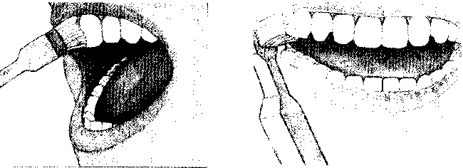

1\. Để đầu bàn chải một góc 45 độ đối diện với đường viền răng. Làm sạch răng bằng cách di chuyển bàn chải theo vòng tròn nhỏ.

2\. Chải sạch mặt ngoài của hàm trên và dưới, đảm bảo rằng bàn chải giữ đúng độ nghiêng với đường viền nướu.

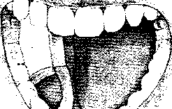

#### 1 ĩ

- 3\. Chải sạch mặt trong của răng dưới bằng cách di chuyển theo vòng tròn. Nhớ phải giữ một góc 45 độ với đường viền nướu.

- 4\. Chải mặt ăn sâu của hàm trên bằng cách chuyển động bàn chải qua lại và lặp lại với hàm dưới.

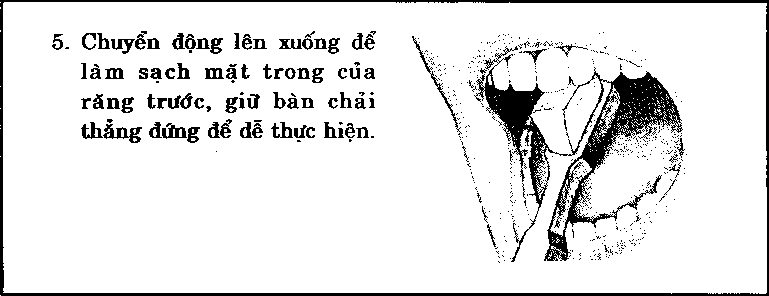

vấn đề mảng bám.

Mảng bám gây ra hai vấn đề hệ trọng là sâu răng và viêm nướu. Mảng bám là một lớp phim vô hình do vi khuẩn sinh sôi nhờ những mẩu thức ăn thừa trong khoang miệng ẩm ướt. Hãy tưởng tượng những con giòi chui rúc trong thùng rác. Đánh răng và dùng chỉ nha khoa để lấy thức ăn nuôi sống vi khuẩn. Nếu để tiến triển tự nhiên, thì mảng bám trồ thành một chất cặn lắng dính chặt vào răng và nướu. Sau một thời gian chất ấy sẽ cứng lại tạo thành cao răng và dần phá huỷ mô và lớp men bao phủ phía ngoài răng.

Thường thì men răng không đủ bền vững để bảo vệ răng khỏi vi khuẩn tấn công vào lớp răng kế tiếp là ngà răng. Nếu không có sự phản công ngược lại của đội ngũ bảo vệ (nha sĩ và vệ sinh viên), thì vi khuẩn sẽ tân công vào lớp sâu hơn là tuỷ răng gây đau đớn và viêm nhiễm, và cũng có thể bạn cần phải phẫu thuật ống chân răng với chi phí cao.

Tẩy trắng răng.

ít nguy hiểm hơn sâu răng và viêm nướu, răng ngã màu chủ yếu do dùng cà phê, trà và thuốc lá. Tẩy trắng răng có thể thực hiện không gây đau đớn hay thay đổi cấu trúc của răng. Tốt nhất nên đến nha sĩ. Nha sĩ sẽ dùng một hợp chất mạnh lấy đi màu vàng ố hay màu không mong muốn và trả laị màu trắng sáng cho răng. Chất làm trắng răng chỉ cho hiệu quả tạm thời.

Vệ sinh răng miệng: bài học vỗ lòng

Mọi người đều biết rằng chúng ta nên đánh răng ít nhất một ngày hai lần, nhất là sau khi ăn. Bạn cũng nên dùng chĩ nha khoa vào mỗi tối. Khi còn bé, chúng ta được dạy cách đánh răng, nhưng có lẽ lúc đó những hưứng dẫn không kĩ càng (xem “đánh răng như thế nào”).

Chọn một chiếc bàn chải có đầu nhỏ (dài khoảng 2,5cm (lin), rộng l,2cm (l/2in) và lông bàn chải bằng nhựa mềm. Đánh theo đường ellip hoặc đường tròn, để nghiêng bàn chải 45° về phía đường viền nướu. hầu hết mọi người đều đánh răng ít hơn một phút, nhưng để loại bỏ ổ vi khuẩn, các nha sĩ và chuyên viên chăm sóc răng miệng đề nghị phải đánh răng lâu hơn nữa, khoảng 2-3 phút.

CHỌN BÀN CHÀI

Nhiều loại bàn chải đánh răng trên thị trường có thể đáp ứng thoả mãn nhu cầu. Những lưu ý sau có thể đưa ra hướng dẫn cách tìm loại bàn chải tốt và làm thế nào để lựa chọn loại tốt nhất.

- ♦ Chọn bàn chải đầu nhỏ để dễ di chuyển trong khoang miệng.

- ♦ Thay bàn chải 3-4 tháng một lần, trước khi đầu lông chải mòn và loe ra. Những bàn chải cũ sẽ không hiệu quả và có thể là nơi vi khuẩn gây bệnh viêm nướu ẩn náu.

- ♦ Thay bàn chải sau khi bạn mắc bệnh, vì vi khuẩn có thể ẩn náu trong bàn chải.

- ♦ Nếu bạn không thuận tay phải, nướu mới bị viêm hay chuyên viên chăm sóc răng miệng phàn nàn về thói quen chăm sóc răng miệng kém cuả bạn, thì bạn nên mua bàn chải điện. Có vô số mẫu mã để lựa chọn theo yêu cầu của nha sĩ. Vài loại có gài đặt chuông báo để cho người sử dụng biết di chuyển bàn chải đến phần khác của miệng.

  Đầu bàn chải nên nhỏ,

  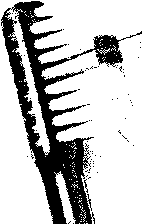

  khoảng 2.5cm (V4 in) nhân 1.2cm (V2 in) để dễ di chuyển

  Sợi nên mểm và bằng nylon để tránh làm đau nướu.

  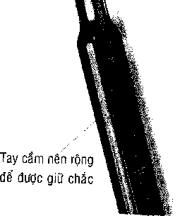

♦ Đầu bàn chải nên nhỏ để dễ tiếp xúc với chiều dài khoảng 2,5cm (1 in), chiều rộng khoảng 1,2cm (1/2 in); Đầu lông bàn chải mềm và bằng nilon để tránh làm tổn thương nướu; Tay cầm rộng để dễ giữ chặt.

Nhiều nha sĩ khuyên các bệnh nhân nên dùng bàn chải điện. Mặc dù bàn chải điện không tốt hơn bàn chải bình thường, nhưng hầu hết mọi người đều gặp rắc rối để dùng đúng chức năng. Từ khi bàn chải điện được thiết kế tương tự máy chụp ảnh kỹ thuật số thì việc đánh răng bằng bàn chải điện không còn khó thực hiện nữa. Chỉ cần đặt bàn chải vào răng, nhấn nút và đợi đến khi có tiếng báo hiệu để chuyển đến vị trí khác. Thậm chí vài loại bàn chải còn tự động tắt.

Tuy nhiên dù bạn có thường xuyên đánh răng đi chăng nữa thì thức ăn sẽ vẫn nhét chặt ở những kẽ răng. Đó là lý do tại sao bạn cần đến chỉ nha khoa. Là việc quan trọng chúng ta nên làm trước khi ngủ mỗi đêm, để vi khuẩn đường không có cơ hội phá huỷ mô lợi và điều này khiến bạn già đi trông thấy. Dùng chỉ tơ nha khoa là phương pháp khá đơn giản, xem chi tiết ở trang 33.

Nếu nướu chảy máu hoặc mềm, bạn nên gặp nha sĩ hoặc chuyên viên chăm sóc răng miệng để kiểm tra và làm sạch.

HỖN HỢP trám Răng có an toàn không?

Trước hết là tin tốt, không có bằng chứng thuyết phục nào cho thấy hỗn hợp trám răng gây nguy hiểm. Còn bây giờ là tin xấu, cũng chẳng có ai bảo đảm mình được an toàn. Trám bằng hỗn hợp hay bằng bạc gồm 35% bạc, 13% thiếc, 2% đồng và 50% thuỷ ngân. Những hỗn hợp này được các nha sĩ và chuyên viên chăm sóc răng miệng sử dụng phổ biến vì chúng rẻ hơn các nguyên liệu khác và cực kì bền cũng như có thể chịu được vận động nhai của răng cấm và răng trước.

Đó là do thủy ngân trong các chỗ trám răng hỗn hợp gây ra. Thủy ngân, một chất lỏng kim loại bạc trong nhiệt kếr rất độc. Khi bạn nhai một lượng nhỏ hơi thủy ngân có thể bay ra từ chỗ trám răng.

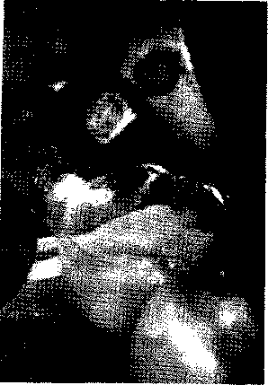

Các nghiên cứu đã chỉ ra rằng một số người đã từng trám răng hỗn hợp có nhiều thủy ngân trong máu và nước tiểu của họ hơn so với những người chưa từng trám răng khác. Mặc dù không có nghiên cứu nào chỉ ra rằng các chất trám răng tự gây ra bệnh nghiêm trọng, mức thủy ngân cao trong máu có thể gây phá hủy thận hoặc phổi, mất trí nhớ, suy giảm thị lực, và cao huyết áp.Nghiên cứu vẫn đang được thực hiện đối với những nguy cơ đe dọa sức khỏe tiềm ẩn của hỗn hợp các chất trám răng. Đồng thời, các bác sĩ nha khoa đang tìm ra hỗn hợp trám răng không chứa thủy ngân mạnh (hỗn hợp nhựa, sứ, và a-cri-lich màu trắng), hiện đang được một số bác sĩ sử dụng để thay thế các hỗn hợp khác. Cách để tránh vấn đề về các chất trám răng hỗn hợp là tránh dùng đến chúng, cẩn thận khi đánh răng và dùng chỉ nha khoa cũng như thường xuyên đi khám răng có thể gây tranh cãi - ít nhất là dành cho bạn.

Các hỗn hợp trám răng càng ngày càng trở nên phổ biến.Sau đây, một chất trám răng mới đang được sử dụng như ánh sáng “xanh”

DỨXG QIÊX BẢO VỆ MIỆXG

Như bạn biết có nhiều người rất thô bạo khi vừa ra cú đánh, chơi bóng đá, khúc côn cầu, hoặc bóng bầu dục thậm chí cả chơi bóng rổ. Vì vậy, sẽ là cực kỳ ngu ngốc khí chơi bất kỳ môn thể thao tiếp xúc nào mà không cần bảo vệ răng miệng. Mất một hoặc nhiều chiếc răng trong những trường hợp như vậy có thể xảy ra bất cứ lúc nào.

Đối thủ đâm vào quai hàm của bạn, làm cho răng trên và dưới bị vỡ vụn. Điều tiếp theo mà bạn sẽ biết đến là bạn đang phun ra những chiếc răng có dính máu.

Tại sao lại nguy hiểm? Khi đi đến bất kỳ cửa hàng bán dụng cụ thể

thao nào và mua một dụng cụ bảo vệ răng. Tất cả những gì bạn phải làm là thả nó vào trong nước sôi để làm mềm, rồi để cho nó nguội, sau đó đặt nó vào trong miệng để khuôn khớp với hàm răng của bạn.

Khuôn bảo vệ miệng có một hệ thống đánh giá để giúp bạn xác định độ mạnh nào là tốt nhất cho mức hoạt động của bạn. Hãy chắc chắn rằng bạn mua một chiếc phù hợp với bạn.

Hãy hỏi người bán hàng cho lời khuyên nếu như bạn không chắc lắm.

\> Khuôn bảo vệ miệng là ý tưởng hay trong môn bóng bầu dục - vì nhiều lý do cụ thể.

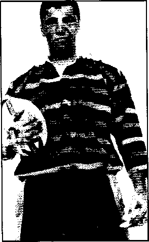

Viêm nướu

Khoảng 70% trên tổng số người trưởng thành mất răng vì bệnh nướu, còn gọi là bệnh nha chu. Ba trong số bốn người phải khổ sở vì bệnh trong giai đoạn đầu và các giai đoạn khác.

Viêm nướu là tình trạng nướu với mô sưng tấy và viêm nhiễm nặng mà nguyên nhân là do thói quen đánh răng và dùng chĩ nha khoa kém cũng như do yếu tô' bẩm sinh. Dấu hiệu đầu tiên gồm có nướu đỏ, sưng tấy hoặc mềm, chảy máu khi đánh răng và dùng chỉ nha khoa, nướu teo rút, giữa nướu và răng có mủ và hơi thở hôi. Viêm nướu là một kẻ tấn công thầm lặng: không có gì bất tiện hay đau đớn cho đến khi bệnh tình trầm trọng đến mức không thể cứu vãn được nữa. Đó là lí do nha sĩ khuyên nên kiểm tra răng miệng định kì.

Điều trị ống chân răng.

Bạn cần phải điều trị ống chân răng bất kể khi nào tuỷ răng viêm nhiễm gây phá huỷ hoặc gây hại đến mô răng. Nếu răng không được điều trị kịp thời thì viêm nhiễm sẽ lan rộng, xương quanh răng bắt đầu thoái hoá và răng có thể rụng. Tuy nhiên trước khi mất răng, hầu hết mọi người trải qua cơn đau đớn này đều xin nha sĩ hãy giật mạnh răng ra. Mọi nha sĩ đều bàn bạc với bệnh nhân nên giữ lại càng nhiều răng xương càng tốt, do đó bước thông thường trước khi nhổ răng là điều trị tuỷ răng.

Đây là điều chúng ta cần biết khi điều trị ống chân răng.

Trước hết, nha sĩ sẽ tiêm một mũi gây tê ,ở nướu, rồi đặt một đế cao su xung quanh để tách biệt răng. Khoan một lỗ nhỏ từ thân răng đến buồng tuỷ răng.

Thứ đến, nha sĩ sẽ lấy hết tuỷ bệnh, buồng tuỷ trong tuỷ răng viêm nhiễm, rồi trám bít lỗ tạm thời bằng hỗn hợp bột kháng sinh. Vài ngày sau, bạn phải quay lại để nha sĩ bỏ lớp trám và kiểm tra để chắc chắn rằng tuỷ vô trùng.

Khi không thấy dấu hiệu viêm nhiễm, nha sĩ sẽ trám bằng hỗn hợp bịt kín hoặc đế cao su vĩnh viễn. Và rồi chân răng được hàn chặt bằng xi-măng.

-----------------------------------—<-------------.. ...................,.....

BẠN có NGHIÊN RĂNG KHÔNG?

Hầu hết những đàn ông biết rằng họ nghiến răng sau trỗ mình lúc nủa đêm và một lời phàn nàn nghiêm khắc từ một người bạn đời không ngủ được: “Bạn làm ồn quá!’1 nghiến răng (tên y học là thói nghiến răng khi ngủ)! xảy ra ở một trong số bốn người và thường dẫn đến việc răng bị mòn và đau âm ỉ trong hàm.

Căng thẳng và căng thẳng thần kinh thường là lý do tại sao chúng ta nghiến răng. Một số triệu chứng cảnh báo khác có thể báo hiệu một bệnh: bạn có cắn móng tay không? Có cắn bút chì không? Có nhai chúng trong miệng không? Nếu bạn làm như vậy, thì vô tình bạn cũng có thể có nghiến răng.

Thông thường thì người nghiến răng không biết mình bị bệnh cho đến khi sự phá hủy đã hoàn thành. Sau đây là một số dấu hiệu thấy được của bệnh nghiến răng.

- ♦ Các đầu răng bạn trông nhẵn đi,

- ♦ Lớp men này quá mòn đến nỗi nếu lộ men răng ra- thì răng của bạn sẽ nhạy cảm với nước nóng và nước lạnh.

- ♦ Răng quặp vào quai hàm của bạn.

Nếu bạn được chẩn đoán bị bệnh nghiến răng thì có lẽ bạn sẽ được khuyên giữ cho miệng thoải mái khi có thể. Buông lỏng lưỡi ra giúp nó nghỉ ngơi thoải mái trên hoặc gần vòm miệng của bạn. giữ răng cách nhau, môi khép lại.

Nếu không hiệu quả thì bác sĩ nha khoa có thể tạo cho bạn một dụng cụ bảo vệ miệng ban đêm để giảm tối thiểu sự phá hủy răng và hàm của bạn. Các tốt nhất để chống lại bệnh nghiến răng là bắt tay vào - chương trình giảm căng thẳng hoàn toàn.

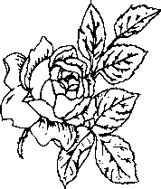

### Làm thế nào để giữ cho các móng tay của bạn dưực gọn gàng?

Móng tay - các phần cuối của ngón tay, nhớ không? Có lẽ bạn không span tâm đến vẻ bề ngoài của móng tay và móng chân của mình -ahưng bạn của bạn có thể sẽ quan tâm đấy. Cảnh tượng móng tay bẩn rè nham nhở hoặc quá dài, nấm móng chân không phải là những gì Bà hầu hết phụ nữ chú ý sao?

BẠN CÓ BIẾT?

Có lẽ mỗi một cậu bé đã phán đoán thời gian trôi qua bởi sự chuyển động về phía trước của những đốm nhỏ màu trắng dường như xuất hiện khắp nơi trên móng tay. Có một loại phong tục tập quán gắn với chúng kể rằng các đốm nhỏ chỉ ra sự thiếu hụt một loại vitamin hay chất khoáng. Thực ra, chúng là các vết thâm tím tương đương -những vật để ghi lại hình ảnh trong cuộc sống của các va đập và tiếng nghiến ken két. Chúng thường mất đi theo thời gian, một ngày nào đó biến mất nhờ vết cắt của dụng cụ cắt móng.

Bể móng tay bẩn thỉu

Thăm sóc móng tay của bạn là một công việc không cần chăm sóc £ỷ, chỉ tốn một ít thời gian hoặc cố gắng nhưng có thể đem lại lợi ích ơn, đặc biệt là với người phụ nữ (hay nhiều người phụ nữ) trong đời Mn. Trước tiên, giữ cho móng tay ngắn bằng cách dùng kéo cắt móng ay hoặc bấm móng tay. Cách cắt móng tay của bạn dễ nhất là sau krũ tắm lúc đó chúng sẽ hơi mềm hơn một chút. Nhớ cắt chúng theo zột đường cong và theo hình dạng tự nhiên của đầu ngón tay.

Bạn có thể bị xước mang rô theo thời gian. Thực ra, bệnh xước ■ ưig rô không ảnh hưởng gì đến móng tay. Chúng được tạo nên khi J bạc của mảnh da khô tách ra từ lớp biểu bì, hoặc vùng da xung . mh móng tay bị chết, và bị thủng chỗ nào đó bất kỳ từ giấy đến áo 1 và tóc. Đừng cắn, kéo, giật mạnh, hoặc gỡ bỏ chỗ xước mang rô. ay vào đó, hãy cắt chúng bằng kéo cắt móng tay hoặc bấm móng ’. Tránh xé toạc mảnh da sống. Có thể chảy máu và nhiễm trùng.

Dùng kem dưỡng ẩm cho móng tay hai lần mỗi ngày để ngăn bệnh xước mang rô xuất hiện. Thợ cắt sửa móng tay nói rằng kem dưỡng ẩm là chìa khóa để giữ cho móng tay của bạn và bàn tay được chăm sóc tốt. Và bất kỳ nhãn hiệu nào cũng hiệu quả. Nếu lớp biểu bì của bạn có màu trắng và nứt nẻ, tức là bàn tay của bạn quá khô và bạn sẽ cần phải sử dụng một loại kem dưỡng ẩm mạnh, bết dính cho đến khi chúng mềm hơn. Nếu bạn có lớp da và các lớp biểu bì mềm, thì một công thức nhẹ hơn sẽ giúp thực hiện mẹo này.

Có bao giờ để ý rằng bao nhiêu phụ nữ đeo găng tay cao su khi rửa chén nhiều hơn so với nam giới? Họ làm thế vì một lý do rất dễ hiểu, ơ một số người, nước làm mềm móng tay và gây gãy móng. Găng tay cũng bảo vệ chống lại các ảnh hưởng của chất lỏng tẩy rửa. Trừ khi bạn dự định để móng tay dài thì không cần phải lo lắng gì về nước.

CÁCH CẤT MÓNG TAY ĐỨNG

Tốt nhất nên cắt móng tay sau khi tắm là lúc móng tay mềm nhất. Móng tay được cắt gọn gang có cạnh nhỏ lòng móng trông có màu trắng hồng. Khi cắt móng tay hãy dùng kéo hoặc bấm móng tay và cắt theo các hình dáng tự nhiên của móng, cắt móng tay bằng (nếu các ngón tay của bạn có hình vuông) hoặc hơi cong theo hình bầu dục (nếu chúng cong).

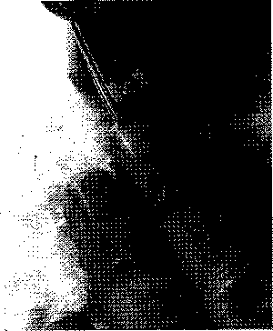

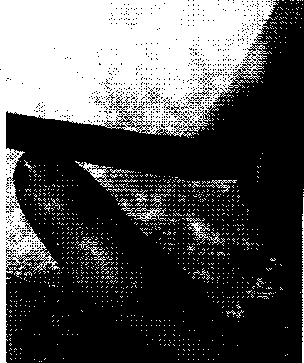

- 1\. Cắt móng tay hoặc thẳng nếu các ngón tay của bạn vuông hoặc cắt hơi cong nếu móng tròn hơn.

- 2\. Kết thúc việc cắt móng bằng cách làm nhẵn móng tay với một tờ giấy nhám. Bắt đầu từ góc và chà đến phẩn trung tâm.

Có thể bạn sẽ thấy các cạnh sắc nhọn sau khi cắt móng. Để làm nhẵn các điểm này, hãy dùng một tờ giấy nhám và giũa từ góc đến phần trung tâm. Mặc dù giũa phần trung tâm đến góc có vẻ tự nhiên hơn, nhưng điều này có thể làm cho các móng tay bị bong tróc và trở nên dễ gãy, và thường để lại các mảnh màu bạc rất nhỏ ở trên móng tay mà bạn cần phải dùng bấm móng tay để cắt ngắn.

Trước khi cắt tỉa móng chân, hãy quan sát chúng. Hầu hết đểu có một đường rãnh nơi móng tay và da gặp nhau. Để tránh móng chân mọc lên từ đó thì đừng bao giờ cắt bên dưới rãnh. Hãy cắt từ trên rãnh cắt thẳng sang.

10 MẸO ĐỀ LÀM CHO MÓNG TAY GỌN GÀNG

- 1\. Không được gặm móng tay bằng răng.

- 2\. Giữ cho móng tay ngắn. Dùng đúng dụng cụ, kéo cắt móng hoặc bấm móng tay.

- 3\. Dùng giũa móng tay, giũa đầu móng tay nhẵn. Gọt các mép cho chúng hợp với phần đầu ngón tay.

- 4\. Xoa bóp bằng kem dưỡng da tay hoặc kem bôi móng bôi lên các lớp biểu bì hằng ngày.

- 5\. Đẩy nhẹ lớp biểu bì trở lại bằng khăn ướt. Đừng bao giờ cắt lớp biểu bì hoặc đẩy chúng trở lại quá thô bạo.

- 6\. Ngâm móng tay từ 10 đến 15 phút trong một dung dịch nước ấm và hydro peroxyt, sau đó dùng bàn chải mềm chà nhẹ,

- 7\. Quá trình mất nước làm cho móng bị gãy, nứt nẻ và bong tróc. Dùng mỡ xoa bóp móng sẽ giúp bạn ngăn chứng khô, tốt nhất là thực hiện trước lúc đi ngủ để nó có thể được hấp thụ mà không ảnh hưởng đến giấc ngủ của ban.

- 8\. Để chiếc giũa móng ở chỗ dễ lấy để sửa nhanh những vấn đề khẩn cấp như là nứt hoặc gãy móng và làm cho các cạnh móng nhẵn. Một cái giũa có kết cấu mịn là dễ dùng nhất.

- 9\. Ăn uống lành mạnh, giữ cân bằng trong chế độ ăn uống.

- 10\. Chất nicôtin từ thuốc lá móng tay làm cho móng tay bạn có màu. Bạn biết phải làm gì rồi.

Làm thế nào để giữ móng sạch

Đôi lúc đàn ông thường làm sạch ngón tay - móng tay bằng một loại dao và các vật nhọn khác rất lạ. Chúng ta hiểu được sự cám dỗ này. Tuy nhiên, vì nhiều lý do an toàn, không nên như thế. Thay vào đó, hãy nhỏ một vài giọt thuốc tẩy giặt thông thường trong một bát nước với nước rửa-chén, sau đó dùng bàn chải cọ sạch. Đối với vết bẩn ít cứng đầu, rắc bột giặt tẩy vào móng tay và cọ sạch. Dùng chất dưỡng ẩm hằng ngày để tránh khô da, nứt nẻ và móng tay dễ gãy.

Lý do khác là để tránh dao, dụng cụ đập đá nhỏ, và tua vít đầu Philips cũng giống như chất tẩy rửa móng tay các vật này có thể chọc thủng móng tay, làm cho móng tay dễ phát triển vi khuẩn và nhiễm nấm.

Đừng cắn móng tay!

Rất nhiều người trong chúng ta gặm móng tay của mình như một con chó gặm khúc xương yêu thích. Lý do tại sao? Dường như hầu hết đàn ông trả lời là do căng thẳng. Thường là họ từ bỏ một thói quen xấu chẳng hạn như hút thuốc lá.

Nếu bạn là một người hay cắn móng tay, hãy tìm một số biện pháp khác làm thỏa mãn miệng của bạn như là kẹo cao su, hoặc sử dụng một sản phẩm được thiết kế để giúp bạn dừng cắn móng tay. Ngăn cắn là một lớp vec-ni trong có chứa hai chất hóa học rất đắng: sucroza oct-a-xê-tát và benxoate denatonium.

Các bệnh nấm

Thỉnh thoảng móng tay cũng xuất hiện nấm. Dùng xà phòng chống khuẩn sẽ giúp ngăn ngừa nhiễm trùng, nếu móng tay trên các ngón tay của bạn bắt đầu chuyển sang màu xanh hoặc một đốm màu vàng hay màu trắng dường như lớn lên theo thời gian, hãy thử bôi kem chống nấm. Nếu không hiệu quả, hãy đi gặp bác sĩ da liễu để được chẩn đoán hợp lý. Với một số bệnh nhiễm khuẩn nấm, chỉ có một loại thuốc được kê theo toa mới trị khỏi chứng bệnh đó.

Hầu như tất cả bệnh liên quan đến nấm móng tay cũng xuất hiện trong móng chân. Nhiều người bị bệnh thường có xu hướng di truyền ảnh hưởng đến khả năng để chống lại các bệnh nấm - trong khoảng 10% dân số. Để giúp làm giảm bệnh nấm, hãy thử thực hiện theo một số biện pháp phổ biến để giữ cho bàn chân khô.

- ♦ Luôn luôn bước ra khỏi nhà tắm với một tấm khăn bông sạch, hút nước.

- ♦ Cố gắng làm khô bàn chân của bạn bằng một chiếc máy sấy và phủ ngón chân của bạn bằng bột chông nấm.

- ♦ Nếu thời tiết và nơi làm việc của bạn cho phép hãy mang dép không cần mang vớ. Nếu không, hãy mang giày được làm từ da hoặc vải bạt - chất liệu này cho phép không khí lưu thông xung quanh bàn chân của bạn.

- ♦ Làm tất cả mọi thứ có thể để giữ cho đôi chân của bạn khô và sạch sẽ.

Móng bị đen

Móng bị đen khi các mạch máu dưới móng tay bị phá vỡ. Móng tay đen xuất hiện khi búa hoạt động sai chức năng bỏ nhỡ điểm đích của. Đen móng chân thường xuất hiện sau khi chơi các môn thể thao bắt và kết thúc liên tục như là quần vợt. giữ cho móng tay duỗi xuống thoải mái theo chiều của nó. Nếu bạn bị đau nhiều, hãy đi khám bác sĩ.

MÓNG CHÂN MỌC RA ĂN VÀO THỊT

Giày chật gây ra hiện tượng móng chân mọc ra ăn vào trong, tình trạng này gọi là móng “mọc ra ăn vào thịt “ chân cắt da và gây ra đau đớn với nhiễm trùng.

Biện pháp chữa trị? Mang giày vừa chân. Đảm bảo có một khoảng trống 12mm (1/2 in) giữ ngón cái và ngón út của chân: nên có đủ chỗ cho bạn ngọ nguậy ngón chân. Ngoài ra, cố gắng tránh chọn những đôi giày mũi nhọn có khuynh hướng siết chặt các ngón chân lại với nhau

Theo các kiểu ngón chân tròn hoặc vuông, cắt móng chân sát xuống dưới rãnh nơi da của ngón chân và móng tay gặp nhau có thể làm trầm trọng bệnh thêm, hãy khuyến khích phần nhọn cuối móng phát triển thay vì mọc ở rãnh. Một số người có thể có yếu tố di truyền bẩm sinh về bệnh móng chân mọc ra ăn vào thịt và chúng xuất hiện phổ biến nhất ở những người có bàn chân rộng.

Các đường cong của móng chân mọc ra ăn vào thịt dưới da ở các bên của các ngón chân gây ra chứng viêm móng chân nặng.

Móng chân mọc ra ân vào thịt

Viêm da

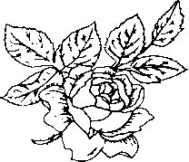
