### Cạo và chăm sóc râu

Có lẽ dấu hiệu rõ ràng nhất của giai đoạn từ cậu bé đến đàn ông là sự xuất hiện râu. Dĩ nhiên, cạo râu là một nghi thức đánh dấu giai đoạn này. vết cắt đau đớn có lẽ đã xuất hiện khoảng thời tiền sử của con người. May mắn thay, ngày nay chúng ta có nhiều sản phẩm đảm bảo cạo râu hoàn hảo hơn.

BẠN CÓ BIẾT?

Bộ râu dài nhất thê' giới được giữ gìn cẩn thận ở Viện Smithsonian, Washington, DC.Nó thuộc Hans N. Langseth, sinh ra tại Na Uy qua đời ở Iowa vào năm 1927. Râu dài 533cm (17ft 6 in).

Mục đích cạo râu

Bạn đang dùng dao cạo điện hoặc cạo râu ướt? Một số người thích sự tiện lợi của dao cạo điện, trong khi những người khác lại thích sự thân thiện của lưỡi dao cạo râu truyền thông đem lại. Dao cạo râu ướt chắc chắn tạo cho bạn nếp cạo ôm sát, đó là lý do tại sao một số đàn ông có làn da nhạy cảm thích dao cạo điện.

Máy cạo râu điện tốt cho những người đàn ông có. lông mọc bên trong mãn tính hoặc bất kỳ chứng bệnh da liễu nào khác trên khuôn mặt, chẳng hạn như mụn trứng cá. Không giông như cạo ướt, máy cạo râu điện không lấy đi lớp trên cùng của da. Đó là ưu điểm và cũng là nhược điểm của nó. Những người đàn ông thích cạo ướt để lấy đi lớp da chết hàng ngày, làm cho khuôn mặt của họ cảm giác mềm mịn. Nhưng vết cắt và vết trầy xước của lưỡi dao có thể gây ửng đỏ. Máy cạo râu điện không gây ra những vấn đề này.

Hãy đảm bảo rằng mặt bạn khô khi bạn dùng máy cạo râu điện, vì nếu cạo râu trong lúc ướt sẽ gây rát da và tạo nên một đường cạo không đạt chuẩn. Và đừng ngạc nhiên nếu như máy cạo râu để lại phía sau nhiều gốc râu hơn bạn muốn. Bạn có thể luôn giữ máy cạo râu trong vali của bạn và giữ được vẻ phong nhã vào giữa trưa.

Hầu hết đàn ông thích cạo ướt phải chịu các vết cắt, vết đứt, và kích ứng da tại một số điểm. Dưới đây là một vài mẹo được các thợ cạo đưa ra sẽ làm giảm khả năng bị kích ứng da.

- ♦ Nếu mặt của bạn có xu hướng ửng đỏ sau khi cạo râu, thấm nước lạnh thay vì nước ấm trước và sau khi cạo. Bạn có thể té nước liên tục lên mặt của bạn hoặc trùm bằng khăn tắm hoặc khăn lau mặt trong vài phút.

- ♦ Thời gian tốt nhất để cạo râu là ngay sau khi tắm lúc da bạn ẩm ướt.

- ♦ Quan trọng nhất là cắt lông triệt để ngay cả ở những chỗ khó với tới. Cạo ngược lại với chiều lông mọc thường gây ra vết sưng đỏ (được gọi là vết sưng do dao cạo) và lông mọc bên trong.

- ♦ Không bao giờ vội vàng cạo râu hoặc sử dụng một lưỡi dao cạo thô. Hấp tấp và dùng lưỡi dao cùn là những nguyên nhân phổ biến nhất gây chảy máu, khuôn mặt như giấy vệ sinh.

- ♦ Sau khi cạo, rửa sạch mặt bằng nước lạnh. Một lựa chọn nữa là dùng khăn lạnh để giúp se khít các lỗ chân lông và ngăn ngừa kích ứng da và lông mọc bên trong. Nếu bạn sử dụng nước hoa sau cạo, hãy chọn một loại không chứa cồn để tránh kích ứng và khô da.

YÊU CẦU VỀ VIỆC CẠO RÂU HỘP lý ---------------------------------------------------------------------ĩ.....................................................................................

Cạo râu hợp lý là làm cho khuôn mặt của bạn mịn màng, sạch sẽ, và không có các vết cắt. Cạo sát với dao cạo nước, nhưng nhiều nam giới có làn da nhạy cảm, mụn trứng cá, mụn cóc, hoặc lông mọc bên trong da có thể thích sử dụng máy cạo râu điện hơn, nó làm giảm khả năng bị vết cắt, vết đứt và kích ứng da.

- 1\. Theo lý tưởng, đi tắm trước khi bạn cạo râu để làm mềm các sợi lông. Nếu không, hây làm ướt các sợi râu của bạn thật kỹ bằng nước ấm - chứ không phải nước nóng - ở trong bồn rửa.

- 2\. Dùng kem cạo râu hoặc chất keo để tạo bọt. Tuy nhiên, không nên sử dụng xà phòng, bởi vì nó có thể làm khô da của bạn theo thời gian.

- 3\. Giữ cho làn da của bạn căng trước lưỡi dao cạo khi bạn kéo dao cạo dọc theo và cạo theo chiều râu mọc. Bắt đầu từ gò má, rồi đến ria mép, cằm và cổ. Đừng vội vàng. Cạo sát nhất có thể, lặp lại quy trình này.

- 4\. Rửa sạch bằng nước lạnh, rồi dùng đá lạnh, khăn ướt khoảng một phút. Làm khô mặt và dùng nước hoa sau khi cạo râu nếu bạn thích. Nhớ rằng nước hoa sau khi cạo râu chứa cồn có thể gây kích ứng và làm khô da.

  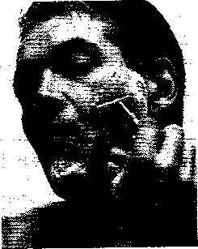

\> Bạn có muốn một lần cạo mềm mại, không vết cắt không? Luôn cắt đi phần gốc của sợi lông.

BẠN CÓ NÊN DỪNG DAO CẠO ĐIỆN KHÔNG?

Dùng một lưỡi dao cạo với nước hoặc máy cạo râu điện thực sự là một vấn đề vể sở thích. Máy cạo râu điện thuận tiện hơn và ít có khả năng làm mặt của bạn chảy máu - cộng với việc khẳng định liệu bạn có đang gặp phiền toái với cả hai chứng lông mọc bên trong hoặc mụn nhọt. Nhưng cạo điện sẽ không đưa ra cho bạn cách cạo ôm sát, mịn màng như cách cạo râu ướt. Nếu bạn có xu hướng hướng về tới một dấu vết lúc năm giờ, hãy cẩn thận về diện mạo của dấu vết đó vào buổi trưa nếu bạn đang dựa vào một chiếc máy cạo râu điện.

Tuy nhiên, kể từ khi máy cạo râu điện có thể di chuyển được và không cần nước hoặc kem cạo râu thì bạn có thể giữ một chiếc trong vali của bạn thường xuyên và sử dụng nó bất cứ khi nào và bất cứ nơi nào bạn muốn - tại nơi làm việc, trong xe hơi, hoặc nhà vệ sinh nam gần nhất. Kem dưỡng ẩm trước khi cạo râu chỉ thực sự cần thiết nếu bạn cảm thấy khó khăn để làm khô da một cách tự nhiên. Cuối cùng, một lưỡi dao cạo > Tính di động của một máy cạo râu điện - bạn có thể sử dụng nó bất cứ đâu và bất cứ khi nào bạn thích - là một trong những điểm thu hút chỉnh của máy. Máy cạo râu hoạt động tốt nhất trên khuôn mặt sạch và khô.

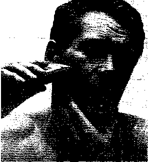

điện sẽ ít gây kích ứng hơn dao cạo truyền thống, và ít có khả năng gây ra chứng lông mọc bên trong da.

Tránh lông mọc bên trong

Không cạo lông ở cổ hợp lý, rồi sau đó mặc một loại cổ cứng và mang cà vạt kít thường làm cho lông mọc vào bên trong đau đớn. Nhiều người đàn ông tóc xoăn thường bị lông mọc bên trong nhiều nhất, đặc biệt là những người đàn ông gốc châu Phi. Tóc bắt đầu phát triển thành hình dạng xoăn trong nang lông, và điều này tạo nên sự khó khăn trong việc xác định làm thế nào để cạo triệt để.

Nếu bạn bị chứng lông mọc bên trong và bị sưng do dao cạo mãn tính, thì đừng kéo da căng ra trong khi cạo bằng lưỡi dao. Nếu tình trạng này vẫn còn, có thể muôn sẽ phải xem xét đến việc để râu. Nếu lông mọc bên trong hoặc bị nhiễm trùng da vẫn tiếp tục gây ra các điểm đau nhói, thì hãy đi gặp bác sĩ chuyên khoa da liễu.

>NG MỌC BEN TRONG

Lông mọc bên trong, mụn đau, đỏ, viêm nhiễm-xảy ra nhiều nhất trong số những người đàn ông có tóc xoăn. Sợi lông thường lớn lên và bật ra khỏi phần gốc, được gọi là nang lông, và xuyên qua các lớp da, hạ bì và lớp biểu bì. Lông mọc bên trong xảy ra khi long cong vào trong da. Khi bạn cạo râu, da có thể bị viêm và bị kích thích, sẽ làm nghiêm trọng hơn chứng lông mọc bên trong, và đôi khi gây ra nhiễm trùng.

Chỗ bị viêm

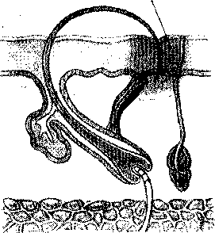

\> Viêm nhiễm; Lông mọc bên trong gây đau đôn được tạo ra khi lông mọc ngược trở lại vào da

Tạo một nếp tóc trông đẹp

Có thể một số đàn ông nên tránh hẳn việc để râu và ria mép hẳn, đặc biệt khi họ có mái tóc nhỏ hoặc thưa thớt mọc lên lác đác sau một tuần.Nếu bạn sở hữu một “khuôn mặt trẻ con”, tốt nhất là để nó trống không, mặc dù một số kẻ độc tài - đặc biệt là luật sư và giáo sư - cố gắng đeo mặt nại để che đậy tính trẻ con trên nét mặt của họ. Có một thời gian dài râu được gắn với việc phân biệt đàn ông và râu màu xám thường cho thấy sự uyên bác.

Nếu bạn đang tính để râu, thì bạn nên biết rằng loại râu nào phù hợp với khuôn mặt của bạn nhất. Ví dụ: một bộ râu và ria mép đầy đủ, sẽ phù hợp với một khuôn mặt nhỏ. Một bộ râu và ria mép thưa phù hợp nhất với một khuôn mặt tròn. Khuôn mặt tròn hoặc vuông trông đẹp hơn với một chòm râu dê và ria mép trong khi một bộ râu không nối với ria mép sẽ hợp với một gương mặt tròn. Một bộ râu ria chuẩn sẽ hợp với một khuôn mặt trái xoan nhất.

LÀM THÊ XÀO ĐỂ TRÁNH CÁC VET cat khi cạo

Không có gì nghiêm trọng hơn việc thức dậy muộn vào ngày họp quan trọng, vội vàng cạo râu và kết thúc với một khuôn mặt mà bạn có thể dùng để thử giọng cho một bộ phim kinh dị bạo lực.

Đó là bạn, điên cuồng xé giấy vệ sinh, chấm nhẹ lên vết cắt đang chảy máu, hy vọng toàn bộ tình trạng này sẽ nhanh tạo vảy trước khi bạn gặp công chúng. Vội vàng cạo râu là nguyên nhân phổ biến nhất gây ra vết cắt. Nhưng cho dù bạn cẩn thận như một bác sĩ phẫu thuật sử dụng một con dao mổ, nhưng bạn vẫn sẽ bị đứt tay theo thời gian. Lý do? Nhiều chỗ sưng và mụn nhọn trên da ước tính khoảng giữa 10.000 đến 30.000 trên khuôn mặt của bạn, nhiều trong số đó không thể nhìn thấy bằng mắt thường được. Khi dao cạo qua các nốt mụn, nó cạo đi phần trên cùng để lại cho bạn một vết máu.

Nhớ tránh cạo lớp vảy và các mụn, nó sẽ chỉ làm rách vết thương. Không thể tránh khỏi vết cắt theo thời gian. Khi bị một vết cắt, hãy dùng ống thuốc cầm máu để ngăn dòng chảy của máu và khử trùng cho da. Dùng nước hoa xoa mặc sau khi cạo râu cũng có ích. Tránh dùng loại có cồn, nếu bạn không phải là bác sĩ chuyên khoa da liễu.

Bảo dưỡng

Như một người thợ cắt tóc đã nhận xét, bộ râu như hàng rào đẹp nhất khi được chăm sóc mọi lúc. Nếu bạn đang để râu, hãy lên kế hoạch cắt râu hai lần một tuần. Thực hiện tốt nhất là khi râu khô. Trước tiên dùng lược gỡ rối nó. Chiếc máy cắt râu bằng điện có thề thực hiện công việc này dễ dàng hơn nhiều.

Cuôì quá trình cắt râu, bạn cần làm sạch các đường cạo bằng cách cạo dọc theo chúng. Dùng dao dài kèm theo, cạo các cạnh của bộ râu, cắt hàng râu rộng cùng một lúc, từ dưới lên trên.

Râu phải được gội, chăm sóc, và chải chuốt hàng ngày trong những lần đến với thợ hớt tóc, nhà tạo mẫu tóc. Nếu bạn không giữ râu sạch, có thể có màu kem và màu trắng ở phía dưới, đó là dấu hiệu chắc chắn cho biết bạn có gàu. Nếu xuất hiện điều này thì bạn cần gội râu với một loại dầu gội trị gàu tốt cho đến khi râu trở nên mềm mại trở lại, sau đó trở lại với loại dầu gội và cách chăm sóc hằng ngày.

Thợ cắt tóc hoặc nhà tạo mẫu tóc thường có thể chẩn đoán - và có thể đưa ra nguyên nhân của - những gì được gọi là chứng ngứa da đầu, nhiễm khuẩn trong một vùng râu thường do dùng lược, kéo, dao cạo râu, hoặc bấm móng tay không sạch hoặc bị nhiễm bẩn. Luôn luôn rửa đồ dùng cho râu của bạn bằng xà phòng định kỳ và tránh mượn hoặc cho mượn chúng. Tránh nhiễm trùng bằng cách ngăn ngừa nó.

KHI Bỏ QUA BƯỚC CẠO RÂU

Hầu hết đàn ông thích cạo sát, điều này sẽ làm khuôn mặt mềm mại, trông trẻ trung và mạnh mẽ. Nhưng cạo sát thường gây kích ứng da, đặc biệt là nếu bạn sở hữu lông xoăn hoặc lông mọc bên trong theo không theo mô hình. Đó là do khi bạn cạo râu xoăn, nó thường cuộn trở lại vào nang lông, gây viêm nhiễm hoặc lông mọc bên trong, một nỗi khổ sở chung đối với những người đàn ông gốc châu Phi.

Không nên cạo râu nếu da bạn bị nứt, bị cắt hoặc bị tấy ở chỗ mà thấy có vẻ như bị đỏ và sần lên hay bạn bắt đầu làm da trở nên xù xì hoặc có những lớp vảy. Hãy bắt đầu lại khi da bạn đã lành hẳn vết thương. Việc cạo râu trên làn da bị tổn thương thường dẫn đến nhiễm trùng, cuối cùng là phải dùng thuốc kháng sinh.

I ~ TTT                        :

Nếu bạn cảm thấy phải bỏ qua quá nhiều ngày cho việc cạo râu theo quy chế của sếp bạn thì nên dùng dao cạo điện thay cho cạo I   râu ướt. Nếu bạn không dùng cách này thì bạn nên thay bằng phương

Ị pháp điện phân hoặc dùng loại thuốc đặc trị lông mặt. Hoặc có thể để râu tự mọc và sẽ tránh được tất cả những vấn đề này.

Mặt khác của lông

Đối với nam giới trên 40 tuổi, thay đổi hoóc môn làm tăng lượng lông ở những nơi lạ nhất, đặc biệt là tai và mũi. cắt nó bằng một cặp kéo cắt móng tay. Nếu bạn cảm thấy khó chịu về nó hoặc có tiền sử về ra máu, hãy để lại nó cho thợ cắt tóc làm.

Lông mũi và lông tai cũng có thể được triệt vĩnh viễn bằng điện phân. Đâý là một kỹ thuật hoàn toàn an toàn có thể triệt các nang lông bằng một cú sốc điện nhanh.

CHỌN KIỀU RÂU PHÌ' HỢP NHẤT

Kiểu để râu cũng nên phù hợp với kiểu tóc của bạn. Nếu bạn có mái tóc dài, hãy chọn cho mình một kiểu râu dài hơn. Còn những người có kiểu tóc ngắn sẽ phù hợp với kiểu để râu ngắn hơn. Có thể người thợ cắt tóc sẽ đưa ra một kiểu râu phù hợp, kết hợp giữa kiểu bạn thích với kiểu râu của một người nổi tiếng nào đó.

Kiểu Vandyke

Được lấy tên theo một nghệ sĩ Flenders sau thế kỉ 17, Vandyke là một kiểu râu trông giống râu dê dài, ấn tượng hơn là kiểu Beatnik.

Abraham Lincoln

Đây là kiểu râu mà tổng thống Mỹ hay để, nó ít dày và vuông hơn kiểu râu truyền thống.

Kiểu Elvis Presley

Sau này Elvis để kiểu tóc mai dài dạng sườn cừu cắt tỉa ở quai hàm, để cằm trần.

Kiểu zz Top

Là kiểu râu hơi có đường cong dài mà giới thương nhân thường để, nhưng không hẳn là tất cả họ.

Kiểu Beatnik

Vào những năm 50, phong trào để râu kiểu Beatnik trông giống như râu của dê, chụm lại ở dưới cằm.

Kiểu Soul patch

Nam diễn viên Vai Kilmer vào vai người dân vùng biên giới Doc Holliday trong bộ phim "Tombstone” đã để kiểu râu đẹp một cách hoàn hảo - một ít ở trên cằm liền kề với môi dưới.

Kiểu Andre Agassi

Được phổ biến trong giới thể thao và ngành công nghiệp giải trí với hình dáng xồm xoàm hay tựa như một bóng chiều tối đen - là kiểu để tùy hứng.

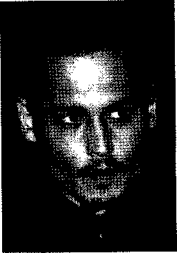

\> Siêu sao Johnny Depp thường ưu ái với chòm râu dê, nó tôn thêm nét thanh nhã của anh ấy.

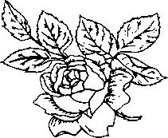

### Trang phục dành cho nam

Điều lạ là bạn không muốn mất nhiều thời gian nghĩ về tủ quần áo của mình. Mà thậm chí bạn cũng không thích thừa nhận lối ăn mặc khá “ấn tượng” của bạn nữa. Vậy làm cách nào bạn biết rằng liệu khuynh hướng thời trang “hot” của ngày hôm nay có phải là những áo vét dài, cổ thẳng đứng theo kiểu Nehru vào ngày mai hay không? Sau đây là những lời khuyên trong việc chọn lựa quần áo như thế nào để bạn luôn luôn hợp thời trang.

TÌM NUCnc QUAN jean thích HỢỉ’

Phải bỏ nhiều thời gian để lựa chọn quần jean ư? Nếu vậy thì cũng xứng đáng để dành nhiều thời gian tìm một bộ quần áo cho vừa vặn. Có lẽ điều này là hiển nhiên, nhưng hãy nhìn xung quanh mà xem, bạn sẽ thấy trên đường nhiều người mặc quần jean quá rộng , quá chật, quá ngắn hay quá dài - mà trên tinh thần là có nhiều cửa hàng ở quanh đây.

Mấu chôì là từ đâu?

Bạn có phải là người ăn mặc luộm thuộm, mặc bất cứ thứ gì có trong tủ quần áo mãi cho đến khi nó trở nên tả tơi, hay đến khi ai đó nói khóe rằng bộ đồ của bạn đã có từ thập kỷ trước? Thì lúc đó bạn mới nhận ra rằng mình nên đi mua sắm.

- ♦ Quy tắc thứ nhất: Không bao giờ vứt bỏ bất cứ thứ gì. Nếu bạn phải đợi lâu cho những bộ trang phục đó hợp thời trang.

- ♦ Quy tắc thứ hai: Hãy bắt đầu với những thứ cơ bản, nên là một người yêu cầu ở mức tối thiểu. Sau đó, nên dành thời gian của mình để mua thêm từng cái một cho vào tủ của bạn.

MÀU SẮC PHÙ HỢP VỚI DA CỦA BẠN ..........................-....................- ....................................................................»n ftwinr                       ..... Màu sắc là điểm thu hút nhất. Màu da tự nhiên và màu tóc là điểm nổi bật của bạn. Việc kết hợp màu lại với nhau sẽ làm cho bạn trông điển trai hơn, gây ấn tượng sâu sắc hơn, và khỏe mạnh hơn, những cái này không làm cho bạn trông mệt mỏi và xanh xao, che giấu nhược điểm hay chỉ đơn giản làm nổi bật khuôn mặt bạn. Thật đúng để nói rằng màu sắc làm cho hầu hết đàn ông đẹp hơn, nhưng nếu bạn muốn mình đẹp, thì hãy làm theo những điều nên làm và không nên làm cho từng loại da của bạn ở bên dưới.

Da trắng hoặc hồng hào

Kết hợp màu xanh nước biển với cà vạt màu đỏ và quần ka ki. Cố gắng tạo ra các kiểu tương phản với màu da của bạn.

Da vàng

Sử dụng các màu trung hòa, màu vàng nâu nhạt, màu xanh. Tránh dùng màu đen.

Da màu nâu vàng nhạt

Tránh màu vàng lục. Dùng các màu tự nhiên mà không có màu tối.

Bạn có thể sử dụng mảng màu sáng ở cà vạt và áo sơ mi.

Da đen

Cực kỳ tránh các màu nhạt nhẹ, màu xám và xanh nước biển bởi vì trông có vẻ thiếu màu sắc. Sử dụng các màu đậm, màu đen, màu xanh hơi đậm hoặc nhạt.

Da màu vàng hoe hoặc vàng nhạt

Hãy mặc trang phục có màu hơi sáng, chẳng hạn như màu hồng da cam, màu ngà, hay xám nhạt. Mặc các màu dịu kết hợp với cà vạt có màu đậm.

Màu nâu

Tránh các màu sẫm. Dùng các màu rõ nét hoặc đậm.

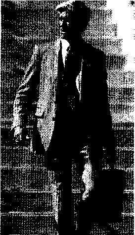

\> Nam giới có làn da trắng nên tránh các màu tối. Bộ vét màu xám nhạt rất phù hợp với áo sơ mi màu xanh nhạt.

Những thứ cơ bản nhất lờ gì?

Bảng danh sách dưới đây là những thứ chủ yếu trong tủ quần áo mà nam giới nên có:

- ♦ Một chiếc áo màu xanh biển.

- ♦ Một chiếc sơ mi màu trắng.

- ♦ Một chiếc áo vải sọc, và có đính biểu tượng một tổ chức nào đó.

- ♦ Một bộ vét màu xám, xanh biển hay vải sọc (hay thậm chí mỗi thứ một bộ nếu bạn phải mặc vét đi làm mỗi ngày)

- ♦ 2 cái cà-vạt, một cái vải sọc, một cái chỉ cần một màu.

- ♦ ít nhất 2 loại quần, một loại quần ka-ki, còn một loại là quần jean màu xanh.

Bây giờ đến phần khó hơn. Hãy bắt đầu kết hợp và hoán đổi những cái quan trọng này để làm cho bạn có cái nhìn khác lạ mỗi ngày, chú ý đến những nguyên tắe chủ yếu này.

- ♦ Đừng kết hợp kiểu sọc với ca-rô và hãy chắc rằng bạn chỉ phối hợp với những cái một màu. Có lẽ, đây này là những điều mà bố mẹ bạn đã dạy bạn và nó vẫn còn là lời khuyên hữu ích.

- ♦ Kết hợp màu. Một số màu kết hợp lại thì thích hợp cho tất cả nam giới, bất kể phong cách của họ là gì đi nữa thì vẫn có sự kết hợp đặc biệt giữa màu đỏ tía hay đỏ với màu xanh biển, hãy kết hợp màu trắng hoặc vàng để tạo sự nổi bật. Những cách phối màu thích hợp khác bao gồm màu xanh biển và màu vàng nâu nhạt, màu xanh lá sáng và vàng nâu nhạt và các màu sắc tự nhiên hay những màu tối hơn.

Việc mua quẩn áo

Một số nam giới có khuynh hướng mua tất cả mọi thứ trong một lần, rồi lại tiếp tục mua nhiều nữa và cứ như vậy, đó không phải là ý hay. Bạn sẽ luôn có hai suy nghĩ và thường chỉ mặc 50% trong số quần áo mà bạn mua. Thay vào đó, nên mua một hoặc hai kiểu, sau đó suy nghĩ nên kết hợp chúng như thế nào với những gì có trong tủ quần áo của bạn. Hãy giữ những cái quan trọng và bổ sung vào. Dưới đây là một vài lời khuyên khi đi mua sắm:

- ♦ Nếu bạn thiếu tự tin về cách ăn mặc, hãy cùng đi mua sắm với bạn mình hay người bạn đáng tin cậy để tham khảo thêm ý kiến của họ.

- ♦ Mặc dù lời khuyên này yêu cầu bạn phải mua được 100% chất liệu vải tự nhiên, nhưng chất lượng sợi tổng hợp ngày nay vẫn tốt hơn cho phép bạn chọn loại vải hỗn hợp. Nhưng cũng nên chọn loại có không ít hơn 80% sợi tự nhiên.

- ♦ Nếu có thể, bạn nên dành nhiều thời gian để mua đồ vét và áo khoác. Chọn đến loại vải tự nhiên sẽ là cuối cùng.

- ♦ Nên chọn mua áo sơ mi cài nút trên hay cổ bẻ, tùy theo ngoại hình của bạn, nhưng cũng nên chú ý những chiếc áo sơ mi cài nút trên sẽ cho thông điệp rằng bạn là mẫu người đàn truyền thống - mà có thể bạn không quan tâm đến điều đó.

- ♦ Áo khoác và áo ngắn tay không nên quá chật hay quá căng phần ngực.

LÀM THẾ NÀO ĐỂ CHỌN ĐƯỢC LOẠI SỘI TOT NHAT?

\\_\\_\\_\_

Quan niệm cũ về nam giới không mặc loại vải sợi đã không còn nữa. Các loại vải sợi pha có tới 20% chất tổng hợp thường đáp ứng về mặt chủng loại, chất lượng và cả sự tiện lợi. Chẳng hạn như thêm một ít sợi nhân tạo vào vải lanh để hồ cứng và tránh bị co dúm sau khi giặt.

Hãy tìm những loại vải có tính chuyển động cùng với bạn, tránh những loại vải chứa nhiều chất liệu nhân tạo. Trước tiên phải chạm vào vải.

Nếu cảm thấy ngứa, đừng nên thử mặc. Nếu bạn không muốn trở

thành tín đồ hàng hiệu thì hãy tìm những bộ đồ được làm từ các công

ty đáng tin cậy hay các hãng tư nhân có cửa hàng trưng bày sản

phẩm. Một công ty ở gần bạn thì ít có khả năng bán những bộ đồ kém chất lượng; nếu chúng có lỡ bị hư sau khi giặc thì họ có thể lấy lại những bộ đồ này và hoàn trả đầy đủ số tiền cho bạn.

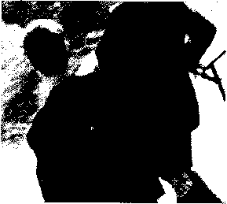

\> Vải tốt sẽ làm cho bạn cảm thấy thoải mái và vẫn trông đẹp thậm chỉ mặc nó cả ngày.

PHONG CÁCH THEO KÍCH THƯỚC VÀ HÌNH DÁNG

Phong cách quá hợp thời không dành cho tất cả mọi người. Hãy mặc theo cách mà phù hợp với bạn nhất - nếu xét về kích thước và hình dáng. Khi đi đến quyết định chọn được trang phục phù hợp thì nên ngắm kỹ lại trong gương. Đừng bị ảnh hưởng theo các xu hướng hay những gì bạn đã nhìn thấy vào tối qua trên ti vi hoặc khi đi giải trí ở hộp đêm. Quần áo rất mốt mà không hợp với dáng người thì cũng trở thành kiểu cách kinh khủng.

Có một cách để giúp bạn tránh phải mặc những bộ đồ cực kỳ xấu là hỏi ý kiến người khác khi bạn đi mua sắm. Tốt hơn là dẫn một người thân hay bạn bè đi cùng - người mà bạn tin là họ sẽ nói thật cho bạn biết liệu kiểu nào hợp với bạn. Một cách khác là nhờ nhân viên tư vấn; hầu hết các khu mua sắm lớn đều có những người tạo mốt, họ sẽ giúp bạn tìm ra trang phục phù hợp.

Khi mà bạn có một tủ quần ’áo tương đối đầy đủ - gồm một cái áo ngắn tay màu xanh biển, áo sơ mi màu trắng, áo sơ mi sọc, bộ vét màu xám, màu xanh nước biển hay có sọc, một cái cà vạt sọc hay được dệt một màu, những chiếc quần ka ki hay quần jean xanh thì hãy thử phối hợp theo các kiểu khác nhau. Ngày này mặc áo vét màu xanh nước biển với quần ka ki thì hôm sau hãy kết hợp quần dài từ bộ đồ vét của bạn với áo khoác.

Khi kết hợp trang phục theo kích thước và dáng người bạn thì có một kiểu thời trang nào đó luôn luôn thịnh hành: bộ com lê cài chéo trông có vẻ phù hợp nhất với dáng người mảnh khảnh, bởi vì chúng làm tăng thêm kích thước. Những chiếc quần xếp li sẽ làm cho người mặc trông ốm hơn, nhưng xu hướng ngày nay chỉ hướng đến người đang ăn kiêng, Xu hướng này hẳn là không phù hợp với người nặng ký hơn.

Và mặc dù một chiếc quần jean 5 túi, có chất lượng tốt là loại cơ bản nhưng đừng mặc chúng ở cơ quan thậm chí chỉ mặc thoải mái vào các ngày thứ 6. Thay vào đó, hãy mặc đồng phục bằng vải ka ki và áo ngắn tay; đó là một phong cách đơn giản nhưng vẫn chuyên nghiệp. Bảng ở dưới được thiết kế để giúp bạn lựa chọn những trang phục công sở hay trang phục trang trọng phù hợp nhất và tôn lên vẻ đẹp của dáng người bạn.

108

CAO VA MANH KHANH

DÁNG NGƯỜI THẤP, TRUNG BĨNH có CAN NANG

Các kiểu com lê

Bộ vét với 4 nút cài chéo là một phong cách cổ điển, trong khi kiểu 6 nút tạo cảm giác là người có sức thuyết phục. Bộ vét cổ điển cài một hàng khuy có 2 nút; các kiểu hiện đại thì cài 1, 3 hay 4 nút.

Kiểu cài chéo hay cài một hàng khuy làm tổn lên chiểu cao và vóc dáng.             psậỊ

Jv^/

Kiểu cài một hàng khuy cao hơn và làm cho dáng người thon thả. Một màu xanh nước biển sẽ thể hiện                 ■ .

được quyển lực.

Các kiểu sơ mi

Hãy chọn những chiếc áo sơ mi làm tôn lên vẻ đẹp và sự tinh tế. Kiểu cơ bản thì nới lỏng ờ phần eo, còn những bộ đồ thể thao thì rộng ờ phần vai, ôm phần eo; thân hình quá khổ và đầy đặn cẩn nới rộng hơn; và kiểu cắt của người châu Âu lại có hình chóp nhọn.

Kiểu Châu Âu hay kiểu cơ bẩn.

Cả hai đểu cho thấy đường eo.

Kiểu may cơ bản.

Kiểu hơi rổng che bớt vòng eo hơi to,

Các kiểu quẩn

Quần có xếp li sẽ làm cho bạn trông thon gọn hơn. Vì vậy chúng là sự lựa chọn tốt cho mọi vóc dáng và kích thưỡc. Kiểu may ôm hiện đang trở thành mốt, sẽ làm nổi bật vẻ đẹp ồ mông và đùi, vì vậy tránh mặc nó nếu bạn là người đô con.

Kiểu xếp li, fim hay thúng thường. Gấu quẫn lơ-vê làm giảm bớt chiểu cao nếu dáng người quá gầy.      - L\*

Kiểu xếp li hay thông thường; khđng ôm cho cảm giác tăng chiêu cao.

109

DANG NGUÔI               1 "\*J CAii NANG

DÁNG NGUOI THÂP VA M

ẢNH KHẢNH

Kiểu cô’ điển - cài

Kiểu cài một

Đối với những

một hàng khuy làm

hàng khuy.

người có vóc dáng

tôn lên dáng người

Những điờng may

này thì kiểu cài

to lớn.

đơn giản hơn sẽ           T '

chéo hoặc cài một

••

che giấu đi vóc              ' "

hàng khuy đều tôn

người to.

lên được vẻ đẹp.

Kiểu may ctf bản

Kiểu căn bản hay            ị ị

Kiểu Châu Âu hay

-

Áo sơ mi cổ rộng

rộng.                'Ị' ì • X

kiểu thể thao.          '

là phù hợp nhất với

Sẽ làm giảm tối                '

Những kiểu này sẽ

ngưới đàn ông có

thiểu và che bớt

làm cho vóc dáng

cổ đầy đặn.

thân hình vạm vỡ.

trông đầy đặn hơn.

Kiểu xếp li hay

Kiểu xếp li, rộng;

Kiểu xếp li hay thông

\|\|\|\|M8f 1111118? ị

còn gọi là thông

khổng ôm.

thường; không ôm.

thường, không ôm.

Một kiểu kẻ sọc

Kiểu quần ống đừng làm

QiỂn may có tỉ lệ

sẽ đánh lừa cảm 4         Ị <

cho đôi chân dài hơn

và vẻ bề ngoài ít

giác cho đôi        ggẸ,

trong khi gấu qiồn lơ-vê

nặng phần trên.

chân to.

làm cho đôi chân trông

ngắn hơn.

ĂN UỐNG KHỎE MẠNH

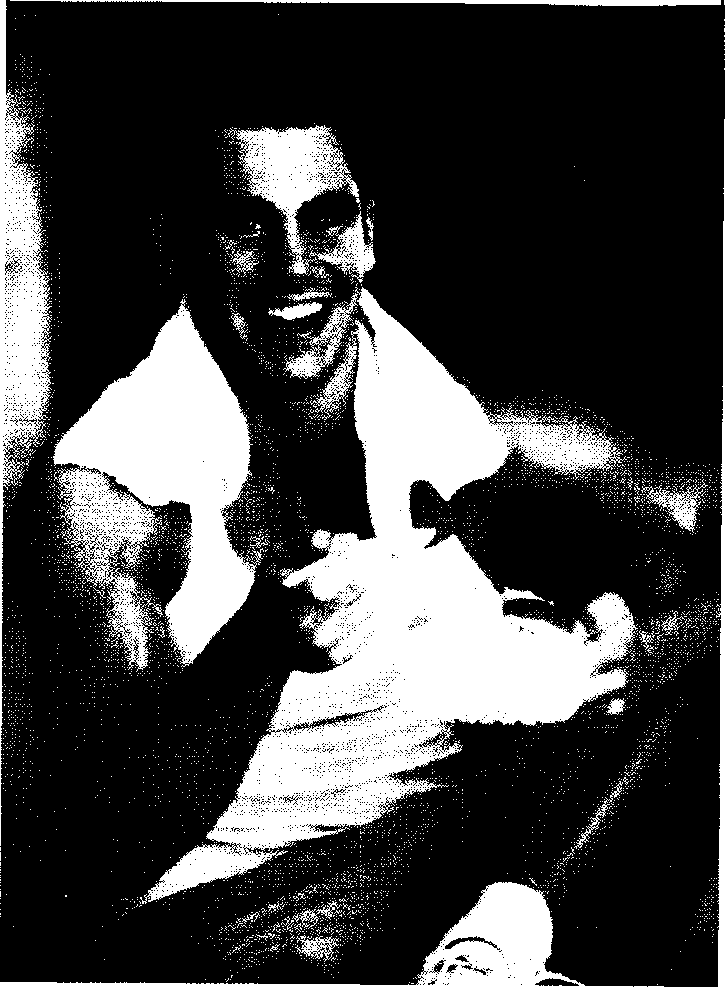

##### Đàn ONG Cần ăn gì?

Cơ thể bạn trông có vẻ rắn chắc nhưng hãy xem lại điều này: cách dây một năm, 98% nguyên tử của cơ thể không hề có. Cứ 3 tháng bạn hình thành một bộ xương mới, 6 tuần tạo ra một lá gan mới; 4 ngày thay thế lớp màng quanh dạ dày. Các chất cần thiết để tạo ra cấu trúc này có từ các chất dinh dưỡng trong thức ăn của bạn.

“Mách nhỏ. Trước khi đi mua sắm, hãy cố gắng hình dung trông bạn như thế nào, và hãy làm cho xe đẩy hàng trong siêu thị phản ánh điều đó.”

Trong quyển Sẽ Không Còn Anh Chàng Nào Béo Nữa của Jonathon Savill và Richard Smelley.

TẠI SAO BẠN CẦN PHẢI ẪN?

Thức ăn có chứa các chất cơ bản cần thiết để giúp bạn phát triển cơ thể như một đứa bé và để duy trì, bô’ sung cho cơ thể suốt đời. Cơ thể bạn là trung tâm của hoạt động cố định hằng ngày, các tế bào liên tục mất và hình thành. Việc ăn (cũng như việc hít thở và uốhg) mang lại một nguồn nguyên tứ và phân tử để tái tạo các tế bào, cơ bắp và xương.

Bạn cũng cần ăn đê’ có năng lượng. Thức ăn được đưa vào miệng là nhiên liệu để vận hành cơ thê’ bạn. Mọi thứ bạn làm, đi bộ, tiêu hóa, quan hệ tình dục, thậm chí ngủ hoặc xem tivi đều cần đến năng lượng.

Khi chúng ta ăn, thức ăn đi vào bộ máy chế biến thức ăn-đó chính là hệ thông tiêu hóa-và được phá vỡ thành những thành phần dễ hâ’p thụ của amino acid, mô-nô-xa-ca-crit, và acid béo mà cơ thể có thể sử dụng được. Glu-cô đi vào hệ tuần hoàn và được đưa đến các mô cùng với ô-xi.

Glu-cô và ô-xi được các tế bào đốt cháy để sản sinh ra năng lượng cung cap cho cơ thể. Quá trình tiếp theo là hấp thu các chát để tạo ra năng lượng và phát triển các mô và tế bào, được biết như quá trình trao đổi chát.

THựC PHẨM LÀ Gì?

Theo quan điểm của một nhà dinh dưỡng, thực phẩm là những gì cung cấp các chất dinh dưỡng cho nhu cầu cơ thê’ để duy trì sự sống và phát triển. Bạn phải nhận được 6 loại dinh dưỡng từ thức ăn. Cơ thể bạn không thể tạo ra tất cả các loại này và cũng không tạo ra đủ chúng. Những loại dinh dưỡng quan trọng là cacbon-hy-đrat, protein, chất béo, vitamin, chất khoáng và nước. Chất xơ -không thật sự là chát dinh dưỡng- nhưng cũng đóng vai trò quan trọng trong sự phát triển.

CACBON-HY-flRAT

Cacbon-hy-đrat (gồm tinh bột và đường) được tìm thấy chủ yếu trong rau củ, trái cây, đậu và ngũ cốc. Chúng được chuyển hóa hầu hết thành glu-cô, nhiên liệu chính mà cơ thể sử dụng để tạo ra năng lượng.

Có 2 loại cacbon-hy-đrat. Khi ăn, đường phân giải và được hấp thụ nhanh chóng. Tinh bột phân giải lâu hơn, vì vậy chúng được hấp thụ từ từ trong máu.

PROTEIN

Là chất nền tảng cho sự phát triển cơ thể, protein chiếm 15 đến 20% trọng lượng của bạn. Trong suốt quá trình tiêu hóa, cơ thể bạn chuyển hóa lượng lớn phân tử protein từ thức ăn thành amino acid, sau đó các phân tử nhỏ hơn chuyển hóa thành các thành phần chính của da, xương, cơ bắp, tóc, răng, v.v.

CHẤT BÉO

Thường được ví như là một chàng trai xấu tính trong một bộ phim, chad béo thỉnh thoảng cũng có lợi. Nó được đốt cháy và dự trữ cho việc sử dụng về sau phòng khi các nguồn năng lượng khác cạn kiệt. Chất béo kết hợp với protein để hình thành lớp màng quanh mỗi tế bào. Nó bảo vệ cơ thể tránh mất nhiệt, và nâng đỡ các cơ quan quan trọng.

Nlfffc

Nước là chất dinh dưỡng cần thiết nhất cho cơ thể. Bạn có thể sông được trong thời gian dài nếu không có thức ăn, các loại vitamin và khoáng chất, nhưng bạn chỉ sống được vài ngày nếu không có nước. Nó phân hủy các chất dinh dưỡng khác và chuyển chúng đi khắp cơ thể. Nước tuyệt đối cần thiết cho quá trình tiêu hóa, hấp thu, tuần hoàn, và bài tiết. Hầu hết hàng triệu phản ứng hóa học xảy ra trong cơ thể đều nhờ nước.

CHẤT X0

Nói một cách nghiêm túc, chất xơ không phải là chất dinh dưỡng, tuy nhiên nó rất cần cho sức khỏe. Nó là nguyên liệu trong thức ăn thực vật (rau củ, trái cây, ngũ cốc, và các loại đậu) mà cơ thể bạn không thể tiêu hóa được. Chất xơ mang lại cho bạn cảm giác no mà không nạp nhiều quá mức lượng calo, vì vậy nó giúp kiểm soát cân nặng. Chất xơ giúp giữ cho hệ tiêu hóa luôn sạch và thực hiện tốt chức năng.

VITAMIN

Mặc dù chỉ sử dụng một lượng nhỏ trong cơ thể, nhiửig vitamin có vai trò chủ yếu trong chế độ dinh dưỡng. Chúng giúp trao đổi chất thường xuyên, là yếu tố quan trọng cho sự phát triển, quá trình sinh sản, khả năng tiêu hóa và giúp cho tinh thần tỉnh táo, tiết ra hooc-môn, thị lực và cả hệ miễn dịch.

Vitamin tan trong nước bao gồm vitamin c và tất cả 8 loại vitamin B, hoạt động trong các phần chứa nước nhiều của tế bào. Chúng không dự trữ cho việc sử dụng sau này, mà chúng đi ra theo đường nước tiểu. Các loại vitamin khác như vitamin A và E được dự trữ ở các mô chứa mỡ trong cơ thể.

CHẤT KHOÁNG

Những hợp chất vô cơ là hợp chất quan trọng trong cơ thể, bao gồm xương, răng và tóc. Chúng liên quan đến vô số các quá trình, từ việc vận động đến chức năng miễn dịch và sự truyền của xung thần kinh. Cái gọi là khoáng châd đa lượng - bao gồm can-xi. ma-giê và ka-li - được cấu thành 4% trong trọng lượng của bạn, khoảng 2,5kg trong 73kg. Những người ở độ tuổi 50 - có số lượng chất khoáng nhỏ hay vi lượng - đo bằng một muỗng trà.

ĐÚNG hay SAI?

Ăn nhỉều thực phẩm giàu protein thì giúp cơ thể bạn khỏe mạnh.

SAI. Vì lượng protein cao khi cho vào cơ thể thì sẽ không kích thích tăng trưởng cơ bắp. Tuy nhiên, nếu bạn luyện tập thể dục đê’ cho cơ bắp phát triển đầy đỏ thì nó sẽ là nguồn cung cấp vật chất ban đầu.

ĐIỀU GÌ XĂY RA ĐÔI VỚI Tllực PIIAM sau KHI BẠN ĂN?

Thức ăn thực hiện các quá trình cơ bản trước khi cơ thể bạn có thể chuyển nó thành năng lượng hoặc sử dụng các chất dinh dưỡng để tái tạo các mô. Đây là một bảng tóm tắt về những gì xảy ra khi bạn ăn một quả táo.

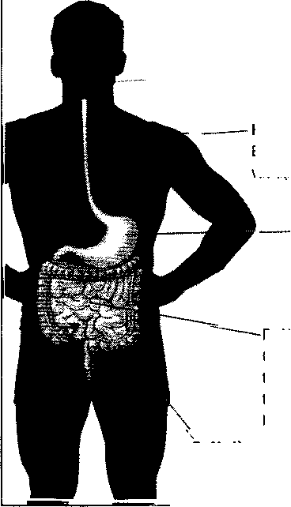

Miệng

Răng và lưỡi của bạn làm nhiệm vụ cắn, nghiền nát và nhào trộn thức ăn, trong khl đó các chất hóa học ở nước bọt giúp phân giải nó.

— Khi bạn nuốt thì họng, thực quản và các cơ trong thực quản đưa thức ăn vào trong dạ dày.

Họng và thực quăn

Bạn nuốt, các cơ trong thực quản đẩy thức ăn vào dạ dày.

Dạ dày

Axit clohyđric và cấc dịch vị khác phân giải thức ăn. Được nghiền nát bởi sự co bóp của cơ bắp, rổi chuyển hóa thành chất lỏng sệt.

Chat dịch đổ dồn vể gan, tuyến tụy và till mật để hoàn thành việc tiêu hóa. Các chất dinh dưỡng di chuyển vào trong thành ruột. Từ đó, chúng đi qua dòng máu và đường bạch huyết đến mỗi tố bào trong cơ thể.

Ruột già

Nước và chất khoáng hấp thu qua thành ruột. Những chất còn lại là chất cặn đi qua trực tràng rồi được thải ra thông qua hậu môn.

AX THEO DỘ TUỔI VÀ CÁCH SÔXG

ở độ tuổi trung niên:

Nên ăn gì ở độ tuổi này? Phải chăng bạn nói bạn có thể ăn tất cả những gì bạn muốn và chưa bao giờ tăng cân? Điều này trồ thành sự thật chỉ ồ một số người may mắn mà thôi - nhưng đối với họ khi đến 30 tuổi thì sẽ khác đi -khoảng thời gian đó, quá trình trao đổi chất của chúng ta chậm lại và đốt lượng ca-lo kém hiệu quả. Hầu hết chúng ta đều tiếp tục ăn ở mức đó, vì vậy dần dần sẽ tăng cân. Đến độ tuổi 30, người đàn ông trung bình có thể đạt đến 500-800g mỗi năm.

Thật may mắn vì khá dễ dàng để chống lại với triệu chứng âm ỉ này. Chúng ta cần phải nhận thức một cách đơn giản về những ảnh hưởng của quá trình trao đổi chất của sự lão hóa và việc thay đổi lượng calo đưa vào cơ thể và thói quen tập thể dục để bù đắp. Giảm nhẹ thực phẩm trong bữa ăn, thêm vào đó là bánh quy chẳng hạn, và kết quả là triệu chứng trên sẽ không lan rộng đến vùng thắt lung.

Chúng ta nên bổ sung bao nhiêu lượng calo mỗi ngày?

Yếu tố chính cho việc ăn uống hợp lý là duy trì cân bằng năng lượng; điều này có nghĩa là ăn đủ lượng calo để đủ cho việc tiêu thụ hằng ngày hoặc ít hơn, nếu nhiều hơn bạn sẽ tăng cân. Yếu tố chính ảnh hưởng đến việc tiêu thụ năng lượng bao gồm:

- • Chiều cao, cân nặng và vóc dáng.

- • Tuổi tác.

- • Mức độ vận động thân thể (ví dụ: công việc ngồi một chỗ hoặc công việc liên đòi hỏi phải vận động cơ thể).

- • Số lượng và hình thức tập luyện.
---

Đối với người đàn ông ồ độ tuổi trung niên, mỗi ngày nên đưa vào cơ thể một lượng là 2500 calo để duy trì cơ thể được khỏe mạnh. Nếu muốn giảm cân, cần phải cắt giảm khoảng 500 calo mỗi ngày và tăng mức độ của việc tập thể dục. Chúng tôi không nói rằng bạn cần chú ý đêrì mỗi lượng calo mà bạn tiêu thụ, hãy ăn uống thỏa thích. Cách tốt nhất để giảm cân không phải là bạn luôn đếm xem có bao nhiêu lượng calo trong mỗi bữa ăn, (mặc dù bạn có chú ý về chúng) nhưng thay vào đó cần phải luyện tập thể dục thường xuyên, và một chế độ ăn uống không có chất béo mà chủ yếu là trái cây, rau quả và ngũ cốc.

Đừng vượt quá sự cho phép:

Rối loạn tiêu hóa ở nam giới thì ngày càng gia tăng, điều này cũng gặp ở nữ giới - người gặp các bệnh như chán ăn. Bạn không nên quá lo lắng với lượng calo đưa vào cơ thể đến nỗi trở nên bị ám ảnh: điều đó không có lợi cho tinh thần và thể chất. Nếu lúc nào bạn cũng ăn uống hợp lý và thường xuyên luyện tập thê’ dục thì việc hấp thụ calo quá mức sẽ không gây hại. Nếu việc ăn uống vằ việc tập thể dục bị dồn ép quá mức sẽ rất có hại cho thể chất và tinh thần của bạn. Bạn có thê’ mất đi những dưỡng chất cần thiết cho cơ thê’ của mình và làm thay đổi sự cân bằng hóa học quan trọng của bộ não, làm tinh thần giảm sút.

BẠN VÀ CHẾ ĐỘ ĂN UỐNG CỦA BẠN

Tại sao thật quan trọng để biết về hy-đrát-các-bon, chất béo, protein và các chất khác nữa? Nó không phải bài học trong nhà trường. Thật quan trọng để biết được những điều này bởi vì hầu như chúng ta có chế độ ăn uống nhưng lệch với những nhu cầu trong cơ thể: chẳng hạn, chúng ta ăn quá nhiều và không đủ châT xơ. Và hiện tại chúng ta biết rằng chế độ ăn uống đóng vai trò quan trọng trong việc bảo vệ cơ thể chông lại những căn bệnh; chẳng hạn như mốỉ liên quan giữa chế độ ăn ít chất béo và tỉ lệ bệnh tim tháp. Vì vậy, nếu bạn ý thức hơn về việc nên ăn gì vào mỗi ngày, thì bạn sẽ đưa ra sự lựa chọn phù hợp với chế độ ăn của bạn. Việc mua những thức ăn có nhiều chất dinh dưỡng giúp sức khỏe bạn ngày càng tốt hơn và có lẽ sông lâu hơn.

CHẤT DINH DƯỠNG ĐA LƯỢNG VÀ VI LƯỢNG

Như bạn biết, mỗi ngày cơ thể sản sinh ra hàng nghìn hợp chất hóa học: protein để tạo ra các tế bào mới và bổ sung các tế bào bị hỏng, các hooc-mon để điều hòa mọi thứ từ trao đổi chất đến phát triển giới tính, hợp chất đường để cung cấp nhiên liệu cho toàn bộ°quá trình. Để thực hiện tất cả việc này, cơ thể bạn cần các chất cơ bản để tạo ra các chát dinh dưỡng.

Các bảng ở bên dưới và ở các trang sau liệt kê các chất dinh dưỡng thiết yếu, vai trò của chúng đê’ giúp duy trì sức khỏe tốt, chúng được tìm thấy trong thức ăn, và tiêu chuẩn Châu Âu đã đưa ra số lượng cần thiết hằng ngày (RDAs).

Có 2 nhóm dinh dưỡng cơ bản: chất dinh dưỡng đa lượng, cần thiết trong số lượng lớn, và có trong protein, cacbon-hy-đrat, chất béo, nước, cũng như một ít chất khoáng; chất dinh dưỡng vi lượng cần thiết trong số lượng cực nhỏ, được đo thành miligam(mg) và microgram(mcg). Chúng bao gồm các loại vitamin và một số ít chát khoáng.

CHẤT DINH DƯỠNG vĩ MÔ

Chết dinh dưỡng

Vai trò đtfi vđi sức khỏe

Nguồn cung cấp thiết yếu

Yêu cẩu

Carbohydrates

Đốt cháy năng lượng, giúp tiêu hủy chát béo và giữ cho làn da, xuơng và móng tay khỏe mạnh.

Carbohydrates phức hợp (tinh bột): rau quả, trái cây, đậu, tất cả các loại ngũ cổc.

Carbohydrates đơn thể( đúỡng): đường tinh chế, mật ong, mật đường.

Carbohydrates phức hợp nên chiếm khoảng từ 55 - 65% trong một khẩu phẩn ăn hàng ngày của bạn. Giảm đến mức tối thiểu các Carbohydrates đơn thể.

Protein

Phát triển và khới phục các tế bào da hémôglobin. Sản xuất hoocmon và enzim tiéu hóa

Gia cẩm, cá, trúng, đầu, tất cả các loại ngũ cốc, quả hạch, sản phẩm từ bơ sữa.

Khoảng 1X3 gram trên 500 gram của trọng lượng cơ thể, khoảng 56 gram cho một người đàn ông 75kg. (2 oz cho một người đàn ông nặng 11st 8 oz).Hẩu hết nam giới ăn nhiếu hơn lượng trên.

Chất béo

Giúp hình thành màng ngoái của mỗi tê' bào. Quan trọng cho hệ thẩn kinh, một sô' hocmôn, tóc, da. Chổng lại sự mất nhiệt. Đốt cháy năng lượng và dự trữ năng lượng khi cẫn.

Có trong các loại dẩu không bão hòa đơn (chẳng hạn dẩuoliu) và dầu bão hòa đa (có trong ngô, huỡng dương, dẩu cây rum. Trành những loại mỡ bão hòa (có trong thịt,bơ sữa,và lá cây họ cọ và dẩu đùa).

Chúng ta chỉ cẩn 2-5% lượng calo từ chất béo theo tiêu chuẩn để nghị là 30%; Lời khuyên của các chuyên gia tối đa là 25%.

Chat dinh dưỡng

Vai trò đôì với sức khỏe

Nguồn cung cấp thiết yếu

Yêu cấu

Nước

Làm mát và bôi trơn cơ thể, ván chuyển tất cả càc chất dinh dưỡng thông qua hễ thông tuán hoàn, loại bỏ châ't thải và chẩ't độc. Là thành phần chính của toàn bộ cấc chất dịch trong cơ thể. Môi phản ứng hóa học trong mọi tố bào của cơ thê’ đểu phụ thuộc vào nuổc.

Có trong nước, nước ép trái cầy, trái cây, rau quả.

Mỗi cơ thể yêu cẩu 2,3-3,4 lít nước (4-6 lon) môi ngày, nhưng có khoảng một nửa là đi kèm với thức ăn. Uổng 6-8 cốc nước (225ml) và nhiểu hơn nếu bạn thường hoạt động thể chất.

CAC LOẠI VITAMIN TAN TRONG NƯỚC                                 1

(1131 dinh dưAng

\\.1 i trò dò'i MŨ khoe

Nguon cung tãp chính

Yêu cầu

Vitamin c

Là một chất chống oxy hóa. Cần thiết cho qua' trinh phát triển xương, sự hình thành ca'c hệ thống truyền dẫn dây thần kinh (chẳng hạn như serotonin, và giải độc trong gan. Tăng khả nắng miễn dịch và có thể giúp ngẩn ngừa bệnh cảm lạnh, bệnh ung thư, bệnh tim, giúp nướu lợi được khỏe mạnh.

Có trong: cam, bưởi, dưa, ớt đỏ, rau bina thô, bông cải xanh, cải bruxen, súp lơ, xoài, đu đủ, dâu tây, khoai tây.

60mg mỗi ngày. Nhiều chuyên gia khuyên dùng từ 250-1 OOOmg/ ngày.

Sinh tố B (vitamin

Tham gia vào việc chuyển đổi carbohydrat thành năng lượng, nêu thiếu hụt có thể gây ra trầm cảm, mệt mỏi, mat cảm giác ngon miệng

Đậu Hà Lan, đậu, các loại ngũ cốc, thịt lợn, bánh mì.

1,4 mg mỗi ngày.

Riboflavin

(vitamin B2)

Giúp tăng năng lượng từ carbohydrates, chất béo và protein. Có vai trò quan trọng trong sự hình thành của các tế bào hồng cầu và hocmon. Giúp duy trì các mô.

Sản phẩm từ sữa, ngũ cốc, bánh mì, bông cải xanh, măng tây, đậu Hà Lan, khoai tây, cam / nước cam, trứng, gan.

1,6 mg mỗi ngày.

( hai (linh diiiint;

Vai tro dm Mli MI( khoe

Nguon lung 1 ip chính

Niacin

(vitamin B3)

Giúp chuyển đổi carbohydrates, axit amin và các chài béo thành năng lượng.

Có trong gạo, ngũ cốc, đồ nướng, thịt, gia cầm, cá, đậu phông, bia.

1 8 mg mỗi ngây.

Pantothenic acid (vitamin B5)

Giúp chuyển hóa protein, carbohydrates và châ’t béo, và sản xuất hocmone quan trọng và chất dẫn truyền thần kinh .

Được tìm thấy trong tất ca’ các mô động vật và thực vật; trong quả bơ, bông cải xanh, cám, tâm, trứng.

6 mg mỗi ngày.

Vitamin B6

Giúp điều chỉnh hệ thống thần kinh. Có vai trò quan trọng trong quá trình chuyển đoi protein và amino acid thành năng lượng. Vitamin B6 cũng giúp vào quá trình trao đổi cha'tglucozo, axit béo và giúp tái tạo hồng cầu.

Có trong tất cả các loại ngũ cốc, khoai lang tây, thịt gà, cá lòng đỏ trứng, chuối, bơ.

2mg mỗi ngày.

Nếu khẩu phần ăn của bạn có nhiều protein thì bạn cần bổ sung thêm nhiều Vitamin B6 hơn.

Vitamin B12

Cần thiết cho việc tổng hợp ADN và quá trình phân chia tế bào. Sa’n sinh hồng cầu, giúp điều trị thiếu máu mãn tính.

Có trong gan, sò, thịt bò, thịt lợn, trong ca'c sản phẩm sữa, trứng.

1 mcg mới ngày. Những người ăn chay có thể thiếu hụt Vitamin B1 2 từ trứng, sữa. do vậy cần uống bổ sung Vitamin B12.

Axit Folic

Cần thiết cho sự tăng trưởng và phân chia tế bào, và hình thành Hemoglobin.

Có trong các loại đâu như: đậu tây, ngũ cổ'c, rau bina, măng tây, bông cải xanh, đậu bắp, các loại hạt và gan.

200mg mỗi ngày.

Biotin

Giúp tăng cường hệ thống miễn dịch. Có vai ưò quan trong trong việc chuyển hóa protein, chất béo và Carbohydrat, và hình thành protein mới, hoocmon và chât dẫn truyền protein.

Có trong dầu phộng, đậu, các loại hạt, ngũ cốc, lòng đỏ trứng,súp lê; ca'c bộ phận nội tạng như: gan, thận.

0.15mg mỗi ngày.

chất dinh dttóng

MBn trong chBi

Vai trò dôi VOI sue khoe

Ngu ôn cung tape lnnh

\|‘U (au

Vitamin A

Cần thiết cho mắt, sinh sản, phát triển tế bào, tăng trưởng, miễn dịch. Giúp làn da luôn khỏe đẹp và màng niêm dịch. Beta-carotene - tiền tố của Vitamin A, giúp chống quá trình oxy hóa.

Có trong dưa hâ'u, đào, mơ, xoài, đu đủ, cà rốt, rau bina, bông cải xanh, cà chua, rau diếp, đậu xanh, khoai lang, bí vàng, cá, gan, lòng đỏ trứng, các loại sữa.

800 mcg.

Hãy thận trọng khi dùng các châ't bổ sung vitamin A. Sẽ gây đôc khi uổng liều lượng cao.

Vitamin D

Có vai trò quan trọng trong việc hấp thụ Can-xi trong cơ thể. Là yếu tố chính để phát triển xương, răng chắc khỏe và tác đọng đến hệ thống thần kinh vận động.

Ânh nắng mặt trời giúp cho cơ thể hấp thụ vitamin D, Vitamin D có trong cá mòi, cá hồi, cá trích, ngoài ra còn có trong các sản phẩm sữa.

5 mcg mỗi ngày.

Vitamin E

Là chất chống oxy hóa, giúp bảo vệ tế bào và các mô tránh khỏi quá trình lão hóa. Ngăn ngừa bệnh tim và giảm cholesteron, ngăn chặn quá trình tích tụ các mảng bám trong động mạch. Tăng khả năng miễn dịch và phông chống đục thủy tinh thể.

Có trong các loại hạt như: hạt hạnh nhẩn, lạc, quả hồ đào, bí ngô và hạt hướng dương, rau xanh, lúa mì, ngũ cốc.

1 00 mg (30IU) mỗi ngày theo tiêu chuẩn EU.

Theo lời khuyên của các chuyên gia nên dùng 100-400IU mỗi ngày để tăng cường hiệu quả quá trình chống oxy hóa.

Vitamin K

Giúp điều chỉnh quá trình đông máu.

Có trong các loại rau xanh, trái cây, các loại hạt, trứng, sẩn phẩm sữa, thịt.

60-80 mcg mỗi ngày.

NhMwC

UYtN 10 ĐA LLỤNG

Nguyên rõ

Tat dung doi xoi Mil khoe

Nquon lung < ap < hu veil

ìeu < .111

Canxi

Xây dựng câ'u trúc xương và răng, có vai trò quan trọng trong cơ chế đông máu, câ'u trúc của màng tế bào và dẫn truyền xung thần kinh. Giúp ngăn ngừa giòn xương, bảo vệ cơ thể chống lại cao huyết a'p và ung thư ruột kết. Có vai trò quan trọng đối với sự phát triển bình thường ở trẻ em.

Có trong các sản phẩm từ sữa như sữa, phô mai, sữa chua. Ngoài ra còn có trong cá mòi, hạnh nhân, hạt vừng, bông cải xanh, đậu tương, rau xanh.

800 mg mỗi ngày.

ao

Có vai trò quan trọng đôì với hệ thần kinh và duy trì cân bằng dịch.

Có trong muối ăn chính là na tri clorua. Clo được tlm thấy ở khắp nơi trong tự nhiên và trong các sản phẩm đóng gói.

3.400 mg mỗi ngày.

Magiê

Xây dựng cấu trúc xương, điều hòa hoạt động của tim và chống lại bệnh tim. Quan trọng trong hoạt động của enzyme và trong quá trình trao đổi chất, biến đổi protein, chất béo và đường thành năng lượng.

Có trong các loại rau xanh, đậu, hải sản, các loại hạt, đậu tương, trứng, ngũ cốc, các sản phẩm từ sữa.

300 mg mỗi ngày.

Phôt pho

Có vai trò quan trọng trong việc xây dựng câ'u trúc xương, giúp duy trì cân bằng axit-kiềm và có vai trò quan trọng trong quá trình trao đổi chát.

Có trong các sản phẩm từ sữa, thịt, cá, ngũ cốc, các loại hạt, đậu.

800 mg mỗi ngày.

Kali

Điều hòa huyết áp và chức năng tim. Có vai trò quan trọng đối với sự co cơ và truyền xung thần kinh vâ trong việc sản xuâ't axit nucleic.

Có trong quả thuộc chi cam quýt, chuối, cà chua, phần lớn trái cây và rau quả, hải sản.

3.500 mg mỗi ngày.

Natri

Quan trọng trong việc truyền dẫn các xung thần kinh, giúp điều hòa huyết áp, tham gia vào quá trình trao đổi chất protein và carbohydrate.

Tìm thấy tự nhiên trong gần như tất cả các loại thực phẩm, và trong rau quả đóng hộp và đông lạnh, bánh nướng, ngũ cốc, khoai tây chiên và khoai tây chiên ngô, vv...

2.400 mg (tốì đa)

SHI N(. NC.l YEN lí) VI 1LỌM.

\\mn cn to

1.11 dung dill vol "III kiwit\*

Ngiion 1 ung < ap < hu vu

Y cu 1 .UI

Crom

Giúp giảm nguy cơ bệnh tiểu đường và bệnh tim bằng cách điều chỉnh lượng đường trong máu và mức insulin và làm giảm cholesterol trong máu.

Có trong men bia, mầm lúa mì và bánh mì lúa mạch đen, thịt, phô mai, rượu, bia.

3-5 mg mỗi ngày. 1

Đồng

Hỗ trợ các tế bào T trong hệ miễn dịch, tham gia vào việc sản xuất hormone, rất cần thiết cho việc duy trì xương, tóc và da, có mặt trong nhiều enzym chống oxy hóa.

Có trong động vật biển có vỏ, các loại hạt, ca cao, nâ'm, ngũ cốc nguyên hạt, đậu Hà Lan, đậu khô, rau xanh, gan.

1,6 mg (tối đa) mỗi ngày.

Sắt

Có vai trò quan trọng đối với sự hình thành của các tế bào máu và vận chuyển oxy khắp cơ thể. Rất cần thiết cho quá trình đốt cháy protein, châ't béo và carbohydrates để sản xuất năng lượng.

Có trong thịt đỏ, thịt gia cầm, cá, các loại hạt, ngũ cốc, quả mơ, đậu, đậu Hà Lan, rau múi tây, lòng đỏ trứng, rau bina (rau chân vịt) và các loại rau xanh khác.

10 mg. Hây thận trọng, việc bổ sung sắt dư thừa oó thể hình thành các gốc tự do dẫn đến bệnh ung thư và bệnh tim.

Mangan

Tham gia vào quá trình chuyển hóa glucose và xây dựng cẩu trúc xương. Là một châ't chống oxy hóa quan trọng. Cần thiết cho việc tổng hợp của dopamine, một châ't dẫn truyền thần kinh quan trọng ở não.

Có trong ngũ cốc, các loại hạt, trái cây, các loại hạt, trứng, rau xanh, thịt, tôm, cua, sò, hến, ca'c sản phẩm từ sửa.

Theo EU thì ko có RDA, nhưng các chuyên gia Hoa Kỳ đề nghị lượng an toàn hằng ngày là 2-3 mg

Selen

Là một chát chống oxy hóa mạnh, kết hợp với vitamin E để bảo vệ màng tế bào chống lại các gốc tự do ở tim, gan, thận, và phổi. Quan trọng đối với sự phát triển của tế bào và kháng khuẩn.

Có trong cá, thịt, toàn bộ ngũ cốc (đặc biệt là lúa mì), ca'c sản phẩm từ sữa, trứng, các loại hạt, bông cải xanh, dưa chuột, hành tây, tỏi, củ cải, nâ'm.

75 mcg (nam giới), 60 mcg (phụ nữ)

Kẽm

Thúc đẩy sựtăng trưởng, quan trọng đối với khả năng sinh lý và sinh sản. Quan trọng đối với hệ miễn dịch và chữa trị nhiễm trùng và làm lành vết thương. Là một chát chống oxy hóa quan trọng.

Có trong hải sản, thịt bò, gà tây, bột yến mạch và ngũ cóc, nâ'm men, đậu, mầm lúa mì, các loại hạt, sữa, trứng.

15 mg mỗi ngày.

## sự THIẾT YẾU CỦA DlNH DƯỠNG TỐT

•

Hầu hết chúng ta đều sống một cuộc sống hối hả, ít chú tâm đến những gì mình ăn. Nhưng việc thay đổi thực phẩm thì rất quan trọng. Bằng cách biết được tính thiết yếu của việc dinh dưỡng tốt như thực phẩm nào mà bạn cần dùng, bô’ sung thêm chất nào để hữu ích, cần tránh những thực phẩm nào thì bạn có thể đã đạt được một bước tiến lớn để có sức khỏe tốt và sống thọ.

Ị ............ ......................................1

10 MẸO DINH DƯỠNG HÀNG ĐÂƯ

- 1\. Tránh nguy cơ bị bệnh tim, ung thư, tiểu đường bằng cách hạn chế ăn thịt đỏ, những sản phẩm sữa nguyên kem, và thực phẩm chiên.

- 2\. Về vitamins, khoáng chất, chất xơ thì hãy ăn hoa quả và rau.

- 3\. Carbon hydrate phức (được tìm thấy trong các loại hạt, rau quả, trái cây) chính là nguồn năng lượng tốt nhất.

- 4\. Ăn thực phẩm đa dạng

- 5\. Chú ý đến khẩu phần vitamin và khoáng chất hàng ngày,

- 6\. Hạn chế uống rượu, hơn 2 đơn vị một ngày sẽ dễ dẫn đến tai nạn, bệnh tật hay nghiện.

- 7\. Ăn nhiều chất xơ. Thức ăn thô (bao gồm các loại hạt, trái cây, rau, các hạt đậu) giúp làm giảm lượng cholesterol và nguy cơ ung thư ruột kết.

- 8\. Hãy chuyển sang dùng cá. Lượng protein có trong cá nhiều ngang như ở trong thịt đỏ - nhưng lại không có chất béo bão hòa ở trong thịt đỏ

- 9\. Uống từ 6 đến 8 ly nước một ngày

- 10\. Tránh ăn kiêng cấp tốc vì không tốt trong dài hạn

BIẾT NHU CẦU CỦA MÌNH

Nhu cầu về dinh dưỡng của mỗi người là đơn nhất và phụ thuộc vào nhiều yếu tố, bao gồm tính di truyền, phong cách sống, cơ địa và sức khỏe tổng quát. Mặc dù có những bảng hướng dẫn, tất cả chúng ta nên khôn ngoan trong việc làm theo, như ăn nhiều trái cây, rau quả, và các loại hạt, giảm thiểu chất béo, uốhg đủ nước, thì mỗi chúng ta cần theo một chế độ ăn kiêng hiện tại và tìm ra cách riêng đê’ có 1 kế hoạch ăn uống thích hợp.

Để chắc rằng việc ăn kiêng đã bao hàm tất cả mọi thứ mà bạn cần, hãy tham khảo tháp thực phẩm (xem "bí ẩn của tháp"). Nó là một tham khảo cần thiết, về cơ bản, tháp thực phẩm nói rằng :

- • Dùng nhiều thực phẩm mỗi ngày để đảm bảo rằng bạn đã có đủ lượng dinh dưỡng cần thiết.

- • Ăn nhiều loại hạt, trái cây, và rau quả: biến những thứ này thành phần trọng tâm của mỗi bữa ăn.

- • Chỉ ăn những thực phẩm phái sinh từ động vật một cách điều độ vì chúng thường chứa lượng chát béo bão hòa cao.

- • Ăn dè chừng dầu, mỡ và các thực phẩm có đường.

BẠN CÓ BIẾT?

Từ năm 1948 trồ đi,tất cả đàn ông trong thị trấn Framingham, Massachusetts, USA, đã được nghiên cứu nhằm giúp các nhà khoa học xác định được những nhân tố gây nguy cơ cao cho bệnh tim và đột quỵ. Các nhà nghiên cứu đã tìm ra rằng những người đàn ông to ồ Framingham với tổng lượng cholesterol dưới 5mmol/lít, không có ai chết vì bị nhồi máu cơ tim.

###### LẬP KÊ HOẠCH

Rất tiếc, nhưng chỉ đơn giản đọc về điều này là chưa đủ. Khả năng là bạn sẽ không thay đổi chế độ ăn kiêng rõ rệt trừ khi bạn gặp phải tình huống nào đó. Ăn uống khỏe mạnh là điều thú vị nhưng tự nó không thể diễn ra, nó đòi hỏi phải có suy nghĩ, quyết định và thận trọng.

Biết được nhu cầu dinh dưỡng của bạn, sau đó suy nghĩ xem nên thay đổi như thế nào cho việc ăn kiêng hiện tại.

Viết ra những thay đổi này là một ý tưởng tốt. Viết ra những câu đơn giản và trực tiếp mà bạn có thể thực hiện được chẳng hạn, "tôi muốn ăn ít đường, ăn nhiều carbon hydrate phức": "tôi muôn ăn ít chất béo bão hòa". Đồng thời cũng nên viết ra rằng tại sao bạn lại muôn thay đổi ("duy trì thêm nhiều năng lượng": "giảm nguy cơ bị bệnh tim"). Cuối cùng, đặt ra mục tiêu cụ thể, viết ra rằng bạn muốn đạt được điều gì: 2 hay 3 suất ăn rau quả mỗi ngày, thêm nhiều hạt, không ăn thêm những sản phẩm sữa chứa hoàn toàn chất béo, ăn cá thay vì thịt hai lần mỗi tuần và hơn thế. Hãy vẽ đồ thị cho tiến trình của mình và tự thưởng cho việc thành công.

NHỮNG bí ấn cứa THÁI’ Tliực PIIAM

Đối với nhiều người đàn ông, tháp thực phẩm lằ một cái gì đó lạc hậu, những cuốn sách giáo khoa về nó như là gây ngáp và làm mí mắt nhíu lại. ô, hãy ngừng những định kiến này trong chốc lát vằ xem xét lại. Dù tin hay không, thì tháp thực phẩm cũng đóng một vai trò kì diệu đối với việc duy trì sức khỏe tốt.

Nó chỉ ra 3 điều cơ bản, bạn nên:

- • Ăn nhiều loại thực phẩm mỗi ngày.

- • Ăn theo tỷ lệ cân đối đã khuyến nghị (ăn nhiều ở hai bậc dưới).

- • Ăn một ít thực phẩm (ở 2 bậc trên cùng) có chừng mực.

ở phần đáy dài, theo đề nghị của tháp thì, 2 bậc thấp hơn - những loại hạt, trái cây, rau quả nên hình thành nền tảng cho việc ăn kiêng.Các thực phẩm phái sinh từ động vật ỗ bậc tiếp theo,được ăn một cách có chừng mực, thì chứa nhiều chất béo bão hòa, các hạt đậu, cây họ đậu và đậu hũ có thê’ thay thế cho thịt. Các thực phẩm nằm trên đỉnh chóp của tháp (bơ, dầu, chất ngọt và v.v.) thì nên ăn vừa phải.

Tháp cũng đưa ra những khuyến nghị về phần ăn cho cả nam lẫn nữ. Đàn ông nên hướng về số phần ăn nhiều hơn nhất là nếu họ hoạt động. Nếu những lời đề nghị này làm bạn nản chỉ thì hãy xem điều này: đối với các loại hạt lúa, nếu bạn ăn 1 tô ngũ cốc với một lát bánh mì nướng cho bữa ăn sáng, một miếng sandwich cho bữa ăn trưa, và một khẩu phần mì ống dành cho đàn ông - có thể nói lằng, gấp đôi lượng 75g (30Z) cho bữa ăn tối, thì bạn đã có hơn 6 xuất ăn rồi.

Hầu hết những người đàn ông ăn kiêng theo tháp thực phẩm này thấy rằng họ đã tăng việc hấp thu carbon hydro phức và cắt giảm được khá nhiều lượng chất béo nhất là gây bão hòa và đường.

có GÌ TRONG MỘT KHAU phan ăn?

Đây là một hướng dẫn xấp xỉ:

- • Các loại hạt lúa: 1 lát bánh mì, 25g (1 oz) ngũ cốc lạnh hay 75g (30Z) ngũ cốc nấu sẵn, cơm, hay mì ống.

- • Rau củ:một nhúm rau sống, rau lá; 190ml (6 fl oz) nưởc rau quả

- • Trái cây: 1 quả táo trung bình, chuối, hay cam; một tô nhỏ trái cây đã cắt sẵn, nấu hay đóng hộp; 190 ml (6 fl oz) nước trái cây

- • Sữa: 250ml (8 fl oz) sữa hay sữa chua; 40g(l 12 oz) pho mát

- • Thịt, thịt gia cầm, cá, đậu khô, trứng, quả hạch: 50-75 g (2-30Z) thịt; phần ăn tương đương bao gồm 18og (6oz) hạt đậu khô đã nấu chín, 1 quả trứng, hay 30 ml (2 tbsp) bơ đậu phông

- • Mỡ, dầu, và chất ngọt chỉ sử dụng có chừng mực; các sản phẩm sữa 2-3 phần; trái cây 2-4 phần; thịt, thịt gia cầm, cá, đậu khô, trứng, và quả hạch 2-3 phần; rau 3-5 phần; lúa (bánh mì,ngũ cốc, gạo, mì ống, khoai tây) 6-11 phần

  Châ't béo, dầu, và đường Sử dụng ít

  

  

  Các sản phẩm bửsữa 2-3 phẩn

  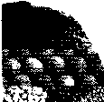

  Thịt, thịt gia cẩm, cá, đậu khô, ỉrứng và các hạch

  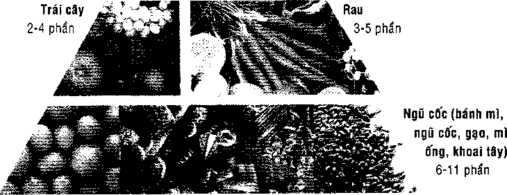

TAM BIỆT TẤT CẢ NHỮNG DIỀU ĐÓ

Nếu bạn quyết định sẽ theo tháp thực phẩm-nên như thế- thì bạn chắc chắn sẽ phải cắt giảm mạnh mẽ những sở thích của mình. Đa số những thực phẩm có chứa chất béo và đường và cả những món tráng miệng tuyệt diệu chứa cả 2 thành phần trên cần phải nằm trong danh sách "không" hay "à, chỉ nên ăn một ít thôi" của bạn. Những chất ngọt là dạng đường đơn giản, thường gọi là "calories rỗng" vì chúng không cung cấp dinh dưỡng. Châ't béo có xu hướng tích tụ ở những nơi mà mình thực sự không mong muốn, thêm vào đó lại thường hay phình thêm ra, gây tắc mạch và dẫn tới nguy cơ bệnh tim.

Sau đây là một số loại thực phẩm ưa thích mà tốt hơn hết là cần tránh xa hay ít nhất là ăn một cách có chừng mực.

- • Những sản phẩm từ thịt bò, bao gồm bít tết, hamburgers, thịt nướng, và nội tạng của động vật (thường có hàm lượng mỡ bão hòa cao).

- • Gà hay gà tây nấy với da (hàm lượng mỡ bão hòa cao).

- • Chocolate và hầu hết các loại bánh quy (nhiều chất béo và đường).

- • Dừa và dầu cọ (hàm lượng mỡ bão hòa cao).

- • Thịt nấu sẵn (hàm lượng mỡ bão hòa và natri cao).

- • Bánh rán (nhiều mỡ và đường).

- • Lòng đỏ trứng (cholesterol rất cao).

- • Các loại dầu thực vật được hydro hóa (chúng sản sinh ra các nhân tố tự do, thậm chí còn tệ hơn là chất béo bão hòa).

- • Mayonnaise (hàm lượng choles-terol và chất béo cao).

- • Chocolate (chất éo và đường cao).

- • Bơ đậu phông (chát béo cao).

- • Các sản phẩm thịt heo, như xúc xích, thịt xông khói, giăm bong (hàm lượng natri và chất béo bão hòa cao).

- • Những sản phẩm sữa nguyên kem (hàm lượng chất béo bão hòa cao).

Nếu bạn không thể sống mà thiếu những người bạn cũ này, thì tốt nhất là cố gắng ăn một lượng chừng mực thôi hoặc tìm những chất thay thế có hàm lượng béo thấp. Nếu ăn thịt bò hay heo, hãy nhớ chọn những miếng nạc nhất có thể.

CHỌN CHAT Xơ

Các chuyên gia dinh dưỡng khuyến cáo rằng chúng ta nên ăn từ 20-30g (3/4-ioz) chất xơ mỗi ngày.Tương đương khoảng 12 lát bánh mì nguyên hạt. Cụ thể hơn, bạn sẽ hấp thu từ nhiều loại hạt, trái cây và rau củ. Sau đây là nội dung chất xơ ăn kiêng tính theo gam trong một sô loại thực phẩm nói chung giàu chất xơ.

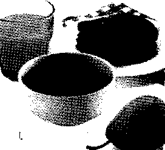

###### ĂN MỘT ÍT QUÀ VẠT THÌĐÙựC!

Bánh rán, bánh quy và những thanh socola - 3 loại quà vặt được yêu thích nhất mà chúng tôi vừa mới khuyên bạn nên từ bỏ. Liệu có phải tất cả những món quà vặt đều không tốt?

Chúng tôi rất vui lòng được nói, câu trả lời dường như là không. Quà vặt thì hữu ích, không những giúp bạn cung cấp năng lượng và

BỮA ĂN SÁNG KHÔNG THE GIẢM ĐƯỢC

Theo ước lượng có gần một nửa chúng ta bỏ qua bữa sáng, hối hả với cái dạ dày trống rỗng cho đến khi nạp đầy vào buổi trưa (hay giữa buổi sáng với phần ăn có nhiều chất béo và đường). Buổi sáng rất quan trọng: những cuộc nghiên cứu chỉ ra rằng vào buổi sáng muộn, những người ăn sáng đầy đủ sẽ có biểu hiện về thể chất và tinh thần tốt hơn những người bỏ bữa.

Nhưng đừng theo cách dự bị lỗi thời. Thịt xông khói, giăm bông và xúc xích chứa chất béo bão hòa gây tắc mạch. Thay vào đó, hãy thử một tô ngũ cốc giàu chất xơ với váng sữa và trái cây. Lượng đạm trong sữa sẽ tiếp thêm sinh lực cho não, carbon hydro phức trong ngũ cốc và trái cây sẽ cung cấp năng lượng duy trì cho bạn tới giữa ngày. Một số thực phẩm thay thế ngon lành bao gồm pho mát làm từ sữa đã gạn kem với hằm lượng chất béo thấp hay sữa chua không béo, bánh mì nguyên hạt hoặc bánh sừng bò với mứt.

làm tinh thần minh mẫn mà còn giúp bạn kiểm soát cân nặng dù tin hay không. Tại sao? Nếu bạn hoãn ăn quá lâu, có khả năng bạn sẽ phải tự chịu đựng khi cuối cùng bạn cũng phải ăn. Nhưng cũng quan trọng đó là tránh thôi bốc đồng, mua những thanh socola, bánh rán, bánh quy và những loại quà vặt khác có hàm lượng chất béo và ngọt thấp, và nên ăn chúng một cách có chừng mực mà thôi.

Một sự lựa chọn hoàn hảo về dinh dưỡng giữa những lần ăn vặt bao gồm trái cây hay nước trái cây, rau quả, một chén súp với một lát bánh mì nguyên hạt, bánh quy giòn có hạt hay bánh quy xoắn và trơn, bỏng ngô (không bơ)

TẤT CẢ NẰM TRONG THỜI GIAN ĐÃ ĐỊNH

Một vấn đề khác cần ghi nhớ nếu bạn đang định mức lại việc ăn kiêng đó là định ra thời gian của bữa ăn. Các chuyên gia dinh dưỡng nói rằng ăn khi nào là điều quan trọng.

Có một điều là, nếu bạn không ăn trong hơn 4 đến 5h, đường huyết của bạn sẽ bị hạ, có thể dẫn đến phát cáu, suy nghĩ mông lung, căng thẳng và mệt mỏi.

Án quá khuya vào ban đêm dễ gây mất ngủ cũng như ợ hơi và khó tiêu. Thường người ta hay nghĩ rằng việc này khuyến khích tăng cân nhưng giờ đây điều này là không đúng.

Các chuyên gia dinh dưỡng khuyên nên ăn điều độ, bắt đầu bằng một bữa ăn sáng đầy đủ dưỡng chất. Họ cũng nói rằng bạn nên ăn nhiều nhất vào khoảng giữa ngày. Nếu muôn ăn thêm thì hãy ăn ít thôi, ăn nhẹ và để dạ dày gần trống rỗng khi đi ngủ.

DỪNG QUÊN CHÁT xtí

Chất xơ, là những thành phần có trong thực phẩm từ thực vật mà cơ thể không thể hấp thu hay tiêu hóa,trôi qua hệ tiêu hóa mà vẫn còn khá nguyên vẹn. Nó không chỉ là sản phẩm phế thải mà thực sự là

Kill NÀO TIIÌ BẠN CAN Bổ SUNG VITAMIN?

Một chế độ ăn uống nghèo nàn cùng với bổ sung vitamin vẫn lằ một chế độ ăn uống không hợp lý. Ăn thức ăn đúng là cách tốt nhất để có được các chất dinh dưỡng mà cơ thể càn. Và chúng tôi biết bạn muốn ăn tất cả các loại thực phẩm đúng. Nhưng chỉ trong trường hợp ... nó sẽ không gây phương hại cho việc bảo đảm có dinh dưỡng trong các hình thức bổ sung chất lượng cao các vitamin, khoáng chất và các chất dinh dưỡng khác

Nếu bạn đang khỏe mạnh, việc bổ sung các chất có thể giúp tăng cường hệ miễn dịch của bạn. Nếu bạn hút thuốc, uống nhiều rượu, hoặc nếu bạn đã bị bệnh hoặc ăn kiêng một thời gian, hoặc nếu bạn làm theo một chế độ ăn chay nghiêm ngặt thì việc bổ sung có thể là quan trọng. Hãy tìm một công thức có chứa khoảng 100 phần trăm của các đề nghị cung cấp hàng ngày của EU đối với tất cả 13 loại vitamin, cũng như kẽm, selen và, nếu có thể, đồng.

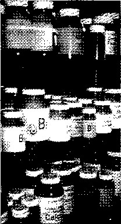

Các chất bổ sung như thế này có thể tăng cường hệ thống miễn dịch của bạn, nhưng chúng không thể thay một chế độ ăn uôhg thiếu chất thành đầy đủ.

phần thiết yếu cho việc ăn kiêng một cách khỏe mạnh. Hãy xem xét những điều sau:

- • Chất xơ làm cho phân mềm hơn, to hơn, giúp ngăn ngừa táo bón và đi đại tiện không đều đặn.

- • Các nghiên cứu cho thấy rằng ăn kiêng với hàm lượng chất xơ cao sẽ bảo vệ bạn khỏi ung thư ruột kết.

- • Chất xơ (được tìm thấy trong cám yến mạch, lúa mạch, táo và hạt đậu) giúp làm giảm lượng cholesterol, vì thế làm giảm nguy cơ bệnh tim.

Các chuyên gia khuyên cáo bạn nên dùng khoảng 20-30g (viên thuốc dạng hình thoi) chất xơ mỗi ngày. Để đạt được điều này bạn sẽ phải cần 5 phần trái cây và rau quả cũng như sáu phần các loại hạt. (Xem "sự lựa chọn chất xơ của bạn" để xem danh sách những thực phẩm giàu chất xơ.) Nó được nối kề với tháp thực phẩm,đánh dấu hoa thị cho những nhóm thực phẩm này.

CẮT GIẢM LƯỢNG CHOLESTEROL

Bạn có nghĩ rằng bạn còn đang trẻ và hoạt động đủ để không có gì phải lo lắng về lượng cholesterol của mình? À, thế thì bạn phải nghĩ lại. Nếu bạn ăn kiêng theo kiểu Anh, chất béo bão hòa trong cơ thể sẽ chuyển đổi thành cholesterol, bạn sẽ phải đốì mặt với vấn đề sức khỏe nghiêm trọng.

Cholesterol giông như một khẩu súng dầy, nhầy, dần dần tạo nên một lớp lót trong động mạch và cản trở máu lưu thông. Khi lượng máu cung cấp cho tim bị tắc nghẽn, bạn sẽ có thể bị lên cơn đau tim, nếu phần tắc ở động mạch nuôi não, bạn sẽ bị đột quỵ.

Thủ phạm chính là những thực phẩm có nhiều mỡ, nhất là mỡ động vật, như thịt đỏ và bơ sữa béo hoàn toàn và thực phẩm chiên. Nghe có vẻ quen không? Theo bác sĩ y khoa William Castelli, giám đốc của the Framingham Heart Study, "khi bạn trông thấy lối đi có mái vòm bằng vàng, nghĩa là bạn đang đi đến cổng thiên đường".

Để hạ thấp lượng cholesterol, hãy nghiêm túc hạn chế những thực phẩm có chứa chất béo bão hòa cao bao gồm thịt đỏ, thịt heo, 151

các sản phẩm bơ sữa được làm hoàn toàn từ sữa (pho mát, bơ, sữa chua, kem chua), dừa và dầu cọ, thực phẩm chiên. Thay vào đó, các châ't xơ ưa thích bao gồm các loại hạt (như lúa mì, yến mạch và lúa mạch), rau củ, trái cây, và các loại đậu. Đồng thời gia tăng tập luyện thể thao hàng ngày.

Hàm lượng cholesterol trong thực phẩm thì không quyết định trong việc tăng lượng cho-lesterol trong máu như mức độ của chất béo bão hòa. Dù có đúng như thế thì an toàn vẫn là trên hết, các thực phẩm có chứa lượng cholesterol cao như trứng và tôm thì dễ dàng hơn. Một vài người di truyền đã có mức cholesterol cao. Nếu bạn ở trong trường hợp này, cần thận trọng hơn trong việc làm theo hướng dẫn.

KẾT HỢP THỰC PHẨM: GIẢ TƯỞNG HAY THựC TE?

Một số người nói việc kết hợp các loại thực phẩm nhất định, chẩng hạn như trái cây và ngũ cốc, sẽ sản xuất chất độc trong dạ dày, dẫn đến rất nhiều gas. Những người khác yêu cầu bạn không nên ăn protein và carbohydrate cùng nhau.

Tất cả chuyên gia dinh dưỡng đều từ chối những khái niệm này, họ nói rằng hệ thống tiêu hóa của chúng ta thường xuyên xử lý kết hợp phức tạp, thậm chí trong các loại thực phẩm đơn giản nhất. Đậu có chứa carbohydrate, chất xơ, và protein; sữa có protein, carbohydrate và chất béo. Đã có bằng chứng mạnh mẽ rằng một chế độ ăn uống cân bằng khác nhau với bữa ăn có chứa loại thực phẩm dinh dưỡng, kết hợp ngon miệng, là tốt nhất.

CÓ GÌ TRONG THựC PHAM bạn ăn?

Người ta luôn muốn biết có nhiều axit pantothenic trong một củ khoai tây nướng như thế nào? Đây là cơ hội lớn của bạn! Bảng dưới đây liệt kê các giá trị dinh dưỡng, protein, carbohydrate, chất béo và các vitamin và khoáng chất quan trọng nhất - 45 thực phẩm thôrig thường, sử dụng nó kết hợp với bảng các chất dinh dưỡng để tìm hiểu xem bạn có đang nhận được đủ chất dinh dưỡng từ chế độ ăn uống của bạn.

##### BẠN ĐANG THƯA CĂN?

•

Khoảng 20 phần trăm người Anh cho tỉ lệ vượt quá iruic độ tổì ưu của họ về sức khỏe tốt. Một chế độ ăn uống thừa chất béo và lôi scíng ít vận động làm dễ dàng tăng cân, và khó để giảm cân. Nhưng có được một trọng lượng khỏe mạnh là một trong những điều quan trọng nhất bạn có thể làm để tránh căn bệnh nghiêm trọng.

BẠN CÓ BIẾT?

Những người xem truyền hình trong ba giờ hoặc nhiều hơn mỗi ngày bị béo phì gấp hai lần những người đàn ông xem ít hơn một giờ.

YÉl Cơ TIIỂ

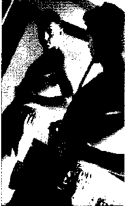

Yêu cầu đôi với cơ thê’ hoàn hảo ... Nếu nó thúc đẩy bạn làm việc thường xuyên và ăn một chê độ ăn uống lành mạnh, đó là một may mắn. Nhưng nó có thể ngấm ngầm, số lượng những người đàn ông không hài lòng với cơ thể của họ đã tăng lên đáng kể. Hầu hết chúng ta cảm thấy bất an và thiếu tự tin khi chúng ta so sánh các khổ người của chúng ta với các cơ thể cứng cáp của các diễn viên và vận động.

Bạn có thể làm gì về điều này? Đầu tiên, chấp nhận bạn là ai. Loại hình cơ thể cùa bạn là của chính bạn dành cho một cuộc sông, và có quá nhiều thứ mà bạn có thể cho vào một khổ người săn chắc hay lấy đi một khổ người nặng nề. Bạn lằ một cá nhân có những thứ riêng của bạn. Hãy đánh giá cao chính mình.

Hình ảnh quảng cáo của một cơ thể “hoàn hảo" làm cho một số người cảm thấy bất an vể ngoại hình của họ.

NGUYÊN NHÂN DẪN ĐÊN CÃC VẤN ĐỀ VỀ TRỌNG LƯỢNG

Chúng tôi không muốn làm bạn giật mình, nhưng những rủi ro sức khỏe xung quanh việc thừa cân là có thật. Nếu bạn chỉ hơi thừa cân, sự gia tăng nguy cơ của bạn là nhỏ, nhưng nếu bạn thực sự béo phì -được định nghĩa là hơn 20 phần trăm trên trọng lượng tối ưu của bạn hoặc mang nhiều hơn 25 phần trăm mỡ cơ thể - thì đây là một số những nguy hiểm mà bạn đang phải đối mặt.

- • Tăng ít nhất là gấp hai lần nguy cơ huyết áp cao, gần sáu lần nguy cơ nếu bạn dưới 45 tuổi.

- • Có khả năng cholesterol cao, dẫn đến tắc nghẽn mạch máu.

- • Rủi ro đột quỵ cao.

- • Gia tăng nguy cơ bệnh tim và nhồi máu cơ tim

- • Gia tăng nguy cơ ung thư ruột kết và ung thư tuyến tiền liệt.

- • Gia tăng nguy cơ phát triển bệnh tiểu đường khởi phát.

- • Có khả năng gia tăng nguy cơ ngưng thở khi ngủ, bệnh túi mật, viêm xương khớp, và gặp những vấn đề về tình dục.

Nói một cách ngắn gọn trong trường hợp này: những người đàn ông béo chết trẻ.

###### KHÍA CẠNH TÂM LÝ

Nếu những nguy cơ trên đây không đủ để giúp bạn bắt đầu một chế độ ăn uống lành mạnh, thì hãy suy nghĩ về điều này: cũng có các vấn đề về tâm lý gắn liền với tình trạng thừa cân - những điều này bao gồm sự lo lắng về sức khỏe, cảm giác xấu hổ và tự ý thức.

Không chỉ có phụ nữ ở các nước phương Tây mới có một hình ảnh không đẹp khi so sánh mình với các hình mẫu của các siêu mẫu thời trang, mà hàng triệu người đàn ông, đang cố để xây dựng lại lòng tự trọng bị mất, đang thực hiện chế độ ăn không mấy hiệu quả, điều này thúc đẩy một ngành công nghiệp về chế độ n uốhg hợp lý có trị giá hàng tỷ bảng Anh.

BẠN CÓ QUÁ THỪA CÃN?

Béo phì là một thực tế đôi với nhiều người trong chúng ta. Nhưng bạn có thực sự phải lo lắng không? Nghiên cứu cho thấy mặc dù chỉ có khoảng một phần ba của những người đàn ông thực sự thừa cân, nhưng số người cho rằng mình bị thừa cân lại râ't nhiều.

Tại sao rất nhiều người trong chúng ta đã bị thuyết phục rằng mình béo phì? Rất nhiều điều phải làm với những khuôn mẫu văn hóa: có bắp thịt là tốt, tinh khiết và đon giản. Nhiều nhà quan sát quốc tế đang ngạc nhiên về nỗi ám ảnh của chúng ta với bắp thịt. Một mặt, chúng ta không nói, "Anh chỉ có mỡ nếu anh nghĩ rằng mình đang có." Mặt khác, ở khía cạnh tích cực, thì hình dạng và kích thước cơ thể chấp nhận được, khỏe mạnh lại lớn hơn nhiều so với phần nhất định của các phương tiện truyền thông mà có chúng ta có thể tin tưởng.

Vậy đi đến vấn đề như thế này: ta thấy một quan điểm, có một cái nhìn thực tế của cơ thể, và không sai lạc về trọng lượng của bạn, nếu không bạn sẽ tự hành hạ mình với cảm giác tội lỗi về nó.

Vậy thật quan trọng để có một nhận xét thực tế về trọng lượng của bạn. Nhưng thực tế bạn làm điều đó như thế nào? Bước đầu tiên, bạn có thể tìm ra trọng lượng tối ưu của bạn cần có bằng cách sử dụng các phương pháp được trình bày chi tiết trong phần "Trọng lượng tối ưu của bạn là gì?"

Cũng thật quan trọng để biết tỷ lệ chất béo trong cơ bắp cơ thể của bạn. Nếu bạn là một vận động viên được đào tạo hoặc nếu bạn làm việc bên ngoài nhiều, bạn có thể có một tỷ lệ phần trăm cao của khối lượng cơ bắp. Cơ bắp nặng hơn mỡ. Hãy so sánh một người chỉ nằm trên chiếc ghế dài với một người đàn ông dùng mối quan hệ của câu lạc bộ sức khỏe của mình để làm việc thường xuyên. Cả hai có thể cùng một chiều cao và có cùng một kiểu cơ thể - họ thậm chí có cùng cân nặng - nhưng một người sẽ phong độ và khỏe mạnh, và người kia thì mũm mĩm và đầy nguy cơ bệnh tật. Các chuyên gia dinh dưỡng đã khẳng định rằng một cơ thể chỉ cần 15-20 phần trăm lượng mỡ là khỏe mạnh, bạn có thể tìm hiểu làm thế nào để bạn đánh giá bằng cách nhìn vào "Bạn nên có lượng mỡ bao nhiêu?"

HÃY THỨ NHÉO VÀO NGƯỜI

Chúng tôi không muốn biết liệu bạn đang tỉnh táo hay mơ. Nhưng chúng tôi muốn kiểm tra các yếu tố có nguy cơ nghiêm trọng đối với bệnh tim và bệnh tiểu đường khởi phát ồ người lớn.

Vì những lý do chưa hoàn toàn rõ ràng, sự nhão cơ trên hông và mông thì ít có nguy cơ về sức khỏe hơn là một vòng mỡ dư thừa nằm ở vùng giữa. Nhưng thậm chí nghiêm trọng hơn là chất béo mà bạn không thể nhìn thấy được. Được gọi là mỡ nội tạng, mỡ dư thừa này nằm ẩn trong ổ bụng. Trừ khi là có một vòng bụng rắn chắc nhưng nếu lỡ như bạn có một vòng eo lớn đến nỗi bạn không thể bấu được nhiều ở phần cơ mềm nhão khi bạn cấu vào da, thì bạn nên đến gặp bác sĩ.

Lớp mỡ dưới da - loại mà bạn bấu được - có thể là không nhiều nhưng ít nhiều vẫn có rủi ro.

Cũng có một yếu tô' khác: là độ tuổi của bạn. Khi một người đàn ông bước sang tuổi 30, tỷ lệ trao đổi chất của anh bắt đầu chậm lại, và kết quả là có sự tăng cân trung bình từ 500-700g (1 đến 11/2 Ib) mỗi năm (trừ khi, đó là, lượng calo của anh ta được giảm xuống và mức độ tập thể dục được tăng lên).

CÂN NẶNG LÝ TVỞXG?

Các chuyên gia xác định “thừa cân” và “nhẹ cân” như 10 đến 20 phần trăm nhiều hơn hoặc ít hơn trọng lượng tốì ưu của bạn. Vì vậy, trọng lượng tối ưu của bạn là gì? Dưới đây là hai cách để tìm ra.

Vì trọng lượng khỏe mạnh phụ thuộc khổ người của bạn, trước tiên bạn cần phải đo khung hình của bạn. sử dụng phương pháp đo bằng dải băng (hoặc một sợi dây mà bạn có thể đặt nằm lên cây thước) và đo chu vi của cổ tay bạn, ở phía trước của xương cổ tay, nơi uốn cong cổ tay. Người tầm thước nhỏ có chu vi nhỏ hơn 15,5 cm (61/4), người đàn ông với khung hình trung bình có kích thước là 15,5 cm - 17,5 cm (61/4 - 7 in), và những người tầm thước lớn là 17,5cm (7in). Kết hợp kích thước đo khô’ người với các bảng xếp hạng cân nặng dưới đây để tìm ra những trọng lượng tối ưu của bạn nên có.

Phương pháp khác dùng đê’ tìm hiểu xem bạn vượt hoặc thiếu cân là đê’ xác định chỉ số khôi cơ thê’ của bạn (BMI). Đê’ làm được điều này, cần phân chia trọng lượng của bạn theo ký lô cùng chiều cao của bạn theo mét vuông. Nên ở chỉ số BMI từ 19 đến 30. Ví dụ, Ted nặng 85kg (13 Xton 4 pao) và cao là l,72m (5ft 7in). Nhân 1,72 với 1,72 đê’ có được chiều cao của mình theo mét vuông, sau đó chia cho 85 bằng con số đó (2,95). Kết quả là 28,81. Chỉ sô’ BMI từ 20 đến 25 là khỏe mạnh. Bạn được coi là thừa cân nếu chỉ số BMI của

bạn là 25 hoặc cao hơn. Do đó, Ted là hơi thừa cân.

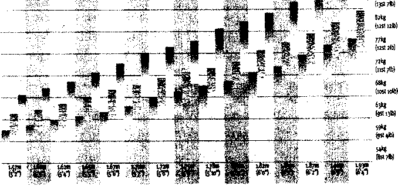

Chiểu cao tính có 25mm gót chân

ỆTầm vóc nhỏ ỊỊ Tầm vóc trung bình

Nguồn: Biểu đồ chỉ số chuẩn của Công ty

• Tầm vóc lớn

Bảo hiểm nhân thọ khu đô thị.

TẠI SAO CHÚNG TA THỪA CÂN

Nếu bạn đã thực hiện một biểu đồ hình tròn được gọi là "Tại sao chúng ta thừa cân" thì một lát cắt có thể được gọi là "gia đình: gen và thói quen". Phần còn lại của chiếc bánh này sẽ được chia thành các lớp có tên gọi "Ăn quá nhiều", "không tập thê’ dục đủ", và "chế độ ăn uống chất béo cao". Vâ’n đề là có quá nhiều người trong chúng ta không chỉ lấy một lát cắt, mà chúng ta ăn cả cái bánh này! Hãy nhìn lần lượt.

###### THỪA HƯỞNG Từ GIA ĐÌNH

Vâng, không phải tâ't cả là lỗi của cha mẹ, nhưng các nhà nghiên cứu dinh dưỡng tin rằng con người có thể được lập trình gen để mang trọng lượng khác nhau và cũng có số lượng mỡ trên cơ thể khác nhau. Về mặt sinh học, mỗi người chúng ta có thể có một "điểm thiết lập" về mô mỡ, một số lượng mỡ cụ thể trong cơ thể chúng ta "muốn" để có, do đó dù chúng ta có ăn kiêng bao nhiêu đi chăng nứa thì nó cũng vẫn sẽ tiếp tục cố gắng để quay lại điểm thiết lập.

Nói cách khác, Điều đó là bình thường đối với một người có thể là cao - hoặc thấp - đối với người khác. Điều đó mang nhiều ý nghĩa, hãy xem xét tất cả các loại của các đặc điểm khác, chẳng hạn như chiều cao, màu tóc, kiểu cơ thể, và khổ người, nằm trong hệ thống gia đình.

Về mặt di truyền học, bạn có thể kế thừa từ cha mẹ của bạn một khung cơ thể lớn, sự trao đổi chất chậm, và một lượng lớn các tế bào mỡ. Nếu bạn có những đặc điểm này, bạn sẽ phải luyện tập chăm chỉ để duy trì một cân nặng khỏe mạnh.

###### QUÁ NHIỀU THỨC ĂN, QUÁ NHIỀU CHẤT BÉO

Hầu hết chúng ta chỉ đơn giản là ăn quá nhiều thức ăn, nhiều hơn chúng ta cần đê’ duy trì mọi hoạt động của cơ thể. Nếu bạn nạp nhiều calo hơn bạn đốt cháy thì lượng dư thừa được chuyển đổi thành mỡ và được lưu trữ trong các tế bào mỡ đê’ sử dụng trong tương lai. Vậy là cứ tích tụ dần lên.

Chúng ta cũng không có được sự cân bằng hợp lý. Những người đàn ông thường nạp từ 35 đến 40 phần trăm lượng calo từ chất béo, trong khi chỉ cần 25 đến 35 phần trăm. Tăng thì cứ tăng mà chế độ thì

BẠN CÓ BAO NHIÊl MỠ?

Hầu như cơ thể của nam giới có khoảng 60 phần trăm là nước và 5-6,5 phần trăm là khoáng chất, phần còn lại chia đều cho mỡ và protein. Từ khoảng 15 đến 20 phần trăm mỡ được xem là khỏe mạnh, mặc dù một vận động viên qua huấn luyện có thể có ít nhất là 7 phần trăm, phần còn lại cơ chứa nhiều protein.

Biểu đồ dưới đây cho phép bạn xác định tỷ lệ phần trăm mỡ cho cơ thể của bạn. Đầu tiên, đo vòng eo của bạn, sau đó vẽ một đường từ trọng lượng của bạn trên thanh vạch bên trái đến kích thước vòng eo của bạn. Tại điểm đường giao với thanh vạch đường chéo (trung điểm) sẽ cho bạn một chỉ sô' chính xác.

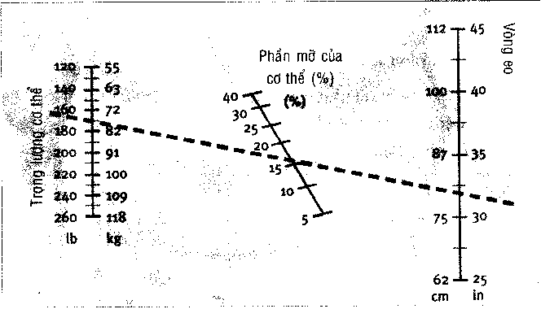

vẫn có chế độ, chất béo tạo mỡ nhiều hơn các loại thực phẩm khác. Protein và carbohydrate chứa bôn calo mỗi gram, một gam chất béo có tới chín calo. Điều đó có nghĩa bạn có thể ăn nhiều gâ'p đôi lượng protein hoặc carbohydrate bằng chất béo và vẫn không nạp nhiều calo. Ngoài ra, thức ăn béo có thể dễ dàng chuyển đổi thành các mô mỡ; mặt khác carbohydrate và protein phức hợp thì không.

###### LÔI SỐNG ÍT VẬN ĐỘNG

Đã bao nhiêu lần bạn được nhắc nhở về tầm quan trọng của việc tập thể dục, và được khuyên nên tập luyện nhiều hơn nữa? Tuy nhiên, chúng tôi sẽ thắng nếu chúng ta đặt cược rằng bạn đã không luyện tập nhiều. Chỉ một ít phần trăm những người đàn ông ở Anh tập thể dục thường xuyên, và một số’ lượng lớn trong chúng ta không tập bất kỳ bài tập thể dục nào cả. Nếu mặt bạn tiếp tục phì nộn và không làm tiêu hao bớt đi lượng calo thì bạn sẽ được nhìn thây chúng từ tấm gương của bạn.

TÁC IIẠ1 CỦA CÁC GEN BÉO

Chúng ta đều biết rằng di truyền đóng một vai trò quan trọng trong việc xác định có trọng lượng bao nhiêu. Nhưng phải hiểu rằng, gen không xác định bạn sẽ ăn những gì cho bữa tối, hoặc bạn tập thể dục nhiều như thế nào. Phần đó là tùy thuộc vào bạn. Một di truyền trước khi đi theo hướng thừa cân là không nhiều hơn thế: nó không phải là một án chung thân. Cách mà bạn sống, và quyết định mà bạn thực hiện, cuối cùng sẽ xác định xem bạn có mập hay không.

Nếu bạn đã có xu hướng di truyền, bạn sẽ phải luyện tập nhiều hơn - và khéo léo hơn, trong việc ăn thức ăn có nhiều chất xơ và ít chất béo, những thực phẩm làm bạn thấy no nhưng không làm bạn mập lên.

##### CHÃT 8Ế0 LÀ Gì?

Mùi thơm của thịt nướng, hương vị của sữa chua trên một củ khoai tây nướng hoặc bơ trên bánh mì nóng mới ra lò, cảm giác ngon lành và béo ngậy của kem trên lưỡi - thức ăn béo có một sức hấp dẫn không có gì đê’ nghi ngờ. Nhưng chúng ta ăn quá nhiều thứ quyến rũ này, và để dành cho một sức khỏe tốt của chúng ta thì chúng tả phải biết cách chông lại nó.

BẠN CÓ BIẾT?

Chúng ta thích chất béo bởi vì hầu hết các thành phần hương vị của thực phẩm là tan trong chất béo. Đặc biệt là ngay cả các loại thực phẩm mà không phải là chất béo cũng phụ thuộc vào hằm lượng chất béo cho nhiều hương vị của chúng. Loại thực phẩm giàu chất béo cũng cho cảm giác hài lòng và ăn nhiều hơn. Chúng sẽ ở lại trong dạ dày lâu hơn, dành thời gian nhiều để tiêu hóa, và tạo ra một cảm giác thích thú.

CHẤT BÉO DÀNH CHO DIỀU GÌ

Chúng ta cần chất béo. Nó giúp duy trì màng tế bào và mạch máu, giữ cho tóc và da của chúng ta khỏe mạnh, làm chât đệm và cách ly các cơ quan của chúng ta, và điều quan trọng để sản sinh ra nhiều hormones.

Chất béo cũng là một nguồn nhiên liệu quan trọng. Dạng năng lượng được tập trung nhất, mỗi gram chứa chín calo - so với bốn calo mỗi gram trong cả protein và carbohydrates. Điều này làm cho chất béo rất tốt cho việc lưu trữ.

Khi bạn tiêu thụ thức ăn nhiều hơn, bạn cần sử dụng năng lượng ngay lập tức chẳng hạn như năng lượng hình thành tế bào cơ thể, hoặc hồi phục thì lúc này cơ thê’ sẽ chuyển đổi tất cả các protein và carbohydrate còn lại thành chát béo và các nguồn dự trữ (cùng với chất béo từ thức ăn) dành cho về sau.

Chất béo được lưu trữ trong hàng tỷ tế bào. Các tế bào chất béo có thể giảm xuống khi chúng không còn cần thiết, nhưng chúng không mất hết. Không bao giờ. Khi chúng tăng với chất béo - mỗi tế bào trở thành tế bào lớn hơn tới ngàn lần - vì vậy làm bạn to lên.

Sau đó, nếu chúng ta ăn ít thức ăn hơn cơ thể chúng ta cần thì các nguồn dự trữ năng lượng trong các tế bào chát béo được huy động cho hoạt động và đốt cháy nhiên liệu. Trong quá trình tiến hóa của con người sự bô’ trí khôn ngoan này đã duy trì vô số cuộc sông qua các thời kỳ đói kém, nhưng trong các xã hội giàu có nó chỉ có một hậu quả là: sự tăng cân không khỏe mạnh.

CHÚNG TA ÂN QUÁ NHIÊU CHẤT BÉO

Nếu bạn thực sự muốn trở thành một thùng mỡ lợn, trước mắt tót hơn là hãy cứ ăn toàn thức ăn béo, vì châ’t béo nhiều hơn gấp hai lần lượng calo như với carbohydrate và protein. Chất béo trong thức ăn của bạn được chuyển đổi một cách nhanh chóng thành mỡ trên cơ thể của bạn. Trong khi protein và carbohydrates có xu hướng được sử dụng hết năng lượng và tái câ’u trúc tế bào thì chất béo nhanh chóng biến thành phần bụng phệ của bạn.

Các sách hướng dẫn chuyên đề cho biết rằng đàn ông không nên nạp quá 30 phần trăm lượng calo hàng ngày của họ từ chất béo, mặc dù các chuyên gia càng ngày tăng chỉ số tối đa là 25 phần trăm. Đối với một người đàn ông tiêu thụ 2.500 calo, nghĩa là nạp 69 gam chất béo mỗi ngày.

CHÚNG TA ĂN CÁC CHẤT BÉO KHÔNG HỢP lý

Cũng như ăn uống quá nhiều chất béo, chúng ta ăn các loại thực phẩm không đúng. Bơ, pho mát cứng, khoai tây chiên, và thịt đỏ chỉ là một vài trong số cấc loại thực phẩm yêu thích của chúng ta có mức độ chất béo bão hòa, các loại làm tăng cholesterol trong máu và ngăn chặn arteries.

Ở Vương quốc Anh, một nửa dân số được biết là có mức cholesterol có nguy cơ mắc bệnh về tim.

