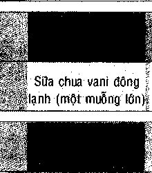
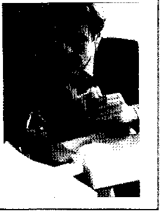
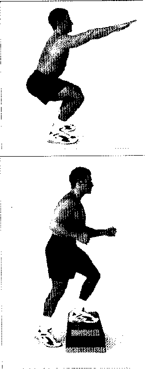
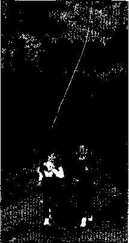
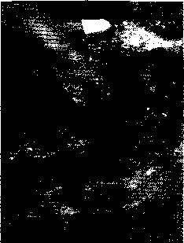
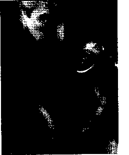
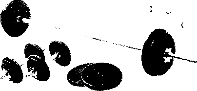
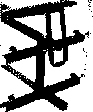
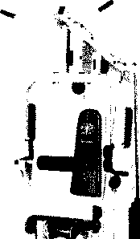
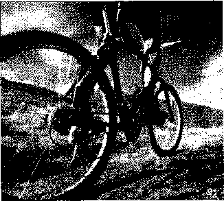

CHẤT BÉO TỐT, CHẤT BÉO XÀÌ’

Chất béo bạn ăn có bốn loại: không bão hòa đơn, không bão hòa đa, bão hòa, và bị hydro hóa. Trong khi tất cầ các chất béo có trong chế độ ăn uống rất giàu calo và có xu hướng làm bạn phì ra thì vẫn có một số tốt hơn những loại khác.

- • Không bão hòa đơn. Thường có trong dầu thực vật và hạt như ô liu và đậu phông. Chúng nâng tổng số cholesterol ở mức độ thấp hơn so với chất béo bão hòa, và không ngăn chặn cholesterol HDL có ích.

- • Không bão hòa đa. Loại này được lấy từ thực vật như hoa hướng dương và ngô. Mặc dù chúng cũng làm tăng lượng cholesterol ít hơn chất béo bão hòa, chúng hạ thấp mức HDL và có thể hỗ trợ trong việc phát triển của bệnh ung thư và ức chế hệ thống miễn dịch. Chỉ nên ăn ít.

- • Bão hòa. Những loại này không liệt kê số lượng. Được tìm thấy trong tất cả các thức ăn động vật, bao gồm cả thịt và các sản phẩm sữa, các chất bão hòa, đóng rắn ở nhiệt độ phòng thì gây ra nguy cơ cao đối với bệnh tim. Chúng có thể dễ dàng được gan chuyển đổi thành dạng cholesterol LDL (xấu), và có thể làm tắc nghẽn động mạch. Chúng cũng liên quan đến bệnh ung thư ruột và ung thư tuyến tiền liệt. Ba loại dầu thực vật - dầu dừa, dầu cọ, dầu hạt cọ -cũng được cho là bão hòa cao và nên tránh.

• Hydro hóa. Còn được gọi là axit transfatty, chất béo hydro hóa là các dạng dầu lỏng đã được thay đổi về mặt hóa học để làm cho chúng bền hơn. Được sử dụng trong việc làm xốp bơ thực vật và rau, chúng làm giảm HDL cholesterol, làm tắc nghẽn động mạch vành, và không tốt hơn cho bạn so với chất béo bão hòa.

##### LẤY LẠI vóc DÁNG SĂN CHẮC

•

Nếu bạn đang mệt mỏi về lượng mỡ dư thừa của bạn nhưng không được khuyên khích về chế độ ăn kiêng, bị bối rốì bởi các lý thuyết khoa học không phân thắng bại, và nản lòng bởi các tính toán "lượng calo từ chất béo" thì chúng tôi có tin tốt cho bạn. Thực ra, về lâu dài, việc giảm cân mạnh khỏe là có thể được, và cách thức để đạt được nó thực sự là khá đơn giản.

MẸO ĐỐT CHÁY CHẤT BÉO

Duy trì trọng lượng của bạn trong một phạm vi lành mạnh đòi hỏi phải có một chương trình lâu dài của việc tập thể dục thường xuyên và cách ăn uống thông minh. Dưới đây là một số chiến lược hiệu quả để giúp bạn thành công.

- • Tại nhà, nên ăn những bữa ăn nhỏ. Hãy dùng một chiếc dĩa nhỏ hơn.

- • Đừng quá lạm dụng. Nếu bạn quá thúc đẩy việc cắt giảm chất béo, bạn sẽ chỉ làm sự việc quay trở lại. Hãy cho phép bản thân chậm lại đôi chút. Hãy ăn kem mỗi tuần một lần thay vì mỗi ngày - và một tách đầy hơn là một lít.

- • Mang phần ăn trưa ít chất béo của bạn khi đi làm. Gồm có trái cây, và có thể là một miếng sandwich thịt gà nạc.

- • Không ăn thức ăn béo vào ban đêm. Khả năng tiêu hóa của bạn giảm từ

20 đến 40 phần trăm, và bạn không tập thể dục để đốt cháy nó được.

LÝ DO TẠI SAO CHÊ ĐỘ ÂN KIÊNG KHÔNG HIỆU QUẢ

Chúng ta đã biết tất cả các khuyến cáo đối với những kế hoạch chế độ ăn kiêng nghe như là phi thường: "Mất 14kg \[2 Xton\] trong hai tuần".

LÀM THÊ NÀO ĐE cat giảm chat béo tì' chê độ ăn l ông của bạn 111......  I   fẾẾỂỀMMlỀỂ^ỀMhỂfiirii ...................................     II m ..............................................

Hầu hết đàn ông vẫn nhận được 35 to 40 phần trăm lượng calo hàng ngày từ chất béo. Đây không những không tốt cho tim của bạn, mà nếu có thể nó cũng khó mà giảm cân được. Để lấy lại vóc dáng, hãy cố gắng tự giới hạn khoảng 20 hoặc 25 phần trăm. Nó dễ dàng hơn bạn nghĩ, nếu bạn làm theo những hướng dẫn này:

- • Nếu bạn ăn thịt đỏ, chỉ sử dụng thịt nạc trong các phần nhỏ; tốt hơn nên chuyển sang cá, thịt gia cầm (thịt trang là tốt nhất) mà không cố da. Chì sử dụng các sản phẩm sữa không béo hoặc ít chất béo. Nghĩa là không bơ, không sữa chua, không kem và không có pho mát hoặc cũng không có các loại ít chất béo.

- • Thử các loại nước xốt salad không dầu mỡ, chẳng hạn như nước cốt chanh hoặc giấm thơm.

- • Bỏ thói quen thêm bơ hoặc dầu ăn vào thức ăn của bạn.

- • Tránh các thức ăn chiên. Các món thịt nướng, bánh nướng, món kho rim, sa-tế (trong rượu vang hoặc một canh ít chất béo), hoặc món hấp thay vì chiên thức ăn trong dầu.

- • Nấu ăn rau trong nước dùng hoặc nước và thảo mộc thay vì xào với bơ hoặc dầu.

- • Nếu bạn ăn cá ngừ đóng hộp, chọn loại đóng gói trong nước chứ không phải dầu.

- • Tránh bánh ngọt và món tráng miệng đa dạng như bánh pho mát.

- • Kiểm tra các nhãn trên các gói thực phẩm cho hàm lượng chất béo và loại bỏ các sản phẩm chất béo không tốt.

Đây là những nguyên tắc, không phải quy tắc cứng nhắc, nếu bạn cần phải có một miếng phô mai hoặc một ít kem bây giờ thì hãy dùng nó, nhưng hãy cố gắng bù đắp bằng cách cắt giảm món khác cả ngày hôm đó hoặc ngày kế tiếp.

Nghe có vẻ rất hấp dẫn nếu bạn tình cờ tăng thêm cân. Nhưng đừng bận tâm, chế độ ăn giảm cân chỉ đơn giản là không hiệu quả.

Mặc dù nhiều người với những chế độ ăn uống có giảm cân trong một khoảng thời gian ngắn, nhưng nghiên cứu cho thấy rằng hầu hết trong số họ - hơn 90 phần trăm - thậm chí cuối cùng lấy lại trọng lượng đã mất. Đó là một phần do phản ứng trao đổi chất kháng lại trong khi bạn ngừng ăn một lượng thức ăn đủ. về cơ bản, cơ thể của bạn chuyển vào chế độ tồn tại và chính nó chậm lại để đảm bảo rằng nó sẽ không đốị cháy tất cả các nguồn dự trữ chất béo của nó. Cuối cùng lúc bạn bắt đầu ăn bình thường trở lại, sự trao đổi chất của bạn vẫn còn chậm, vì vậy bất kỳ trọng lượng bạn có thể đã giảm được lại quay trở lại nhanh chóng.

Thất bại của chế độ ăn kiêng cũng đi kèm với thực tế là người ta có những niềm vui trong việc ăn uống. Ai lại kiên trì với một chế độ ăn uống hàng ngày với một quả táo, cà rốt , và cơm? Thật là nhàm chán! Ăn uống nên là một niềm vui, và ăn uống lành mạnh là việc thưởng thức nhiều loại thức ăn bổ dưỡng.

Để giảm cân bạn sẽ phải tiến hành cho một số công việc, nhưng nếu bạn có cam kết lâu dài thì tất cả điều bạn cần làm là theo ba nguyên tắc đơn giản sau:

- • Đốt cháy nhiều calo hơn bạn nạp vào.

- • Giảm cân dần dần.

- • Thực hiện một số thay đổi về lối sống.

###### LƯỢNG CALO: CẮT GIẢM VÀ ĐỐT CHÁY

"Không chi tiêu nhiều hơn số bạn kiếm được." Không nghi ngờ gì nữa. Đó là lời khuyên tốt để quản lý tiền bạc của bạn. Nhưng khi nói đến trọng lượng, hãy quên nó đi. Trên thực tế là đảo ngược nó.

Cách duy nhất để làm tan chảy lượng mỡ dư thừa đó là đốt cháy nhiều calo hơn bạn tiêu thụ - để tăng lượng calo tiêu hao trong khi giảm calo hấp thu - không chỉ ngày hôm nay hoặc trong tuần này, mà còn đối với quãng còn lại của cuộc sống của bạn. Đó là lý do tại sao bạn cần các chiến lược dài hạn như đi bộ hoặc đi xe đạp đến nơi làm việc thay vì lái xe, hoặc chuyển sang chế độ không chất béo thay cho thực phẩm hằng ngày đầy chất béo, hoặc ăn cá thay vì thịt bò. Đốì với hầu hết nam giới, những th^y đổi đơn giản như cắt giảm một số chất béo từ chế độ ăn uống và tập các bài tập thể dục là đủ.

###### GIẢM CÂN CHẬM VÀ ỔN ĐỊNH

Việc duy trì số cân nặng mong muốn trong cuộc đời của bạn đòi hỏi nhiều hơn so với sự tập trung cao độ của việc giảm cân nhanh. Nó cần sự chăm sóc lâu dài của một lối sống lành mạnh

Nó giống như sự khác biệt giữa một tình yêu dam mê và một cuộc hôn nhân thành công. Bạn có thể giảm 9 kg (20 Ib) trong sáu tháng tới hay không? Chắc chắn là được. Bạn thậm chí có thể thích thử thách

MlCN’G MÓN’ NGON THAY THẾ DÀNH CHO CÁC MÓN KHOÁI KHAU chứa NHIÊl U1ÂTBÉO

Chúng tôi biết bạn thích những loại thực phẩm và các bữa tiệc nhiều chất béo ngon miệng. Nhưng có thể học cách sống mà không có chúng và vẫn được thưởng các bữa ăn và đề ăn nhẹ ngon miệng, vừa ý. Hãy thay thế ít chất béo cho nhiều chất béo hết mức mắ bạn có thể.

Thức ăn nhiều chất béo

Thực phẩm thay thế ít chất béo.

Các sản phẩm sữa nguyên chát, bao gồm sữa, sữa chua, pho mát béo.

Kem hay bán kem sữa, sữa chua, phô mai, pho mát giảm chất béo.

Kem chua.

Sữa chua không béo hoặc ít chất béo.

Kem.

Sữa chua kem trái cây đông lạnh không béo.

Băm nhỏ thịt bò.

Gà hoặc gà tây băm nhỏ.

Ca' đóng hộp trong dầu.

Cá đóng hộp trong nước.

Mayonnaise.

Mayonnaise tách béo.

Nước xốt salad với dầu.

Nước xốt không dầu.

Súp kem.

Nước súp bằng nước luộc.

Bánh Sô-cô-la khoai tây chiên.

Thanh bánh trái sung, bánh gừng.

Bánh rán.

Bánh mì tròn vđi mứt.

Khoai tây hoặc bánh khoai tây chiên giòn

Bánh quy, bánh mì que, bỏng ngô.

Đậu phông rang.

Nho khô, mơ khô

này. Nhưng sau đó thì sao? Một khi đạt được thành công, hầu hết nam giới ngủ quên trên chiến thắng của họ. Các kiểu ăn uống cũ và thói quen ít vận động dần dần lại kết tụ trở vào. Để hiệu quả lâu dài, bạn cần có một chiến lược dài hạn đối với việc giảm cân từ từ.

###### THAY ĐÔÌ CÁCH SỐNG

Thói quen ăn nhiều chất béo và một lối sống ít vận động đã gần như chắc chắn đưa bạn đến tình trạng bạn đang có hiện tại. Để đảo ngược tình

có GÌ KHÁC BIỆT?

Phải chăng bạn không bị thuyết phục về lợi ích của việc ăn uống ít chất béo? Biểu đồ dưới đây có thể thay đổi suy nghĩ của bạn. Nó so sánh hàm lượng calo và chất béo của một loạt các đồ ăn nhẹ, cả tốt (ít chất béo, lượng calo thấp) và xấu (chất béo cao, lượng calo cao). Hãy xem có sự khác biệt?

Sô' calo

840

435

350

173

210

to8

289

204

ĐỒ ân nhẹ

Nho khô (8g \[2oz\])

Bỏng ngô (25g \[1oz\])

BáB rán mứt

Bagel với mứt

Lượng chất béo

71g

IB

24g

1g

14g

1g

16g

#### 2g

hình, và giảm cân vĩnh viễn, bạn cần phải thay đổi lối sống. Đó là phải hạ quyết tâm thực hiện những thay đổi phù hơp trong cuộc sống hằng ngày của bạn là cải thiện chế độ ăn uống và tăng cường hoạt động thể chất.

Chúng tôi không nói rằng bạn phải đảo lộn toàn bộ cuộc sống của bạn, hoặc thay đổi ngay chế độ ăn uống và dùng thủ thuật nào đó trong bài tập thể dục.

LÀM THẾ NÀO ĐỂ TÁI TẬP TRUNG CHẾ ĐỘ ÂN UỐNG CỦA BẠN

Hãy nghiêm túc về việc thay đổi chế độ ăn uống của bạn? Trước hết bạn cần có một chế độ ăn uống đa dạng lành mạnh, đầy đủ các loại thực phẩm ngon mà bạn sẽ mong muốn được ăn, bỏ đi thứ linh tinh, và hướng tới thực phẩm tươi trong sản phẩm. Thay vì thực phẩm đóng gói sẵn, bánh kẹo, thức ăn nhanh và béo ngậy thì hãy ăn nhiều rau, trái cây, đậu, bánh mì nguyên cám, và ngũ cốc nguyên hạt. Những loại chứa nhiều carbohydrate phức hợp, không chỉ đóng gói với các vitamin và khoáng chất, mà còn có tác nhân đốt cháy chất béo - cái mà cơ thể của bạn có thể tiêu hóa chúng. Để chuyển hóa 100 calo carbohydrate phức hợp thành chất béo cơ thể thì cơ thể phải sử dụng 23 calo. Chỉ cần 3 calo đê’ chuyển hóa 100 calo chất béo trong chế độ ăn uống thành chất béo cơ thể.

Carbohydrate phức hợp cơ cũng là nguồn cung cấp chất xơ. Rau, trái cây, ngũ cốc nguyên hạt, và đậu không chỉ chứa ít calo và rất ít chất béo, chúng cũng nhanh no hơn và mất nhiều thời gian để nhai, vì vậy bạn có thể ăn ít.

Để tăng lượng nạp carbohydrate phức hợp hàng ngày của bạn:

- • Ăn nhiều đậu như đậu lăng, đậu vằn, và đậu tây.

- • Ăn nhiều các món salad và rau nấu chín.

- • Ăn bánh mì nguyên cám thay vì bánh mì trắng.

- • Ăn nhiều khoai tây, nướng hoặc luộc, không ăn khoai tây chiên.

- • Chọn ngũ cốc nguyên hạt chẳng hạn như bột yến mạch.

Tất nhiên, bạn cần nhiều hơn là chỉ tăng cường carbohydrate. Bạn vẫn phải cắt giảm râ’t nhiều các chất béo và các chất làm tăng số đo vòng eo khác từ những ngày cũ và thay thế chúng bằng những chat ít chat béo mà bạn sẽ thích ăn.

###### CẮT GIẢM Mff

Cắt giảm chất béo từ chế độ ăn uống của bạn là việc chính yếu cho chương trình giảm cân của bạn cùng với việc tập thể dục thường xuyên. Các sách giáo khoa nói rằng bạn sẽ nạp khoảng 30 phần trăm lượng calo hàng ngày từ chất béo, nhưng để giảm cân, bạn có thể sẽ phải cắt giảm xuống từ 20 đến 25 phần trăm hoặc thậm chí ít hơn.

BAO NHIÊU CHẤT BÉO?

Số liệu của Sở Y tế Anh cho thấy nam giới trung bình tiêu thụ không nhiều hơn 35 phần trăm lượng calo hàng ngày của mình ở các dạng chất béo. Các nguồn khác lại cho biết số liệu thấp hơn ngưỡng tối đa của 30 phần trăm. Một chế độ ăn uống chủ yếu là trái cây, rau, carbohydrate phức hợp (chẳng hạn như mì ống, gạo và ngũ cốc), và chọn các dạng thực phẩm thay thế ít chất béo như các sản phẩm hằng ngày sẽ giữ cho bạn khỏe trong vùng giới hạn. Nó có thể là một ý tưởng tốt đê’ kiểm tra lượng tiêu thụ chất béo của bạn bằng cách giữ các theo dõi tính theo gam chất béo trong các sản phẩm bạn tiêu thụ trong một ngày bình thường. Đối với sản phẩm đóng gói, hãy kiểm tra nhãn dinh dưỡng. Đối với thực phẩm tươi sống, cân nắm rõ danh sách đầy đủ các chất dinh dưỡng và chỉ số calo.

Một vài chất béo tốt cho bạn hơn so với những loại khác: ví dụ, dằu ô liu tốt hơn so với bơ thực vật hoặc bơ, nhưng tất cả các chất béo đều có tác động ở cùng một nhiệt. Bạn không thể chì đơn giản là chuyển sang dầu ô liu thay vì bơ, ăn gấp đôi, và vẫn còn hy vọng để duy trì trọng lượng như nhau. Quy tắc là: giữ cho lượng chất béo của bạn dưới 35 phần trăm trong tổng số calo hàng ngày của bạn, và đối với chất béo bạn ăn, nếu có thê’ hây chọn những loại không bão hòa đơn.

Cố gắng làm theo các hướng dẫn trong tháp dinh dưỡng (xem "bí mật của tháp dinh dưỡng"), cụ thể là ăn ít thức ăn nhiều mỡ, dầu, và đồ ngọt. Cắt giảm thịt đỏ, đó là chất béo bão hòa, hoặc ít nhất là mua loại nạc nhất. Ăn thay thế nhiều cá và gia cầm.

###### THƯỞNG THỮC MỘT ÍT MÓN NGỌT

Khi bạn thèm món ngọt vào cuối bữa ăn, hãy tìm kiếm đồ ăn nhẹ và không béo. Hãy làm như nhiều người Châu Âu thường làm: ăn một miếng trái cây. Nhâm nháp một miếng táo ngon ngọt, giòn sẽ đáp ứng được cơn thèm mà không có chất béo và rất ít calo.

###### RƯỢU VÀ TRỌNG LƯỢNG

Một lượng rượu vừa phải có thể tốt cho tim của bạn, nhưng nó sẽ làm cho mọi việc chẳng dễ dàng hơn nếu bạn đang cố gắng để giảm cân. Uống hai (12 fl oz) lon bia 350ml một ngày cho một tháng làm tăng lên đến khoảng cùng số calo như 65 miếng bít tết!

Ngoài ra, nếu cơ thể của bạn không thê’ lưu trữ rượu thì nó phải đốt cháy ngay lập tức. Trong khi bạn đang đốt rượu, bạn không đốt cháy chất béo được. Điều cuối cùng, rượu là một chất kích thích có cảm giác ngon miệng mà thường không ăn kèm với cà rốt và rau trộn, nhưng lại đi kèm với pho mát giàu chất béo, thịt, khoai tây chiên, và nước chẩm. Nếu bạn thực sự muôn giảm cân thì việc cắt giảm rượu gần như là một điều cần thiết.

LÀM THẾ NÀO ĐỂ SỬ DỤNG NHÃN THựC PIIAM và tại sao

Bảng “Thông tin dinh dưỡng” trên nhiều gói thực phẩm có thể cung cấp cho bạn một bức tranh khá hoàn chỉnh về những gì bạn sắp ăn. Ví dụ, nó thường sẽ cho bạn biết chính xác mỗi 100g (4oz) và mỗi phần ăn trung bình có bao nhiêu gam chất béo, bao nhiêu chất béo bị bão hòa, và cứ mỗi khẩu phần 100g (40Z) có bao nhiêu calo. Ngoài ra, các nhà sản xuất thực phẩm lớn nhất -bao gồm siêu thị vỡi các thương hiệu “nhãn hiệu riêng” sẽ cung cấp một loạt các loại thực phẩm mà yêu cầu phải thúc đẩy ăn uống lành mạnh hoặc thật thích hợp cho những người có chế độ ăn đặc biệt - ví dụ, ít chất béo, giảm đường và muối, không gluten, thích hợp cho người ăn chay. Tuy nhiên, những gì tạo nên những khái niệm như sản phẩm ít chất béo, hay “lite” và như vậy có thể khác nhau từ một nhà sản xuất khác. Tuy nhiên, tin tốt là hầu hết các chuỗi siêu thị lớn xuất bản tờ rơi ghi nhãn thực phẩm trên sản phẩm “của riêng thương hiệu” của họ, và thường được miễn phí. Nhận biết các thông tin về các gói thực phẩm muôn nói gì và bạn sẽ có thể chọn thông tin về những gì bạn ăn.

TẦM QUAN TRỌNG CỦA THỂ DỤC

Một lý do khác làm kế hoạch chế độ ăn uống thất bại là nhiều người trong số họ chỉ tập trung vào cắt giảm các loại thực phẩm béo. Bài tập thể dục bị loại bỏ khỏi chế độ cân bằng. Tập thể dục thường xuyên đi đôi với một chế độ ăn uống hợp lý, ít chất béo.

HÃY CHẬM RÃI ĐẾ THƯỚNG THỨC HƯƠNG VỊ

Bạn ăn càng nhanh, bạn càng ăn nhiều hơn trong bữa ăn. Vì vậy, nếu bạn muốn ăn ít hơn, thì phải ăn chậm lại. Phải mất khoảng 20 phút cho phản ứng cơ thể để biết bạn đã ăn đủ. Nếu bạn ăn quá nhanh, bạn có thể ăn nhiều hơn bạn cần mà không nhận ra. Đê’ giúp bạn ăn chậm lại:

- • Ngồi ăn trong một bầu không khí bình tĩnh và tĩnh lặng.

- • Vào lúc bắt đầu bữa ăn, dành ít thời gian để thư giãn. Ngồi yên lặng và nhắm mắt lại. Hãy hít thở sâu và để cho căng thẩng tan đi.

- • Đặt nĩa của bạn xuống sau mỗi miếng. Nhai và nuốt tất cả các thực phẩm.

- • Hãy dành thời gian để thực sự thưởng thức hương vị và kết cấu thức ăn của bạn.

Bài tập hiếu khí - bài tập thể dục nhịp điệu, duy trì liên tục bằng cách sử dụng cơ bắp của cơ thể - giúp bạn giảm cân bằng cách đẩy mạnh tốc độ mà cơ thể bạn đốt cháy nhiên liệu, không chỉ trong khi bạn đang tập mà còn một vài giờ sau khi bạn dừng tập.

Chạy bộ, bơi lội, đi xe đạp, trượt tuyết, cũng như các hoạt động thể thao như bóng đá hoặc tennis, là những cách tuyệt vời để lưu thông máu và ãối cháy mỡ của bạn đốt. Mỗi tuần nên hoạt động ngoài trời ba hoặc bốn lần, mỗi lần khoảng 30 phút.

Tập thể dục nhiều hơn không nhất thiết là phải tham gia một câu lạc bộ sức khỏe nào đó, mặc trang phục đặc biệt, hoặc trang thiết bị đắt tiền. Nó chỉ có nghĩa là gia tăng hoạt động thể chất hàng ngày của bạn. Làm nhiều việc vặt trong nhà. Hãy dành ra 30 phút đi bộ mỗi ngày, vào buổi sáng sớm, lúc giờ nghỉ trưa của bạn, hoặc khi bạn về nhà. Đậu xe một dặm hoặc xa hơn từ chỗ làm và đi bộ phần còn lại quãng đường. Đi xe đạp đến nơi làm việc, hoặc làm việc lặt vặt hay đi mua sắm chút ít bằng xe đạp hay là đi bộ.

###### TẠI SAO BẠN CẦN CO BẮP

Bên cạnh việc tập thể dục hiếu khí, bạn cũng phải duy trì khối lượng cơ bắp. Từ khoảng 30 tuổi, trừ khi bạn làm việc để ngăn chặn nó, thì bạn đã bắt đầu mất 500g (£1) cơ hoặc hơn thế trong một năm và chuyển đổi sang thành mỡ khi quá trình trao đổi chất chậm lại.

Bryant A. Stamford, tác giả của quyển Thon gọn không cần tập thỉ dục, nói rằng, "Để tiến hành cuộc chiến đấu chống lại mỡ thừa một cách hiệu quả nhất, bạn cần phải là một máy đốt cháy calo tốt 24 giờ một ngày, và việc có mô cơ thích hợp là cách duy nhất để làm điều đó." Đó là do cơ bắp đốt cháy nhiều calo hơn mỡ. Bạn sẽ đốt cháy hơh 30 đến 50 calo một ngày, dù thức hay ngủ, cho mỗi 500g bổ sung (£ 1Ị của cơ bắp mà bạn có.

Để giữ cho cơ bắp săn chắc hoặc để tăng chúng lên một chút, bạn không cần phải trở thành một nhà xây dựng cơ thể. Công việc nhà và làm vườn như cơi lá và lau sàn nhà có thể đáp ứng tất cả những gì bạn cần. Nếu bạn thích, tập luyện sức nặng hay thậm chí tập bên ngoài một vài phút với một cặp tạ 2kg (£5) hai lần một tuần có thể hình thành khối lượng cơ và góp phần cho một cân nặng khỏe mạnh.

BÂY GIỜ LÀ THỜI GIAN đỂ phá vỡ thói quen ít vận động

Thừa cân? Có phải trong cuộc sống của mình bạn ngồi nhiều? Nghĩ rằng có thể có một mối liên quan nào đó? Vài lần một ngày bạn nên đi đứng vài phút sẽ giúp giảm đi vài cân.

Tại nhà

- • Nếu bạn có không gian, hãy đá một quả bóng hoặc chơi cầu lông.

- • Đạp một chiếc xe đạp, tập thể dục trong khi xem truyền hình hoặc trong khi bạn nghe điện thoại.

  

- • Trong khi nói chuyện điện thoại, đi bộ xung quanh thay vì ngồi một chỗ.

- • Làm việc vặt của kế hoạch tập thể dục. Cào lá, đào vườn, quét vỉa hè hay đường lái xe.

Phá vỡ những thói quen cũ. Vào giờ ăn trưa, thoát khỏi bàn lầm việc và đi bộ.

ở nơi làm việc

- • Đi bộ ít nhất năm phút để ăn trưa.

- • Dùng tất cả hoặc một phần thời gian nghỉ ngơi của bạn để có một quãng đi bộ ngắn.

- • Bỏ qua thang máy và đi cầu thang. Nó đốt cháy calo và làm tăng sự trao đổi chất của bạn.

Tại Trung tâm mua sắm

- • Đậu xe cách xa các cửa hằng mà bạn muốn ghé thăm.

- • Sử dụng thang bộ thay cho thang máy, hoặc đi bộ lên cầu thang.

##### ĨHỨC UỐNG vô HẠI, KHÔNG NGUY HIỂM

Rượu có tốt cho bạn không? Câu trả lời tất nhiên sẽ là có - nếu và chỉ nếu - bạn tiếp tục uống dưới sự kiểm soát. Nghiên cứu cho thấy rằng những người uống vừa phải có tim và gan khỏe mạnh và sống lâu hơn những người nghiện rượu nặng hoặc kiêng hẳn rượu, vấn đề là không phải ai cũng có thể dừng lại sau khi một vài ly.

LÀM THẾ NÀO ĐỂ xử LÝ MỘT TÌNH TRẠNG DƯ VỊ

Buồn nôn, chóng mặt, đau đầu như búa bổ, nhạy cảm với ánh sáng và tiếng ồn, suy nghĩ mù mờ, có thể là do uống quá nhiều - không ai muốn nghĩ tới nó. Đây là một số cách để giảm bớt khó chịu.

- • Uống nước trái cây. Một ly nước cam sẽ giúp rã rượu.

- • Nếu còn đau đầu, hãy uống một liều thuốc giảm đau nhẹ. Một hoặc hai tách cà phê cũng có thể giúp được bạn.

- • Uống hai hoặc ba ly nước lớn. Một trong những nguyên nhân chính của sụ nôn nao là do mất nước. Hãy nhớ uống nước trước khi đi ngủ.

- • Uống vitamin c hoặc ăn trái cây giàu vitamin c như cam, bưởi, dâu tây.

- • Hãy kiên nhẫn. Điều duy nhất điều trị sự dư vị là thời gian. Trong khoảng 24 giờ, bạn sẽ cảm thấy tốt hơn.

R1’Ợ( V\\RẠX

Những ảnh hưởng của đồ uống có cồn khác một cách đáng kể người này sang người khác. Một số đàn ông chỉ cần uống một vài ngụm là đã cảm thấy buồn ngủ hoặc bị đau đầu, và có thể cho thấy rõ dấu hiệu sức phán đoán và nhận thức bị suy giảm chỉ sau một lần uống. Nhiều người nghĩ rằng họ có thê’ xử lý được nhiều hơn - và một số nhìn bên ngoài thì như là có thể, mặc dù về lâu dài họ

có phải trả giá.

Đây là một số tác hại của việc uống rượu, chia thành ba loại. Lưu ý rằng nhiều tác hại nằm trong vùng màu xám giữa vùng sử dụng vừa phải và quá

nhiều, tùy thuộc vào mỗi người.

Uống rượu vừa phải

Nghiện rượu nặng

• Nhịp tim nhanh.

• Cảm giác chán nản và thất

• Cảm giác thư giãn.

vọng.

• Cảm giác hứng khởi, vui mừng.

• Nguy cơ mắc bệnh tim.

• Giảm nguy cơ bệnh tim.

• Cơ tim bị tổn thương.

• Thay đổi tâm trạng.

• Kích ứng và loét dạ dày.

• Tăng ham muốn tình dục, làm tăng

• Bệnh gan.

khả năng làm tình.

• Rối loạn tuyến tụy.

Uống trung bình đến nhiều

• Huyết áp cao.

• Đau đầu và dư vị.

• Thừa cân.

• Phá vỡ mô hình giác ngủ bình

• Bất lực.

thường.

• Hành vi bạo lực và/hoặc thất

- • Lời nói khiếm nhã.

- • Đãng trí.

- • Sức phán đoán và nhận thức và/

thường.

hoặc sự sắp xếp bị suy giảm.

❖

\\* ❖

Lựl ÍCH CỦA UỐNG VỪA PHẢI

Nếu hiện giờ và cả sau này bạn nằm trong sô' nhiều người đàn ông Anh chỉ uống vài giọt nhỏ thì có thể là bạn không cần làm điều gì cho sức khỏe, vì một chút rượu trong máu của bạn làm cho bạn cảm thấy tốt. Tình trạng căng thẳng, stress và ức chế giảm đi. Bạn cảm thấy thoải mái, và bạn có thể có một cảm giác khỏe khoắn, sảng khoái thậm chí nhẹ nhàng. Và uống rượu là đời sống xã hội chủ yếu của nhiều người.

Hiện nay chúng ta cũng biết rằng uống một ngày một vài ly làm gia tăng mức độ HDL cholesterol, giúp loại bỏ LDL cholesterol "xấu" làm tắc nghẽn động mạch. Các nhà nghiên cứu tìm thấy một HDL tăng trung bình là 17 phần trăm, mà chuyển thành 40 phần trăm có thể làm giảm nguy cơ bệnh tim. Người ta cũng nhận thấy rằng rượu làm giảm khả năng tạo các cục máu, là những cái đóng thành khối các mạch máu và gây ra các cơn đau tim và đột quỵ.

###### RƯỢU Đỏ HAY TRẮNG?

Có phải rượu vang đỏ tốt hơn cho bạn hơn là vang trắng? Có phải vấn đề thực sự là loại đồ uống bạn dùng? Một cuốn sách năm 1992, Nghịch lý Pháp, cho rằng uống rượu vang đỏ làm giảm tỷ lệ bệnh tim ở Pháp, một đất nước ăn nhiều chất béo.

Nhưng đó không phải là kết thúc của câu chuyện. Một nghiên cứu lớn (khoảng 81.000 người uống rượu) tại Kaiser Permanente Medical Centre ở Oakland, California, phát hiện ra rằng những người uốhg rượu vang trắng ít mắc bệnh về tim nhất.

Cuối cùng, Trường Y Harvard đã chấm dứt sự lẫn lộn này. Trường học này báo cáo rằng việc uống vừa phải - cho dù đó là bia, rượu vang, hay rượu mạnh - đều giảm nguy cơ đau tim. Vậy cho nên chất cồn ngọt kỳ diệu này có vẻ như tự nó là rượu, không phải là hình thức nó mang.

###### ĐIỂU Độ LÀ MẤU CHỐT

Những lợi ích của rượu phụ thuộc vào sự điều độ. Đô'i với hầu hết những người đàn ông, một hoặc hai đơn vị một ngày được coi là vừa phải, uống hơn hai đơn vị là quá nhiều. Một đơn vị được định nghĩa là một nửa lít bia, một trong những biện pháp đo các loại rượu mạnh của quán rượu, hoặc một ly rượu vang. Các giới hạn cho nam giới được các bác sĩ Anh xác định là 21 đơn vị mỗi tuần. Số lượng này được duy trì bởi Hiệp hội Y tế Anh (BMA), mặc dù các đề xuất của chính phủ trong năm 1996 rằng các giới hạn là quá thấp.

\-\-\-----------n

HÃY K1EM SOÁT THỨC CÔNG CỦA BẠN

- • Thiết lập một giới hạn và thực hiện đúng. Trừ khi bạn có một khung lởn, cơ bắp thì giới hạn của bạn sẽ có hai lần uống.

- • Trước tiên cần ăn một cái gì đó. Thức ăn trong dạ dày làm chậm sự hấp thu và làm giảm mức độ nghiêm trọng của dư vị.

- • Uống chậm rãi. Tự giới hạn mình mỗi giờ một ly.

- • Đừng nên uống mỗi ngày. Bạn có thể tạo khả năng chịu đựng và bắt đầu uống nhiều hơn. Thỉnh thoảng cần ngưng lại.

- • Không uống để nâng cao tâm trạng của bạn. Nó sẽ không tác dụng. Mặc dù ban đầu hưng phấn nhưng rượu là một chất giảm đau.

- • Thay thế rượu bằng đồ uống không cồn. uống một lon soda lớn hoặc nước khoáng giữa các lần uống.

- • Chỉ cần nói “không”. Áp lực xã hội mà bạn cảm nhận có thể tất cả chỉ nằm trong suy nghĩ của bạn.

- • Bỏ qua các món có nhiều bọt. Sâm panh hoặc các thức uống pha với nước có ga được hấp thu nhanh hơn.

VÀ BÂY GIỜ LÀ TIN XẤU

Nghiên cứu y học đã chỉ ra rằng nếu bạn vượt qua ranh uốhg rượu vừa phải, tất cả những mặt tích cực sẽ mất đi. Thay vì việc ngăn ngừa bệnh tim, việc uống rượu thực sự có thể gây ra căn bệnh, làm tăng nguy cơ đau tim và chứng đột quỵ do tổn hại cơ tim và lảm tăng huyết áp. Và hơn thế nữa ...

Hậu quả uống nhiều rượu thật quá lớn. Nghiện rượu mãn tính có thể gây thiệt hại nghiêm trọng cho chính tất cả các cơ quan trong cơ thể của bạn. Sau đây là một danh sách ngắn:

- • Các tế bào não bị phá hủy, bộ não tự nó teo lại.

- • Tổn thương dây thần kinh có thể dẫn đến bệnh liệt dương; tác dụng độc hại của rượu đối với tinh trùng có thể làm suy giảm tính.

- • Mắc bệnh về gan, kể cả ung thư gan và xơ gan.

- • Hệ tiêu hóa bị suy yếu, dạ dày cũng như ruột già và non có thể bị viêm, và tuyến tụy bị tổn thương.

Cũng như ảnh hưởng về tâm thần, lạm dụng rượu dẫn đến một loạt các vấn đề xã hội, bao gồm cả hành vi bạo lực, tai nạn, mất việc làm, đổ vỡ gia đình và tính bốc đồng. Một nửa số ca tử vong giao thông và ít nhất một phần tư các vụ giết người và tự tử đều liên quan đến rượu.

Kết luận: hãy thưởng thức những niềm vui và lợi ích của việc uống níỢu vừa phải, nhưng phải cẩn thận không nên quá lạm dụng. Chúng là con dao hai lưỡi. Hãy thiết lập giới hạn và thực hiện đúng.

""■"O"  ................................................' ■■ ‘———               ............

NỒNG ĐỘ RƯỢU TRONG MÁU LÀ BAO NHIÊU?

Các chuyên gia nói rằng uống hai ly một ngày sẽ giữ cho bạn không chỉ nằm trong vùng an toàn, mà còn thu được tác dụng của rượu để ngăn ngừa bệnh tim và đột quỵ. Nhiều người đàn ông uống nhiều hơn những hướng dẫn gợi ý. Tuy nhiên khi bạn uống nhiều, bạn nên nhớ rằng bất kỳ rượu trong mạch máu của bạn sẽ ảnh hưởng đến hiệu suất tinh thần của bạn cho đến khi rượu đã được cơ thể của bạn chuyển hóa. Rượu hấp thụ và đào thải khỏi mạch máu của bạn nhanh như thế nào, và do đó làmthế nào nó ảnh hưỏng đến chức năng tâm thần và thể chất của bạn, điều này được xác định bởi một loạt các yếu tố, chẳng hạn như:

- • Số cân nặng của cơ thể.

- • Tỉ lệ mỡ: mỡ cơ thể nhiều thường có nghĩa là tốc độ hấp thu chậm.

- • Sức chứa của dạ dày tại thời điểm uống rượu: rượu được tiêu thụ ở một dạ dày trống rỗng vào mạch máu của bạn nhiều hơn một cách nhanh chóng hơn là nếu bạn đã ăn ba món trước đó.

- • Loại rượu hấp thụ: ví dụ, đồ uống có ga được hấp thụ nhanh hơn so với đồ uống không có ga; rượu vang, chẳng hạn như rượu vằng, có tác động mạnh hơn lại thường được nhận thấy.

Toàn bộ các loại này có nghĩa là rất khó để thực hiện bất kỳ mối tương quan trực I tiếp giữa các đơn vị của rượu tiêu thụ và nồng độ rượu trong máu. Vì vậy, mặc dù I chúng ta có thể nói rằng nồng độ rượu trong máu 0,32 phần trăm có thể gây I nguy hiểm cho tính mạng, số lượng đồ uống có cồn mà bạn sẽ phải tiêu thụ để đạt nồng độ cồn trong máu có thể khác nhau đáng kể. Cách bạn phản ứng với rượu trong cơ thể của bạn phụ thuộc vào một loạt các yếu tố chẳng hạn như:

- • Cách bạn đang nghỉ ngơi.

- • Dễ dãi với rượu: đây là lần lượt xác định bởi thói quen uống bình thường của bạn)

- • Một số loại thuốc: Luôn luôn đọc nhãn và hỏi bác sĩ hoặc dược sĩ của bạn nếu có nghi ngờ gì.

Vì vậy, điều này có nghĩa là nồng độ cồn trong máu tương tự có thể ảnh hưởng đến những người khác nhau theo những cách khác nhau. Chỉ có điều chắc chắn là rượu ảnh hưởng đến nồng độ và tinh thần nhạy bén. Đê’ được an toàn tuyệt đối, bạn không nên uống gì cả nếu bạn đang lái xe hoặc vận hành máy móc.

Cuối cùng, đừng quên loại bỏ rượu ra khỏi thức ăn của bạn, trừ khi nó đã được nấu chín kỹ. Hãy chú ý đến những món có rượu vàng và tiếp sau đó - cà phê sau bữa ăn tối có rượu - chúng có thê’ đẩy bạn vượt quá giới hạn!

TẬP THỂ DỤC VÀ súic KHỎE

##### GIÁ THỊ CÙA Việc TẬP thể dục

Bạn bận rộn, bạn mệt mỏi, bạn có nhiều việc tốt hơn để làm. Vậy tại sao cần phải tập thể dục? Cách đây không lâu, người ta không hỏi câu hỏi đó vì tập thể dục là những gì chúng ta đã làm trong tất cả những ngày dài suốt quá trình lao động chân tay. Điều đó không còn đúng nữa trên quy mô lớn. Và đó là lý do tại sao chúng ta cần tập thê dục: cơ thể chúng ta được thiết kế để làm điều này.

BẠN CÓ CẦN PHẢI TẬP THE DỤC?

Bạn có thể lái chiếc xe mới của mình trên một hành trình dài, nhưng khi khoảng cách dài thêm thì cách khôn ngoan là nhìn xuống dưới mui xe trước khi khởi hành. Đối với một số người, việc kiểm tra sức khỏe định kỳ là một vấn đề bắt buộc nếu:

- • Bạn có tiền sử gia đình mắc một sô căn bệnh như ung bao gồm viêm ruột kết, dạ dày, ung thư tuyến tiền liệt khô. Hãy bàn bạc vấn đề này với bác sĩ của bạn.

- • Bạn có nguy cơ mắc bệnh tim mạch, các dấu hiệu lộ ra gồm thói quen hút thuốc, tiền sử gia đình mắc bệnh tim, tổng mức cholesterol là 5mml hoặc hơn nhiều hơn, hoặc tổng tỷ lệ HDL - cholesterol có tỉ trọng cao của 3 hoặc nhiều hơn, huyết áp cao; bụng bia, và các vết bầm lâu lành, các bệnh nhiễm trùng thường gặp, ngứa ran hoặc tê ở bàn tay và bàn chân.

CÁC LỢI ÍCH VỀ THỂ CHẤT

Các hậu quả của việc không tập thể dục được thể hiện rõ ở những người bị béo phì nghiêm trọng, thở dốc khi leo lên bậc cầu thang, không thể cúi xuống để chạm vào ngón chân của mình, và bị đau nhức khắp các cơ bắp thứ yếu hoặc bị các dạng nào đó của bệnh tiểu đường.

Những lợi ích của việc tập thể dục dường như cũng dễ dàng như thấy và cảm nhận được. Như sức khỏe được cải thiện, cấu tạo cơ thể chuyển từ dạng mỡ sang cơ, tạo nạc nhiều hơn, càng linh hoạt hơn và bạn càng hoàn hảo dứt khoát hơn.

Hãy nhìn vào ba bộ phận cấu thành của bài tập thể dục: sức khỏe, khả năng chịu đựng và tính linh hoạt. Chỉ đơn giản là chúng cùng nhau góp phần làm cho cơ thể thêm thanh lịch và hấp dẫn hơn.

###### SỨC KHỎE

Rèn luyện sức khỏe để củng cố đặc điểm vốn thuộc về nam tính: việc xử lý các cơ lớn và khỏe mạnh cho cho phép bạn nâng các vật nặng, cũng như dễ dàng hoàn thành công việc bình thường nhưng quan trọng chẳng hạn cạy nắp hộp bằng móng tay lỏng lẻo hoặc khéo léo mở một chai rượu sâm banh.

###### KHẢ NĂNG CHỊU ĐựNG

Rèn luyện khả năng chịu đựng (bài được biết đến như thể dục nhịp điệu cho tim mạch) làm cho các cơ bắp, phổi, và tim tạo ra năng lượng hiệu quả trong duy trì hoạt động sôi nổi, dù là chạy, đi bộ đường dài, xe đạp leo núi hay trượt tuyết - hoặc đáp ứng các nhu cầu hàng ngày như tập chạy.

###### TÍNH LINH HOẠT

Các bài tập về tính linh hoạt có thể giúp ngăn ngừa các vấn đề gây ra do các cơ bắp khó cử động, chẳng hạn như đau nhức đặc biệt là đau lưng phía dưới. Tính linh hoạt tốt cũng giúp cho bạn mạnh mẽ bởi vì cơ bắp của bạn trở nên khỏe hơn trong phạm vi chuyển động mà chúng được đặt qua đó, vì thế bạn càng vận động cơ bắp nhiều hơn thì bạn càng dẻo dai hơn.

GIỮ SỨC KHÓE ĐỀ CÁM THÂY TRỄ HƠN

Tập thể dục có thể kéo dài cuộc sống của bạn và quan trọng hơn - là những tháng năm có sức khỏe tốt. Trong số các chuyên gia về lão hóa, một sự thật hiển nhiên rằng hầu hết những thay đổi mà chúng ta nghĩ rằng chắc chắn là kết quả từ việc già đi thực sự do sự đào thải không những không thể ngăn ngừa được mà cũng chẳng thể đảo ngược. Ví dụ: Các nghiên cứu đã phát hiện rằng chín tháng tập luyện thể dục nhịp điệu có thể cải thiện hiệu suất tim mạch 25% ngay cả nam giới đang ở độ tuổi từ 60 đến 72.

Suy yếu do tuổi tác chắc chắn sẽ xảy ra. Bắt đầu từ khoảng độ tuổi 30, chức năng sinh lý tổng thể hạ xuống ở mức khoảng 1% trên một năm. Tuy nhiên, bạn càng khỏe mạnh thì bạn đang ở mức độ cao trên biểu đồ về khả năng thể chất khi sự suy yếu xuất hiện.

Vì lý do đó, nhiều đàn ông khỏe mạnh lớn tuổi hơn có thể có sức mạnh và

khả năng tập thể dục nhịp điệu bằng khả năng những người đàn ông ít vận động ở nửa độ tuổi của họ. Nói cách khác, lúc 70 tuổi, một người đàn ông gầy phải tập ba tiếng thể dục nhịp điệu hàng tuần duy trì thực hiện hai lần để khỏe

mạnh như một người đàn ông ít vận động ở cùng độ tuổi.

Tập thể dục (kết hợp với một chế độ ăn uống thích hợp) sẽ ngăn chặn cuộn cơ hoành, duy trì sự dẻo dai, làm cho tim khỏe mạnh, làm chậm quá trình lão hóa xương, và giúp bạn ít bị tổn thương. Chỉ cần chắc chắn khi bạn duy trì các lựa chọn hoạt động phù hợp với lứa tuổi của bạn.

Giữ gìn sức khỏe qua bài tập thể dục thường xuyên và bạn sẽ kéo dài được tuổi thanh xuân.

CÃC LỌÌ ÍCH TINH THẦN

Tâm lý bắt nguồn từ các bài tập thể dục thường xuyên ít xác thực hơn các bài tập thể dục. Nhưng dĩ nhiên chúng rất thật.

Ví dụ: căng thẳng luôn là một phần của cuộc sông hiện đại. Đó là bản năng cơ bản chiến đấu hoặc bỏ chạy, một bước đầu của hành động tâm lý được sinh ra trong não. Tuy nhiên, trong cuộc sống hiện đại (khi chúng tôi ngồi trước máy tính hoặc ngồi sau tay lái của một chiếc xe với tốc độ cao hoặc bị mắc kẹt trong một vụ kẹt xe), căng thẳng tinh thần không có sự khuây khỏa bằng vật lý. Tập thể dục cung cấp được điều này và còn nhiều hơn nữa, làm cho khỏe mạnh, thúc đẩy khả năng giải quyết vấn đề, bù đắp sự lo lắng, giảm thiểu bệnh trầm cảm và làm ngủ ngon.

NHỮNG LỢI ÍCH CHUNG VỀ sức KHỎE

Các lợi ích kết hợp giữa tinh thần và cơ thể của việc tập thể dục tạo nên những ảnh hưởng lớn đến sức khỏe tổng thể. Một cơ thể ít căng thẳng, ít mỡ, nhiều cơ bắp hơn và tim mạch khỏe mạnh ít có khuynh hướng bị bệnh tim và một số bệnh ung thư, xương chắc hơn, khả năng sinh lực tình dục tốt hơn, và sở hữu một hệ thông miễn dịch cao hơn. Tất cả các kết quả này kéo dài suốt một quãng đời dài hơn và có sức khỏe tốt hơn đến cuối đời.

\-\-\-\-\- BẠN KHỎE MẠNH Mil THE NÀO?

Mỗi chương trình tập thể dục cân được chuẩn. Các bài tập đơn giản dưới đây cung cấp nền tảng cho một số phương pháp cơ bản để tập thể dục. Trong khoảng thời gian tạm ngưng hoạt động sau khi bắt đầu một chương trình tập thể dục, kiểm tra tiến bộ của bạn bằng cách lặp lại các bài kiểm tra.

SỨC MẠNH CỦA PHẦN TRÊN cơ THE

Bài tập: nghiêng xuống ghế.

Phương pháp: ngồi trên cạnh của một cái ghế.

Đặt tay lên cạnh trước của ghế và nhích dần dần mông của bạn ra khỏi ghế trong khi dùng tay chống đỡ. Giữ cho lưng thẳng từ từ hạ mình cho đến khi hai cánh tay trên của bạn song song với sàn nhà, sau đó nâng lên trở lại. Thực hiện nhiều lần đến mức có thể.

Kết quả tốt: 10 lần gập xuống

sức MẠNH CỦA PHÂN DƯỚI cơ THE

Bài tập: Ngồi xổm từ từ.

Phương pháp: Đứng với bàn chân thẳng với sàn nhà, độ rộng bằng vai. Bạn tự tính thời gian trong lúc di chuyển từ từ đến mức có thể, bạn gập gối cho đến khi đùi song song với sàn nhà, sau đó từ từ tự nâng người lên. (tự giữ thăng bằng với cánh tay duỗi ra) Thực hiện lâu đến mức có thể, ngay cả khi bạn mệt thì hãy hoàn thành toàn bộ chúyển động.

Kết quả tốt: 60 giây.

THỂ DỤC NHỊP ĐIỆU RÈN sức KHỎE

Các bài tập: Bước thử nghiệm.

Phương pháp: Bước một chân lên, rồi bước tiếp chân kia, sau đó bước một chân xuống, sau đó là chân kia. Mỗi bước lên xuống theo chu kỳ số đếm. Thực hiện khoảng 20 lần/ phút trong khoảng 3 phút. Ghi lại nhịp mạch, đếm khoảng 15 giây, rồi nhân với 4.

Kết quả tốt: tỷ lệ nhịp mạch là 95 bpm hoặc thấp hơn nếu bạn hoạt động vừa phải và đang ở trong độ tuổi ba mươi, bốn mươi.

TÍNH LINH HOẠT

Bài tập: Chạm chân.

Phương pháp: Ngồi với chân trái thẳng ra trước mặt bạn, chân phải nhét vào đùi trái của bạn. Với cánh tay trái càng xa càng tốt hướng về các ngón chân của bạn.

Kết quả tốt: tay chạm đến chân.

##### CÁC ụỈA CHỌN BÀI TẬP

Quyết định bạn nên thực hiện bài tập nào và ở cường độ nào có liên quan đến một loạt các yếu tô' khác nhau với từng người. Chúng bao gồm tuổi tác, tình trạng sức khỏe hiện tại của bạn, loại hình cơ thể, và các mục tiêu của bạn, chứ không nói đến định nghĩa của bạn về niềm vui. Tuy nhiên câu hỏi cơ bản là bắt đầu từ đâu?

“Tại sao phải lo về một vòng eo to? Có một lý do chính đáng. Nó có thể lây đi nhiêu nẵm trong cuộc đời của bạn. Không người đàn ông nào có vòng eo to lại được khuyến cáo rằng anh ta không thể đi theo con đường mà trước kia có thể”

Garry Egger và Rosemary Stanton trong quyển Hưống dẫn giảm đi vòng eo

cơ THỂ ĐANG TRONG QUÁ TRÌNH HÌNH THÀNH

CÓ thể bạn có khuynh hướng nghĩ những thuật ngữ "tích góp" cho cơ thể. Sự thật về việc khỏe mạnh hơn là quá trình giật xuống càng nhiều càng tốt vì đó là quá trình tích góp.

Chỉ có duy nhất một bài thể dục cung cấp các lợi ích trong việc tăng cường sức khỏe hoặc sức chịu đựng là loại mà kêu gọi các cơ bắp vượt quá mức độ gắng sức thông thường. Các nhà sinh lý học gọi nó là nguyên tắc quá tải: nếu bạn lặp lại các cơ quá nhiều, chúng sẽ thích nghi với những nhu cầu mới. Điều này xảy ra như là một kế hoạch tái thiết, trong đó các bài tập đầu tiên là giật cơ xuống - làm chúng kiệt sức, và suy yếu, gây phá hủy các vùng vĩ mô.

Sau đó cơ thể tái tạo lại các cơ bị phá hủy, củng cố thêm nên chúng có thê chống lại sự lạm dụng tương tự tốt hơn, làm chúng lớn hơn, khỏe mạnh hơn và hiệu quả hơn.

Tuy nhiên để giữ cho quá trình gập xuốhg và tích góp tiếp tục phát triển thì đòi hỏi một chút cân bằng. Bạn muốn gập xuống đủ để cơ thể phản ứng và cải thiện nhưng không nhiều chứng đau nhứt hoặc thương tích làm trục trặc và phá hủy động lực của bạn.

#### I                           ......................................... ■

BẤT ĐẤL’ NHƯ THẾ NÀO

#### \-\-\-\-\-\-\-\-\-\-\-\-\-\-\-\-\-\-\-\-\-\-\- \-\-\-\-\-\-\-\-\-\-\-\-\-\-\-\-\-\-\-\-\-\-\-\-\-\-\-\-\-\-\-\-\-\-\-\-\- — \-\-\-\-\-\-\- ■—\-\-\-\-\-\-\-\-\-\-\-\-\-\-\-\-\- ■ \- -----------------

Nếu bạn không quen với bài tập hoặc không thực hiện thuờng xuyên, thì bắt đầu một chương trình mới có thể cảm thấy khó khăn. Thật khó khăn để biết phải bắt đầu như thế nào. Nguy hiểm hơn là nhiều đàn ông có khuynh hướng làm nhiều và làm quá sỡm hoặc không vượt qua sự nản lòng bước đầu “ và cuối cùng từ bỏ vì đau nhức hoặc thiếu động cơ. Tự chuẩn bị tinh thần và vật chất, theo dõi các kết quả của tri giác:

- • Kiểm tra với bác sĩ của bạn. Cuộc nói chuyện với bác sĩ sẽ giúp bạn phòng trước những giới hạn hoặc nguy hiểm bất ngờ

- • Tham khảo người huấn luyện. Người hướng dẫn ở phòng tập hoặc hướng dẫn viên cá nhân có thể giúp bạn đánh giá mục tiêu và chương trình của bạn, báo cho bạn biết những điều không hiệu quả; các mong muôn không thực, các kỹ thuật hợp lý, và các khía cạnh an toàn.

- • Bắt đầu dễ dàng. Tất cả các đàn ông đều có xu hướng ra ngoài. Tự kiềm chế trước, bắt đầu bằng tập ít, theo như bạn có thể. Rồi bắt đầu tăng cường độ, thời gian, hoặc mức độ thường xuyên của bài tập - nhưng không nhiều hơn 10-15 phần trăm mỗi tuần.

- • Đầu tư vào bài tập. Nguồn quỹ bạn bỏ vào thẻ hội viên phòng tập hoặc các trang thiết bị tốt có thể tăng động lực để giúp cho chương trình tập luyện thành công. Nhưng nếu bạn mới tập luyện một môn thể thao, hãy mượn hoặc thuê dụng cụ trước để chắc lằng hoạt động này là những gì bạn muốn tiết kiệm tiền.

- • Hòa đồng. Càng nhiều bạn bè hoặc gia đình tham gia (hoặc ít nhất hỗ trợ) chương trình tập luyện với bạn thì bạn càng có nhiều khả năng gắn bó với nó.

Vì lý do này, bắt đầu tập thể dục ở mức phù hợp với tình trạng của bạn rất quan trọng. Từ đó, bạn có thể bô’ sung dần dần những nhu cầu cho cơ thể - nhấc được nhiều cân nặng hơn, chạy xa hơn vài dặm, bơi nhiều hơn vài vòng, tăng cường độ hoặc thời gian tập luyện.

DẠNG cơ THỂ VÀ BÀI TẬP

CÓ phải bạn cao và có nhiều cơ bắp? Hay bạn có vai hẹp và gầy còm? Hơi tròn trịa phải không? Cách bạn hình thành phần nào thể hiện đặc điểm cấu tạo cơ của bạn?

I ở NHÀ HAY ở PHÒNG TẬP? ----—\_\_\_\_—\_\_\_\_;

Lý tưởng nhất là bạn sẽ tập cả ở nhà lẫn ở phòng tập. Đó là cách sắp xếp hợp lý và

tin cậy nhất bảo đảm bạn có thể gắn bó với chương trình. Nhưng nó thường là lựa

chọn giữa cái này và cái kia. Sau đây là những lợi ích tương đối của mỗi loại:

Tại nhà

Tại phòng tập

• Thuận tiện, thời gian mở.

• Trang thiết bị tốt hơn và nhiều hơn.

• Khổng chen lấn hay gặp

• Có nhân viên huấn luyện hướng

người hướng dẫn khó chịu.

dẫn bạn.

• Hoàn toàn điều khiển được

• Hiện trường cung cấp cho bạn hiệu

máy đài và tivi.

lực, niềm khích lệ, động cơ.

• Sau đó bắt đầu với bên ngoài,

• Môi trường xung quanh hấp dẫn

rẻ hơn để duy trì.

hơn.

• ít có ý thức tự giác.

• Các cơ hội xã hội.

• Các buổi luyện tập tốn ít thời

• Các câu lạc bộ có thể cung cấp dịch

gian.

vụ giữ trẻ.

Một loại cơ rút lại nhanh chóng và dùng năng lượng trong một thời gian ngắn, gọi là thớ co rút nhanh. Nó phù hợp với các hoạt động dùng sức nhanh như là chạy nhanh và nâng vật nặng. Một loại cơ khác co rút kém nhanh và tiêu hao năng lượng từ từ được gọi là thớ co rút chậm. Nó phù hợp cho các hoạt động có sức chịu đựng như là đi xe đạp và chạy.

Cơ thể của bạn là một hỗn hợp các loại cơ, nhưng có một loại thường chiếm ưu thế. Biết được loại đó là loại nào có thể giúp bạn quyết định các bài tập phù hợp nhất cho bạn. Làm thế nào để tìm ra điều này? Hãy nhìn vào gương. Nếu bạn cao và gầy ít mỡ (người Ốm yếu gầy còm), thì các cơ của bạn hầu hết là co rút chậm và có thể bạn sẽ thành công hơn với bài tập thể dục nhịp điệu. Nếu bạn rắn chắc và lực lưỡng (đầy đủ khoáng chất) thì bạn có thớ cơ co rút nhanh hơn và bạn có khả năng thực hiện tốt bài thể dục nhịp điệu và cử tạ. Nếu bạn đang ở mức nào đó giữa (người có cơ bắp cuồn cuộn) thì bạn có thể thích mức độ thành công bằng nhau dù bạn có làm gì.

Nếu bạn vừa thực hiện mục tiêu sức khỏe tổng quát thì chương trình tập luyện bao quát nên bao gồm cả luyện tập sức chịu đựng và sức mạnh. Tuy nhiên, dựa trên loại cơ thể có khả năng một dạng bài tập thể dục sẽ dễ hơn, tạo ra nhiều lợi ích hơn và có thể thú vị hơn.

NHẬN RA CHÍNH MÌNH? BẠN VÀ KIÊU cơ THE CỦA BẠN

\_\_\_\_\_\_\_\_\_\_\_■\_\_\_\_\_\_\_\_\_\_\_\_\_\_\_\_\_\_\_\_\_\_\_\_\_\_\_\_\_\_\_\_\_\_\_\_\_\_\_2-------------------------------------------------.----------------------------------

Bạn có khao khát trông có nhiều cơ, và rắn chắc hơn? Một cái bụng bằng phẳng, cánh tay lực lưỡng, ngực cuồn cuộn hơn?

Sự thật là mỗi người trong chúng ta thừa hưởng một thiết kế gien cho một hoặc hai loại thể chất vằ tầm vóc cơ bản này tiếp tục xác định rõ đặc điểm của chúng ta trong cuộc sông, sắp đặt một số ranh giới tự nhiên. Tin tốt là mặc dù chúng ta không thê’ thay đổi cấu trúc xương, nhưng chúng ta có thể biết cách để làm điều tốt nhất cho nó, sửa chữa và định hình những gì trên bộ xương thông qua chế độ ăn uống và tập thể dục hợp lý.

• Người ốm yếu gầy còm. Là những người nhẹ cân thiếu các loại nạc trong cơ nhưng tốc độ và nhanh nhẹn cao. Họ có tầm vóc mảnh khảnh và tỷ lệ trao đổi chất nhanh. Cơ bắp của họ chủ yếu là đang dạng các loại cơ co giật chậm, làm cho họ trồ thành những ứng cử viên lý tưởng cho các bài tập thể dục nhịp điệu. Ngay cả những người ốm yếu hoạt động ồ mức độ vừa phải về bản chất luôn giữ dáng gầy.

R

,4'                                Vóc dáng thể thao

■" . Vóc dáng cao, gầy                                              \

Quá trình trao đổi chất nhanh

Quá trình trao đổi                   \

chất trung bình     ~:

\|\|j\|Ễ

i ‘

lilli

Cơ bắp nhỏ

raMnranhm5 Cơ bấp mạnh mẽ

11

ỊỊỊ

Tỷ lệ mỡ trong cơ

Tỷ lệ mỡ trong cơ

ISII

■

. thể rất nhỏ

thể nhỏ

,Ế»

• Người có cơ bắp rắn chắc. Khỏe mạnh và vạm vỡ, với bờ vai rộng, eo nhỏ, và chỉ có một tỷ lệ nhỏ chất béo trong cơ thể, những anh chàng này là các vận động viên tự nhiên trong chúng ta. Hình mẫu người đàn ông nam tính trong nền văn hóa của chúng ta, họ chì phải xuất hiện để làm cho hầu hết chúng ta

cảm thấy thua kém. Nhược điểm duy nhất của họ là nếu không cẩn thận họ có thể

đặt tăng cân, thậm chí trở thành bánh xe dự trữ.

Vóc dáng nặng nể

Người mập mạp. Thiên nhiên ưu đãi

Ểiír Wiiiiliiir

thân hình lớn với nhiều cơ bắp có

chứa thớ cơ co rút nhanh, những

người mập mạp dễ phát triển cơ bắp

,              ‘ Quá trình trao đổi

và phát triển sức mạnh lớn. Nếu họ

L.'T       ; chất chậm

tập thể dục và cẩn thận với những gì họ ăn thì họ có thể duy trì sức khỏe tuyệt vởi. Tuy nhiên, vì quá trình trao đổi chát chậm, nêu họ không cẩn thận, thì họ chắc chắn sẽ tăng cân trổ lại.

Cấc cơ bắp rất khỏe mạnh

Tỷ lệ chất béo trong \_ cơ thể lớn

CÁC LOẠI BÀI TẬP

Có ba dạng bài tập cơ bản - bài tập hiếu khí và bài tập kỵ khí, và bài tập co duỗi. Mỗi dạng trong số những dạng này tương ứng với ba yếu iố - sức mạnh, sức chịu đựng, và tính linh hoạt - chúng cùng nhau tạo nên thê’ lực tổng thể, ba dạng này khác với những dạng khác ở cách thực hiện chính xác như thế nào?

###### BÀI TẬP HIẾU KHÍ

Bài tập hiếu khí thúc đẩy cả tính chịu đựng và tim khỏe mạnh. Các hoạt động có khuynh hướng kéo dài và không những giúp các cơ được yêu cầu duy trì chuyển động mà còn giúp cả hệ thống tim mạch-tim, phổi và mạch máu - công việc của nó là thêm oxy vào và lưu thông năng lượng mang trong máu.

Cung cấp oxy hiệu quả là kết quả cuối cùng của bài tập hiếu khí. Với trạng thái bài tập hiếu khí tăng, thì phổi lấy oxy tốt hơn, tim và các mạch máu cung cấp đến các cơ tốt hơn. Chế độ ăn uống cũng có liên quan, với năng lượng từ thức ăn (đặc biệt là hydrat cacbon) được lưu trữ như glucoza trong các tế bào đang chờ cơ hội để giải phóng bằng cách tiếp xúc với oxy. Với khả năng hiếu khí được cải thiện, các tế bào cá nhân cũng có khả năng hoàn thành thuật giả kim thuật chuyển đổi năng lượng tốt hơn.

###### BÀI TẬP KỴ KHÍ

Bài tập kỵ khí ngắn, nhanh gọn không liên quan đến hệ thống hiếu khí. Thay vì năng lượng bắt nguồn từ hầu hết các phần trực tiếp lưu trữ glucoza trong chính các cơ đó. Gluco nhanh chóng được rút hết nhờ thúc ép rất lớn, vì thế cơ thúc ép kỵ khí nhanh chóng làm mỏi các cơ. Cử tạ một và sức mạnh kỵ khí phần phần nào đó cũng là chức năng các của biết bao cơ thúc ép mới có thể sản sinh ra trước khi thất bại.

Trong bài tập kỵ khí, các cơ cơ bắp phải tác động vào một số hình thức chịu đựng - đó là lý do tại sao việc cử tạ đôi khi lại được ám chỉ là luyện tập sức chịu đựng, quá trình này được đo lường bằng cách tăng sức chịu đơn hơn là tăng khoảng cách hay tăng thời gian. Ví dụ: nếu bạn đang ngồi trên ghế với một lực nặng 150 cân Anh trong hai lần đếm từ 8 đến 12 lần lặp lại thì mục đích của bạn nói chung là nâng cùng trọng lượng nhiều lần hơn khi bạn khỏe mạnh hơn nhưng nâng tạ nặng hơn trong phạm vi các lần lặp lại.

###### CO DUỖI

Ngoài những lợi ích cung cấp phạm vi chuyển động lớn hơn, tính linh hoạt cũng có chút ít cải thiện điều kiện thể chất. Tuy nhiên điều quan trọng là vì các cơ linh hoạt ít có khuynh hướng bị chấn thương và đau nhức. Mất tính linh hoạt là một trong những dấu hiệu đầu tiên của sự lão hóa. Chú ý đến khía cạnh này sức khỏe này sẽ giúp trì hoãn tiếng kẽo kẹt có thể được hình thành sớm nhất ở độ tuổi hai mươi hoặc ba mươi, và làm cho bạn ít do dự trong chuyển động của mình trong khi thực hiện một loạt các hoạt động, từ cắt cỏ đến tình yêu.

NĂM LỜI KHUYÊN CAN THIET cho việc luyện tập \_\_\_\_\_\_\_\_\_\_\_\_\_\_\_\_\_\_\_\_\_\_\_\_\_\_\_\_\_\_\_\_\_\_\_\_\_\_\_\_\_\_\_\_\_\_\_\_\_\_\_\_\_\_' \_\_\_\_\_\_\_\_\_\_\_\_\_\_\_\_\_\_\_ \_

Hãy nghĩ về một buổi tập như một thói quen hằng ngày hơn là một nghi thức, được đặc trưng bởi các chuyển động và nhịp điệu quen thuộc mà dần trở thành phương pháp rèn luyện. Mỗi một phần nghi thức không những phục vụ cho một mục đích thể chất, mà còn cung cấp một cấu trúc vững chắc về tinh thần cho những nỗ lực của bạn. Dưới đây là những yếu tố cần thiết.

- 1\. Khởi động. Cho 5 đến 10 phút đầu tiên, thực hiện hoạt động hiếu khí nhẹ, chẳng hạn như chạy tại chỗ. Nó sẽ làm cho máu lưu thông, thư giãn cơ bắp, và chuẩn bị hệ thần kinh cho các chuyển động mạnh.

- 2\. Co duỗi. Bây giờ các cơ đã được làm nóng và mềm dẻo, duỗi chúng ra từ từ để mở phạm vi chuyển động trong lúc tập trung vào những gì bạn định thực hiện trong buổi tập luyện của bạn. Việc co duỗi này chỉ nên kéo dài khoảng 5 phút.

- 3\. Đẩy thân người. Sau vài tuần đầu, bạn nên tập cho cơ bắp mệt mỏi nếu bạn muốn thu được những lợi ích đáng kể. Khi cơ bắp gần như không thể làm điều đó, hãy suy nghĩ, “Đây là một phần có giá trị.”

- 4\. Bình tĩnh lại. Cũng như khi bạn bắt đầu từ từ, kết thúc cùng một cách. Thực hiện từ 5 đến 10 phút bài tập hiếu khí nhẹ, đi bộ hoặc co duỗi. Nó giữ cho cơ bắp của bạn khỏi bị chặt quá mức và đưa ra một quá trình chuyển đổi tinh thần.

- 5\. Uống nưởc. Trong quá trình hoạt động hiếu khí mạnh, cơ thể của bạn bị mất mồ hôi ở một tỷ lệ liên tục lớn hơn 258 lần hơn lúc nghỉ ngơi. Chỉ cần mất 2% trọng lượng nước trong cơ thể của bạn có thể cắt giảm khoảng 10% khả năng nỗ lực lâu dài của bạn. 0 thường xuyên làm mới mình và tâm hồn và đừng đợi cho đến khi khát mới nhận ra.

TKÉN DANH SÁCH TẬP LUYỆN có NHỮNG ù?

Bài thể dục mà bạn chọn để thực hiện sẽ là một vấn đề ưu tiên cần thiết. Loại hình cơ thể của bạn có thể xác định được bài tập nào là tốt nhất cho bạn, nhưng các yếu tố khác bao gồm Những gì bạn muốn làm, dụng cụ nào bạn có (hoặc sẵn sàng đầu tư vào), và những gì phù hợp nhất với lịch trình gia đình hoặc xã hội của bạn.

ĐÁNH GÔN

Lợi ích: lợi ích hiếu khí nhẹ, nhưng chỉ khi bạn đi bộ một thời gian. Đưa bạn ra ngoài. Khía cạnh xã hội có giá trị cho sức khỏe tinh thần

Nhược điểm: Nếu bạn lái xe ngựa thì đó không phải là bài tập thể dục. Có khả năng tiềm tàng trong việc bị thương ở lưng và và chấn thương cột sống. Chi phí sân cỏ đang sử dụng.

ĐI XE ĐẠP

Lợi ích: Phát triển tình trạng hiếu khí vằ làm cho cơ chân khỏe mạnh. Sự phấn khích đến từ tốc độ (dành cho xe đạp trên đường) và len lỏi qua các chướng ngại vật tự nhiên (đối với xe đạp leo núi). Bạn có thể đạp xe đi làm hoặc đến cửa hàng và xem đó như một bài tập thể dục. Dễ dàng thực hiện trong nhà với các thiết bị không duy chuyển được.

Nhược điểm: lợi ích của các cơ chủ yếu bị giới hạn ở chân. Có thể nguy hiểm bởi vì có xe ô tô (đường xe đạp) hoặc các bản ghi, các tảng đá, và dốc xuống.

BƠI LỘI

Các lợi ích: Kết hợp hiếu khí và tình trạng cơ bắp toàn thân. ít tác động. Nước giữ cho bạn mát mẻ ngay cả các buổi luyện tập sôi nổi nhất.

Nhược điểm: cần đào tạo các kỹ năng và an toàn cơ bản. Các chi phí vào hồ bơi đang dùng.

TẬP TẠ

Lợi ích: cách hiệu quả nhất phát triển sức mạnh cơ thể toàn điện. Trang thiết bị rất dễ sử dụng. Cho kết quả nhanh chóng.

Nhược điểm: Có thể buồn tẻ. Không có dụng cụ thích hợp có thê’ bị cứng các khớp. Đặc biệt là khi thả tạ có thể nguy hiểm.

TRƯỢT TUYẾT

Lợi ích: Tiêu thụ calo tốt và bài tập phù hợp, đặc biệt là cho chân. Thúc đẩy và tiếp thêm sinh lực. Máy trượt tuyết xuyên quốc gia có sẵn dùng trong nhà. Tính hòa đồng - rất thuận tiện cho việc gia nhập nhóm với bạn bè.

Nhược điểm: Tính khó gần. Chi phí cao cho việc đi lại, trang bị thiết bị, quần áo, nâng cao. Phụ thuộc vào thời tiết. Nguy cơ chấn thương tiềm ẩn cao khi trượt xuống dốc, ít hứng thú khi trượt xuyên quốc gia.

TRƯỢT PATIN NGHỆ THUẬT

Lợi ích: Rèn luyện bài tập hiếu khí cũng tạo điều kiện để hạ thấp cơ thể. Vui vẻ và nhanh nhẹn. Có thể thực hiện ỗ gần nhà, thiết bị tương đối rẻ tiền.

Nhược điểm: Hướng dẫn về kỹ năng và kỹ thuật thích hợp. Tiềm ẩn chấn thương cao.

THỂ THAO QUẦN VỢT

Lợi ích: Bài tập hiếu khí mạnh và bài tập cơ bắp. Tính cạnh tranh cao tạo nên thú vị

Nhược điểm: đặc biệt khó khăn cho các khớp, cần ra sần tập. Khía cạnh cạnh tranh cao có thể đe dọa một số hoạt động này.

CHÈO THUYỀN

Lợi ích: Có lợi lớn cho vấn đề về phần trên của cơ thể. Đáp ứng được tính nam tính. Thỏa mãn sức hút nam tính dưới nước.

Nhưực điểm: Viễn cảnh treo lộn ngược dưới nước. Học cách để cuộn như người Exkimô rất nản chí nhưng cần thiết.

CHÈO THUYỀN

Lợi ích: Một hoạt động hiếu khí hòa hợp với các cơ. Trong cả phần trên và phần dưới cơ thể. ít ảnh hưởng.

Nhược điểm: Tập đều đều một lúc nếu như ở trong nhà. Các máy chèo ngoài thị trường đôi khi là hàng kém chất lượng.

CHẠY ĐUA

Lợi ích: Phần tinh hoa của bài tập hiếu khí. Trang thiết bị cần thiết là đôi giày tốt. Bạn có thực hiện bất cứ đâu, bất kỳ thời điểm nào.

Nhược điểm: Ảnh hưởng cao; khó có thể hạ thấp các khớp trên cơ thể. cần phải thay giày thường xuyên.

BÓNG ĐÁ

Lợi ích: Hoạt động hiếu khí tuyệt vời. Các yếu tô’ hòa đồng và cạnh tranh tạo nên động lực. Có thê’ chơi trong nhà như phần 5-a

Nhược điểm: đòi hỏi tô’ chức và những người khác tình nguyện tham gia. Có nguy cơ chấn thương cao gắn với các môn thê’ thao tiếp xúc.

LÊN XUỐNG CẦU THANG

Lợi ích: Buổi tập hiếu khí hiệu quả sẽ dễ cho xương và các khớp. Có thê’ thực hiện quanh năm. Chuyển động là điều mà bạn thường dùng trong đời sống thực.

Nhược điểm: Người thực hiện bước đi chỉ có thê’ hạ thân mình. Có thê’ gây nhàm chán.

ĐI BỘ ĐƯỜNG DÀI

Lợi ích: Có thể cần phải đi theo tuyến đường, ít hành động. Chỉ cần một đôi giày cho cuộc hành trình.

##### TẬP LUYỆN THEO ĐỘ TUỔI CỦA BẠN

Càng lớn tuổi, bạn càng cần phải cẩn thận hơn về việc bắt tay vào một chương trình tập thể dục. Nhưng lão hóa chắc chắn không phải là lý do gì để từ bỏ việc tập thể dục. Trong thực tế, mặc dù nhiều người đàn ông giảm dần mức độ hoạt động của họ khi họ già đi, hoạt động còn lại là cách chắc chắn nhất để giữ lại tuổi thanh xuân ổn định như những năm trước.

“Tập thể dục là một cách tuyệt vời để xua đi hết sự thất vọng và căng thẳng.”

Bác sĩ lan Banks hỏi Bác sĩ lan về ... Sức khỏe nam giới.

-........................................................... '

GIỮ GÌN sức KHỎE QUA NHIỀU NĂM

Các bài tập luyện về cân nặng cơ bản được miêu tả trong phần "Các bài tập để cải thiện sức mạnh" cung cấp cho bạn công việc hằng ngày chủ yếu cho bất kỳ độ tuổi nào nhưng sự pha trộn giữa tập luyện sức đề kháng, hiếu khí và co duỗi từ từ thay đổi qua các thập niên. Sau đây là một số cân nhắc và đề nghị cho từng thập niên.

###### NHỮNG NĂM TUÔÌ HAI MƯƠI

Ớ tuổi này, bạn đang ở đỉnh cao về thể chất và việc tập thể dục dường như là không cần thiết, nếu lãng phí thời gian. Nhtửig bây giờ khi bạn hình thành các thói quen và các ưu tiên sau này sẽ mang bạn về phía trước, khi hoạt động tích cực thì sẽ không vấn đề nữa.

Độ tuổi đôi mươi là một khoảng thời gian đặc biệt tốt để bắt đầu tập tạ. Bằng cách bắt đầu từ bây giờ, bạn thiết lập một mức độ cao hơn(khoảng 1% một năm) cho sự suy giảm từ từ trong khối cơ và mật độ xương bắt đầu ở độ tuổi ba mươi của bạn. Các lợi ích từ việc tập tạ ở độ tuổi này có thể lớn hơn là trong những thập niên sau đó, bởi vì cơ thể của bạn vẫn bơm ra một lượng tét xtô-xtê-rôn phong phú, một loại hooc môn đóng một vai trò quan trọng trong việc phát triển cơ, nhưng làm giảm sản lượng khi cuộc sống vẫn tiếp diễn.

KHINĂOBẠN KHÔNG NÊN TẬP THE DỤC

Trước khi thực hiện bất kỳ chương trình tập thể dục nào, đầu tiên hãy kiểm tra với bác sĩ của bạn để loại trừ những điều kiện hoạt động thể chất mạnh có thê’ làm tòm trọng thêm. Quyết định cuối cùng là khi nào tập thể dục - hoặc là khi nào không tập - xuất phát từ bác sĩ. Đồng thời, bạn thường nên tránh một buổi tập thể hoặc ngùng tập thể dục (và thậm chí đi khám bác sĩ) nếu bạn:

- • Cảm thấy đau. Đau là hệ thống và một tín hiệu cảnh báo của phần cơ thể, thường có nghĩa là cái gì đó có trục trặt. Đừng cố gắng ‘Tàm việc khi” cảm thấy đau. Câu châm ngôn cổ, “không đau đớn, thì không có thành công” là hoàn toàn mất í?ĩá trị - bằng cách gắn nó vào trường hợp này, bạn sẽ tự làm cho mình đau nhiều hơn và làm trầm trọng thêm các vết thương.

- • Cảm thấy chóng mặt. Chứng chóng mặt không giải thích thường là ít quan trọng, nhưng nó cũng là một triệu chứng của hơn 350 bệnh ốm vặt, nghiêm trọng hơn trong số đó gồm bệnh đau tim, đột quỵ, tiểu đường, và chảy máu bên trong.

- • Cảm thấy tóc ngực. Không phải mỗi cơn tức ngực đều là đau tim nhưng là triệu chứng đủ quan trọng để bào đảm sự chăm sóc cho dù có vấn đê gì. Các dấu hiệu khác về sự tắc nghẽn máu để cẩn thận như là khó thở, cảm lạnh, buồn nôn, và ngứa ran ở cổ hoặc cánh tay trái.

Ngoài ra, cơ thể của một người đàn ông hai mươi - điều gì đó khiến đàn ông có sức mạnh phục hồi hơn. Nó cung cấp một lượng protêin nhất định cho chấn thương lâu lành mà những người đàn ông lớn tuổi thiếu, và cung cấp cho các chàng thanh niên thêm lý do để tham gia vào các môn thể thao tích cực. Bạn cũng có thể làm việc ở cường độ cao hơn, nó cho phép bạn để nhồi nhét sự cố gắng nhiều hơn nữa vào một khoản trống ngắn ngủi của thời gian hơn là thực tế hoặc an toàn cho những người đàn ông lớn tuổi.

###### NH0MG NĂM TUỔI BA MƯ0I CỦA BẠN

Các suy giảm liên quan đến tuổi tác trong khối cơ, sức mạnh, khả năng hiếu khí và tỷ lệ trao đổi chất bắt đầu ở độ tuổi này, nhưng hầu như không đáng chú ý, đặc biệt là nếu bạn hoạt động tích cực. Tuy nhiên, hoạt động rất có thể sẽ trở thành trở ngại với các nhu cầu từ công việc và gia đình tăng lên. Có lẽ đáng chú ý nhát là về suy giảm thể chất sẽ diễn ra ở tính linh hoạt.

Trong suốt độ tuổi ba mươi, điều ý nghĩa là bắt đầu rút lui khỏi các hoạt động thể thao có ảnh hưởng cao - tiếp xúc cao (nhưng không hoàn toàn tránh chúng). Ví dụ, nếu bạn chạy ba lần một tuần,thay vì đó hãy chạy hai lần, thay thế bằng đạp xe hoặc bơi lội vào ngày thứ ba. Tương tự như vậy, nếu bạn chỉ bắt đầu một chương trình tập luyện, đừng ngộ nhận rằng bạn có thể chịu đựng loại hình phạt mà bạn đã đặt ra khi bạn tập thể dục ở trường. Hãy chú ý chặt chẽ hơn các dầu hiệu nguy cấp từ cơ thể của bạn.

Vì buổi tập luyện của bạn được pha trộn, nên mất nhiều thời gian để thực hiện các bài tập hiếu khí (vì bạn cần phải thực hiện chúng ít mạnh mẽ hơn) và co duỗi nhiều thêm. Đê’ bù đắp cho thời gian đã mất, trừ đi một phần từ cân nặng hằng ngày của bạn.

###### NHỮNG NĂM BỐN MƯƠI CỦA BẠN

Những ảnh hưởng tuổi tác thể hiện ra trong suốt thập niên này nhưng chúng không cần phải làm bạn chậm lại nếu bạn đã hoạt động tích cực. Nếu ban chưa hoạt động tích cực, sẽ tốn thời gian.

Nhiều vấn đề lớn về sức khỏe bắt nguồn từ bệnh tim đến ung thư, bắt đầu trở thành một vấn đề ở tuổi tứ tuần của bạn. Dĩ nhiên, đó không có nghĩa là chúng chắc chắn sẽ xảy ra, nhưng theo thống kê dường như chúng đang trở nên nhiều hơn. Đây có thể là thời điểm để nói với bác sĩ của bạn về bài tập thể dục, cho dù bạn dự đinh tập bài tập nào nhưng đặc biệt khi bạn đang lên kế hoạch để bắt đầu chương trình tập luyện.

Cần lưu ý sự suy giảm quá trình trao đổi châT - tỷ lệ mà cơ thể mà ở đó cơ thể đốt cháy nhiên liệu- làm chậm quá trình loại bỏ lượng calo dư thừa. Kết quả là, bạn có thể chứng kiến sự ra đời của vòng eo lớn vì calo được lưu trữ như chất béo bắt đầu tích tụ ở trong bụng, kho lưu trữ tự nhiên cho lượng mỡ thừa ở nam giới. Bạn sẽ cần phải chú ý hơn nữa đến một chế độ ăn uống thích hợp và hoạt động hiếu khí để tiêu hao mỡ.

Buổi tập luyện kết hợp của bạn nên thay đổi cho vững chắc hơn đối với hoạt động hiếu khí có tác động thấp, để giữ cho căng thẳng trong cơ thể ở mức nhỏ nhất. Không hoàn toàn từ bỏ cân nặng hằng ngày của bạn, tuy nhiên, bạn cần cơ bắp bởi vì nó đô’t cháy nhiều Calo hơn chất béo (ngay cả lúc nghỉ ngơi), và chống chấn thương. Hãy thử thúc đẩy cả sức mạnh và bài tập hiếu khí bằng tập luyện theo chu kỳ.

###### NHỮNG NĂM NĂM MƯƠI VÀ NGOÀI NĂM Mưtfl

Càng lớn tuổi, thì càng khó đi vào khái quát. Nếu bạn đã hoạt động từ lúc bạn ở tuổi đôi mươi, nhu cầu và khả năng thể chất sẽ khác đáng kể với người đàn ông ít vận động suốt thời trai trẻ.

Tình trạng sức khỏe tổng thể của bạn và các hạn chế thể hiện trên cơ thẻ bạn cũng có thể là cực kỳ khác với một người đàn ông khác ở tuổi của bạn. Bạn và bác sĩ của bạn càng ngày càng là người duy nhất có thẩm quyền quyết định lựa chọn bài tập cho bạn.Tuy nhiên, vẫn có một vài khía cạnh về mức độ thâm niên mà bạn nên ghi nhớ.

Mất khôi lượng xương có ảnh hưởng lớn về sau đốì với nam giới nhiều hơn so với phụ nữ hiện đang là một vấn đề với mục tiêu là để giảm tối thiểu khả năng gây trục trặt tại vết đứt gãy ở bất kỳ điểm nào trong tương lai. Điều quan trọng để thực hiện bài tập chịu sức nặng là ở đó bạn đang đứng bằng bàn chân của mình, chống đỡ cơ thể bạn. Đi bộ là một ví dụ, khi đang chạy (trong giới hạn thích hợp) và thậm chí nhảy múa.

Những gì bạn đưa vào cơ thể ngày càng trở nên quan trọng hơn sau khi bạn chuyển sang độ tuổi 50. Có thể bạn không để ý điều đó, nhưng về mặt dinh dưỡng, thì nhu cầu của cơ thể thay đổi cùng với tuổi tác - ví dụ, bạn có khuynh hướng cần ít calo hơn - và có một phần thưởng lớn trong việc lựa chọn thực phẩm tốt, giàu chất dinh dưỡng đó là giảm được lượng mỡ, đường và muôi. Bất cứ loại thuốc nào mà bạn uống cũng có thể ảnh hưởng đến quá trình hấp thụ các

HỎI VÀ ĐÁP

H: Tại sao nhiều người có vẻ mạnh hơn khi ồ trong trường hợp nguy cấp?

Đ: Hệ thần kinh trung ương thường giữ lại các cơ chưa được tập luyện có ích trong việc ngăn ngừa chấn thương và giữ cho cơ thể hoạt động suông sẻ, nhưng van an toàn này được mở ra trong suốt quá trình đấu tranh giữa sống hoặc chết. Theo một ước tính, cơ bắp chưa được tập luyện thực sự mạnh hơn từ 40% đến 60% so với những gì ta nghĩ về chúng. Các lợi ích ban đầu cùng với tập thể dục chủ yếu bắt nguồn từ những thay đổi về thần kinh, chứ không phải là những thay đổi vật lý.

k\_\_\_\_\_\_\_\_\_;\_\_\_\_\_\_\_\_\_\_\_\_\_\_\_\_\_\_\_\_\_\_\_\_\_\_\_\_\_\_\_ \_\_\_\_\_\_\_\_\_\_\_\_\_\_\_\_\_\_\_\_\_\_\_\_\_\_\_\_\_\_\_\_\_\_\_\_\_\_\_\_\_\_\_\_\_\_/ chất dinh dưỡng; điều này và tác dụng phụ của các loại thuốc khác nên trở thành một phần trong cuộc nói chuyện với bác sĩ của bạn để cân nhắc bài tập và các tác dụng của nó.

Khi bạn có tuổi, bạn ngày càng trở nên dễ bị tổn thương, nhưng ở đây, có những nguy cơ rủi ro rất khác nhau giữa các cá nhân. Một số đàn ông chạy maratông ở độ tuổi này, nhưng hầu như không được khuyến cáo toàn diện. Ngoài ra, hãy tham khảo ý kiến bác sĩ của bạn về những gì phù hợp cho bạn.

NĂM CÁCH DUY TRÌ ĐỘNG Lực

Theo lý tưởng, tập thê’ dục rất thú vị. Theo thực tế, thì không. Làm thế nào bạn có thể duy trì năng lượng khi nó suy giảm, tìm thời gian khi không có, giữ lại niềm vui khi bạn đang buồn chán?

- 1\. Đặt ra mục tiêu. Có thể sẽ tốt hơn khi leo núi lúc bạn về hưu, hoặc cạnh tranh trong một sự kiện thể thao. Điều đó là tốt để có một tác động trong tâm trí. Nhưng nó cũng quan trọng cho những mục tiêu ngắn hạn cụ thể theo hướng hành động và tính toán được. Ví dụ: “Tôi sẽ chạy sáu dặm hai lần trong tuần này” là tốt hơn “Tôi sẽ chạy” Khi bạn đặt ra các mục tiêu cũ rích thì chỉ cần đặt ra những mục tiêu khác.

- 2\. Đừng so sánh. Sẽ luôn có người đàn ông khác mạnh khỏe hơn, nhiều kỹ năng hơn, gọn gàng hơn bạn. Phớt lờ họ. Bỏ qua luôn thành tích thể thao thời tuổi trẻ của bạn. Biện pháp duy nhất để tập trung là các khả năng tức thì của bạn (và các hạn chế) và làm thế nào cải thiện chúng.

- 3\. Châm ngòi. Tập thể dục không phải là tất cả các nỗ lực tất cả hoặc không có nỗ lực gì. Nếu bạn buông lơi, tốt thôi. Những thiệt hại về việc tập thể dục, như lợi ích xảy ra từ từ. Có lẽ bạn cần nghỉ ngơi. Đó không phải là một thất bại, và nó không phải là lý do để từ bỏ.

- 4\. Hãy vui vẻ. Tập luyện nên là một niềm vui, chứ không phải là một việc chán phèo.Đi xuống dốc trên một chiếc xe đạp, lướt ván tuyết qua bột, hoặc làm tình là công việc, chứ không phải là việc cực nhọc và buồn tẻ. Không có nhiều thời gian để tập tạ hoặc tập xe đạp trong phòng nếu bạn biết sau này chúng sẽ làm cho những hoạt động thú vị tốt hơn.

- 5\. Tạo các ưu tiên. Có hai loại nhiệm vụ. Một loại là hò hét ầm ĩ khẩn cấp để gây sự chú ý tức thì, nhưng có ít ý nghĩa lâu dài. Loại kia rất quan trọng - nó có tầm quan trọng lâu dài và cuối cùng sẽ mang lại sự hài lòng lớn. Tập thể dục là một trong loại thứ hai. Ghi lại các buổi tập luyện vào nhật ký của bạn để nâng cao tình trạng của chúng. Khi bị cám dỗ lấy đi bài tập thể dục, hãy hỏi liệu lựa chọn một trong hai loại có quan trọng trong một thời gian dài.

Một cách để duy trì động lực là tìm một hoạt động mà bạn thích vì lợi ích riêng của nó. Tập luyện với một người bạn làm cho tập thể dục thú vị hơn.

\-\-\-- -

CAC CHƯƠNG TRÌNH TẬP THÊ DỤC THỢ MAY DÀNH CHO BẠN

Cần phải tập bao nhiêu bài tập hiếu khí ở tuổi của tôi? Phải tập luyện sức mạnh bao nhiêu? Khi các thập niên qua đi, bài tập thể dục của bạn cân thay đổi, và một chương trình tập luyện tốt có thể tính đến những thay đổi này. Các chương trình dưới đây được gọp lại thành nhóm theo thập kỷ nên hình thành cơ sồ trong chương trình thể dục của bạn. cố gắng thực hiện ít nhất ba lần một tuần, với một ngày nghỉ ngơi ở giữa mỗi buổi tập.

TUỔI ĐÔI MƯƠI

Luyện tập sức mạnh: 30 phút thứ Hai, thứ Tư, thứ Sáu, thực hiện ba lần mỗi bài tập.

. Tập luyện bài tập hiếu khí: 15 đến 20 phút thứ Hai, thứ Tư, thứ Sáu nhịp đập của tim tôi đa là ồ 80 đến 85 phần trăm

Co duỗi: 5 phút mỗi buổi tập

Các chú ý đặc biệt: Bảo vệ gối và vai - các khớp đặc biệt dễ bị tổn thương trong suốt quá trình tập luyện với cường độ mạnh và thể thao cạnh tranh như là bóng đá, bóng bầu dục và khúc côn cầu

Sử dụng khả năng phục hổi của cơ thể trong trò chơi năng nổ.

ĐỘ TUỔI BA MƯƠI

Tập luyện sức mạnh: 20 phút thứ Hai, thứ Tư và thứ Sáu thực hiện hai lần mỗi bài tập.

Tập luyện bài tập hiếu khí: 30 phút thứ Hai, thứ Tư và thứ Sáu nhịp tim tối đa ồ 70 phần trăm.

Co duỗi: 5 đến 10 phút mỗi buổi tập

Các chú ý đặc biệt: Đừng đẩy cơ thê’ bạn đến tình trạng phàn nằn. Nếu chỉ mới là bắt đầu hãy làm từ từ cho đến khi bạn chắc chắn rằng bạn đã xác định được các giới hạn của bạn.

Dành nhiều nhiều thời gian hơn để thực hiện các hoạt động hiếu khí như là bơi lội.

ĐỘTUổI TỨ TUẦN

Tập luyện sức mạnh: 20 phút thứ Hai, và thứ Sáu thực hiện hai lần mỗi bài tập. Thực hiên theo chu kỳ tập luyện 45 phút vào thứ Tư, dùng tạ nhẹ hơn; thực hiện chu kỳ này ba lần.

Tập luyện bài tập hiếu khí: 25 phút thứ Hai, thứ Tư và thứ Sáu nhịp tim tôi đa từ 60 đến 70 phần trăm. Vào thứ Ba và thứ Năm, thực hiện 30 phút hoạt động nhẹ.

Co duỗi: 5 đến 10 phút mỗi buổi tập

Các chú ý đặc biệt: thêm nhiều bài tập cơ bụng đê’ bù đắp cho cơ đệm

Giảm tập luyện về sức mạnh - nhưng không phải bỏ hẳn.

ĐỘ TUỔI NĂM MƯƠI VÀ NGOÀI NĂM MƯƠI

Tập hryện sức mạnh: 20 phút thứ Hai, và thứ Sáu. Vào thứ Tự, tập 45 phút chu kỳ tập luyện

Tập luyện bài tập hiếu khí: 20 phút thứ Hai và thứ Sáu, nhịp tìm tá đa lúc (fi nhanh là từ 60% đến 70%. Co duỗi: 5 đến 10 phút mỗi buổi tập

Các chá ý đặc biệt: các khớp và lung rất dễ bị tổn thưđng - là các cảnh báo thêm về việc đặt căng thẳng quá mức lên những vùng này.

Thực hiện bài tập sức chịu đựng để giD cho xuơng chắc khỏe.

##### MỚ/ TWftfNG MÀ THIẾT BỊ

Chúng tôi đánh giá cao tất cả các cách thức của những công cụ có thể giúp đỡ chúng tôi đi nhanh hơn, hiệu quả hơn, bước vào môi trường thù địch, và nếu như không vượt qua giới hạn tự nhiên của chúng ta. Tuy nhiên, thiết bị tập thể dục tốt không chỉ là một khối đồ chơi cho các các cậu bé, nó là một trong những thành phần cần thiết cho sự thành công trong bài tập thể dục của bạn.

LÍT ĐÚNG THIẾT BỊ

Bạn đã có nhiều lời biện hộ đủ để không tập thể dục. Bạn không muốn những đồ xung quanh kém chất lượng hoặc trang bị không đầy đủ để kết hợp với thiết bị khác.

Đầu tư vào một môi trường mà ở đó bạn cảm thấy thoải mái và thích dành thời gian bao la để làm tăng khả năng gắn bó của bạn với chương trình. Tương tự như vậy, mua trang bị đáp ứng nhu cầu của bạn và không để lại bạn sự mệt mỏi sẽ tốt hơn ở mức độ nào đó, hoặc than vãn về sự thiếu hiệu quả của một món hàng mà bạn đã mua với giá quá rẻ, sẽ làm cho buổi tập luyện của bạn hiệu quả hơn và cũng cho phép bạn tự hào hơn về những gì bạn làm.

NĂM MẸO NHÓ ĐE tập the dục an toàn

- 1\. Bám sát trình tự chuẩn. Trước khi tập thể dục, hãy khởi động, sau đó duỗi căng ra. Trong lúc tập, hãy nghỉ mệt và uống nhiều nước. Sau khi tập xong, hãy hạ nhiệt.

- 2\. Học các kỹ thuật phù hợp. Kỹ thuật không phải là tuân theo một cách cứng nhắc các quy tắc mà nó là một mẫu để tập hiệu quả và an toàn.

- 3\. Tập từ từ. Tập quá tốc lực thì nhanh mạnh, nhưng không phải là cách khôn ngoan. Tập căng thì cũng tốt nhưng quá sức lại dễ làm đau và chấn thương.

- 4\. Hãy dùng thiết bị an toàn. Dùng mũ chụp và đệm lót, và rõ là không thời trang lắm.

- 5\. Hãy lắng nghe con đau. Nó sẽ báo cho bạn điều gì đó, mặc dù có thể bạn muôn lờ đi. Lắng nghe các dấu hiệu của thiết bị khi có trục trặc -Ví dụ, xe đạp hay máy tập giảm cân bị hỏng có thể gây chấn thương nghiêm trọng.

Việc đánh giá dụng cụ tập thể dục và thê’ thao vốn dĩ phụ thuộc vào những vào những gì bạn mua. Tuy nhiên, một số nguyên tắc chúng có thể được áp dụng cho iấị cả dạng thiết bị.

- • Hãy xem xét các nhu cầu của bạn. Bạn sẽ sử dụng thiết bị thường xuyên hay chỉ thỉnh thoảng mới dùng? Bạn sẽ lệ thuộc vào cách dùng mạnh mẽ của nó hay dùng nó dễ dàng? Bạn sẽ là người duy nhất sử dụng nó hay là bạn sẽ dùng chung với người khác? Mức độ khả năng của bạn là gì? Các câu trả lời của bạn ảnh hưởng đến các mẫu cụ thể mà bạn lựa chọn và giá tiền mà bạn phải trả.

- • Đừng tiết kiệm. Bạn đang đầu tư vào thiết bị được giữ để sử dụng qua nhiều năm. Nếu bây giờ bạn không để dành đủ tiền, thì về sau bạn sẽ không hài lòng. Dụng cụ mà bạn không thích có xu hướng kết thúc giống như là một chiếc giá mắc quần áo -trong một thời gian dài nó đắt hơn cả việc tung ra hàng hóa cao câp mà bạn thực sự dùng.

- • Mua từ một cửa hàng uy tín. Các chuyên gia bán thiết bị tốt hơn và nhân viên bán hàng có kiến thức để hướng dẫn bạn hơn là những cửa hàng tạp hóa và các doanh nghiệp bán lẻ chiết khâu cao.

THIẾT LẬP MỘT PHÒNG TẬP TI1Ể DỤC TẠI NHÀ

Nghe có vẻ hấp dẫn chỉ đơn giản là bước vào tầng hầm của bạn để thực hiện một buổi tốt, nhưng một phòng tập thể dục tại nhà thành công phụ thuộc vào việc nói về những dụng cụ có sẵn của một số yếu tố:

- • Dụng cụ của người bạn cùng tập với bạn! Nếu không gian bạn muốn phát triển là một nơi (bị lấp đầy bởi những chiếc hộp, quần áo và những bức thư tình cũ, bạn cằn phải lên kế hoạch di chuyển chúng.

- • Yếu tố mạng nhện. Một căn phòng tối ẩm ướt với nhiều mạng nhện thắp sáng bởi bóng đèn tròn không phải nơi thú vị để tập thể dục. Làm chúng sáng sủa hơn với nước sơn, đèn, thảm, và thậm chí là cả Tivi.

- • Kiểm soát môi trường. Hãy chắc chắn rằng bạn đã có nguồn sưồi ấm trong mùa đông và máy điều hòa hoặc quạt để giữ mát vào mùa hè.

- • Không gian sàn nhà. Những chiếc máy tập thể dục cồng kềnh thường chiếm không gian. Đo sàn nhà bạn và các thiết bị bạn định đặt vào để chắc rằng tất cả nó sẽ vừa.

- • Chiều cao của trần nhà. Nó cũng quan trọng như việc chiếm dụng không gian của sàn nhà, nhưng dễ bị bỏ qua. Đừng chỉ đo các thiết bị, mà hãy đo không gian từ trên xuống khi bạn sử dụng nó.

- • Kiểm tra thiết bị. Chỉ mua những gì bạn có thể nhìn thấy, chạm vào và sử dụng được. Hầu hết các cửa hàng có uy tín sẽ cho phép bạn thử thiết bị trên sạp bán hoặc ngoài trời gần đó.

- • Hãy để các chuyên gia lắp ráp. Tự lắp thiết bị vừa tôn thời gian vừa nhiều hiểm nguy - các chuyên viên tại cửa hàng xe đạp hoặc chủ phòng tập đa trạm có khả năng lắp ghép công cụ của bạn nhanh hơn và an toàn hơn bạn làm. Cửa hàng sẽ giao thiết bị lắp ráp đến cho bạn, cài đặt, và sẵn sàng để tập rồi.

QUẨN ÁO VÀ DÀY GÉP

Tin tốt cho tài khoản còn lại của bạn ở ngân hàng là nói chung bạn không cần quần áo đặc biệt cho chương trình tập thể dục. Tuy nhiên, thời tiết lạnh cần một vài biện pháp phòng ngừa.

Khi thời tiết lạnh, quần áo thực sự tạo nên một con người. Cho dù mục tiêu là chạy đua, đi xe đạp, hoặc dẫn đầu một chuyến tham quan đất nước, thì không chỉ là giữ ấm, mà còn chống khô, trong cái lạnh thường là giống nhau. Một số quy tắc để làm theo:

- • Tránh dùng vải bông. Nó giữ lại độ ẩm trên làn da của bạn làm cho bạn lạnh và ẩm ướt. Các lớp gần da nên là vải pô-li-ét-xte, pô-li-prô-pi-len, nilon hoặc len cừu.

- • Mặc các lớp quần áo có thể dễ dàng cởi bỏ được sẽ làm cho bạn thoải mái, như là những điều kiện đảm bảo: mặc hai lớp áo sơ-mi hút độ ẩm từ da sang các lớp bên ngoài, thêm một lớp thứ ba cách điệu, chẳng hạn như là lông cừu hoặc len. Khi trời lạnh, gió, mưa đe dọa, hãy mặc áp chống ẩm, lớp bên ngoài thoáng khí hoặc áo có mũ trùm đầu.

- • Đừng quên chiếc mũ. Bạn mất khoảng 50% nhiệt độ cơ thể qua phần đầu của bạn.

###### HƯỚNG DẪN MUA GIÀY

Giày dép - có lẽ không có món đồ đơn lẻ đóng một vai trò quan trọng đối với rất nhiều môn thể thao khác nhau. Đi giày không hợp lý có thể làm cho một hoạt động bất kỳ tệ hơn. Đó là một trong những lý do khiến bạn phải chọn mang giày dép chuyên dụng với các hình thức như chạy, đi bộ, leo núi, chơi trên sân thể thao, đi xe đạp, tập thể dục nhịp điệu - hầu như mỗi môn thể thao đều có thiết kế riêng của nó. Có thực sự là bạn cần một đôi giày riêng cho mỗi hoạt động không?

Nói chung là không, mặc dù một số môn thể thao yêu cầu mang giày chuyên dụng hơn những môn thể thao khác, và tập một môn thể thao càng nhiều lần thì bạn càng có thể phải dùng đêh một đôi giày đặc biệt. Một quy tắc ngón tay cái là nếu bạn thực hiện một hoạt động ba lần hoặc nhiều hơn ba lần một tuần, thì một đôi giày thể thao cụ thể sẽ là một ý tưởng hay để tránh đặt quá nhiều căng thẳng lên đôi chân của bạn và đơn giản chỉ là để nâng cao hiệu suất của bạn. Tuy nhiên chạy đua là một môn thể thao mà ở đó bâ't kỳ thời lượng tham gia thường xuyên nào cũng sẽ đòi hỏi một đôi giày tốt do bản chất lặp đi lặp lại và ảnh hưởng cao của nó.

Sau đây là một số mẹo để chọn giày:

- • Đừng dựa vào kích cỡ ghi trên chiếc hộp mà trong thực tế có thể khác nhau từng chiếc. Tránh đặt hàng bằng thư điện tử, trừ khi nhà cung cấp có chính sách trả hàng hấp dẫn.

- • Khăng khăng với cỡ giày vừa. Ngón chân nên cách xa mũi giày bằng khoảng chiều rộng của ngón tay cái, mu bàn chân phải vừa vặn và thoải mái với điểm rộng nhất của giày và gót chân phải vừa khít mà không bị trượt ra ngoài. Đừng để những người bán hàng thuyết phục bạn rằng một chiếc giày sẽ thoải mái hơn nhiều, khi nó "được mang vào" mà nó phải thoải mái từ bây giờ.

- • Mang cả hai chiếc giày vào. Thường thì một chân của bạn sẽ nhỏ hơn một chút so với chân kia. Hãy chắc chắn rằng cả hai chiếc giày trong một đôi vừa vặn.

- • Cố gắng dí mua sắm vào cuối ngày. Chân sưng lên nhiều khoảng 5% từ sáng đến tối và khi mua đúng kích thước sẽ đảm bảo giày không quá chật.

DỤNG CỤ TẬP LUYỆN sức CHỊU ĐựNG

Dụng cụ luyện tập sức mạnh đưa ra hên tảng cho bất kỳ phòng tập thể đục tại nhà nào, nhưng có một số phương pháp tăng sức chịu đụng cho cơ. Bạn quyết định như thế nào phụ thuộc vào những gì bạn thấy thoải mái, bao nhiêu không gian tại nhà và bao nhiêu tiền bạn sẵn sàng bồ ra. Sau đây là một số cân nhắc cơ bản:

- • Quả tạ. Sự khác biệt lớn đầu tiên giữa các loại thiết bị là không trọng lượng, như những quả tạ và thanh tạ và máy tập tạ. Nên thiết lập mức không trọng lượng lý tưồng trên cả quả tạ và thanh tạ. Quả tạ gồm các thanh ngắn chứa các bảng trọng lượng trên phần cuối của mỗi quả tạ với một thanh giữ mỗi cây kim đê’ mỗi cánh tay sẽ nâng đỡ một trọng lượng riêng biệt. Những thuận lợi của phi trọng lượng là nhỏ gọn và linh hoạt “bạn có thể thực hiện hàng chục bài tập khác nhau với chúng - và chúng đòi hỏi cân bằng và tự chủ hơn so với máy, bắt chước các chuyển động thực tế cuộc sống và do đó làm cơ bắp hoạt động nhiều hơn.

- • Thanh tạ. Thanh tạ cũng giống như quả tạ, nhưng nó chỉ dài hơn và được thiết kế để kịp thời chống bằng cả hai tay. Vì điều này, số lượng tạ được giữ ở phần cuối của các thanh nói chung là lớn hơn nhiều so với quả tạ. Với cả hai loại dụng cụ thì điều quan trọng là phải đảm bảo quả tạ ngang bằng với cổ áo. Có nhiều loại cơ chế cổ áo. Những loại di chuyển dễ dàng nhất và chắc chắn có

liên quan đến cơ chế tự động khóa như là lò xo mở rộng được mở ra khi bạn

bóp phần cuối của dụng cụ tập cơ cầm tay. Bởi vì các thanh tạ rất nặng nên có thể rất nguy hiểm, đặc biệt là khi nâng lên trên đầu và dùng khi người hướng dẫn tập của bạn giới thiệu.

Một dây thép gai và các quả tạ là những công cụ thể dục rẻ tiền, linh hoạt và hiệu quả.

• Ghế dài. Nếu bạn sử dụng tạ phi trọng lượng, thì bạn sẽ cần đến một chiếc ghế dài để có thể ngồi hoặc nằm và giữ thanh tạ trên một cái giáo. Thường thì phải trả thêm tiền cho các tính năng như là có thể nghiêng chiếc ghế theo nhiều góc độ khác nhau và điều chỉnh chiều cao các giá của thanh tạ. Hãy tìm đến các ống vững chắc vằ có chiều rộng cố định ít nhất là dài    'V[1](#bookmark0).

bằng khoảng cách giữa khuỷu tay và các đầu ngón ■ tay của bạn, để nâng đỡ đôi vai hợp lý.              ì,

Một chiếc ghế dài với một cái giá đỡ các thanh tạ một lúc nào đó sẽ có ích cho việc tập thể dục như là băng ghế để ép người.

cách sử dụng cùng giá đỡ tạ. Các máy dễ sử dụng nhát cho phép một số các điểm được thiết lập

I   cùng một lúc; các máy này yêu cầu bạn phải tháo

Ị    gỡ kết cấu và cấu hình lại để thực hiện bài tập

tiếp theo có thể thêm thời gian quan trọng vào

I trong buổi tập của bạn.

Một máy tập trọng lượng - khôi lượng đa iFL điểm chiếm rất nhiều không gian, nhưng đó

»J[2](#bookmark1)T'     là điểm tập thể dục tất cả trong một. Chọn

1       mộtloại °[2](#bookmark1)10 phép bạn thiết lập một số điểm

\\*                                     cùng một lúc.

•« f

• Các loại máy phi trọng lượng-khối lượng. Thay vì khối lượng tạ lớn thì một sô máy sử dụng một số hình thức khác của bài tập sức chịu đựng như là các sợi dây hoặc dây băng có thể co dãn, xi lanh thủy lực, hoặc khúc gỗ hoặc nhựa uốn cong. Những chiếc máy này có xu hướng nhẹ hơn, chiếm ít không gian và chi phí ít hơn so với các máy tập trọng lượng - khối lượng. Chúng có thể tạo nên một buổi tập luyện tốt mặc dù chúng thường không làm cho cơ bắp của bạn hoạt động hiệu quả như thiết bị đĩa và ròng rọc; độ mạnh cũng có thể trở thành một vấn đề lớn. Một hạn chế khác là rất khó để theo dõi chính xác việc tăng sức chịu đựng (và do đó cải thiện tình trạng sức khỏe) giống như khi tập với các máy tập tạ mà ở đó cái chốt trong rãnh cho phép bạn biết chính xác sức chịu đựng nào bạn đang trải qua.

Tự TRANG BỊ DỤNG cự DAY DỦ

phía sau máy tại phòng tập thể dục nhiều hơn và không bao gồm ruột của bạn. Đối với các môn thể thao hiếu khí như đi xe đạp, thì có nghĩa là bạn nên mua áo sơ mi được làm bằng một loại vải hút ẩm, làm mát da khi trời nóng và giữ ấm khi trời lạnh.

• Quân sọt. Làm cho thoải mái tối đa và hạn chế sự lúng túng ở mức nhỏ nhất. Phần lớn nó là vấn đề cá nhân: phần cuối đối diện của hình là các qùàn sọt thể thao sợi bông cơ bản hoặc bông / pô-li-ét-xte có thê’ được sử dụng cho nhiều mục đích khác nhau (tập tạ, chạy đua, đi xe đạp), và nhiều quần thun lycra ôm sát da sẽ hỗ trợ và hút ẩm, nhưng trừ các đường cong trên cơ thể của bạn.

- • VỔ. Sợi bông là thích hợp nhất cho chân khô, nhưng nó lại hút và giữ lại độ ẩm. Chân hay đổ mồ hôi sẽ thích hợp hơn trong loại vải hỗn hợp poly/vải bông nó ít hâ’p thụ, hút ẩm khỏi da và nhanh khô hơn khi bị ưổt.

- • Giày. Cho dù bạn tham gia hoạt động nào, thì bạn sẽ phải cần một đôi giày vừa vặn, thoải mái để hỗ trợ thích hợp cho bạn. Có phải bạn cần một đôi giày thể thao cụ thể? Điều đó phụ thuộc vào việc bạn dành bao nhiêu thời gian để làm một việc: mua một đôi giày chuyên dụng chỉ khi bạn thực hiện một hoạt động ít nhất ba lần một tuần. Ngoại trừ chạy đua. Cho dù bạn chạy ít, nhưng đặc tính tác động cao của môn thể thao này là đòi hỏi một đôi giày chạy bộ chất lượng tôt.

  

DỤNG CỤ TẬP THỂ DỤC CÁ NHÂN

..—.........

Một khi bạn đã quyết định muốn có loại dụng cụ nào đó thì các sự lựa chọn thực sự bắt đầu. Luôn luôn có một giới hạn để lựa chọn, bắt đầu từ giá rẻ, máy ồ cấp thấp với ít tính năng hơn hoặc ít thành phần bền, và kết thúc với thiết bị đắt tiền, đứng đầu dòng có thể có các tính năng hoặc vật liệu thực sự khác biệt chút ít với những người bình dân. Dưới đây là một số hướng dẫn về việc mua các loại dụng cụ phổ biến nhất cho cả trong nhà và ngoài trời:

• Xe đạp. Xe đạp leo núi hiện nay đang chiêm ưu thê trên thị trường xe đạp thích hợp cho việc lái xe ở những tuyến đường phụ, nhờ các lốp xe to và có gò nhỏ, với phạm vi tỷ sô Các cấu trúc vật liệu phổ biến nhất vằ giá cả phải chăng là thép hợp kim (mạnh và dẻo, nhưng nặng) và nhôm (giòn và cứng, nhưng sáng). Hệ thông treo ở các phân nhánh hoặc hệ thông lý tưởng cho địa hình gồ ghề, nhưng lại không cần thiết cho đường ray trơn tru. Đừng quên chiếc xe đạp đường trường: kiểu dáng đẹp vằ nhanh chóng, nó sẽ là lựa chọn tốt hơn nêu như hầu

truyền rộng, và cấc hệ thông treo.

Một xe đạp leo núi có một hộp số để phù hợp với mọi địa hình.

hết là bạn cưỡi xe trên vỉa hè.

Quằn áo đi xe đạp: để đi xe đạp (dù là xe đạp leo núi hay xe đạp đường trường), thì một số phụ tùng rất quan trọng.

- ■ Một chiếc mũ bảo hiểm. Là điều cần thiết: đại đa số người bị thương nghiêm trọng khi đi xe đạp là ồ đầu.

- ■ Quần sọt. Chúng giữ sức bền của bàn đạp xoay làm phần mông của bạn khỏi bị tê.

- ■ Găng tay độn. Chúng chặn áp lực của lòng bàn tay lên tay lái làm các mạch máu hoặc các dây thần kinh khỏi bị bó chặt.

- • Xe đạp tại chỗ. Xe đạp tại chỗ tương đối rẻ tiền do đặc điểm cơ học đơn giản. Bàn đạp làm cho bánh xe chống lại bánh đà hoặc một số dạng đối kháng khác. Phanh có com-ba ngoài giúp giữ cho bánh xe không bị lệch hưởng và khó điều khiển, nhưng các bánh xe sử dụng sức cản của gió hoặc nam châm để làm lực nhẹ nhàng và êm ái trở lại.

- • Máy chèo thuyền. Máy chèo thuyền đã không còn được ưa chuộng sau một thời gian thịnh hành vào nhũiig năm 1980, một phần do sản phẩm trên thị trường bình dân thường kém chất lượng trong khi những loại tốt vẫn tồn tại. Nó vận hành tốt nhất khi người sử dụng kéo một tay cầm gắn liền với một cáp hoặc dây đai răng quay bánh đà. Tránh các loại tạo sự đối kháng bằng phương tiện xi lanh thủy lực hoặc khí nén, nó có thể vỡ và ít tạo cảm giác như chèo thuyền thực sự.

• Máy tập trượt tuyết. Mấy tập trượt tuyết NordicTrack (và thương hiệu chất lượng cao này từ lâu đã chiếm lĩnh thị trường) là một trong những loại máy tốt nhất, vì chúng giúp tập luyện cả phần thân trên lẫn phần thân dưối, mà không quá tốn kém. Tuy nhiên, sự chuyển động của máy làm người tập cảm thấy lúc đầu hơi

lúng túng và cần phải làm quen dần. Bạn sẽ càn phải lựa chọn kiểu tập chân di chuyên độc lập với nhau, và nhũng kiểu chân di chuyển được kết nối với nhau (có nghĩa là, khi một chân nền tảng di chuyên về phía trước, chân kia tự động di chuyên trở lại, và ngược lại). NordicTrack thường giữchân di chuyển độc lập giống như cảm giác trượt tuyết thật, nhưng chuyển động đôi thì dễ điều khiển hơn. Bạn có thể thêm tiền mua màn hình điện tử, nhưng điều đó không Một máy tập trượt tuyết là một máy có cần thiết cho một buổi tập luyện hiệu quả. giá tộ và thích hợp toàn diện.

• Máy tập chạy bộ điện Treadmills. Vận động với một thiết bị di chuyển bàn chạy giúp bạn đi bộ hoặc chạy bộ. Với mục tiêu ít nhất 1,5 mã lực, chọn “chế độ liên tục” sẽ không bị hết điện sau thời gian dài luyện tập. Hãy chắc chắn rằng bàn chạy đủ rộng để di chuyển. Động cơ Treadmills là một trong những bộ phận đắc nhất trong các thiết bị thể dục thể thao. Nếu bạn có thể điều kiện hãy mua loại có thể nâng lên để tạo hiệu ứng giống như một ngọn đồi.

Máy leo cầu thang Stairclimbers. Có hai loại: người đi bộ chỉ tập luyện hai chân, trong khi người leo càu thang có thêm sự vận động của cánh tay giống như đang leo lên một cái thang. Bạn cũng sẽ cần phải lựa chọn chân trụ. Vồi một số kiểu, một chân sẽ tự động di chuyển lên khf chân kia di chuyển xuống. Với các kiểu khác, cả hai chân di chuyển độc lập. cả hai phương pháp đều hoạt động tốt. Những bộ phận tốt nhất bỏ xi lanh thủy lực hoặc khí nén để tạo ra ỉực cản, thay thế các loại cáp hoặc dây chuyền di chuyển một bánh đà. Những máy cao cấp còn có đặc điểm cấu tạo các chi tiết tốt hơn như thanh cầm tay, và cơ công.

í

Đi bộ giúp cơ thể yếu ớt được rèn luyện hiệu quả.

Một đôi giày vừa vặn là yếu tố cần thiết đối với trượt patin nghệ thuật.

- • Trượt patin nghệ thuật. Trượt patin được phân loại theo mục đích sử dụng: hockey đường phố, thể hình, giải trí, tốc độ. Một đôi giày vừa vặn (bao gồm một lớp lót xốp bên trong một vỏ nhựa gắn vào khung bánh xe) có tầm quan trọng nhất định. Giày ren thường phù hợp hơn, nhưng giày thắt thì dễ tháo ra và mang vào hơn. Một thước đo chất lượng đó là vòng bi của bánh xe. Hãy tìm các kiểu có số lẻ ABEC (chuẩn đo lường sức chịu đựng, bền bỉ, chống mài mòn của Mỹ) sắp xếp từ một đến ba.

Đồ trang bị: Giống như đi xe đạp, trượt patin cũng có những yêu cầu riêng.

- ■ Một mũ bảo hiểm. Bạn có thể bị thương nhiều tình huống khi đi giày trượt, nhưng va trúng đầu là tồi tệ nhất.

- ■ Tấm lót bảo vệ. Khuỷu tay, cô’ tay, cô’ và đầu gối cũng là những nơi dễ bị thương,sẽ không có đồ trang bị hoàn chỉnh nếu thiếu miếng đệm rẻ tiền đê’ bảo vệ

- • Ván trượt. Có rất nhiều sự lựa chọn cho địa hình dốc. Các loại truyền thống như ván trượt dóc (hợp với người mạnh mẽ và có thê’ lực)

và ván trượt dốc lớn (đáp ứng tất cả các yêu cầu của những người trượt dốc điêu luyện) đã được bô’ sung bằng parabol dễ điều khiển, ván trượt mềm, và ván trượt mọi địa hình cho cả hai loại cứng và mềm. Mục đích là đê’ có P-tex tốt - vật liệu trơn dưới đáy ván trượt, và đặc biệt chú ý đến việc mua giày phù

, hợp. Ngoài ra, còn phải xem xét việc di chuyển của ván trượt tuyết, điều này thường gây lưỡng lự. Trượt patin cũng có hàng loạt các thiết bị đê’ lựa chọn.

- • Thuyền Kayak. Nhũng gì bạn trải nghiệm phụ thuộc vào nơi bạn muốn đi. Dòng nước xiết có nhiều xoáy tạo khả năng cơ động cao hơn trong dòng nước mạnh lổm chổm đá. Thuyên kayak trên biển dài hơn, nhẹ hơn, chắc hơn và được thiết kế đê’ sử dụng trên hồ, cảng vầ biển. Poly-urethane là một vật liệu bền, rẻ tiền, phù hợp vởi hầu hết mọi người, mặc dù những người có kinh nghiệm thường lấy thuyền kayak với những sợi thủy tinh vừa vặn. Đối với bất cứ loại thuyền kayak nào bạn chọn, hây đảm bảo rằng nó có đủ chỗ đê’ chân.

##### KHỞI ĐỘNG

Khởi động - có vẻ như một sự lãng phí thời gian, phải không? Miễn là bạn đang tập thể dục, tại sao không tiến hành ngay vào bài tập luyện chính? Điều đó chắc chắn được nếu bạn có thể lực tốt và bị sức ép về thời gian, nhưng thực tế là, sự tập luyện của bạn sẽ được tốt hơn nếu bạn khởi động trước.

THÓI QUEN KHỞI DỘNG

Hãy khuyên bất kỳ ai tập thể dục trong phần nằy như là một bài tập khởi động hoàn chỉnh hay vì thứ khác, hãy làm hai lần liên tục. Bài khởi động của bạn nên chiếm khoảng từ 5 đến 10 phút.

Duỗi thẳng

Khi bạn thực hiện căng giãn cơ ở mức trung bình khoảng 5 đến 10 phút, đừng quên kéo giãn chế độ ăn uống của bạn mà các nhà sinh lý học thể dục thường khuyên đưa vào là một phần của toàn bộ quá trình khởi động.

Kéo duỗi khoảng 5 đến 10 phút, giữ mỗi lần kéo khoảng 30 giây. Lựa chọn các bài tập kéo duỗi, hãy xem phần “Các bài tập làm cải thiện sự dẻo dai”. Việc chọn cho mình một bài tập kéo duỗi mỗi bộ phận cơ thể rất quan trọng.

TẠI SAO BẠN NÊN KHỞI ĐỘNG

Đừng mắc sai lầm khi bỏ qua bước khởi động và tham gia ngay vào hoạt động mạnh hoặc bài tập nặng. Như một nhà vô địch thế giới nói, con người thiếu kiên nhẫn, họ muốn nỗ lực ngay lập tức để có thể cảm thấy họ đang nhận được một cái gì đó từ sự tập luyện của mình. Nhưng những gì họ nhận được thương là bị tốn sức hoặc tệ hơn nữa là bị chấn thương.

Khởi động làm tăng nhiệt độ cơ thể, làm cho cơ bắp, gân, và dây chằng dẻo hơn. Điều đó làm tăng khả năng chịu chân thương, bao gồm cả vết thương nhỏ gây đau nhức.

Tham gia vào các hoạt động ngoài trời cũng làm cơ thể và trí não hoạt động hiệu quả hơn. Kết quả là máu được lưu thông đến các cơ quan như lá lách và dạ dày.

Điều này giúp cơ bắp được cung cấp nhiều chất dinh dưỡng và oxy, từ đó làm nó có sức mạnh và độ bền hơn.

Khởi động không có nghĩa là làm mất nhiều thời gian của bạn - nó chỉ tốn từ 5 đến 10 phút - hoặc vất vả. Trong thực tế, bạn chỉ cần luyện tập vừa đủ dổ mồ hôi, không vì thế mà bạn phải hít thở mệt nhọc, để tránh việc mất năng lượng bạn cần trong khi luyện tập phần trọng tâm.

Cụ thể gồm năm cách khởi động phổ biến. Tất nhiên, bạn có thể chọn các cách thay thế phù hợp hơn với lối sống của bạn và nhiệt độ cơ thể. Nói nghiêm túc, chẳng hạn như làm vườn. Theo cách của bạn, mất 5 hoặc 10 phút để làm công việc như nhổ cỏ, cào cỏ hoặc quét rác. Các hoạt động như vậy góp phần làm cân đối toàn bộ cơ thể, và cường độ vừa phải giúp sự khởi động có tính hiệu quả.

Leo cầu thang

Tìm một bậc cẩu thang phù hợp hoặc một cẩu thang bình thường ở nhà. Bước lên một chân, sau đó bước tiếp chân kia, tiếp tục di chuyển với một nhịp độ đều đặn. Mỗi phút, thay phiên chân.Đừng nhằm vào tốc độ cao: 5 đến 10 phút ở tốc độ vừa phải là đủ để làm tăng nhiệt độ cơ thể.

Chạy theo nhịp

Nếu bạn không có một bậc thang phù hợp, chạy tại chỗ trên mặt đất là một sự thay thế tối ưu giúp tạo sự nỗ lực thể chất vừa phải, cố gắng để phán thân trên cũng được luyện tập. Tạo điểu này bằng cách làm cánh tay của bạn cử động hết sức, hoặc bằng cách vòng cánh tay bạn trong vòng tròn một cách nhẹ nhàng (không nhanh chư một cánh quạt vì điều đó có thể làm căng các khớp).

Nhẳydây

Một sự lựa chọn khác là nhảy dây, đây không chỉ là thể dục nhịp điệu mà còn làm cho cơ bắp trong toàn bộ cơ thể hoạt động. Với mục đích khối động, nhảy cả hai chân cùng lúc (nhảy một chân tại một thời điểm vất vả hơn). Duy trì các chuyển động nhỏ, tiếp tục nhảy sát mặt đất và quay dây vận động cùng cổ tay và cánh tay.

Đi xe đạp

Nếu bạn có một chiếc xe đạp, hãy đi một chuyến ngắn. Nếu bạn có một chiếc xe đạp cố định, hãy tập VỚI nó. Đừng nhằm mục đích đạt tốc độ mạnh như quay dây ở thể dục nhịp điêu, nhưng cố gắng đạp với tốc độ vừa đủ để bạn thở sâu hơn (gió làm mất trên chiếc xe đạp thực sự có thể làm máy đo mổ hôi không chính xác sự gia tăng các hoạt động trao đổi chất)

Đi bô

Bắt đẩu bước đi thong thả, sau đó dần dần tăng tốc độ. Sau khl ỗ tốc độ bình thường, tăng tốc để phẩn thân trên của bạn cũng được cử động. Sau một vàl phút, tăng tốc bước nhanh, tay đưa qua lại và thực hiện những bước dài hơn. Duy trì tốc độ ở phần cuối của khởi động.

NGHỆ THUẬT THƯ GIÃN

Nếu khởi động thường được quan tâm thì thư giãn thậm chí thường bị bỏ qua nhiều hơn. Nhưng nó cũng có những lợi ích đáng kể, đặc biệt là sau bài tập thể dục mạnh khi cơ bắp của bạn đã hoạt động gắng sức.

Tầm quan trọng của việc thư giãn là đối với việc lưu thông máu. Khi tập thể dục, tim đập nhanh hơn và các mạch máu mở rộng để cung cấp oxy và chất dinh dưỡng cho cơ bắp làm việc. Nếu ngừng tập đột ngột, tim bạn bắt đầu đập chậm lại, nhưng mạch máu tạm thời vẫn còn mở. Kết quả là, máu có xu hướng tích lại ở các chi thay vì vận chuyển hiệu quả, ví dụ đến não.

Điều đó có thể làm bạn cảm thấy chóng mặt. Nghiêm trọng hơn, nếu bạn không khỏe mạnh hoặc có nguy cơ mắc bệnh tim, nó có thể gây áp lực quá mức lên tim của bạn. Ngoài ra, giữ máu lưu thông sau khi tập thể dục giúp bạn loại bỏ chuyển hóa các chất độc như acid lactic, và để khôi phục lại năng lượng cho cơ bắp.

Thư giãn không nhất thiết bắt buộc trong các bài tập. Cách tiếp cận hợp lý nhất là tiếp tục làm những gì bạn đã làm trong suốt thời gian tập luyện, nhưng chỉ có 50-60% phần trước là bạn luyện tập mạnh mẽ.

Ví dụ, nếu bạn đang chạy, làm chậm lại bằng cách chạy bộ hoặc đi bộ nhanh. Tưởng tượng bạn đang ờ vòng chạy cuối chiến thắng, và bạn đã có ý nghĩ đó. Nếu bạn đang kiệt sức bởi loại hình đang luyện tập, bạn có thể thay thế các bài tập khởi động trong phần này, mà vẫn làm tốt Ỷiệc thư giãn sau khi tập luyện vất vả cũng như chuẩn bị sẵn sàng trước giờ tập.

Việc thư giãn nên kéo dài từ 5 đến 10 phút. Hãy ghi nhớ rằng cường độ tập luyện của bạn càng cao, nên có thời gian thư giãn càng lâu. Luôn luôn chuyển dần dần từ cường độ cao đến cường độ thấp. Ví dụ, nếu bạn đã luyện tập với một chu kỳ cố định trong 30 phút ở cấp độ 6, chuyển xuống cấp độ 5 trong một vài phút, sau đó chuyển qua mức 4, hoặc thấp hơn.

Sự HlỂư BliÍT VỀ KHỚI DỘ.XG

Mặc dù tác động của một sự khởi động hiệu quả nhất khi bạn thực sự có thể cảm nhận được nhưng nó thể tác động đến cơ bắp trong vòng 45 phút. Nghĩa là, nếu nhiệt độ cơ thể của bạn tăng lên, và đổ mề hôi nhẹ và nhịp tim tăng cho biết rằng cơ thể của bạn đã sẵn sàng cho những nhiệm vụ nặng. Nếu không cảm thấy những phản ứng nữa chứng tỏ bạn không có sự chuẩn bị phù hợp cho bài tập luyện mà lẽ ra bạn phải có. Trong trường hợp đó, bạn không cần phải khởi động lại, nhưng bạn nên tăng cường độ tập luyện dần dần, tạo ra một quá trình chuyển đổi nhịp nhàng từ cường độ thấp đến cường độ cao.

[1](#footnote1)

Các máy tập trọng lượng-khối lượng. Các máy này thực hiện công việc tốt hơn bằng cách điều khiển các cơ bắp thông qua một giới hạn chuyển động đầy đủ với hình thức và cách điều khiển hợp lý, đồng thời làm cho chúng dễ dàng và an toàn khi sử dụng hơn so với tạ phi trọng lượng.Giữ các ngón tay sạch sẽ khi di chuyển các bộ phận - đặc biệt cẩn thận nếu bạn có con nhỏ.) Chuyển động của máy cũng có xu hướng cách ly các cơ bắp khiến cho chúng lý tưởng để nhắm tới các vùng cụ thể. Các máy tập trọng lượng - khối lượng này sử dụng một hệ thống để kéo hoặc đẩy thanh nâng các đĩa thép thông qua một hệ thông cáp và ròng rọc. Máy tập trong lượng-khối lượng đa điểm cho phép thực hiện các loại các bài tập khác nhau bằng Một buổi tập luyện thể dục nói chung ít đòi hỏi trang phục đặc biệt, miễn là bạn cảm thấy thoải mái và an toàn. Tuy nhiên, có một vài thứ cơ bản - áo sơ mi, quần sọt, vớ, và giày - phải sẵn có trong tay.

[2](#footnote2)

Áo sơ mi. Một chiếc áo sơ mi là tất cả những gì bạn cần, nhưng nếu phần phía trên cơ thể của bạn trông ổn thì bạn sẽ thấy thuận lợi hơn khi mặc một chiếc áo không tay được khoét sâu vào cánh tay để lộ đôi vai, ngực và cánh tay. Hãy nhớ rằng áo sơ mi được cắt ở phía dưới làm cho bạn đổ mồ hôi về

