
###### CHẠY

Nếu bạn muôn một thử thách mạnh mẽ, không gì có thể bằng một cuộc chạy marathon toàn bộ hay chỉ hơn 58km (26 dặm), mục đích là thay vì phải chạy một cuộc - marathon nửa chừng - một mục tiêu mà

ĐẠP XE: LỊCH TRÌNH CHO MỤC TIÊU MỘT TRĂM KILÓMÉT \_\_\_\_\_\_\_\_\_\_\_\_\_\_\_\_\_\_—\_—\_\_\_\_\_\_\_\_\_\_\_\_\_\_\_\_\_\_\_\_\_\_\_\_\_\_\_\_\_\_\_\_\_\_\_\_\_\_\_\_\_\_\_\_\_\_\_\_\_\_\_\_\_\_\_\_\_\_\_\_\_\_\_\_\_\_\_\_\_1

Một trăm Kilômét (100 kilomet hay 62 dặm) là mục tiêu thách thức đối với sức bền cho những người đạp xe mới tập. Chương trình dưới đây đưa ra sự pha trộn các quãng đường và vận tốc để đem lại sức bền cho giai đoạn 5 tuần. Quãng đường được tính bằng Kilômét.

11 AN

Thứ

Hai

Thú Ba

Thứ Tư

rhu Nam

Thứ

Sáu

Thứ

Bảy

Chủ

Nhật

TÓNG Km

10

16

19

1 6

48

14

12 ỉ

11

18

21

1 8

55

16

138

13

21

24

21

61

18

1’2

13

7 ?

27

22

67

21

1’2

5

13

22

27

I6

8

100

186

Dễ dàng

Từng bước

230

Nhanh

1 Ngày trăm (từng bước)

bạn hoàn toàn có thể hy vọng đạt được trong 8 tuần tập luyện. Giả định rằng bạn khá phù hợp và một tuần chạy 3 lần 3 dặm.

Kế hoạch (xem ô bên dưới) bao gồm chạy nhiều hơn (4 ngày một tuần thay vì 3 ngày), dần dần tăng khoảng cách hàng tuần lên. Đừng lo lắng về tốc độ chạy, từ khi thiết lập mục tiêu-kể cả khi nếu bạn đang tính thi đâu, đơn giản chỉ là hoàn thành quãng đường một cách thoải mái chứ không phải là tốc độ trong một cuộc đua.

CHẠY: KÊ HOẠCH MARATHON MỘT NỨA

- • TUÂN 1: Thêm 5km đường chạy nữa trong ngày thứ 4. Từ đây, bạn sẽ chạy

4 ngày một tuần, thường chạy quãng đường dài hơn. Vạch ra ngày nghỉ ngơi trước và sau ngày chạy quãng đường dài nhất.

- • TUÂN 2: Chạy 6km ở một trong những ngày chạy.

- • TUÂN 3: Thêm một fân chạy 6km lần thứ 2,luân phiên thay thế quăng đường 6km với 5 km,sao cho lịch trình của quãng đường sẽ là 6-5-6-5. Khi cằn thì hãy dành ra một ngày để nghỉ.

- • TUÂN 4: Đã đến lúc bắt đầu thử thách chính bạn.chạy 6km trong 3 ngày và 8km trong ngày thứ 4. Nghỉ một ngày trước và sau khi chạy quãng đường 8km.

- • TUÂN 5: Tiếp tục tăng quãng đường chạy,thêm 8km chạy nữa,và biến ngày chạy quãng đường dài nhất là 10km, sao cho lịch trình của quãng đường chạy sẽ là 10-6-8-8.

- • TUÂN 6: Bạn vẫn đang chạy 6km và 8km,nhưng trong ngày chạy quãng đường dài, hãy cố thành 13 km.lúc này lịch trình sẽ là: 13-6-8-6.

- • TUAN 7: Bắt đầu nâng 13km chạy thành 16km - một quãng đường mà chỉ chiếm 2/3 mục tiêu của bạn.nếu bạn có thể làm bây giờ, tuần sau bạn sẽ khá hơn khi bạn chạy marathon một nửa. Lịch trình sẽ là: 16-6-8-8.

- • TUÂN 8: Giảm dần ngay khi bạn đạt đến ngày chạy được marathon một nửa ở cuối tuần. Quay lại với quãng đường bạn đã chạy trong tuần 3, 6-5-6-5. Nghỉ ngày thứ 7 và chủ nhật hãy bắt đầu chạy marathon một nửa.

###### BƠI

Trừ khi bạn có sợ lựa chọn ở những vùng nước thoáng, đây là một hình thức luyện tập nơi mà có phong cảnh hơn là sự tẻ nhạt.Nếu bạn đã bơi mỗi lần nửa tiếng, 3 lần trong một tuần ở hồ bơi, thì bạn hoàn toàn có thể muốn bơi mạnh hơn, nhanh hơn, tốt hơn bạn vẫn thường như thế.

Những gì bạn nhắm tới là mốc của cuộc thi, bơi 100-mét tự do. Và đừng chỉ nhắm đến việc đạt được khoảng cách tốt nhất của một người, hãy nhắm đến việc chiến thắng. Điều này sẽ khác biệt gần như là huân luyện, trong đó kiểu bơi xả hơi, thong thả sẽ không còn nữa. Thay vào đó, bạn cần tập trung vào một cách thức hoàn chỉnh, luyện tập sức mạnh và tăng tốc.

Để kiểu bơi được hoàn chỉnh, bạn sẽ phải cần trợ giúp của huấn luyện viên hay người hướng dẫn. Phần còn lạị bạn có thể tự mình làm được. Chương trình dựa trên sự luân phiên giữa những ngày dễ và khó, 5 buổi luyện tập căng trong một tuần. Vào thứ Hai và thứ Tư, tập trung vào aerobic và độ bền tim mạch.vào thứ Ba và thứ Năm, thì tập độ bền cơ bắp và sức mạnh. Vào thứ Sáu, nỗ lực tập mọi thứ ,tất cẩ trong 1 lần.

Theo sát chương trình trong suốt 8 tuần trước cuộc thi. Ghi lại những hướng dẫn chung đơn giản mỗi tuần. Một ngoại lệ: trong suốt 8 tuần đó, hãy nghỉ 2 ngày trước cuộc thi.

—

.........\_ \_

• Thứ 2 và thứ 4. Bao quát từ 1,500 đến 2,000 mét trong đoạn mà bạn chọn lựa, chẳng hạn như 100 met hay 500 met, nghỉ 30 giây sau mỗi phần. Ví dụ, bạn có thể bơi 1,500 met trong 15 fân của 100 met, hay 3 lần 500 met. Thay đổi khoảng cách đoạn khu bạn đạt được sức bền và thể lực khá hơn. Chẳng hạn,nếu bạn bắt đầu với đoạn 100 met, sau đó bạn nên bơi thêm đoạn 500-met. Bơi ở tốc độ khoảng 70% sức lực.

• Thứ 3 và thứ 5. Tập trung vào sức bền và tốc độ. Bơi cùng khoảng cách như vào thứ 2 và thứ 4, nhưng cố khoảng 80% toàn lực và nghỉ 15s sau mỗi đoạn.

Thứ 6. Dốc toàn lực: bơi 4 đoạn 100 met 1

với 90% sức lực, đừng nghỉ giữa, các đoạn, 1

thay vào đó, tiếp tục bơi 50 mét với 60% 1

sức lực.                                      1

Để bơi tốt ở nội đung 100m tự do, bạn 1

cẩn phải hoàn thiện kiểu bơi, luyện 1

tập sức bền và tãng tốc.               1

##### ÍCH LỢl của việc LUYỆN TẬP CHÉO

Luyện tập chéo bao gồm kết hợp 2 hay nhiều kiểu bài tập trong một kế hoạch bơi. Nghe có vẻ hơi đặc biệt, nhưng nó là dạng bài tập mà bạn đã bơi nhiều lần rồi. Nếu bạn đã dịch chuyển bàn ghế trong một ngày nào đó, xoay sang một cửa hiệu và thực hiện làm vườn nữa, nghĩa là bạn đã luyện tập chéo.

BÀI TẬP KHÔNG THỜI GIAN

Luyện tập chéo bao gồm bất kì dạng nào của hoạt động thê’ chất mà phù hợp với lịch trình luyện tập của bạn cho dù bạn có đi đến phòng tập hay thậm chí thay đổi quần áo luyện tập. Sau đây là một vài cách.

- • Đi bộ đến chỗ làm hay chạy đến ga tàu.

- • Dẫn chó đi dạo.

- • Dạo bộ với một cái ghế đẩy.

- • Đi thang bộ giữa các tầng trong tòa nhà nơi bạn sông hay làm việc.

- • Chơi thể thao với con trẻ trong công viên hay vườn.

- • Làm một vài việc vặt trong vườn bằng tay hay các dụng cụ bằng tay hơn là các dụng cụ máy móc để cắt cỏ, tỉa xén hàng rào,nhổ cỏ dại, cào lá cây.

CỐT LÕỈ CỦA LUYỆN TẬP CHÉO

Luyện tập chéo pha trộn giữa những dạng bài tập khác nhau, những ai thích thú với luyện tập thể hình toàn diện cần thiết tham gia vào luyện tập chéo vì những dạng bài tập khác nhau thì cần thiết để đạt được sức bền cơ bản.

Trong nhiều năm, các huân luyện viên và hướng dẫn viên nghĩ rằng luyện tập sức bền và thể lực đồng thời là phản tác dụng theo một cách nào đó. Ý của họ và bằng cách luyện tập cả 2 một lúc, bạn sẽ không làm tốt cái nào cả và một dạng bài tập sẽ ảnh hưởng đến ích lợi mà bạn có được từ bài tập kia.

Cách nghĩ này có cơ sở dựa trên nguyên lý căn bản của sinh lý học gọi là nguyên lý đặc trưng. Nó chỉ ra rằng cơ bắp có thể phát triển tốt nhất trong các hoạt động đặt thù như cử tạ hay đạp xe khi được huấn luyện chỉ theo cách đó. Với lý do này, bạn sẽ không trở thành một chuyên gia đạp xe hay cử tạ, hoặc ngược lại.

Nguyên lý đặc trưng vẫn còn tồn tại như là một huân lệnh, nhưng ngay cả những vận động viên nghiêm túc ngày nay cũng nhận ra rằng một bất đồng nho nhỏ cũng có thể phá hỏng tính đơn điệu của việc luyện tập quá sức, lộ trình lặp đi lặp lại, tạo cân xứng và ngăn ngừa bị thương. Nghiên cứu chỉ ra rằng luyện tập chéo thực ra không gây trở ngại nhiều lắm đến việc huấn luyện đặc thù trong thể thao.một nghiên

THÊ XÀO LÀ NGƯỜI DÀN ÔNG THÉP

Việc tập luyện chéo có ý nghĩa nhất đối với những người đang chuẩn bị cho một sự kiện nghiêm túc, chẳng hạn như cuộc đua 3 môn phối hợp, một cuộc đua đưòng dài gồm có các đoạn chạy, bơi và đi xe đạp. Nếu bạn muốn trở thành người đàn ông thép, hãy thử xem chương trình tập luyện của một vận động viên 3 môn phối hợp như thế nào bằng cách thử thói quen hằng ngày của vận động viên mói bắt đàu này.

Ngoài việc thay đổi các khoảng cách như được liệt kê, cũng cằn thay đổi nhịp độ. Chẳng hạn, trên các cuộc đi chơi lâu hơn, hãy giảm nhiệt độ để bảo toàn năng lượng. Vào các ngày khác, hãy đi các quãng ngắn với nhịp cường độ cao, sau đó là các quãng dài hơn, cường độ thấp hơn để bạn duy trì nhịp độ vừa phải.

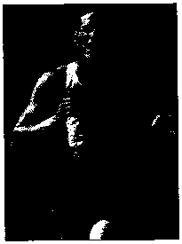

Một vận động viên 3 môn phối hợp chạy vài mét cuối để đến đích. Chương trình tập luyện ô trên cho bạn nếu trải cuộc sống của người đàn ông khác.

Bui

Chạv

Đạp xc

Thứ Hai

1100m

6km

-

Thứ Ba

-

-

24 km

Thứ Tư

160 Om

1 okm

-

Thứ Năm

-

1 okm

24 km

Thứ Sáu

1400m

6km

Thứ Bảy

-

40 km

Chủ Nhật

-

8km

24 km

cứu thậm chí còn đề xuất rằng luyện tập sức bền làm giảm tần suất nghỉ ngơi của tim, có ích cho tim (dù trở bên bền bỉ hơn sẽ không cần thiết phải cải tiến việc luyện tập). ít ra, các huấn luyện viên ngày nay nhận thấy rằng, luyện tập chéo không gây hại. Và đối với toàn bộ việc luyện tập thể hình, thì đây là phương pháp được ưa thích hơn.

Một trong những lợi thế nhất của luyện tập chéo là tỷ lệ đốt cháy mỡ. Tập sức bền và aerobic chung giúp đốt mỡ nhiều hơn là các dạng bài tập khác.

Luyện tập chéo là cơ hội để kết hợp các bài tập hay động tác vào chế độ luyện tập của mình, phù hợp với lịch trình và phong cách sống. Những điều này rat đơn giản. Hãy đi thang bộ ở chỗ làm hơn là đi thang máy và nhổ cỏ dại trong vườn cũng là 2 hoạt động góp phần trong chương trình luyện tập chéo.

THỬ THÁCH CỦA MÔN THE THAO 3 MÔN Pỉlốl HỘP

Vào giữa những năm 1970, một nhóm các vận động viên chạy ở miền Nam California, được truyền cảm hứng từ những huấn luyện cứu đắm ở địa phương, quyết định kết hợp giữa chạy bộ, bơi lội và đạp xe vào trong một chương trình luyện tập. Vậy là môn thể thao 3 môn phôi hợp được hình thành. Một trong những người tiên phong đã đem ý tưởng sang Hawaii, nơi mà ông tổ của cuộc thi 3 môn phối hợp, người thép, được sinh ra bằng cách kết hợp 3 cuộc đua nhừ tử vào thành một bài tập 140 dặm. Thật đáng kinh ngạc, ý tưởng đã được truyền lửa vào hiện nay có khoảng 2,000 cuộc thi 3 môn thể thao phôi hợp được tổ chức đơn thuần ở Mỹ và nhiều nơi trên thế giới.

Quãng đường của mỗi đoạn rất đa dạng và không có một định nghĩa chắc chắn nào cho việc một môn thể thao 3 môn phôi hợp kéo dài bao lâu, dù

dạng thức phổ biến là tiêu chuẩn quốc gia, bao gồm bơi 1500-met, đua xe 40-kilomet, và chạy 10-kilomet. Dù nhiều thử thách tột cùng (nếu không hải là điên rồ) đã diễn ra từ khi phát triển, việc tham gia 3 môn thể thao phối hợp (nhất là cuộc thi Người thép) đã tồn tại như là đỉnh cao thành tựu của các vận động viên.

Khởi đầu môn thể thao 3 môn phối hợp là ở Parana, Brazil từ lúc mới bắt đầu, đến nay đã phất triển và trở nên phổ biến.

PHA TRỘN VÀ HÀI HÒA

Khi bạn đến với bài tập pha trộn và hài hòa, điều gì chi phối sự lựa chọn của bạn? Các vận động viên ưu tú nhất có khuynh hướng tham gia vào các động tác trong bài tập có cùng nhóm cơ bắp được sử dụng trong những môn thể thao hàng đầu.vì thế, ví dụ, một người chạy bộ hàng đầu sẽ luyện tập đạp xe. Nhưng đối với những người đơn thuần như chúng ta, người đơn giản chỉ muốn đưa sự đa dạng vào trong chương trình luyện tập thể hình chung, thì cách tốt nhất là pha trộn những động tác khác nhau.

Mẹo là hài hòa các bài tập mà cân bằng với những bài tập khác, mỗi bài tập sẽ có những lợi thế mà những động tác khác không có. Đó là tất cả mất đề của việc bạn hiểu nghĩa của từ "cân bằng" như thế nào, đây là 3 nguyên lý pha trộn giúp hướng dẫn bạn lựa chọn:

- • Hài hòa kĩ năng với sự lặp lại. Có những dạng bài tập cố định, như là chạy và bơi, bao gồm những động tác quen thuộc và lặp lại trong đó tâm hồn trở nên thư thái. Hài hòa chúng với những môn thể thao khác yêu cầu kĩ năng ở cấp độ cao, sao cho cơ thể và tâm hồn hoàn toàn khác hướng. Những hoạt động đòi hỏi kĩ năng cao bao gồm trượt tuyết, đá banh, đạp xe leo núi, quần vợt sân trường và golf.

- • Hãy kết hợp cứng và mềm. Những môn thể thao có lực va chạm mạnh cao, như chạy và tennis, có thể gây chấn động khớp. Hãy pha trộn trong những môn thể thao ít lạm dụng cơ thể. Ví dụ tốt nhất là đạp xe, bơi và chèo thuyền.

- • Kết hợp trên và dưới, vấn đề lớn nhất đối với chạy và đạp xe là cả hai đều nhắm đến việc hạ thấp cơ thể, nhưng lại không tận dụng phần cơ thể trên. Mục tiêu là làm sao cho cả cơ thê’ cùng hoạt động. Những kết hợp có thê’ bao gồm danh sách bên dưới. Hãy kết hợp bâí kì môn thê’ thao nào ở cột bên tay trái với cột bên phải.

- \- Đi bộ

- \- Chạy bộ

- \- Đạp xe

- \- Trượt tuyết

- \- Bơi lội

- \- Chèo thuyền

- \- Bơi xuồng/xuồng caiac

- \- Tennis

BA CÁCH CHO VIỆC TÂP LITỆN TẬP THE DỤC CVA BẠX TRÔ XÊX THÚ VỊ HƠN

Mặc dù bạn đặt ra hàng loạt dự định hay ho để duy trì được cả khoá tập luyện. Tuy nhiên việc đặt ra kê hoạch luyện tập chiếm phần quan trọng trong suốt một quá trình luyện tập. Những mẹo nhỏ dưới đây sẽ góp phần đạt đến mục tiêu trong quá trình tập luyện của bạn.

- 1\. Hãy viết ra lịch tập luyện của bạn. Ghi lại ngày bạn bắt đầu luyện tập. Việc làm này không chỉ lưu lại việc luyện tập của bạn diễn ra như thế nào mà còn tạo cho bạn sự nỗ lực đê’ đạt được kế hoạch của mình. Bạn không chỉ ghi lại thời gian luyện tập với cường độ như thế nào mà hãy ghi chép lại chi tiết chẳng hạn ghi lại những suy nghĩ của mình trong quá trình luyện tập hay là việc bạn đã cảm thấy mệt mỏi ra sao. Mấu ghi chép này hoàn toàn cho bạn thấy được những việc bạn đã đạt được và những việc bạn chưa làm được, từ đó bạn có thể điều chỉnh chương trình luyện tập để đạt được hiệu quả một cách tối ưu nhất.

- 2\. Mời bạn bè cùng tham gia khoá luyện tập. Tập một mình dễ khiến cho bạn lười biếng và nản chí. Tuy nhiên, việc rủ ai đó như bạn bè, đồng nghiệp cùng luyện tập với mình có thể tạo động lực cho bản thân, khắc sâu tình cảm bạn bè, tạo nguồn cảm hứng, kể cả tính cạnh tranh. Việc tập luyện cùng bạn bè cũng thúc đẩy bạn bởi vì bạn sẽ không muốn bỏ lỡ buổi tập hoặc đến trễ nếu bạn bè của mình đang đợi mình đến tập cùng.

- 3\. Đảm bảo thuận tiện cho chương trình tập luyện. Bạn hây chọn lựa những không gian thích hợp và tiện lợi nhất, ở gần nhà hay gần nơi làm việc của mình chẳng hạn. Việc bạn phải đi càng xa, thậm chí càng nhiều rắc rối phát sinh thì mục tiêu cho việc tập luyện cũng khó mà đạt được.

##### NHŨNG BÀI ĨẬP DÀNH CHO BỤNG

Bạn hãy suy nghĩ thật kĩ: chỉ tập thể dục thôi cũng chưa đủ giảm béo bụng. Bạn cũng cần kết hợp với những bài thể dục nhịp điệu dành riêng cho bụng. Bên cạnh việc làm bụng thon gọn,các bài tập luyện cũng cần thiết gíup bạn khoẻ mạnh bởi lẽ bụng là bộ phận trung tâm đảm nhiệm vai trò di chuyển, vận động của cơ thể.

BẠN CÓ BIẾT?

Những bài thể dục được học ở trường không có công dụng bằng những bài thể dục dành cho bụng. Bởi các bài thể dục ở trường chỉ chú trọng ở phần thắt lưng mà không liên quan nhiều đến phần bụng. Chỉ có hoạt động của phần hông chiếm đa phần trong các bài thể dục này.

PHẦN BỤNG HOẠT ĐỘNG NHƯ THẾ NÀO?

Các bắp thịt ở phần bụng gồm 4 nhóm được xếp thành lớp ở phía trước và cả phía sau cơ thể. Các bắp thịt này rất cần thiết trong việc giữ cho cơ thể vững chắc, cho phép bạn uốn cong người hay gập người trong việc tạo ra những tác động đòn bẩy với những bộ phận khác của cơ thể. Các bắp thịt này cũng hỗ trợ cho xương sống, vì thế các bắp thịt ở bụng làm giá đỡ hỗ trợ cho lưng và hạn chế các cơn đau thắt lưng. Bắp thịt bụng khoẻ mạnh cũng góp phần cho một vóc dáng thẳng, đẹp.

BẮP THIT BỤNG RẮN CHẮC THẬT sự NHƯ THÊ' NÀO?

Việc tập thể dục cho phần bụng sẽ dần làm eo bạn trở nên thon thả, điều đó có đúng không? Sai hoàn toàn. Ta không thể tin hoàn toàn theo như lý thuyết của các bài thể dục. Tập luyện các bài thể dục dành cho bụng sẽ không đô't cháy hết lớp mỡ quanh bụng, dù cho bạn đã sở hữu được các bắp thịt bụng săn chắc và đẹp bên dưới lượng mỡ thừa.

Bụng là bộ phận đầu tiên tích trữ lượng mỡ của cơ thể và lại là bộ phận cuối cùng chuyển hoá năng lượng. Không chỉ do gen di truyền mà dẫn đến việc sở hữu "mấy chiếc bụng bia" mà còn do quá trình họ đã ăn quá nhiều châT béo trong những năm trước đó, bởi vì quá trình trao đổi chất chậm và nhu cầu tiêu hao calo ít lại gắn liền với chế độ dinh dưỡng cũng dẫn đến tình trạng béo bụng.

Để tống khứ cái bụng mỡ béo, bạn cần phải có một chế độ dinh dưỡng đảm bảo sức khoẻ, những bài thể dục nhịp điệu đốt cháy lượng mỡ và một thân hình cơ bắp khoẻ mạnh. Tất nhiên bạn cũng phải duy trì việc luyện tập các bài thể dục dành riêng cho bụng nếu bạn luôn muốn sở hữu thân hình thon gọn, bắp thịt rắn chắc.

KẾ HOẠCH TẬP LUYỆN NHƯ THÊ' NÀO?

Bạn không nhất thiết phải tập hết tất cả các bài tập được mô tả ở phần này, nhưng bạn nên chú ý đến những cơ xiên cũng như các cơ bắp phần bụng. Cũng cần xác định các bắp bụng được mô tả thông qua việc xem các minh hoạ như "các bắp thịt bụng nằm ở đâu". Khí luyện tập thể dục bạn nên nhớ phải dùng đệm để tránh chấn thượng phần lưng.

LỊCH LUYỆN TẬP

Khi bạn luyện tập các bài thể dục dành cho phần bụng, bạn sẽ thấy được những cơ bắp này.

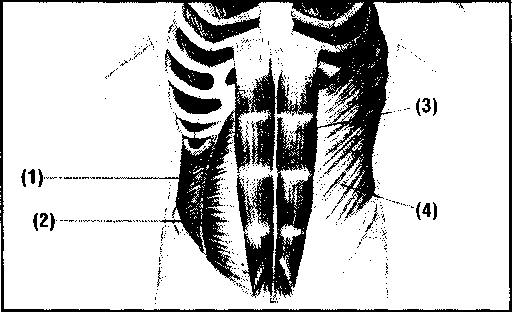

- 1\. Các cơ xiên ở bên trong

Cơ xiên bẽn trong nằm ngay bên dưới của các cơ xiên bên ngoài, liên kết bốn xương sườn nằm ở cuối với khung xương chậu. Các cơ xiên cũng giúp bạn có thể uốn cong người, theo sự di chuyển của các cơ xiên bên trong.

- 2\. Các ctf bụng ngang

Các cơ ngang này nằm bên dưới các cơ bụng thẳng, tạo nên một phiến cơ chạy dọc thành bụng, hỗ trợ cho các cơ quan bên trong.

- 3\. Các cơ bụng dgc

Phần cơ này nằm ồ dưới phẩn ngực và chạy dọc xuôhg phẩn khung xương chậu. Chính những cơ bụng này mới liên quan đến khái niệm “cơ bụng”, bởi vì khi các cơ này săn chắc, vùng bụng mới thật sự thon gọn.

- 4\. Các cơ xiẽn bẽn ngoài

Các cơ này chạy xuống theo các hướng cơ thể giữa phần ngực và phần xương chậu. Phần cơ này làm việc ngược lại với những phán cơ khác (một phần cơ thể bạn nghỉ ngơi, phần khác lại phải hoạt động), các cơ xiên cho phép cơ thể uốn cong người và giúp cho quá trình trao đổi châ't.

NHỮNG BẮP THỊT BỤNG NAM ở dâu?

Các cơ bụng nằm giữa những phần cơ bắp khác của cơ thể phải hoạt động mỗi ngày dù phần bụng được cho là quan trọng nhất.

Các cơ bụng có thể sẽ khoẻ hơn, dẻo dai hơn khi ta nâng số fân lặp lại của động tác nhằm tăng cường sức khoẻ và sự dẻo dai. Bạn hây duy trì số nhịp mỗi lần tập và cố gắng tăng số nhịp lên 10 % mỗi tuần, bạn hãy cố gắng tập hết sức.

Khi bắt đầu các bài thể dục, bạn hãy cố gắng làm nóng các phần cơ chủ yếu. Bạn cũng nên sáng tạo ra một lịch tập dành riêng cho mình, sau đây sẽ là một ví dụ. Chẳng hạn: thứ 2, thứ 4 vằ thứ 6 bạn tập các bài tập thắt chặt người và tay không trong khi thứ 3, thứ 5, thứ 7 bạn luyện tập các bài tập cho phần cơ xiên và nghỉ ngơi vào Chủ nhật.

Các cơ bụng chia ra phần trên và phần dưới là một quan niệm không đúng. Các cơ bụng thẳng đứng là phần cơ bắp nhỏ. Tuy nhiên, bạn hoàn toàn có thể lựa chọn những bài thể dục có tác dụng cho vùng trên lẫn dưới của phần cơ này.

Ví dụ, các bài tập vặn người tác động từ 90 đến 100 % đến phần dưới của cơ bụng, trong khi đó các bài tập nhấc hông có tác dụng ồ mức 30%. Tuy nhiên, khi ta đặt mục tiêu cho phần bụng dưới, chỉ số này hầu như đổi ngược lại

###### CÁC BÀI TẬP THẮT CHẶT NGƯỜI ctf BẢN

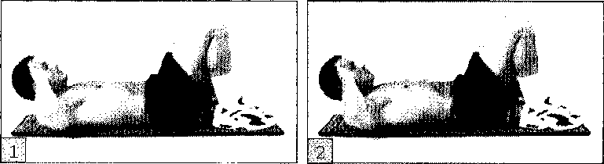

1\. Đặt lưng nằm thẳng, đặt tay lên vùng thái dương hoặc đặt tay sau tai (chú ý không ôm lấy hần sau cổ), cũng có thể đan chéo hai tay và đặt trước ngực. Đặt đầu của bạn cách mặt đệm vài cen-ti-met, cằm gập hướng về phía trước. Duỗi thẳng chân, kế đó bạn nâng từng chân một lên khoảng 15 cen-tĩ-met sao cho tại đầu gối tạo thành góc 45 độ (giữ cho phần cẳng chân có khoảng cách không đáng kể)

2\. Nhẹ nhàng đẩy lưng của bạn, từ từ uốn thân dưới của bạn hướng về phía đầu gốì, nâng phần xương bả vai của bạn lên( chú ý không vẫn giữ cho lưng nằm yên. Giữ yên khoảng một giây. Đưa trở về tư thế ban đầu, bạn chú ý không được ngừng lại giữa mỗi nhịp.Bạn hãy cố gắng tập hết sức mình, hoặc bạn lặp lại nhiều lần, mỗi lần khoảng 10 nhịp.

/'’j'N Bạn không cần phải nín thở. Hãy thở ra khi khi bạn thắt chặt người về phía trước, hít vào khi bạn đưti tư thế trở lại ban đầu.

###### CÁC BÀI TẬP TAY KHÔNG

Việc bạn hóp bụng lại một phần nào đó tác động đến phần bụng của bạn nếu như bạn thực hiện có phương pháp.

1\. Ngồi bằng đầu gối, gập chân ra phía sau và đặt tay lên hông hay đùi. Giữ cho phần dưới cơ thể thẳng đứng , hít thật sâu

2\. Hóp bụng vào và thở ra liên tục. Giữ lại trong năm giây rồi lặp lại. Hít thở bình thường, tiếp tục lặp lại. Thực hiện 2 hoặc 3 lần động tác này, mỗi lần 10 nhịp.

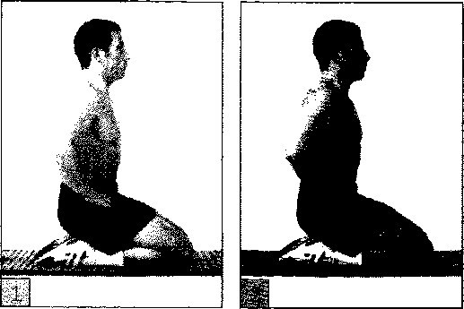

###### CÁC BÀI TẬP CUỘN NGÙỪI

Tác động tới phần dưới của cơ bụng

1\. Bạn đặt lưng trên tâm đệm, áp hai lòng bàn tay vào đầu, nâng đầu cao hơn so với phần lưng. Nâng phần cẳng chân lên sao cho phần đùi tạo với tấm đệm góc 90 độ. Đây là tư thế bắt đầu

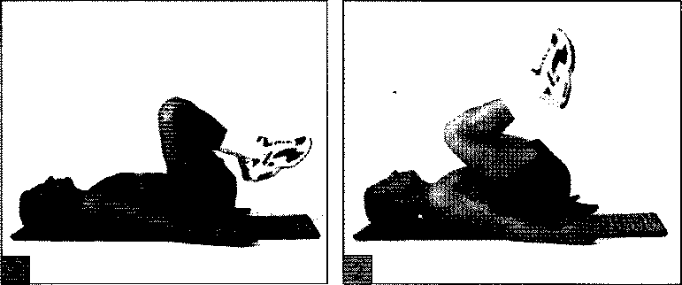

2\. Đẩy đầu gối hướng về phía ngực, từ từ đưa chúng trở về tư thế ban đầu. Bạn cố gắng điều chỉnh tư thế của mình. Bạn nên dùng các cơ ở phần bụng dưới trong bài luyện tập này, vì thế hãy cố gắng sử dụng sức đà. Hãy nhớ rằng bạn phải thở ra khi cuộn đầu gối về phía mình và hít vào khi đưa đầu gối trở về tư thế ban đầu.

###### NHỮNG BÀI TẬP UỐN CONG CÁC ctf XIÊN

1\. Đứng dang chân rộng bằng vai, hướng mặl xuống hông, chùng đầu gối. Cầm một thanh dài đặt phía sau cổ ngang vai và nhớ giữ chặt thanh này.

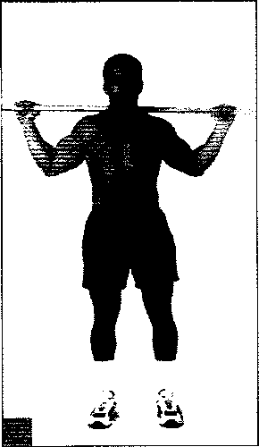

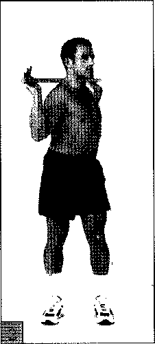

2\. Giữ cho hông của bạn không cử động và mặt hướng về phía hông, nhẹ nhàng uốn thật cong người qua bên trái , quay về tư thế ban đầu tiếp tục thực hiện động tác như vậy về bên phía tay phải, lặp lại động tác như thế với tốc độ chậm rãi và ổn định.

Bài thể dục này có thể luyện tập cho phần dưới của lưng, bạn Niz phải đảm bảo được việc chuyển dộng thật chậm rãi và điều khiển phần hông của mình trong cả bài thể dục

###### CÁC BÀI TẬP UỐN CHÉO NGưừl

1\. Tư thế chuẩn bị tương tự như bài tập thắt người cơ bản: nằm chân duỗi thẳng trên sàn hay đệm, đầu gối gập lại 45 độ. Nếu bạn đan chéo tay đặt trước ngực, hãy cố gắng đặt tay của bạn lên trán hay khum lại ở phía sau tai, đặt khuỷ tay hướng về phía đầu bạn. Nâng nhẹ phần vai của bạn lên khỏi sàn, cuộn cơ thể của bạn hướng về phía đầu gổì.

2\. Nhẹ nhàng cuộn thân của bạn sao cho khuỷu tay bên trái chạm đầy gốì bên phải. Giữ khoảng một giây, trở về tư thế ban đầu (không để

các CƠ bụng được nghỉ), cứ lặp lại tương tự như vậy với việc cho

khuỷu tay bên trái chạm với đầu gốì bên phải. Bạn cứ tiếp tục tập luyên như vậy cho đến khi bạn thấy thật sự mệt và không thể thực hiện thêm được nữa, hoặc bạn cũng có thể lặp lại nhiều lần mỗi làn 10 nhịp.

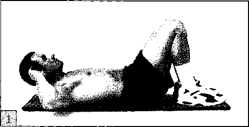

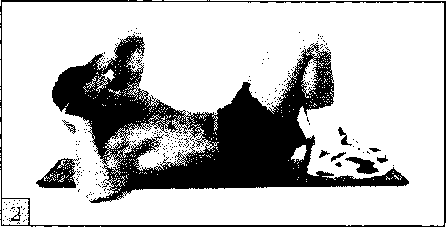

###### CÁC BÀI TẬP CHO KHUỶU TAY BẰNG TẠ

Khi kết hợp thêm sức nặng, bạn sẽ khó di chuyển các cơ của mình hơn so với các bài tập dành cho cơ xiên - đây là cách tăng cường tốt cho các khoá tập luyện cao hơn, nhưng hầu hết phần này thường dành cho phái mạnh.

- 1\. Đứng dang chân rộng bằng vai, hai cổ tay giữ chặt tạ hướng vào nhau. Theo lý thuyết các bài tập cử tạ nhẹ phải kết hợp với số lần lặp lại nhiều hơn (từ 12 đến 20 lần) còn các bài tập cử tạ nặng nên kết hợp với số lần lặp lại tương đối ít.

- 2\. Chú ý giữ cho cơ thể luôn thẳng đứng, nhẹ nhàng đưa người chuyển động sang bên phải, đưa tạ hướng xuổhg cẳng chân cho đến khi bạn cảm thấy phần cơ xiên bên trái của bạn đang hoạt động. Đừng để cho thân người của bạn bị uốn cong theo hướng của khuỷ tay. Bạn chầm chậm quay trở về trạng thái ban đầu, hãy lặp lại liên tục như vậy theo phía bên phải như trên, chú ý bạn không được nghỉ ở giữa các lần lặp lại. Bạn cũng làm tương tự như vậy đôi với phía bên trái.

  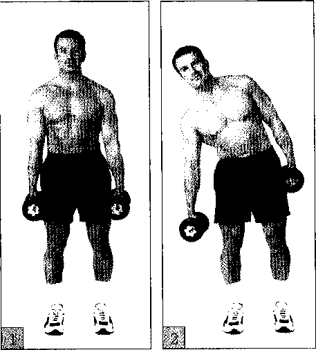

###### CÁC BÀI TẬP THẮT CHẶT PHẦN cư XIÊN

Phần bài tập này bổ trự cho việc có được những cơ xiên

- 1\. Đặt lưng nằm thẳng, đặt tay lên thái dương hoặc khum lại sau tai. Đưa cẳng chân qua phía bên phải. Giữ nguyên phần thân người ở phía trên trong khi phần thân người dưới hướng qua bên phải.

- 2\. Nếu có thể, hãy giữ cho hai bên vai song song với nhau, nâng xương bả vai lên. (chú ý đừng hướng khuỷu tay về phía đầu gối). Giữ nguyên động tác này trong 1 giây, đưa cơ thể trở về vị trí ban đầu. Thực hiện động tác 10 đến 20 lần, sau đó tiếp tục thực hiện động tác với bên còn lại. Bạn nên thực hiện nhiều lần động tác này nếu có thể.

  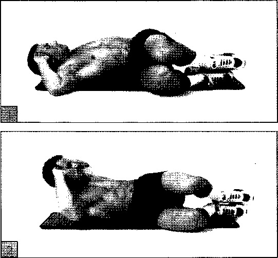

###### BÀI TẬP NÂNG ĐẦUGÔÌ

1\. Nằm duỗi thẳng chân, hai long bàn tay úp xuông mặt sàn. Giữ chặt một phần lưng của bạn rồi nhẹ nhàng nâng gót chân của bạn lên khoảng 75 mi-li-met.

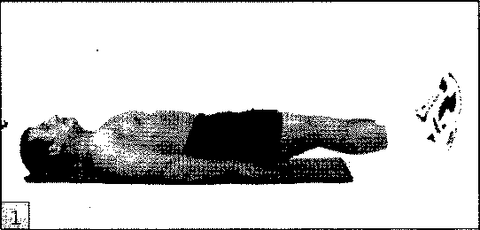

2\. Nâng đầu gốì phía bên phải hướng về phần ngực, giữ nguyên cẳng chân trái của bạn thật cao và thẳng. Giữ nguyên tư thế như vậy trong 1 giây rồi duỗi thẳng đầu gối bên phải ra trở về vị trí ban đầu và lại lặp lại với đầu gốì bên trái. Hãy cố gắng thực hiện các động tác nhiều đến mức có thể, hoặc thực hiện 5 lần lặp lại cho mỗi bên, mỗi lần 5 đến 10 nhịp.

Zjp\ Bạn không thể thực hiện tốt động tác này nếu sông lưng của XÃ/ bạn yếu.

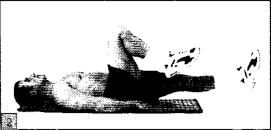

###### CÁC BÀI TẬP NGỒI BẰNG LÚầlG

Bài tập này có tác dụng tới các cơ bắp theo cách khác:

- 1\. Ngồi trên sàn nhà, uốn cong đầu gối và duỗi thẳng bàn chân, vai rộng bằng chân. Đặt các ngón tay lên đầu gối, các ngón tay đan xen lẫn nhau, mặt hướng về phía đầu gối. Ngửa nhẹ người ra sau tạo với sàn nhà một góc 90 độ.

  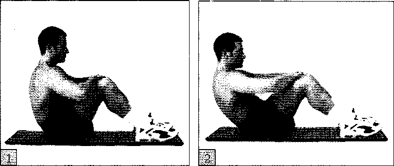

- 2\. Hạ thấp thân người của bạn về phía sàn nhà, cuộn phần thân người dưới. Khi thân người của bạn tạo với sàn nhà một góc 45 độ, trở về vị trí ban đầu. Thực hiện lại bài tập này 2 lần, mỗi lần 10 nhịp.

###### CÁC BÀI TẬP CHO CHÂN

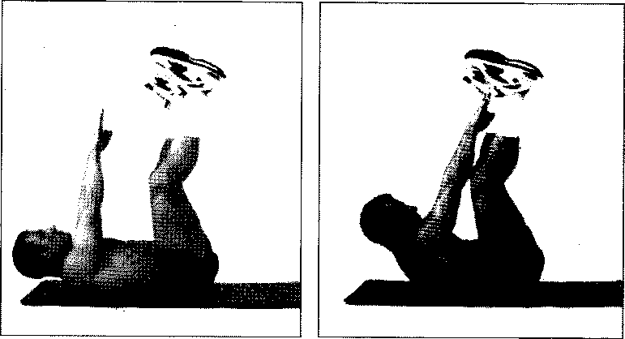

- 1\. Đặt tư thế nằm yên trên sàn nhà, chân duỗi thẳng theo hình chữ "V" hướng lên trần nhà, đầu gối chùng lại.

- 2\. Hướng hai tay lên phía trần nhà, nhấc bả vai lên, tay duỗi thẳng hướng về phía chân phải. Giữ nguyên tư thế trong vòng 1 giây rồi đưa tư thế trở về vị trí ban đầu, giữ cho phần bụng của bạn co lại. Đưa tay hướng về phía chân trái. Lặp lại 5 đến 10 lần mỗi chân, sau đó lặp lại thêm 1 hay 2 lần nữa.

###### CÁC BÀI TẬP CUỘN CHÂN

Đặt tư thế nằm thẳng, gập đầu gối lại và hạ thấp cẳng chân xuống tựa vào ghế dài hay ghế đệm bành. Đặt đùi tạo với đệm một góc 90 độ. Nghiêng đầu 1 góc 45 độ và đặt tay ra trước vùng thái dương hay khum ở sau tai. Đây là tư thế bắt đầu. Bạn nhẹ nhàng cuộn người về phía trước phôi hợp với thở ra, kế đó từ từ đưa cơ thể trở về trạng thái ban đầu kết hợp với hít vào. Cứ lặp lại như vậy, hãy nhớ rằng không được ngừng lại trong những lần lặp lại.

/'j'S Chứ ý không được căng cổ trong quá trình gập người, bạn sẽ dễ bị thương ở vùng cổ kể cả phần thắt hữig.

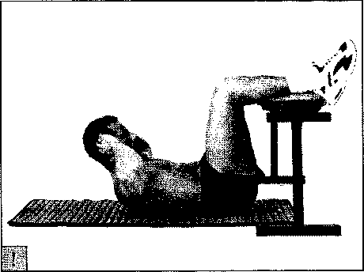

###### CÁC BÀI TẬP THẮT CHẶT NGƯÒTl KẾT Hựp vóì GHẾ DÀI

Bài tập tác động đến các cơ của vùng bụng.

1\. Ngồi ngay dưới chân ghế và đặt chân duỗi thẳng trên sàn nhà, đưa tay vịn vào ghế. Ngả người khoảng 45 độ rồi nâng chân lên cách mặt đất vài cen-ti-met, giữ cho đầu gối hơi gập lại.

2\. Giữ phần thân dưới thẳng đứng, nâng đầu gối hướng về phần ngực. Giữ nguyên tư thế trong 1 giây rồi trở về vị trí ban đầu. Thực hiện lại động tác 2 lần, mỗi lần 10 nhịp.

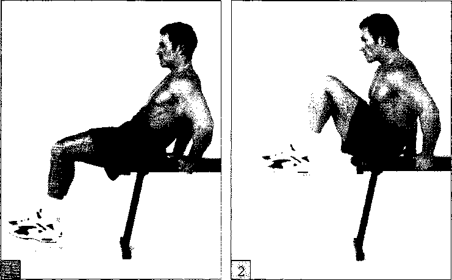

##### THỜ! GIAN NGHÍNGtíl rò Hồ! PHỤC

•

ít người biết đến một sự thật rằng việc trở nên khoẻ mạnh hơn không phụ thuộc hoàn toàn vào việc luyện tập thể dục. Điều này là hoàn toàn đúng: ngồi trên ghế sofa, nằm trên giường hay thực hiện những hoạt động nhẹ nhàng, bình thường cũng quan trọng như việc luyện tập. Đây được xem là quá trình nghỉ ngơi và hồi phục, nếu như ta không thực hiện quá trình này, các cơ bắp được luyện tập cũng không thể trở nên dẻo dai hơn, khoẻ mạnh hơn được.

TẠI SAO THỜI GIAN NGHỈ NGOI LẠI RẤT QUAN TRỌNG?

Đa phần trong chúng ta ai cũng có quan niệm sai lầm rằng cơ bắp của mình sẽ trở nên khoẻ hơn, dẻo dai hơn và làm việc có hiệu quả hơn khi chúng ta thực hiện những động tác với cường độ mạnh; chẳng hạn, đi xe đạp, bơi lội hay cử tạ. Tương tự như vậy, chúng ta sẽ cảm thấy rằng việc các cơ bắp sẽ trở nên yếu hơn nếu như chúng ta không luyện tập.

Tuy nhiên thực tế lại hoàn toàn khác, các bài tập thể dục cũng chính là những tác nhân khiến cơ thể của chúng ta mệt mỏi và yếu dần đi. Quá trình nghỉ ngơi và phục hồi mới thật sự là phương thuốc giúp cho các cơ được phục hồi và khoẻ mạnh hơn, nhờ vào khả năng tự hồi phục lại các mô bị tổn thương của cơ thể đảm bảo cho cơ thể được khoẻ mạnh hơn.

Đa phần các vận động viên danh tiếng hàng đầu đều rất chú trọng đến thời gian nghỉ ngơi. Họ có hẳn một lịch trình luyện tập rõ ràng được các bác sĩ và huấn luyện viên theo dõi sít xao về vấh đề luyện tập quá mức hay một triệu chứng bất kì nào đó khi các cơ bắp của họ cứ liên tục bị mệt mỏi, co cứng so với khả năng tập luyện cúa họ, ảnh hưởng đến việc biểu diễn trong vài tuần, thậm chí cả hàng mấy tháng ròng. Việc đặt ra một lịch trình nghỉ ngơi cụ thể thật sư quan trọng, đặc biệt đối với những ai đang tập luyện quá sức. Một khoảng thời gian nghỉ ngơi cũng có thể làm các cơ bắp phục hồi lại.

Việc tập luyện quá sức thường diễn ra khi bạn mới bắt đầu một khoá tập luyện quá sức chịu đựng hoặc cũng có thể bạn đột ngột nâng mức độ tập luyện của khoá tập luyện lên. Để đạt được mục đích của bản thân, bạn nên đặt ra việc tập luyện sao cho vừa với sức của các cơ bắp, không vượt quá sức chịu đựng. Nếu bạn luyện tập quá sức sẽ dễ dẫn đến cơn đau, mệt lử, mất khả năng vận động tạm thời, thậm chí là nguy cơ tàn tật suốt đời.

###### VẬY CÓ NÊN NGHỈ NGƠI QUÁ NHIỀU HAY KHÔNG?

Một số người cho rằng việc nghỉ ngơi quá nhiều sẽ gây ra nhiều nguy cơ và mất đi mức độ đã tập luyện trước đó. Thực tế không bác bỏ nhận định này, ai cũng biết điều gì quá nhiều cũng đều không tốt. Chẳng hạn, vận động viên lâu năm phải luyện tập 3 đến 4 giờ mỗi ngày cũng không thể cải thiện thành tích nhanh hơn so với những vận động viên mới tập với cường độ 1 đến 1,5 giờ đồng hồ mỗi ngày.

Với những cuộc nghiên cứu khác, khi các vận động viên bơi lội và điền kinh cắt giảm đi 60% giờ luyện tập, họ vẫn không hề mất đi sự dẻo dai thậm chí sau cả 3 tuần. Với các huấn luyện viên cử tạ ngừng lịch luyện tập, họ vẫn có thể bắt đầu lại mức độ họ từng đạt được trong vòng thời gian một tháng trở lại.

BỐN CÁCH CÂN BẰNG CHƯƠNG TRÌNH TẬP LUYỆN VỚI THỜI GIAN NGHỈ NGƠI

Việc kết hợp các bài tập thể dục (không quá nhiều) với thời gian nghỉ ngơi (hợp lý) cần phải có khoa học. Phần lớn đều phụ thuộc vào nỗ lực của bạn. Dưới đây là một sô lời chỉ dẫn:

- 1\. Bạn nên ghi chép lại khi bắt đầu việc luyện tập. Mặc dù các cơ bắp phải hoạt động tuy nhiên với các hoạt động cường độ quá mạnh cũng dễ làm các cơ này bị thương. Khi bắt đầu một kế hoạch luyện tập trong vòng 6 tháng hay dài

• hơn, tốt hơn hết bạn nên tập luyện ít hơn kế hoạch bạn đặt ra. Bạn hãy tăng cường độ cỏa việc tập luyện lên không quá 10% mỗi tuần, cho dù về mặt tốc độ, khoảng cách, chương trình, sức đề kháng, hoặc đại diện

- 2\. Bạn cũng cân đặt ra thời gian nghỉ ngơi cho suốt quá trình tập luyện. Việc làm này giúp các cơ giải toả mệt mỏi và tiếp tục hoạt động để đem lại kết quả tốt nhất. Việc đặt ra thời gian nghỉ ngơi cho quá trình luyện tập là hoàn toàn hợp lý. Thông qua mục tiêu của bản thân, bạn hãy đa dạng hoá các giờ giải lao.

- 3\. Hãy cho các cơ bắp của bạn được luyện tập sau một tuần làm việc mệt nhọc. Suốt chương trình tập luyện khắc nghiệt của mình, bạn hãy cho phép các cơ bắp vừa mới luyện tập 48 giờ nghỉ ngơi để hồi phục trước khi bắt đầu luyện tập trd lại, đặc biệt đối với những bài tập cũ. Tuy nhiên bạn cũng nên có những vận động nhẹ. Vận động viên cử tạ thường có lịch tập luyện xen kẽ, chẳng hạn họ tập luyện phần thân trên vào ngày đầu và phần thân dưới cơ thê’ vào ngày tiếp theo. Đây chính là chiến lược cho các chương trình luyện tập hàng ngày đáp ứng đủ thời gian phục hồi cho từng nhóm cơ.

- 4\. Hây thực hiện sự phục hồi hoạt động. Một cách khác chính để duy trì cử động là thực hiện những hoạt động nhẹ vào ngày nghỉ, dặc biệt bạn có thể đi bộ sau những ngày tập đạp xe trước đó. Có lẽ cách nghỉ ngơi tích cực cũng đem lại những tác động tích cực cho việc giảm các cơn đau bằng việc loại bỏ các chất có hại ra khỏi cơ bắp.

##### SẢO vệ cơ THỂ TRÁNH CÁC CHẤN THƯƠNG

Nếu bạn tuân theo những quy tắc an toàn cơ bản, bạn có thể hạn chế được hầu hết các chân thương, đảm bảo tình trạng sức khoẻ tốt và lường trước những rắc rốì dễ xảy ra. Thậm chí, những vết thương rất nhỏ cũng có thể để lại di chứng kéo dài hàng năm, cũng có thể hàng chục năm. Sau đây là một số cách giúp bạn tránh một số rắc rối.

(\> ......................................................... ....... ...........

“Bạn không nên chơi các môn thể thao để được đẹp hơn, bạn sẽ đẹp hơn khi chơi những môn thể thao này. Luyện tập theo lý thuyết của những môn thể thao này bạn sẽ hạn chế bị chấn thương”.

Theo ông Edward R. Laskowski- giám đốc bệnh viện trung tâm y tế thể thao Mayo ồ thành phố Rochester bang Minnesota

LÀM CÁCH NÀO đê’ tránh bị thương

Phải tập luyện các bài tập theo trật tự, tuân theo thứ tự của bài tập sẽ giúp bạn hình thành được nội dung và dần đi vào quá trình luyện tập.

- • Quá trình tập từ từ. Những ai không tập luyện nhiều sẽ dễ bị chấn thương hơn.

- • Hãy khởi động. Quá trình khởi động không chỉ giúp các cơ bắp uyển chuyển mà còn hạn chế các trường hợp rách cơ, khởi động giúp bôi trơn các khớp xương và cải thiện khả năng của các tế bào cơ để thực hiện quá trình chuyển hoá oxy thành năng lượng.

- • Hãy duỗi thẳng người. Thao tác này giúp tăng sức dẻo dai, giảm đi nguy cơ bị chân thương.

- • Hãy sử dụng các phụ kiện bảo vệ.

- • Bạn nên làm theo hướng dẫn của các chuyên gia. Bạn có thể áp dụng hết tất cả, tuy nhiên bạn hãy luôn cố gắng luyện tập theo hướng dẫn của huấn luyện viên hoặc các phương tiện cung cấp thông tin trước một khoá tập luyện mới.

- • Bạn hãy để ý đến những cơn đau. Đó là dấu hiệu của việc tập luyện sai.

KHI NÀO GẶP BÁC sĩ, KHI NÀO Tự MÌNH CHỮA TRỊ

Có những lúc trong cuộc sống của hầu hết các vận động viên có những việc sai lầm nghiêm trọng. Hình minh họa cho thấy một số dấu hiệu của chấn thương nghiêm trọng trong một lựa chọn của nhiều bộ phận dễ bị tổn thương của cơ thể. Nếu như bạn có những cơn đau hay những bất ổn nghi ngờ có liên quan đến chấn thương do chơi thể thao, bạn nên đến bác sĩ đa khoa.

Nhưng bạn cũng không cần phải nằm viện. Các cơ bắp đau nhức vì áp suất của sự lưu thông máu và các chất lưu. Đê’ cầm máu, bạn hãy dùng vỏ trấu, đá lạnh hoặc nén chặt lại rồi nâng cao phần bị thương.

• Thả lỏng vùng bị thương, để giảm sự lưu thông máu và tạo điều kiện cho các mô bị tổn thương được lành.

\\* Làm lạnh vùng bị đau để làm các mạch máu co lại và làm giảm cơn đau. Tuy nhiên tránh cho đá tiếp xúc trực tiếp với vùng da bi thương và hạn chế việc chườm đá liên tục trong suốt 20 phút để giảm nguy cơ bị hoại tử.

• Dùng gạc băng thật chặt vùng bị thương, nhằm nén các mạch máu lại và giảm sưng phồng.

Nâng vùng bị chấn thương cao hơn tim để giảm lượng máu chảy ra và tăng lượng chất lưu chảy ra ngoài.

Đô'i vơi chấn thương phẩn đầu. Một cú va đập mạnh vào đầu có thể gây ra tinh trạng không giữ được thăng bằng hay bất tỉnh, thậm chí ngất xỉu trong một khoảng thời gian, đều là những dấu hiệu của chấn động. Các cảnh báo như choáng váng, rối loạn, đau đầu, buồn nôn, tinh trạng buồn nôn hay mệt lử.

Đối với phẩn vai. Vai bạn sẽ cảm thấy mỏi rã rờl, bạn cũng không thể cử động vai của mình hay nhấc tay lên đẩu. Nó có thể là bị trật khớp.

Khuỷu tay. Tình trạng tê liệt dai dẳng hoặc ngứa ran xảy ra ở phần khuỷu tay nhạy cảm với tác động bên ngoài cho thấy sự tổn thương thẩn kinh. Nếu bạn phát hiện thấy mụn thịt nhỏ nhô ra từ khuỷu tay, bạn có thể mắc chứng viêm túi thanh mạc.

Lưng. Đau tỏa xuống dưới đầu gối, hoặc đi kèm với sự tê cứng, cảm giác khó chịu hoặc mất kiểm soát cơ thể cũng có thể là một biểu hiện về vấn đế thần kinh.

Đầu gôì. Không thể dang rộng hay co gập đầu có thể báo hiệu một phần xương hay sụn lỏng lẻo.

GIỮ CHO NHIỆT ĐỘ CỦA BẠN ĐƯỢC ÔN ĐỊNH

Việc duy trì thân nhiệt bình thường của cơ thể trong lúc tập luyện cũng là một mối quan tâm. Ta lại tiếp tục suy nghĩ vấn đề này. Việc giảm khả năng điều chỉnh nhiệt độ bên trong cơ thể cũng là một dạng của chấn thương, cũng có thể đe doạ đến các chức năng khác của cơ thể. Dưới đây là cách điều chỉnh nhiệt độ trong điều kiện khắc nghiệt:

###### BỊ RÉT LẠNH

Nhiệt độ cơ thể thấp cũng đe doạ đến các chức năng điều chỉnh cần thiết của cơ thể chẳng hạn như nhịp tim hay sự trao đổi chất.

Sự giảm nhiệt cũng tương tự như việc bạn bị cảm lạnh khiến bạn nhanh chóng mất đi lượng nhiệt của cơ thể. Muốn bảo vệ cơ thê’ bạn nên mặc quần áo hút ẩm. Nếu bạn thật sự mệt mỏi, hãy nhanh chóng vào nhà bởi vì khả năng tăng nhiệt cho cơ thê’ sẽ xuống rất nhanh và bạn sẽ cảm thấy co cứng.

###### TRONG VÙNG NHIỆT

Khi trời nóng, các cơ bắp và làn da sẽ thiếu các chất lưu cần thiết cho sự điều chỉnh nhiệt độ và tiết mồ hôi. Tránh tình trạng mệt lả do quá nóng chính là vấn đề làm sao để không bị tăng thân nhiệt trong lúc phải hoạt động nhiều. Vậy nên bạn hãy thực hiện những hoạt động có cường độ mạnh trước 8 giờ sáng và sau 6 giờ chiều đối với những ngày nắng nóng, mặc quần áo rộng, mát mẻ và uống thật nhiều nước. Hãy thận trọng với những dấu hiệu cảnh báo như sởn gai ốc, tình trạng mê sảng kê’ cả chứng chuột rút.

CÁC CÁCH GIẢM ĐAU HIỆU QUẢ NHẤT

Tất nhiên phòng bệnh luôn tốt hơn chữa bệnh, nhưng đôi khi cũng cần phải dùng đến các biện pháp giảm đau.

Đối với những người chơi thê’ thao, thuốc giảm đau Nurofen luôn là lựa chọn hàng đầu, chát thuốc kháng viêm làm giảm sưng phồng và những cơn đau. Thuốc giảm đau và hạ sốt paracetamol lại có tác dụng theo hướng khác, thuốc này thực hiện quá trình giảm đau bằng việc truyền các kích thích lên não nhưng lại không giảm viêm bao nhiêu.

Lựa chọn thứ hai chính là thuốc giảm đau aspirin. Thuốc này yếu hơn thuốc giảm đau Nurofen, nhưng lại có thành phần kháng viêm. Tuy nhiên hãy cẩn thận. Thuốc giảm đau sẽ tác động xấu đến dạ dày và cản trở sự lưu thông máu, vì thế không nên lạm dụng. Bạn nên hỏi ý kiến bác sĩ khi sử dụng những loại thuốc này, và không thích hợp khi dùng thuốc trong thê thao.

###### \*

###### \\* \*

LƠI ích cúa massage

Nhiều vận động viên nói rằng massage không những giúp tránh mà còn phục hồi chấn thương, bằng cách thư giãn cơ bắp vằ loại bỏ các chất thải. Chưa có bằng chứng khoa học đầy đủ cho những công bố- kết quả của bất kỳ việc điều trị đúng đắn nào cũng không là thước đo vượt quá được thực tế là người đã thực hiện massage cho rằng nó làm cho họ cảm thấy tốt hơn. Nhưng ai có thể bàn cãi điều đó? Dưới đây là một sô kỹ thuật tự massage đơn giản cho một số khu vực đặc biệt dễ bị đau nhức hay cứng cơ:

- • Cổ và vai. Đặt tay phải vào vai phải của bạn. Đặt tay vào bắp thịt dày tại vai bạn, nghiêng đầu của bạn ra khỏi bàn tay trong khi kéo ngón tay về phía vai phải. Đê’ mát xa vai, bấm và ép sát vào cơ ở đầu vai, đung đưa ngón tay qua lại. Lặp lại ở phía bên kia.

- • Đùi. Ngồi trên sàn nhà hoặc trên một chiếc chiếu, sử dụng cả heli tay để xoa, bóp, và rung các cơ ở đầu của một chân của bạn để thả lỏng chúng. Sau đó đặt một tay lên mỗi bên đùi sao cho ngón tay cái tiếp xúc các đầu ngón chân. Nhấn xuống hơi mạnh cùng với ngón tay cái, đẩy chúng dọc theo đùi của bạn về phía đầu gối. Lặp lại với chân kia.

- • Gân kheo. Ngồi đối diện một bức tường với một chân gác lên tường. Thả lỏng phía dưới chân đó bằng cách xoa và bóp, sau đó nằm xuống, co đầu gối bên phải và chân phải chạm sàn. Đê’ mắt cá chân trái của bạn lên đầu gối bên phải, đặt hai tay lên chân trái và ấn xuống đồng thời những ngón tay cong xuống đê’ những ngón tay tiếp xúc với nhau. Trượt ngón tay xuống phía dưới.

  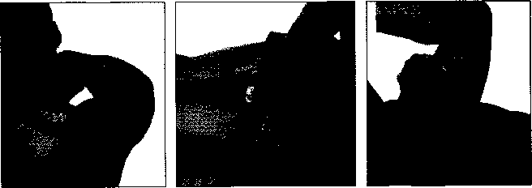

LÀM SAO ĐỂ KIỂM soát sự ĐAU ĐỚN - CÁCH Tự DO

....... ■ ............................,..............................................................................................................-------------'

Các bài tập liên quan đến tốc độ, sự cân bằng, chuyên động tác động cao, nâng hạng nặng, hoặc sự kết hợp của các yếu tố này, dẫn đến tỷ lệ chấn thương cao nhất, nhưng nhờ những dụng cụ tập luyện phù hợp, những cơn đau và các vấn đề có thể tránh được. Dưới đây là những gì bạn cần

CHẠY

Vấn đề: Tác động cao, đáp xuống một chân với toàn bộ trọng lượng cơ thể, có thể tác động mạnh các cơ, gân, và các khớp xương.

Giải pháp:

- • Đi bộ một chút, kết hợp đi bộ với chạy, đặc biệt là trong những tuần đầu của một quá trình tập luyện, cho phép cơ thể quen với chạy nhiều.

- • Hãy mang giày thể thao chuyên để chạy bộ. Chạy là một trong số ít những môn thể thao mà bắt buộc đòi hỏi giày thể thao cụ thể để làm giảm bớt tác động và giúp những bước chạy êm hơn.

- • Hãy dùng đến phần mềm và cả phần đế. Đối với loại đường ghồ ghề, dốc, nhiều hố, và vòng xoắn thường khiến bạn bong gân và gây xương.

- • Hãy thực hiện các bước chạy ngắn. Một sải chân quá dài dễ làm dãn cơ và gần quá mức và làm chậm tốc độ của bạn, bởi vì tác dụng phanh khi đầu bàn chân chạm đất.

  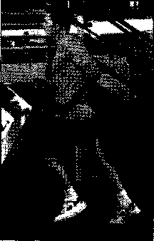

- • Thư giãn. Kiểu chạy với tâm trạng căng thẳng, khép kín, nắm chặt bàn tay có thể bị chuột rút cơ bắp của bạn. Kiểu thả lỏng thì dễ dàng duy trì hơn, và cũng có thể nhanh hơn.

Loại bỏ mỏi cơ bằng cách áp dụng một kiểu chạy thả lỏng.

ĐI XE ĐẠP

Vấn đề: Tai nạn và các rủi ro đi xe đạp ngoài trời liên quan đến chấn thương đầu có thể gây chết người, cả việc đi xe đạp ngoài trời và trong nhà đều ảnh hưởng đến lưng và đầu gối.

Giải pháp:

- • Luôn luôn đội mũ bảo hiểm - đó là bảo vệ rẻ tiền và cần thiết. Đê’ tránh tai nạn, dây giày an toàn, áo khoác ngoài, và túi xách luôn để cách xa nan hoa và dây xích, hãy cẩn thận với người lái xe khi họ mở cửa xe và những trở ngại khác, và giữ tốc độ của xe trong khả năng của bạn.

- • Lưu giữ các hộp số khi bạn có tốc độ đạt được đủ tốc độ. Hãy cố gắng chạy chậm hơn tốc độ đó để cho đầu gối ít bị chấn thương do quá mức.

  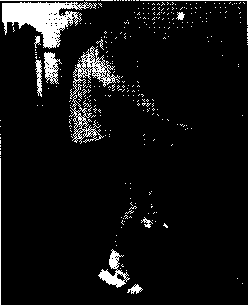

- • Hãy nhờ một thợ sửa xe đạp kiểm tra vị trí của bạn trên yên xe, tay lái và bằn đạp mà không đúng vị trí có thể gây ra đau đầu gối và đau lưng.

Yên xe đạp được điều chỉnh một cách chính xác khi đầu gối của bạn chỉ hơi cong ở phía dưới của đòn.

CHEO THUYÊN

Vân đ'ê: Chèo thuyền ngược với thân người hoạt động quá nhiều có thê’ làm căng cơ bắp.

Giải pháp:

• Di chuyển nhịp nhàng. Chèo đúng cách, bạn cần phải di chuyển uyển chuyển và từ từ qua một trình tự chính xác. Với phần trên cơ thê’ nghiêng về phía trước một chút, trước hết là đẩy chân về phía sau. Nghiêng lại một chút và

kéo tay cầm theo hướng thân của bạn với cánh tay của bạn. Khi bạn quay trở lại vị trí bắt đầu, mở rộng cánh tay, gập chân, và nghiêng một chút về phía trước một lần nữa.

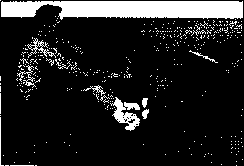

Đẩy chân trở lại trước khi kéo tay cầm chèo vể phía bạn.

I Giải pháp:

- • Giữ khớp thả lỏng. Khóa các khớp như khuỷu tay hoặc đầu gối sẽ giảm áp I lực cho cơ bắp (đó là sự khôn khéo), và đặt sự chịu đựng vào xương, có thể gây kích ứng hoặc lằm tổn thương khớp phức tạp. Giữ di chuyển chậm và

có kiểm soát.

- • Thở. Tránh giữ hơi thở của bạn trong khi nâng: thiếu oxy trong quá trình lấy sức có thể gây nguy hiểm. Theo quy định, thở ra khi nâng một trọng lượng và hít vào trong khi trồ về vị trí bắt đầu của bạn.

- • Sử dụng kiểu cầm thích hợp. ổn đinh và kiểm soát thanh vịn bằng cách nắm ngón tay cái của bạn trên một mặt và các ngón tay còn lại ở mặt bên kia.Tránh đặt tất cả các ngón tay ồ trên một mặt khiến cho thanh vịn rơi nếu nó trượt. Đặt tay của bạn đều nhau trên thanh vịn để giữ trọng lượng cân bằng.

  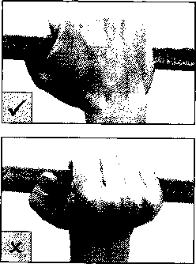

Khi bạn bám chặt vào đòn tạ, ngón tay nên ỡ một bên, ngón tay cái bên kia (phía trên). Muôh nắm chặt (ở dưới) thì ngón tay cái phải đặt cùng phía với các ngón tay khấc.

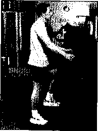

Luôn luôn giữ một thế đứng thẳng đứng-đừng bị để nghiêng về phía trước.

LEO BẬC THANG

Vấn đê: Thế đứng không đúng có thể gây ra đau nhói ở bàn chân và gây sức ép lên cổ và lưng.

Giải pháp:

• Hãy thẳng bàn chân. Việc bước đi với những ngón chân làm kích thích lên các dây thần kinh nằm trong các cầu tròn của bàn chân. Giữ bàn chân thẳng và để nằm toàn bộ lên bề mặt giày chống sốc sẽ giúp làm giảm sức ép. Nới lỏng dây giày để giúp cải thiện lưu thông. Sử dụng bước ngắn và thấp để giảm áp lực tránh đốt cháy nhiều năng lượng.

- • Đứng thẳng. Cúi xuống có vẻ thoải mái hơn, nhưng nó đặt áp lực lên cổ và lưng dưới, đặc biệt là nếu bạn đang vươn cổ để xem TV hay đang theo dõi trong lớp thể dục nhịp điệu.

TRƯỢT PATIN

Vấn đề: Bạn rất dễ ngã thường dẫn đến chấn thương đầu, cổ tay, khuỷu tay và đầu gối.

Giải pháp:

- • Đội mũ bảo hiểm. Chấn thương đầu ít phổ biến hơn so với khớp, nhưng nếu xảy ra thì thật là nguy hiểm.

- • Mang tấm lót. cổ tay là nơi có khả năng bị chấn thương nhiều hơn hẳn, bảo vệ chúng với các thiết bị bảo vệ làmNgiảm nguy cơ chấn thương đến sáu lần. Nhưng đừng quên mũ bảo hiểm và miếng đệm đầu gối.

- • Hãy học hỏi. Học làm thế nào để phanh, sải bước và ngã đúng cách sẽ hạn chế các chấn thương ở người mới bắt đầu, và cũng có thể nâng cao kỹ năng của bạn vượt quá mức tự học.

- • Hãy nhớ kiểm soát. Những người mới bắt đầu thường nhìn xuống bàn chân của mình làm họ mất thăng bằng. Bạn cần phải giữ mắt nhìn về phía trước giúp đặt trọng tâm lên bàn chân để giữ thăng bằng.

Trượt băng patin đòi hỏi một thiết bị bảo vệ thích hợp như mũ bảo hiểm, cũng như miếng đệm khuỷu tay, đầu gối và cổ tay.

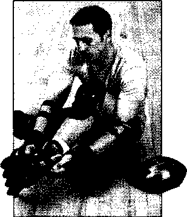

##### TẬP THỂ DỤC TRONG VĂN PHÒNG

Bạn đang mặc chỉnh chu. Có ít không gian và thậm chí không có thiết bị tập luyện. Bạn cũng không muốn bị sếp bắt gặp đang tập luyện ở nơi nào đó. Nhưng văn phòng là nơi cần thiết nên tập thể dục nhất vì bạn làm việc mà ít vận động, thường ngồi một chỗ và bị căng thẳng cả về thể chất lẫn tinh thần

BA THÓI QUEN CAN TRÁNH

Cổ, lưng và cổ tay là những nạn nhân chính của sự căng thẳng và căng thẳng tại nơi làm việc, và áp lực lên chúng chủ yếu do bạn ở một tư thế làm việc quá lâu.

Dưới đây là một số thói quen xấu:

- 1\. Sử dụng bàn phím với cô’ tay cong lại. Góc ở cổ tay càng lớn (thường là bồi bàn phím ỗ vị trí quá cao), bạn sẽ càng cảm thấy căng thẳng. Hãy để bàn tay và cánh tay trong thẳng với nhau.

- 2\. Vươn cổ để nhìn vào màn hình. Có thể màn hình của bạn được đặt quá cao hoặc bạn đeo kính hai tròng và cần nghiêng đầu của bạn để nhìn màn hình.

Dù trong trường hợp nào thì cũng hãy điều chỉnh độ cao của màn hình để nó không cao hơn tầm mắt của bạn.

- 3\. Giữ điện thoại bằng vai của bạn. Điều này là ảnh hưởng đến cô’ và cơ vai. Nếu bạn thực hiện nhiều cuộc gọi trong thời gian dài, bật điện thoại ỏ chế độ rảnh tay hoặc đeo tai nghe.

ẢNH HƯỞNG CỦA CÔNG VIỆC

Cơ thể chúng ta sinh ra để vận động, nhưng thay vào đó chúng ta lại dành cả ngày ngồi trong các cuộc họp hoặc ngồi rũ trước máy tính thực hiện những công việc lặp đi lặp lại. Ngoài việc con người chúng ta ít vận động thì vị trí chúng ta làm việc cũng có thể làm căng thẳng và mệt mỏi cơ bắp nhất định, trong khi sự căng thẳng tinh thần làm chúng ta trở nên áp lực.

Mục đích của tập thể dục tại văn phòng là không chỉ để bù đắp lại sự thiếu hoạt động thể chát bình thường, mà còn ngăn ngừa chứng vẹo cổ chúng ta thường mắc phải do tư thế làm việc, cũng như làm giảm căng thẳng nói chung.

Ngoài các bài tập được đưa ra trong phần này, có những bước thực hiện đơn giản sau đây về thể chất giúp bạn giảm bớt căng thẳng.

- • Thay đổi vị trí thường xuyên. Ớ yên một vị trí quá lâu là nguyên nhân chính làm các cơ bắp cứng và căng thẳng. Dù cho công việc của bạn chiếm hết thời giờ, hãy nghỉ ngơi một lúc khoảng 10 đến 15 phút để giãn chân, di chuyển cánh tay và uốn những ngón tay của bạn.

- • Hãy trò chuyện dù bận rộn. Bất cứ nơi nào có thể, hãy thử nói chuyện với các đồng nghiệp của bạn trong khi đang đi, đặc biệt là nếu bạn biết một chủ đề có thê’ gây căng thẳng. Nghe có vẻ lạ, nhưng nói chuyện trong khi đi giúp ta cởi mở và vui tươi hơn.

- • Đi bộ sau khi ăn trưa. Mặc dù bạn không thể sắp xếp một buổi tập luyện, nhưng ít nhất bạn có thể ra ngoài để đi dạo bộ nhanh, để cho tâm trí của bạn thoải mái và đôi chân của bạn được hoạt động.

- • Đứng lên bất cứ khi nào bạn trả lời điện thoại: nó cho phép sự vận động cơ bắp và tuần hoàn thay đô’i, cũng như làm cho bạn năng nô’ hơn.

###### NGỒI ĐựA VÀO TƯỜNG

Đây là một bài tập thể dục chân chung tương đối tốt.

Đứng lưng dựa vào tường, bàn chân cách nhau khoảng chiều rộng vai. Từ từ trượt lưng bạn xuốhg tường khi bạn đi về phía trước, cho đến khi đầu gối bạn gập xuống làm cho bạn trông như đang ngồi trên ghế. (Để tránh căng thẳng đầu gối, hãy giữ bắp đùi bạn ở trên đầu gối). Giữ cho 5 đến 10 giây, sau đó trượt trở lại vị trí bắt đầu. Làm 5 lần như vậy.

###### ÔM VAI

Đê’ giảm áp lực cho vai và vùng lưng trên, chéo cả hai tay lên ngực của bạn, đê’ tay trái lên bả vai phải và tay phải lên bả vai trái.

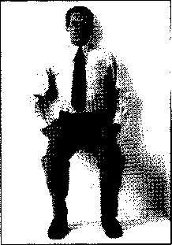

###### NHÚNG GHÊ

Việc nhúng ghế này là cách bạn tập luyện phần cơ thể phía trên tuyệt vời.

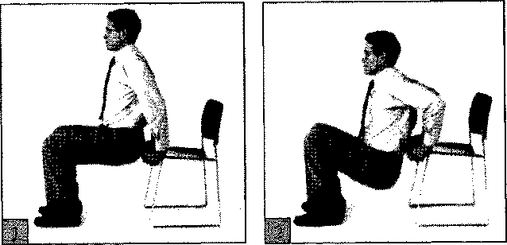

- 1\. Ngồi trên mép ghế với gót chân phẳng trên sàn nhà. Đặt tay lên cạnh phía trước của ghế và nhích mông ra khỏi ghế một cách cẩn thận cùng với sự hỗ trợ của tay. Giữ cho lưng thẳng.

- 2\. Từ từ hạ thấp mình cho đến khi phần trên cánh tay tầm song song với sàn nhà, sau đó nâng lên. Làm 8 đến 12 lần.

###### CÁC ĐỘNG TÁC CHẠM KHỦY TAY ĐẾN ĐẦU GÔÌ

Luyện tập phần bụng.

Ngồi thẳng lưng trên ghế, bàn chân thẳng trên sàn nhà và đan hai với nhau tay sau đầu. Nâng đầu gối trái của bạn, và gập khuỷu tay phải về phía đầu gối. Để chân trái lại xuống sàn nhà, sau đó nâng ầầu gốì bên phải chạm vào khuỷu tay trái. Lặp lại ít nhất 5 lần.

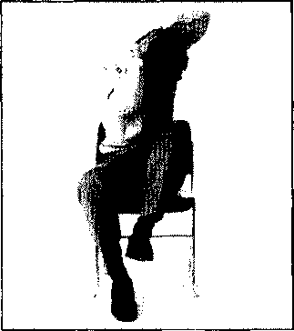

###### ĐỘNG TÁC NÂNG CHÂN LÊN KHI NGỒI

Vận động đùi.

Ngồi thẳng lưng trên ghế với cả hai chân dang rộng và bàn chân phẳng trên sàn nhà. Nhác cả hai chân khỏi sàn, giữ chân thẳng, để chân và thân của bạn tạo thành một hình dạng "L". Giữ trong 5 giây và hạ thấp chân của bạn trở xuống. Sau đó lặp lại.

###### VẶN MÌNH

Vận động ngực và bụng.

Ngồi thẳng trên cạnh ghế, giơ hai tay trong tư thế đầu hàng. Giữ hông của bạn ổn định, ngã thân trên và đầu của bạn qua bên trái ra càng xa càng tốt. Giữ cho khoảng 2 giây, sau đó trở về vị trí bắt đầu. Lặp lại 3 lần ở bên trái, sau đó 3 lần bên phải.

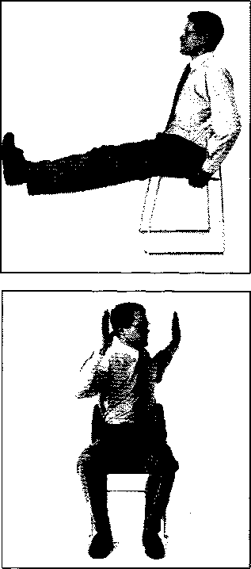

GIẢM BỚT CĂNG THẲNG với các trò chơi trí óc

Hạn chót thì sắp hết, chuông điện thoại reo, ông chủ thì tức giận. Nhưng bạn vẫn có thể đôi khi thoát khỏi sự căng thẳng với các bài tập nhỏ giải phóng cơ thể trong suốt cả ngày.

- • Tưởng tượng một kỳ nghỉ bằng cách hình dung về một nơi xa xôi. Bạn ở trên đỉnh núi cao, ở trên tất cả. Bạn có thể nhìn ra hàng dặm xung quanh và không có ai trong tầm nhìn. Gió thì rít qua rừng thông bên dưởi. Hãy chú ý: một phần của tâm trí của bạn thực sự phải ồ đó, và nó sẽ được thư giãn.

- • Nhìn ra ngoài cửa sổ, và nhìn vào một cái gì đó - một con chim, một con côn trùng, một cái cây ồ xa, một chiếc xe. Hãy để các giác quan của bạn thư giãn trong giây lát: nếu bạn càng nhìn và lắng nghe, bạn sẽ ít suy nghĩ và lo lắng hơn.

- • Có óc kiểm soát là điều tuyệt vời đối với những người muôn thoát khỏi căng thẳng. Khi điện thoại đổ chuông, hãy nghĩ rằng, “Họ sẽ phải chờ đợi một lát.” Đầu tiên hãy hít thở sâu, sau đó mới nhấc máy.

- • Mỗi giờ hoặc lâu hơn, dừng lại những gì bạn đang làm và quên đi căng thẳng mà cơ thể đang phải chịu. Đặc biệt chú ý đến bàn tay, vai, cổ, và hàm. Sau đó, dành một chút thời gian thư giãn về tinh thần các vùng căng thẳng.

- • Nên có một món đồ chơi cầm tay. Nó có thể là một cục nam châm nổi, một đầu quay, một nhân vật hành động, thậm chí có thể là một khẩu súng nước. Chỉ cần nhìn nó nằm trong ngăn kéo cũng khiến bạn vô tư như một đứa trẻ.

  

  

  

