# TOÀN BỘ SỨC KHỎE TẬP THỂ DỤC HIẾU KHÍ

Dù bạn đang ở bất kỳ độ tuổi nào, bất kỳ trọng lượng nào, nếu bạn muốn khỏe mạnh, bạn nên tập thể dục hiếu khí. Tại sao vậy? Thể dục hiếu khí tăng cường hoạt động hiệu quả của tim, phổi, cơ bắp và tuần hoàn, đốt cháy lượng mỡ thừa, đồng thời bảo vệ bạn chống lại một loạt các bệnh, từ đau tim đến loãng xương.

## CÁC BƯỚC TẠO THỂ LỰC

Tim và phổi của bạn phối hợp làm việc để cung cấp oxy cho cơ bắp, giúp giải phóng và sử dụng năng lượng. Các bài tập thể dục hiếu khí buộc phổi và tim hoạt động tích cực hơn. Làm như vậy sẽ tạo điều kiện cho toàn bộ cơ thể được cung cấp oxy và chất dinh dưỡng hiệu quả hơn. Nó giúp bạn mạnh mẽ hơn, quá trình trao đổi chất nhanh hơn, độ bền cao hơn, và bảo vệ cơ thể chống lại bệnh tim cũng như một loạt các bệnh khác.

Tập thể dục hiếu khí phù hợp có tác động trực tiếp và đặc biệt đến hệ thống tim mạch. Theo một nghiên cứu y tế trên khoảng 17.000 sinh viên tốt nghiệp đại học, nếu thực hiện tập thể dục hiếu khí phù hợp, nguy cơ mắc bệnh tim giảm xuống thấp hơn 64% so với những nam giới ít vận động.

Tuy nhiên, khả năng tập thể dục hiếu khí của bạn có các yếu tố hạn chế, nhất là năng lực của cơ thể và yếu tố di truyền. Mặc dù vậy, có thể cải thiện bằng cách làm theo ba nguyên tắc cơ bản: cường độ, tần số và thời gian.

### TẬP CHĂM CHỈ NHƯ THẾ NÀO?

Để có được lợi ích từ việc tập thể dục nhịp điệu từ bất kỳ hoạt động nào, bạn cần luyện tập để tim đập khoảng 70% công suất tối đa của nó.

Để đạt mục tiêu, bạn cần nắm rõ nhịp đập mạch trong quá trình tập luyện, bằng cách dừng lại một lúc và đặt hai ngón tay (không phải ngón cái) vào động mạch phía bên trong cổ tay của bạn. Để chính xác, đếm nhịp đập trong 10 giây, sau đó nhân con số này với 6. (Đếm trong 60 giây sẽ đánh giá không đúng vì tim đập chậm khi bạn dừng.)

### MỨC ĐỘ THƯỜNG XUYÊN NHƯ THẾ NÀO?

Các chuyên gia khuyên rằng bạn nên tập thể dục nhịp điệu ba lần một tuần, với một ngày nghỉ giữa các ngày tập. Ngày nghỉ là ngày quan trọng. Nó không chỉ cho bạn thời gian để làm các việc thú vị khác mà còn cho phép cơ thể hồi phục tổn thương trong các tế bào vi mô của cơ bắp, một quá trình giúp các cơ bắp (và bạn) trở nên mạnh mẽ hơn.

### BAO LÂU?

Thể dục nhịp điệu là một hoạt động lâu dài. Trên thực tế, điều đó có nghĩa là mỗi bài tập nên kéo dài từ 20 đến 30 phút.

Nhiều người không nhận ra rằng họ cũng có thể nhận được lợi ích bằng cách thực hiện những bài tập ngắn hơn, ví dụ như tập thể dục nhịp điệu trong 10 phút, ba lần một ngày.

## LỊCH TẬP LUYỆN

- **Tuổi 20**: 15-20 phút vào thứ Hai, thứ Tư và thứ Sáu ở khoảng 80-85% nhịp tim tối đa.
- **Tuổi 30**: 30 phút vào thứ Hai, thứ Tư và thứ Sáu ở khoảng 70% nhịp tim tối đa.
- **Tuổi 40**: 20 phút vào thứ Hai và thứ Sáu ở khoảng 60% nhịp tim tối đa. Vào thứ Ba và thứ Năm, tập nhẹ 30 phút như đi bộ nhanh.
- **Tuổi 50 và trên 50**: 20 phút vào thứ Hai và thứ Sáu, khoảng 60 đến 70% nhịp tim tối đa. Vào thứ Ba và thứ Năm, tập 30 phút đi bộ nhanh.

## KIỂM TRA THỂ LỰC CỦA BẠN

Nhịp tim nghỉ ngơi là dấu hiệu cho biết tình trạng tổng thể về khả năng tập thể dục hiếu khí của bạn. Bởi vì một trái tim không khỏe mạnh sẽ làm việc vất vả hơn để bơm máu ngay cả khi cơ thể đang nghỉ ngơi, nhịp tim nghỉ ngơi giảm xuống khi thể lực được cải thiện, nghĩa là thể lực càng tốt, tim của bạn hoạt động càng hiệu quả ngay cả khi bạn đang ngủ.

Người đàn ông ít vận động trung bình có nhịp tim nghỉ ngơi khoảng 80 đến 100 nhịp mỗi phút. Ngược lại, một vận động viên khỏe mạnh có nhịp tim nghỉ ngơi từ 30 đến 40 nhịp mỗi phút. Một người đàn ông hoạt động bình thường có nhịp tim nghỉ ngơi khoảng 60.

Để đo nhịp tim nghỉ ngơi của bạn, bắt mạch ở cổ hoặc cổ tay sau khi thức dậy vào buổi sáng. Đó là thời gian khi cơ thể của bạn thực sự nghỉ ngơi. Đơn giản chỉ cần đếm các nhịp đập trong 60 giây.

## BẠN THỨC DẬY CƠ THỂ TẬP LUYỆN VỚI CƯỜNG ĐỘ NHƯ THẾ NÀO?

Bạn đã tập luyện chăm chỉ để có hiếu khí phù hợp, nhưng không quá nặng vì như vậy sẽ làm bạn mệt. Nỗ lực duy trì này phụ thuộc vào hoạt động của bạn ở một tỷ lệ tối đa - đủ cao để thách thức tim và phổi, nhưng không quá cao đến nỗi làm khả năng cung cấp oxy và chất dinh dưỡng vượt quá nhu cầu của cơ bắp.

Biết nhịp tim tối đa của bạn là một cách xác định bạn nên hoạt động mạnh thế nào trong thời gian tập thể dục hiếu khí. Biểu đồ dưới đây cho thấy “khu vực luyện tập” - tối đa 70 đến 90%. Tìm tuổi của bạn ở khu vực dưới và cho đến khi bạn nhìn thấy tỷ lệ phần trăm mà bạn đang hướng tới, sau đó đi ngang qua tỷ lệ bên tay phải để xem mỗi phút tim bạn nên đập bao nhiêu lần. Con số này là điều mà bạn nên đặt mục tiêu cho quá trình tập luyện của mình.

Nhằm mục tiêu để nằm ở mức 70% - trong khu vực dưới cùng. Tùy thuộc vào độ tuổi và khả năng, bạn có thể đặt mục tiêu cao hơn một chút hoặc thấp hơn - tham khảo ý kiến huấn luyện viên để hiểu rõ về điều này. Bắt đầu từ từ và xây dựng dần dần theo thời gian.

### BIỂU ĐỒ NHỊP TIM (NHỊP MỖI PHÚT)

| Tuổi (năm) | 70% | 80% | 90% |
|------------|-----|-----|-----|
| 20         | 140 | 160 | 180 |
| 25         | 137 | 156 | 176 |
| 30         | 133 | 152 | 171 |
| 35         | 130 | 148 | 167 |
| 40         | 126 | 144 | 162 |
| 45         | 123 | 140 | 158 |
| 50         | 119 | 136 | 153 |
| 55         | 116 | 132 | 149 |
| 60         | 112 | 128 | 144 |
| 65         | 109 | 124 | 140 |

## TẬP LUYỆN ĐỐT CHÁY NĂNG LƯỢNG NHƯ THẾ NÀO

Bắt đầu một bài tập thể dục hiếu khí chậm, tăng cường độ (bạn tự nỗ lực tập luyện khó khăn như thế nào), tần số (bạn tập thể dục thường xuyên như thế nào), hoặc thời gian (bạn tập thể dục trong bao lâu) khi bạn trở nên khỏe hơn.

Để chứng minh sự điều chỉnh có tác dụng đến khả năng tập luyện như thế nào, bảng dưới đây cho thấy số calo được đốt cháy cho một vài hoạt động, tùy vào thời gian luyện tập bao lâu.

| Hoạt động          | 15 phút | 30 phút | 45 phút | 60 phút |
|--------------------|---------|---------|---------|---------|
| **Đi xe đạp**      |         |         |         |         |
| 20 km/h            | 142     | 283     | 425     | 566     |
| 30 km/h            | 213     | 425     | 638     | 850     |
| **Chèo thuyền**    | 104     | 208     | 310     | 415     |
| **Chạy bộ**        |         |         |         |         |
| 5 phút/km          | 183     | 365     | 548     | 731     |
| 4 phút/km          | 223     | 446     | 670     | 893     |
| **Bơi lội**        |         |         |         |         |
| 33m/phút           | 124     | 248     | 371     | 497     |
| 45m/phút           | 131     | 261     | 392     | 523     |
| **Tập bài thể dục**| 189     | 378     | 576     | 756     |
| **Trượt tuyết**    | 146     | 291     | 437     | 583     |

## HAI LOẠI SỨC CHỊU ĐỰNG

Dường như không có vẻ như vậy, nhưng thực sự có hai loại sức chịu đựng riêng biệt: tim mạch và cơ bắp.

- **Sức chịu đựng của hệ tuần hoàn**: Đề cập đến khả năng bạn có thể leo hết cầu thang mà không thở hổn hển hoặc tim đập thình thịch.
- **Độ bền cơ bắp**: Nói đến khả năng duy trì các hoạt động bền bỉ như chạy mà chân bạn không bị mỏi.

Tập hiếu khí làm tăng cả hai hình thức của sự chịu đựng cùng một lúc, mặc dù có lợi cho cơ bắp nhưng cũng phụ thuộc vào các hoạt động cụ thể. Ví dụ, chạy thúc đẩy sức chịu đựng tim mạch bởi vì nó kích thích hoạt động tim và phổi. Nó cũng làm tăng độ bền cơ bắp ở chân vì được hoạt động phần lớn. Tuy nhiên, chạy không có tác động nhiều vào độ bền cơ bắp ở cánh tay và phần trên cơ thể vì chúng được sử dụng không nhiều.

## CHỌN MỘT BÀI TẬP THỂ DỤC

Hầu như bất kỳ hoạt động nào làm tim đập nhanh và làm bạn hơi khó thở thì được xem là một bài tập thể dục tốt. Vì vậy, các hoạt động mà bạn chọn cơ bản nằm ở vấn đề sở thích. Mỗi hoạt động tạo ra điều kiện hiếu khí, nhưng hãy đảm bảo chọn một hoạt động mà bạn có khả năng gắn bó trong thời gian dài.

### ĐẠP XE

Điều kiện thể dục hiếu khí trên một chiếc xe đạp đòi hỏi một nhịp đạp đều đặn, hoặc tốc độ chân đạp ổn định, mà không có nhiều sự xuống dốc (mặc dù thỉnh thoảng xuống dốc là tốt để kiểm soát tốc độ hoặc tạm nghỉ nếu bạn cảm thấy quá sức). Người đua xe đạp có mục tiêu đạt số vòng quay mỗi phút (rpm) khoảng 80 đến 100. Những người bình thường nằm trong phạm vi 50, mức tối thiểu cho huấn luyện; 60 đến 90 là khoảng trung bình đối với những người điêu luyện.

Luyện tập để đạt rpm bằng cách đếm số lần chân phải của bạn đi đến đầu của bàn đạp. Nhằm mục đích tăng nhịp của bạn khoảng 10 rpm mỗi tuần. Khi bạn đạt đến mức vòng quay cao hơn, bạn sẽ muốn thay đổi đến mức cao hơn, điều đó đòi hỏi nỗ lực nhiều hơn nữa, làm bạn trở nên mạnh mẽ và nhanh hơn.

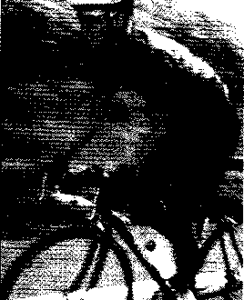

Đi xe đạp, dù trong nhà hay ngoài trời, đều mang lại những lợi ích to lớn. Mục tiêu một nhịp ít nhất là 50 rpm.

### TRƯỢT TUYẾT

Môn thể thao này đem đến một sự tập luyện toàn bộ cơ thể tuyệt vời. Dù những cảm giác và chiêm nghiệm thú vị của trượt tuyết ngoài trời rất lý tưởng, nhưng thực tế có những hạn chế: cần có tuyết, độ dốc tốt, và thời gian để duy trì hoạt động này trở thành một hoạt động thực hành thường xuyên. Tuy nhiên, những lợi ích liên quan đến tập thể dục cũng có thể đạt được bằng cách sử dụng máy trượt tuyết tại nhà.

Nếu bạn bắt đầu chuyển dần hoạt động trong nhà với một máy trượt tuyết, đặc biệt là nếu bạn không quen thuộc với sự di chuyển bất tiện của thiết bị, hãy làm quen dần dần. Mục tiêu đạt buổi tập 10 đến 15 phút thực hành trong tuần đầu tiên, sau đó chuyển qua luyện tập thực tế khi bạn có đủ điều kiện và sự tự tin. Bắt đầu với buổi tập 20 phút, sau đó làm theo cách của bạn để có một buổi tập 30 phút trong vòng ba tuần.

Máy tập trượt tuyết cần có thời gian để làm quen, nhưng nỗ lực này sẽ sớm được đền đáp: đó là sự đốt cháy năng lượng.

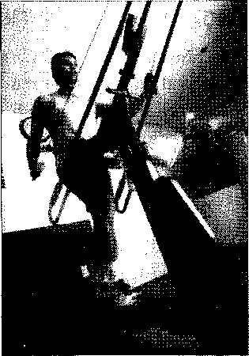

### CHÈO THUYỀN

Chèo thuyền cung cấp một bài tập thể dục tuyệt vời, đồng thời làm tất cả các nhóm cơ chính trong cơ thể hoạt động. Việc có được một số hướng dẫn về hình thức thích hợp trước khi bắt đầu là rất quan trọng - nhiều người đàn ông sử dụng cơ bắp nhiều hơn cần thiết.

Chèo thuyền làm tất cả các cơ trong cơ thể hoạt động. Cần nắm một số hướng dẫn chính xác về kỹ thuật trước khi bắt đầu một cách nghiêm túc.

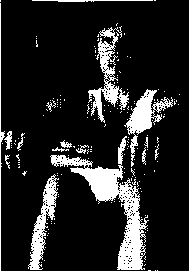

Lần đầu tiên bạn chèo thuyền, hãy luyện tập không quá 5 phút. Trong vài tuần tiếp theo, bạn làm quen với chuyển động, dần dần chèo thuyền nhịp nhàng từ 20 đến 30 phút. Khi trở nên đều đặn, kết hợp xen kẽ với chèo mạnh để tạo sức bền.

### CHẠY

Đó là một trong những hình thức tập thể dục tự nhiên nhất - bạn thực hiện mọi lúc trong cuộc sống. Nhưng nếu gần đây bạn không chạy, bạn cần phải bắt đầu từ từ. Trên thực tế, không phải xấu hổ khi bắt đầu đi bộ, đánh giá nỗ lực ban đầu của bạn theo thời gian, không phải theo khoảng cách.

Luôn cố gắng ra ngoài khoảng 20 đến 30 phút, 2-4 lần một tuần. Trong tuần đầu tiên, đi bộ nhanh trong 20 phút; rồi 30 phút vào tuần thứ hai. Hoặc tùy bạn, có thể thay thế giữa chạy và đi bộ: ví dụ chạy trong 2 phút, sau đó đi bộ 4 phút. Khi bạn có điều kiện hơn, dành nhiều thời gian để chạy và đi bộ ít lại. Khi bạn chạy đủ 30 phút, bạn nên bắt đầu theo dõi tiến bộ bằng cách đo khoảng cách, và thậm chí sau đó tăng lên không quá 10% mỗi tuần, với điều kiện bạn cảm thấy sẵn sàng cho điều đó.

Để giảm áp lực lên cơ thể, tránh vỉa hè nhựa, ngay cả các bề mặt như vòng chạy thể thao hoặc sân cỏ.

Đi bộ để chạy: bốn từ này có thể thay đổi cuộc sống của bạn. Khi mới bắt đầu, nên bắt đầu từ từ, kết hợp chạy với đi bộ.

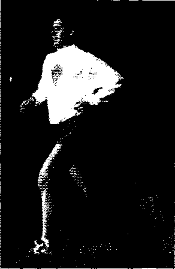

### BƠI LỘI

Đây là một môn thể thao yêu cầu điều kiện hiếu khí phải (hoặc trở nên) cực kỳ tốt - trong tất cả, bạn cần nín thở lâu. Bắt đầu khởi động, nhảy hoặc lặn xuống nước, bơi đến cái thang gần nhất, và đi nhanh tới điểm xuất phát. Lặp lại quá trình này từ 6 đến 10 lần.

Vòng tiếp theo là nền tảng của hầu hết các bài tập. Tùy vào khả năng, bạn có thể bơi 10 vòng liên tiếp trong bể bơi kích thước Olympic, mặc dù hầu hết người mới bắt đầu đều thấy việc này khó khăn: hãy đặt một mục tiêu để tập luyện dần dần.

Một cách để cải thiện là thông qua sự tập luyện thường xuyên, trong đó bạn tập trung vào một phần của cơ thể. Ví dụ, luyện tập kiểu bơi, bạn bơi tự do chỉ sử dụng một cánh tay dang ra trước mặt bạn. Trong luyện tập về đích, bạn giữ cả hai cánh tay bất động, kéo dài phía trước trong khi chỉ đẩy cơ thể để về đích.

Cắt nhanh chóng dưới nước là một trong những điểm thu hút của bơi lội - mặc dù không cần phải là một vận động viên Olympic để đạt thành tích.

### RÈN LUYỆN KẾT HỢP

Rèn luyện kết hợp là một nửa rèn luyện hiếu khí, một nửa rèn luyện sức bền. Bao gồm nâng tạ, nhưng không giống như hầu hết các việc nâng tạ thông thường, bạn không làm nhiều bài tập tại một chỗ cố định. Thay vào đó, bạn sẽ di chuyển nhanh chóng đến bài tập tiếp theo. Một "vòng" có thể được tạo thành từ 6 đến 12 bài tập. Sau khi thực hiện một vòng, bạn có thể làm lại.

Tập ở mức tối thiểu cơ bản giống nhau được mô tả trong phần tiếp theo, "Các bài tập cải thiện sức mạnh". Lặp lại 8 đến 12 lần trong mỗi bài tập, mất khoảng 6 giây cho mỗi lần nâng. (Mặc dù bạn đang chuyển động nhanh, nhưng bạn nên nâng lên từ từ). Nghỉ ngơi khoảng 15 giây (tối đa 30 giây), để giữ cho nhịp tim ổn định.

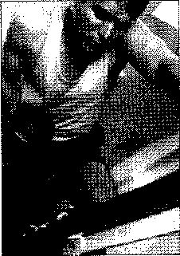

Theo lịch ba ngày một tuần, làm một vòng mỗi buổi tập trong tháng đầu tiên. Thêm vòng thứ hai trong tháng thứ hai và thứ ba, và vòng thứ ba trong tháng thứ tư.

Rèn luyện kết hợp là một chuỗi các bài tập hiếu khí và kỵ khí làm các bộ phận của cơ thể hoạt động cùng nhau.

## BAO NHIÊU LÀ ĐỦ?

Để duy trì sức khỏe toàn diện, quy tắc thứ nhất là bạn nên tập thể dục nhịp điệu từ 20 đến 30 phút một ngày, và tập ba ngày một tuần. Giờ đây, các nghiên cứu đã tiết lộ rằng những lợi ích sức khỏe của tập thể dục cũng có thể đạt được khi thực hiện từng lượt ngắn hơn, và lợi ích của tập thể dục được tích lũy dần. Vì vậy, tập 10 phút thể dục nhịp điệu vừa phải ba lần một ngày cũng tốt như tập 30 phút một lần. Và định nghĩa “thể dục vừa phải” đã được mở rộng bao gồm một loạt các hoạt động thông thường như sơn nhà, mang theo một túi dụng cụ đánh golf, hoặc câu cá bằng ruồi nhân tạo.

## CÁC BÀI TẬP ĐỂ CẢI THIỆN SỨC MẠNH

Tập luyện với tạ mang lại một hình ảnh cơ bắp đồ sộ, nhưng tập tạ không phải chỉ dành cho người mẫu Schwarzenegger. Sự cường tráng cùng cơ bắp mạnh mẽ này sẽ không chỉ làm cho bạn có vóc dáng ưa nhìn, nó còn bảo vệ bạn chống lại những tổn thương và đau lưng, cũng như hỗ trợ trong các hoạt động hàng ngày từ mua sắm đến quan hệ tình dục.

- **20 tuổi**: Tập 30 phút vào thứ Hai, thứ Tư và thứ Sáu, thực hiện 3 lần mỗi bài tập.
- **30 tuổi**: 20 phút vào các buổi thứ Hai, thứ Tư và thứ Sáu, thực hiện 2 lần mỗi bài tập.
- **40 tuổi**: 20 phút vào thứ Hai, thứ Tư và thứ Sáu, mỗi bài tập tập 2 lần. Dành 45 phút để tập một bài thể dục, sử dụng tạ nhẹ hơn và di chuyển nhanh chóng từ bài tập này đến bài tiếp theo, hoàn thành việc tập bài thể dục 3 lần.
- **50 tuổi trở lên**: 20 phút vào thứ Hai và thứ Sáu, 45 phút tập bài thể dục vào thứ Tư.

### CHẬM VÀ ỔN ĐỊNH

Tốc độ bạn nên nâng tạ lên như thế nào? Trên thực tế, đó là một câu hỏi chậm thế nào. Chuyển động nhanh nên tránh bởi vì nó đặt áp lực lên cơ bắp và dây chằng. Chậm và ổn định là tốt nhất, không chỉ để tránh bị chấn thương, mà còn vì nó đảm bảo rằng việc tạo đà không ảnh hưởng đến việc tập của bạn. Lời khuyên tốt nhất là cần sáu giây để thực hiện một nhịp nâng đầy đủ: hai giây để nâng tạ lên và bốn giây để hạ xuống. Dành nhiều thời gian hơn mỗi lần hạ tạ xuống (được gọi là chuyển động lệch hoặc ngược) là một lợi thế bởi vì nó thực sự xây dựng cơ bắp nhiều và nhanh hơn 20% so với đẩy tạ lên, được gọi là chuyển động đồng tâm hoặc tích cực.

### TẬP LUYỆN VỚI TẠ THÀNH CÔNG

Tập luyện với tạ rèn bạn trở nên mạnh mẽ hơn, và nâng cao ngoại hình của bạn như phát triển cơ bắp trở nên rõ ràng hơn. Bạn sẽ có bụng phẳng hơn, ngực lớn hơn, bờ vai trông vững chãi hơn, cùng đôi chân đẹp hơn. Và với cơ bắp khỏe mạnh có nghĩa là bạn sẽ có khả năng làm tốt hơn tất cả mọi việc, những việc bình thường hàng ngày xung quanh nhà dễ dàng hơn nhiều.

Cơ bắp mới cũng cần có trung tâm thể dục thẩm mỹ cụ thể: nó giúp cơ thể đốt cháy chất béo vì cơ đòi hỏi một lượng lớn năng lượng để duy trì hơn chất béo. Bạn có nhiều cơ bắp hơn, dễ dàng hơn để giảm cân.

Hầu hết các chương trình tập tạ đều theo ba nguyên tắc cơ bản:

- **Nâng lên**: Lượng tạ trên bất kỳ bài tập nhất định nên đủ nặng để mang lại mục tiêu cho các cơ bắp đến khi mệt mỏi trong vòng 8 đến 12 lần lặp lại.
- **Tiến trình tăng dần dần**: Nếu bạn chỉ mới bắt đầu một chương trình, bắt đầu nâng tạ 2-3 tuần đầu tiên mà cảm thấy nhẹ để thấy rằng làm 12 lần là khá dễ dàng. Điều này cho phép cơ bắp thích ứng với các hoạt động mới. Sau 2-3 tuần, nâng mức tạ (khi đó 8 lần thì dễ dàng nhưng 12 là khó khăn). Khi bạn trở nên mạnh mẽ hơn, lặp lại nhiều lần hơn. Khi bạn có thể hoàn thành 12 lần lặp lại mà hoàn toàn không cảm thấy mệt mỏi, tăng trọng lượng tạ thêm (nhưng không quá 5% mức tạ bạn đang nâng).
- **Thư giãn**: Nếu bạn tập nhiều bài, tạm nghỉ khoảng 90 giây ở giữa, cho phép các cơ bắp phục hồi và thực hiện đầy đủ các bài tập tiếp theo. Thời gian nghỉ ngơi có thể thay đổi theo mục tiêu của bạn.

### NGUYÊN TẮC CHƯƠNG TRÌNH

Tập tạ có thể làm tăng sức mạnh cơ bắp, kích thước, và độ bền, nhưng nó giúp bạn biết được cái gì là quan trọng nhất. Những thay đổi nhỏ trong các yếu tố trong tiến trình của bạn - sức chịu đựng, số lần lặp lại, số bài tập, và thời gian nghỉ ngơi giữa mỗi bài tập - có thể mang lại lợi ích cho bạn, đạt mục tiêu nhanh hơn, nhưng người khác chậm hơn. Dưới đây là những nguyên tắc hiệu quả nhất để đạt được những gì bạn muốn:

| Mục tiêu       | Cường độ | Lần lặp lại | Bài tập | Nghỉ ngơi       |
|----------------|----------|-------------|---------|----------------|
| Sức mạnh       | Nặng     | 3-8         | 3-5     | 2-5 phút       |
| Kích thước     | Trung bình| 8-12        | 3-5     | 30-90 giây     |
| Sức bền        | Nhẹ      | 12-20       | 2-3     | 15-30 giây     |

### BÀI TẬP THỂ DỤC

Tất cả các bài tập trong phần này được thực hiện tay không, có nhiều khả năng được thực hiện ở cả nhà và phòng tập thể dục. Là một ý tưởng tốt khi tham khảo ý kiến một huấn luyện viên để giám sát kỹ thuật của bạn, cũng như để có được lựa chọn máy móc thay thế. Lưu ý rằng thường có cốt lõi 7 bài tập nhỏ: nhảy lao, bài tập nằm nâng tạ, một cánh tay nâng hàng tạ, những tạ nhân khắc, vùng xoắn tập trung, ngồi ép cơ tam đầu, và ngồi xổm. Những bài tập khác (kiểng gót chân, quả tạ ruồi, và nâng tạ bên) có thể được thêm vào.

Ngoài các bài tập với tạ cốt lõi, làm ít nhất một trong các bài tập bụng từ phần "Tổng hợp các bài tập với bụng".

> “Nếu bạn khỏe mạnh, cơ bắp của bạn sẽ mạnh mẽ, linh hoạt, và bạn sẽ phục hồi nhanh hơn so với một người không khỏe mạnh với bất kỳ chấn thương hoặc bệnh tật nào.”  
> **Tiến sĩ John Tanner** nói về Đau lưng thường xuyên

#### CÁC CHUYỂN ĐỘNG

##### Hoạt động chân và hông

1. Đứng chân rộng bằng vai. Giữ tạ trên một tay phải giơ cao phía trước mặt, cánh tay dang rộng hoàn toàn. Đây là vị trí bắt đầu của bạn.
2. Bước chân trái lên phía trước một bước dài. Chân trái nên khụy xuống ở một góc 90 độ, nhưng đầu gối nên nằm phía trong đầu ngón chân của bạn. Chân phải nên uốn cong ở đầu gối, bàn chân phải ở nguyên tại vị trí bắt đầu của nó, mặc dù gót chân không chạm sàn. Đẩy chân trái của bạn trở về vị trí ban đầu. Làm lại với chân phải. Lặp lại 20 lần (10 lần trên mỗi chân).

> **Lưu ý**: Ở giai đoạn đầu, tập bài này mà không cầm tạ trước tiên, đảm bảo rằng bạn có thể thực hiện một loạt các động tác mà không bị đau nhức trước khi sử dụng tạ.

##### Bài tập nằm nâng tạ (Hoạt động ngực)

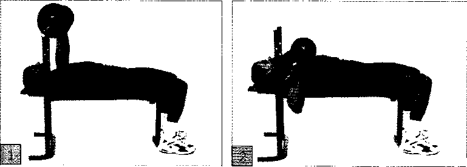

1. Nằm trên một băng ghế, với một thanh tạ trên ngực của bạn (một chiếc ghế được trang bị với một thanh chắn giúp an toàn hơn và dễ dàng hơn). Nắm bắt thanh dang tay rộng bằng vai ngoài hoặc hơn một chút, lòng bàn tay đối diện với chân, bàn chân đặt phẳng trên sàn nhà và lưng thẳng dựa vào băng ghế.
2. Từ từ hạ thấp tạ vào ngực của bạn, với khuỷu tay của bạn sang một bên, và phần còn lại của cơ thể giữ nguyên vị trí (không cong lưng). Tạm dừng một chút khi hết nhịp, nhẹ nhàng chạm tạ ngực của bạn, giữ cho thanh tạ dưới sự kiểm soát đầy đủ (không bao giờ thả thanh ra khỏi ngực của bạn). Nâng cao thanh tạ trở lại vị trí bắt đầu và lặp lại.

##### Tạ đơn (Bài tập cho lưng)

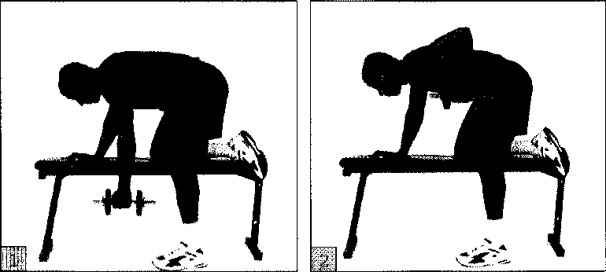

1. Đặt đầu gối phải và bàn tay phải trên bề mặt của một cái ghế dài, với chân trái của bạn đặt phẳng trên sàn nhà. Nắm một quả tạ với bàn tay trái, giữ cho lưng thẳng và mắt nhìn xuống sàn. Mở rộng tay trái của bạn so với sàn nhà, giữ cho khuỷu tay mở. Đây là động tác bắt đầu của bạn.
2. Kéo quả tạ lên phía thân của bạn, đưa nó vào cơ ngực dưới để khuỷu tay trái của bạn hướng về phía trần nhà. Hạ đến vị trí bắt đầu và lặp lại. Thực hiện các bài tập tương tự với tay phải.

> **Lưu ý**: Luôn luôn giữ cho lưng thẳng. Nếu bạn bắt đầu cảm thấy mệt mỏi, hãy chắc chắn lưng của bạn không bị cong.

##### Tạ khắc (Tập cơ vai)

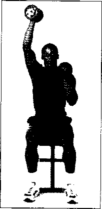

1. Ngồi trên một cái ghế dài với đôi chân dang rộng ra và bàn chân phẳng trên sàn nhà. Cầm tạ bằng một tay, giữ ở mức ngang vai, lòng bàn tay đối diện vào nhau. Đây là tư thế bắt đầu động tác.
2. Giữ lưng thẳng và hơi nghiêng về phía trước, nâng quả tạ bên trái cho đến khi cánh tay của bạn thẳng, nhưng hãy chắc chắn giữ cho khuỷu tay mở. Hạ thấp tư thế ban đầu, sau đó nâng quả tạ bên phải với động tác tương tự. Và lặp lại.

##### Xoay tạ (Hoạt động các bắp tay)

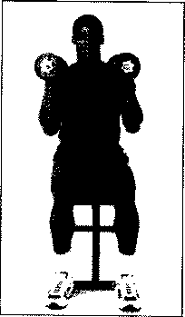

1. Ngồi trên một cái ghế dài, bàn chân phẳng trên sàn rộng bằng vai ngoài. Mở rộng cánh tay phải của bạn giữa hai đầu gối, nắm một quả tạ trong lòng bàn tay phải. Phần còn lại khuỷu tay phải và cánh tay đặt trên đùi phải của bạn, và đặt tay trái lên trên đầu gối chân trái.
2. Từ từ nâng quả tạ lên ngang vai, đưa thành một vòng cung để lòng bàn tay bây giờ đối diện. Giữ những chuyển động chậm và có kiểm soát. Dùng sức mạnh giằng khuỷu tay phải chống đầu gối phải và tay trái trên đầu gối trái sẽ hỗ trợ thêm. Hạ đến vị trí bắt đầu và lặp lại. Thực hiện các bài tập tương tự với tay trái.

##### Cơ tam đầu (Hoạt động cơ vai trên)

1. Ngồi trên ghế cầm giữ một quả tạ theo chiều dọc phía sau đầu của bạn, giữ tạ với trọng lượng cao nhất bằng cách sử dụng cả hai tay, với những ngón tay xen kẽ hoặc chồng lên nhau để hỗ trợ. Khuỷu tay và cánh tay được ép sát vào đầu của bạn.
2. Từ từ mở rộng cả hai cánh tay, đẩy quả tạ về phía trần nhà, giữ cho lưng thẳng. Dừng lại khi cánh tay của bạn thẳng, nhưng không khép khuỷu tay. Uốn cong khuỷu tay của bạn để giảm trọng lượng trở lại vị trí bắt đầu. Lặp lại.

> **Lưu ý**: Hãy chắc chắn rằng bạn nắm chặt tạ suốt thời gian.

##### Ngồi xổm (Hoạt động đùi và cơ gân kheo)

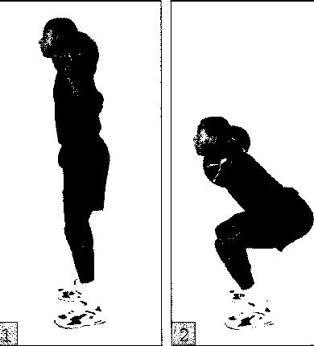

1. Đặt một thanh xà trên vai phía sau cổ của bạn, giữ thanh xà với lòng bàn tay về phía trước. Bắt đầu bằng cách đứng thẳng với bàn chân dang rộng bằng vai.
2. Giữ đầu gối của bạn mở, nghiêng sang nhẹ, sau đó uốn cong đầu gối của bạn, hạ thấp cơ thể của bạn, như chuẩn bị ngồi trên ghế. Dừng lại khi đùi của bạn sắp song song với sàn nhà, sau đó từ từ nâng trở lại vị trí bắt đầu, giữ cho bàn chân phẳng trên sàn nhà. Lặp lại.

##### Kiểng gót (Hoạt động bắp chân)

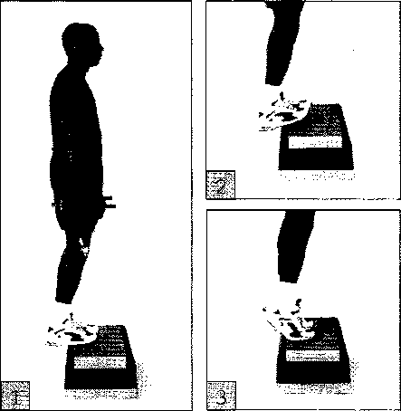

1. Đứng cả hai chân trên một bề mặt cao như một bậc tập thể dục, cầu thang, hoặc thậm chí tạ dày hoặc khối gỗ (chiều cao nên có ít nhất 2 đến 3 inch), mỗi tay cầm 1 tạ. Kiểng gót chân lên khỏi mặt sàn, với tạ trên chân.
2. Từ từ hạ gót chân của bạn đến một điểm trên nền nhà.
3. Nâng mình lên trên ngón chân của bạn, tạm dừng một thời gian ngắn lúc đầu rồi lặp lại.

##### Tạ treo (Hoạt động ngực)

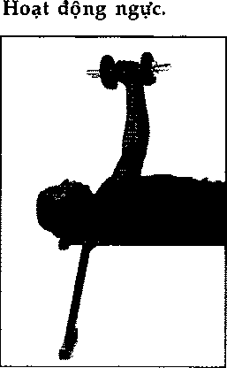

1. Nằm ngửa trên băng ghế, với bàn chân phẳng trên sàn nhà. Hai tay giữ hai quả tạ trong không gian lên trên ngực của bạn, lòng bàn tay đối diện nhau. Lưng thẳng và dựa vào băng ghế, và khuỷu tay của bạn nên hơi uốn cong, không bị khép. Đây là tư thế bắt đầu của bạn.
2. Giữ khuỷu tay và cổ tay cong, từ từ hạ thấp tạ xuống ra xa nhau cho đến khi nó đang ở ngang ngực. Khuỷu tay nên được uốn cong ở một góc khoảng 45 độ. Nâng cao tạ trở lại vị trí bắt đầu và lặp lại.

> **Lưu ý**: Tập trung tất cả vào việc xây dựng cơ bắp cho ngực: không để cho vai của bạn tham gia, bạn có thể làm tổn thương chúng.

##### Nâng tạ 2 bên (Hoạt động ở hai bên vai)

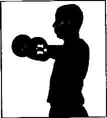

1. Đứng thẳng với bàn chân dang rộng bằng vai, cánh tay để hai bên, giữ một quả tạ trong mỗi bàn tay, lòng bàn tay hướng chân, với khuỷu tay hơi cong. Giữ một tư thế thẳng đứng: ngực, vai và lưng thẳng.
2. Nâng cao cả hai quả tạ thẳng ra từ mỗi bên, giữ cho khuỷu tay hơi cong (xem phía góc nhìn, ở trên), tạ nâng không cao hơn mức vai. Hạ xuống và lặp lại.

## CÁC BÀI TẬP GIÚP CẢI THIỆN SỰ LINH HOẠT

Xem một vận động viên Olympic tại nơi làm việc và bạn sẽ bị thôi miên bởi sự linh hoạt của cơ thể con người được rèn luyện. Nhưng bạn không phải là một vận động viên thể dục linh hoạt. Một loạt các bài tập đơn giản có thể dễ dàng tích hợp vào chương trình thể dục của bạn, mang đến tất cả các lợi ích của việc tăng tính linh hoạt.

### LỘ TRÌNH CO GIÃN

Thật không đúng khi tập tất cả động tác trong phần này trong buổi tập luyện của bạn. Bạn có thể chọn động tác nào phù hợp với mình, cần đảm bảo toàn cơ thể đều co giãn. Dành 5 đến 10 phút tập các động tác co giãn. Giữ mỗi động tác trong 30 giây.

### BẠN CÓ LINH HOẠT KHÔNG?

Hãy thử những động tác đơn giản để đánh giá mức độ nhanh nhẹn của bạn trong một số lĩnh vực quan trọng:

- **Ghế xoay**: Ngồi thẳng trên ghế, xoay thân của bạn sang một bên. Bạn sẽ có thể xoay để một đường nối vai này với vai kia giao với đường nối hai bên hông tạo một góc độ 90 độ, tạo thành một hình chữ T. Nếu bạn không thể, toàn thân và lưng bạn thiếu linh hoạt, dẻo dai.
- **Móng chân cảm ứng**: Ngồi thẳng lưng trên ghế. Mang theo một chân lên từ sàn nhà và cố gắng đặt nó trên ghế để gót chân chạm vào mông của bạn (bạn có thể hướng bàn chân của bạn với hai bàn tay nếu cần, nhưng không ép buộc). Nếu bạn không thể, hông, cơ mông, lưng dưới, và gân kheo trên có vẻ cứng và cần giúp đỡ.
- **Tư thế kiểm tra**: Đứng dựa vào một bức tường, sau đó dựa vào phía sau và đặt lòng bàn tay của bạn phẳng vào tường, cố gắng trượt bàn tay của bạn giữa khoảng nhỏ sau lưng và bức tường. Nếu bạn có thể đẩy bàn tay của bạn lên đến cổ tay, lưng dưới của bạn kém linh hoạt. Nếu bạn chỉ có thể phù hợp với tầm tay của bạn vào không gian, bạn có thể có gân kheo chặt chẽ.
- **Vươn tay**: Đan các ngón tay ở cả hai lòng bàn tay vào với nhau và hướng ra xa, sau đó vòng lên đỉnh đầu của bạn bằng cả hai tay, mở rộng cánh tay của bạn lên phía trên thẳng như bạn có thể. Nếu bạn thấy rằng bạn không thể dễ dàng đi xa hơn vị trí cong khuỷu tay, bạn cần linh hoạt hơn trong vai, ngực và lưng trên.

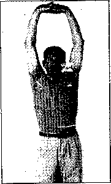

### TÍNH LINH HOẠT CƠ BẢN

Tính linh hoạt là khả năng kéo dài, uốn cong, xoắn, và bật thông qua đầy đủ các động tác. Cơ thể có thể làm những động tác này nhờ kéo giãn cơ bắp.

So với các cơ bắp cứng, những người linh hoạt có thể tác dụng lực đầy đủ hơn thông qua một loạt chuyển động, và nhanh hơn. Điều này được chuyển thành sức mạnh trong các động tác xoay người trên golf hay tennis, phối hợp tốt hơn, và bước nhanh hơn trong khi chạy. Cơ bắp linh hoạt cũng đảm bảo một chế độ tập luyện lâu dài và an toàn - đó là lý do tại sao bạn nên luôn luôn khởi động căng cơ trước khi hoạt động mạnh.

### GIẢI PHÁP CO GIÃN AN TOÀN

Mặc dù có một số phương pháp khác nhau để kéo dài, hầu hết được dự định sử dụng cho các vận động viên hàng đầu; chỉ có một hình thức, được gọi là tĩnh giãn, an toàn và hiệu quả cho mọi cấp độ của người tập thể dục.

Với tĩnh giãn, bạn di chuyển chậm và dễ dàng, bằng cách sử dụng trọng lực và trọng lượng cơ thể để áp dụng chỉ một lực nhỏ đạt được mục đích tạo cơ bắp vượt qua mức thông thường. Để co giãn một cách an toàn và hiệu quả, luôn tuân thủ các nguyên tắc sau:

- **Khởi động**: Một vài phút cho các hoạt động khiến cơ bắp hơi đổ mồ hôi. Nóng lên và mềm dẻo hơn, cho phép chúng co giãn hơn nữa mà không bị chấn thương.
- **Hãy nhẹ nhàng**: Bạn chỉ nên duỗi cho đến khi bạn cảm thấy một lực kéo nhẹ đến cơ, bằng cách sử dụng chuyển động chậm và có kiểm soát. Bằng cách đó, bạn sẽ không buộc các cơ bắp làm việc quá mức cho phép.
- **Giữ**: Lúc đầu khi kéo căng ra, cơ bắp phản xạ cùng với tự động bảo vệ chống lại hơn là mở rộng. Giữ căng trong 30 giây cho phép cơ bắp thư giãn và kéo dài hơn nữa.
- **Đừng trả lại**: Đẩy mạnh cơ kéo dài "chỉ một chút nữa" trong ngắn và nhanh chóng làm tăng nguy cơ rách các sợi cơ như bó cao su mở rộng.
- **Hít thở bình thường**: Một số người dường như nghĩ rằng cần phải giữ hơi thở. Tuy nhiên, hít chậm và nhịp nhàng góp phần làm cân bằng giúp bạn thư giãn.

### SỰ CO GIÃN TỐT NHẤT LÀ TRONG BAO LÂU?

Trong các nghiên cứu về giãn cơ gân kheo, các nhà nghiên cứu thấy rằng 30 giây là khoảng thời gian lý tưởng cho việc cung cấp đáng kể, cải thiện đo lường hàng tuần trong sự linh hoạt.

Ngược lại, giữ ít hơn 15 giây không tốt hơn nhiều so với không kéo, và nắm kéo nhiều hơn 60 giây không mang lại lợi ích lớn hơn nắm giữ trong 30 giây.

### KỸ THUẬT CO GIÃN TIÊN TIẾN

Ngoài phương pháp giãn cơ, có một số phương pháp chuyên nghiệp hơn. Những cách này bạn chỉ nên thử với sự tư vấn của giảng viên:

- **Co giãn liên tục**: Đây là động tác một “nảy”, trong đó bạn sử dụng sức mạnh cơ bắp được nhắm mục tiêu vào một phạm vi mở rộng của chuyển động. Một ví dụ là đong đưa bàn chân của bạn để kéo căng gân kheo trước khi chạy. Đó là tốt nhất cho cơ bắp đã ở trong tình trạng tốt, chuẩn bị cho các môn thể thao có liên quan đến sự đột ngột, chuyển động mạnh mẽ.
- **Co giãn**: Tương tự như để cơ giãn liên tục, nhưng di chuyển nhanh hơn và mạnh hơn.
- **PNF (nhận cảm trong cơ thể thần kinh cơ tạo điều kiện thuận lợi) kéo dài**: Một bạn giữ vị trí căng của bạn cho bạn trong khi các cơ hoạt động co đồng bộ, căng gân kheo, một đối tác giữ chân của bạn trong khi bạn co gân kheo hoặc cơ bốn đầu.

### BÀI THỂ DỤC

Như với nâng tạ, hướng tới mục tiêu cơ bắp lớn, hoặc các nhóm cơ bắp, cung cấp một lộ trình cơ bản tuyệt vời. Chương trình này kéo dài toàn bộ có thể được hoàn thành trong 5 đến 10 phút. Các bài tập có thể được thực hiện theo bất kỳ thứ tự nào bạn muốn.

#### Vai

1. Nằm ngửa ra sàn, chân với ngón chân duỗi thẳng. Duỗi thẳng tay lên trên đầu, các ngón tay đan xen với nhau và lòng bàn tay hướng lên trần nhà.
2. Giữ tay thẳng, từ từ hạ thấp xuống đầu cho đến khi ngừng lại trên sàn đằng sau đỉnh đầu. Giữ nguyên.

> **Lưu ý**: Nếu cảm thấy lưng bắt đầu cong, hãy dừng lại.

#### Hông

1. Đặt lưng xuống, chân duỗi thẳng. Đan các ngón tay lại với nhau đặt ở phía trên chân phải.
2. Từ từ kéo đầu gối phải hướng lên ngực, giữ yên. Trở lại vị trí ban đầu và lặp lại với chân trái.

#### Lưng dưới

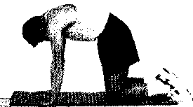

1. Bắt đầu với tay và đầu gối, tay để dưới vai.
2. Giữ tay ở một nơi, ngồi xuống trên gót chân sao cho tay duỗi ra.

> **Lưu ý**: Đừng để lưng chùng. Nếu thế, bạn sẽ dồn trọng tâm lên xương sống.
> **Luân phiên thay đổi**: Không ngồi trên gót chân, uốn cong lưng sao cho nó cuộn lại hướng lên trần nhà như một con mèo.

#### Gân kheo

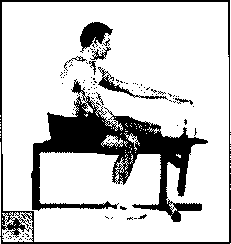

1. Ngồi trên sàn với chân trái duỗi thẳng ra trước, chân phải gấp ngược lại và ép chặt vào chân trái sao cho tạo thành hình số 4.
2. Với tay trái càng xa càng tốt hướng về ngón chân, giữ yên và lặp lại với chân phải.

> **Luân phiên**: Để làm giảm trọng tâm ở lưng dưới, ngồi trên gờ của một cái ghế (hay giường) với chân trái duỗi thẳng trên ghế và lòng bàn chân phải đặt ở dưới sàn nhà. Đặt tay phải trên đầu gối phải, duỗi tay trái hướng về ngón chân trái, giữ yên và lặp lại với chân phải.

#### Háng

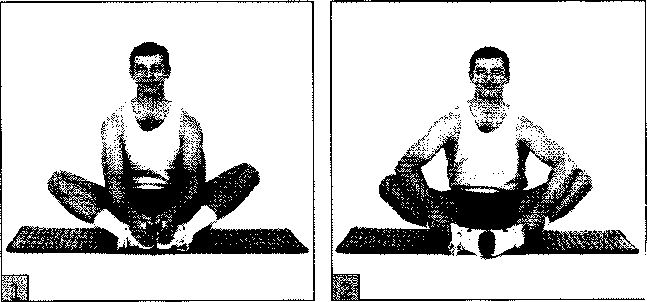

1. Ngồi trên sàn, cong chân như tư thế hình con ếch, chạm 2 lòng bàn chân lại với nhau.
2. Giữ 2 lòng bàn chân chập lại với nhau, tay hay cùi chỏ từ từ nhấn đầu gối hướng về dưới sàn. Giữ nguyên.

#### Bùi

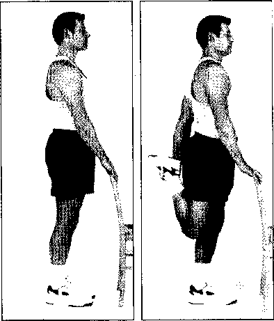

1. Đứng dậy, chân giang rộng ngang vai. Dùng tường hay ghế để hỗ trợ.
2. Uốn cong đầu gối phải và nắm lấy tay phải để giữ cơ thể đối diện với tường hay ghế. (Lưu ý là tay và chân tiếp xúc ở phía đối diện). Kéo chân phải lên sao cho gót chân chạm mông. Giữ và lặp lại với chân trái.

> **Lưu ý**: Để giảm trọng tâm vào đầu gối, giữ chân mà bạn đang đứng hơi cong nhẹ một chút.

#### Lưng dưới và mông

1. Nằm ngửa, tay thẳng với chân trái, duỗi thẳng chân phải, đặt bàn chân trái xuống sàn bên cạnh đầu gối phải.
2. Xoắn hông ở phần eo trong khi giữ nguyên cho phần cơ thể phía trên, thả đầu gối trái cong hướng về phía sàn bên phía phải, hạ càng thấp càng tốt, miễn cảm thấy dễ chịu. Bằng cách giữ cho vai trái nâng lên khỏi sàn nhà, bạn sẽ được hưởng lợi từ phía lưng dưới và vai. Giữ nguyên. Trở về vị trí ban đầu và lặp lại phía bên kia.

#### Bắp chân

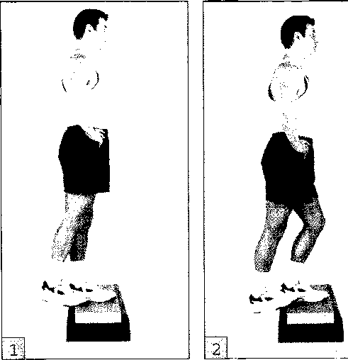

1. Đứng trên bục sao cho gót chân phải đặt ngoài mép của bục.
2. Hạ gót chân xuống dưới mức của bục cho đến khi chân giật mạnh ra phía sau của phần chân dưới. Giữ và lặp lại với chân trái.

> **Thay đổi**: Đứng cách 90-120cm (3-4ft) trước tường với chân giang rộng bằng vai và ngón chân hướng về trước. Bước chân trái tới sao cho đầu gối chân trái cong, chống tay vào tường, trong khi đó giữ nguyên chân phải, gót chân bằng dưới sàn. Hướng nghiêng càng xa càng tốt miễn cảm thấy thoải mái. Đứng cách xa tường nhằm tăng cường độ co giãn linh hoạt.

#### Sườn và lưng dưới

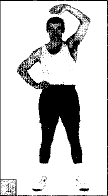

1. Đứng thẳng chân giang rộng bằng vai và đầu gối cong nhẹ. Đặt tay phải lên hông và duỗi tay trái lên trên đầu, lòng bàn tay đối lại cơ thể.
2. Cong eo hướng về phía tay phải, với tay trái qua đầu hướng về bên phải càng xa càng tốt. Giữ nguyên và lặp lại phía đối diện.

#### Hông và đùi

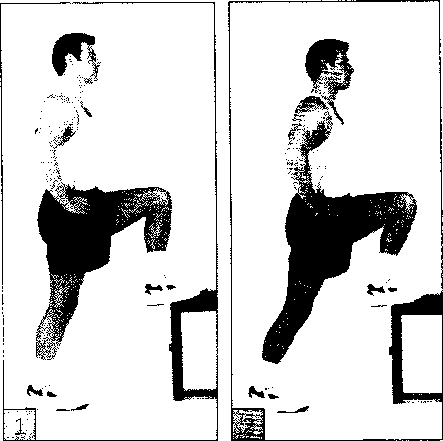

1. Đặt mu tròn của chân trái trên bậc (chỗ gần ngón chân cái), bậc thứ 3 của tầng cầu thang, hay một chỗ bằng phẳng chắc chắn có cùng chiều cao tương tự, lòng bàn chân phải đặt nhẹ trên sàn, đầu gối cong nhẹ.
2. Đặt tay lên hông, nghiêng về trước chân trái, hướng hông theo và giữ thân mình thẳng (đừng để gối trái duỗi quá ngón chân trái). Giữ nguyên. Lặp lại phía bên phải.

#### Ngực

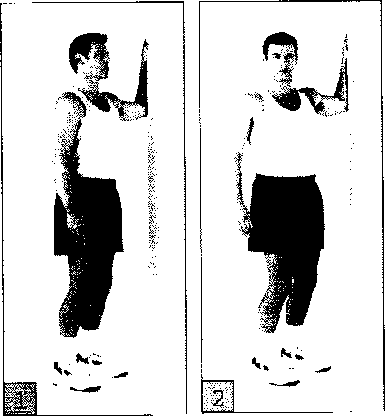

1. Đứng ở lối đi ở cửa hay rìa của bức tường, chân giang rộng bằng vai. Tay trái cong góc 90 độ, đặt tay và cẳng tay áp vào tường sao cho phần tay trên song song với sàn nhà và cẳng tay dọc theo tường.
2. Từ từ xoay người hướng về phía vai phải sao cho tay trái nâng cao được kéo nhẹ bên cạnh thân mình. Giữ nguyên, lặp lại với tay phải.

#### Cơ tam đầu (Bắp thịt to ở bắp tay trên)

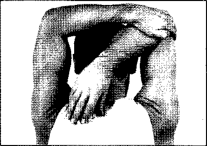

Đứng giang chân rộng ngang vai và cong nhẹ đầu gối. Giơ 2 tay lên đầu, uốn cong cùi chỏ. Dùng tay trái nắm cùi chỏ phải và nhẹ nhàng kéo cùi chỏ phải hướng về tay trái cho đến khi cảm thấy có một sự căng nhẹ về phía trên của tay phải và vai. Giữ nguyên, lặp lại với tay trái.

#### Cổ

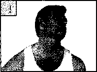

1. Đứng dạng chân rộng bằng vai, lưng và cổ thẳng, vai thả lỏng và mắt nhìn thẳng phía trước. Đây là tư thế bắt đầu.
2. Từ từ quay đầu sang phải càng xa càng tốt. Giữ nguyên, lặp lại bên trái.
3. Từ tư thế bắt đầu, từ từ hạ thấp cằm xuống đến ngực (không cong vai) cho đến lúc bạn cảm thấy có một sự căng nhẹ cơ ở phía sau cổ. Giữ nguyên.
4. Từ từ nghiêng nhẹ đầu lên trên cho đến khi bạn nhìn thẳng lại, giữ nguyên.

> **Lưu ý**: Đừng lắc lư đầu khi đang liên tục chuyển động, điều này tạo áp lực lên xương sống phía trên nhất là khi đầu nghiêng về sau sao cho mắt hướng lên trần nhà.

## LUYỆN TẬP ĐỂ CƠ THỂ CÓ SỨC BỀN TRONG MỌI TÌNH HUỐNG

Luôn có những người đàn ông muốn chứng minh bản thân và có lẽ là đối với thế giới rằng họ hiểu được cần trải qua những gì để kéo bật được sức bền trong mọi tình huống. Cho dù là nó có trên mức trung bình của cá nhân hay một cuộc thi thể thao 3 môn phối hợp, thì mục tiêu cao cần sự cống hiến và thời gian, nhưng với những người đã thành công thì họ nói những nỗ lực là xứng đáng.

### LUÔN TRONG TÂM TRÍ

Muốn tăng sức bền mà không cần phải luyện tập chăm chỉ? Hãy quên việc này đi; bạn sẽ không cảm thấy mệt mỏi nữa. Trong một nghiên cứu, có 2 nhóm đi xe đạp đứng yên một chỗ cùng tiêu hao một lượng năng lượng như nhau trong vòng 15 phút đạp bàn đạp, nhưng một nhóm được bảo cố gắng nhớ tên của giáo viên đã dạy mình trước đây thì việc tăng sự ráng sức rõ ràng thấp hơn nhóm kia, chỉ tập trung vào bài luyện tập của mình.

### CHẾ ĐỘ LUYỆN TẬP

Bạn muốn đạt được nhiều thứ mà việc tập luyện thể thao mang lại hơn là một cuộc sống dài hơn, sức khỏe tốt hơn và một cái nhìn sắc bén hơn? Được rồi, vậy là bạn đang định chuyển sang một trình độ luyện tập khác. Vì luyện tập để có một sức bền trong mọi tình huống thì cơ bản khác biệt so với chỉ là những bài tập: nghĩa là bạn đang hướng đến một mục tiêu riêng biệt với một khoảng thời gian cụ thể.

Luyện tập đòi hỏi một cách tiếp cận quan trọng hơn vì không có nhiều phòng tập cho sự chểnh mảng. Trong khi việc thỉnh thoảng không quy định ngày nghỉ sẽ không cần thiết phá hỏng chương trình của bạn, thì một mô hình phù hợp của việc thiếu tiến triển sẽ thất bại, đặt bạn vào vị thế căng thẳng ngay tại thời điểm mà tình huống xảy ra. Điều này làm cho tình huống trở nên khó khăn hơn và rất có khả năng, kết quả sẽ làm bạn thất vọng. Sau đây là những việc cần làm để bắt đầu cho môn thể thao 3 môn phối hợp căn bản: đạp xe, chạy bộ và bơi lội:

#### Đạp xe

Mục tiêu sức bền cho một người đạp xe không chuyên là một trăm, đạp 100 dặm trong một ngày, đây là bước chuẩn bị cho nhiều tuần luyện tập.

Đây chắc chắn là một mục tiêu xứng đáng nếu cơ thể bạn có thể chịu được, nhưng hầu hết các chuyên gia khuyên rằng những người mới bắt đầu cần hướng đến việc ít mệt hơn nhưng vẫn giữ được ấn tượng, đó là trăm mét, 100 km (62 miles) trong một ngày. Kể cả khi bạn luyện tập trăm dặm, bạn cũng sẽ phải cần đạt được mốc trăm mét trong suốt quá trình luyện tập. Vì thế hãy nhắm vào mục tiêu thấp hơn, sau đó tiếp tục luyện tập nếu bạn muốn gặt hái được nhiều hơn.

Mấu chốt của chương trình là đạp xe 6 ngày một tuần. Một ngày (cố gắng là vào thứ Bảy) là ngày đạp quãng đường dài, và một ngày (thứ Năm là thích hợp hơn) bạn sẽ nghỉ. Mỗi tuần, bạn dần tăng tổng quãng đường của tuần, nhất là vào ngày chạy quãng đường dài khoảng 10 đến 12%.

Quãng đường bạn đạp hàng ngày biến đổi, đạp dài hơn và sau đó ngắn hơn. Tốc độ cũng biến đổi, theo ba biện pháp: đi từng bước, sự nhanh và dễ dàng.

- **Đi từng bước**: Đây là tốc độ mà bạn sẽ đạp vào ngày bạn hoàn tất mục tiêu một trăm. Kế hoạch cho mục tiêu trăm mét sẽ mất 3 đến 4 giờ để hoàn tất, tùy thuộc vào địa hình đồi núi thế nào. Hầu hết các cuộc luyện tập đạp xe sẽ ở tốc độ vừa phải.
- **Nhanh**: Khoảng 3-5 km (2-3 miles) trên một giờ.
- **Dễ dàng**: Đạp thong thả.

Việc kết hợp giữa những quãng đường và vận tốc khác nhau đem lại một nỗ lực và hồi phục đẩy bạn tiến tới mục tiêu của mình.