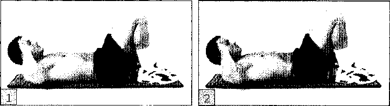
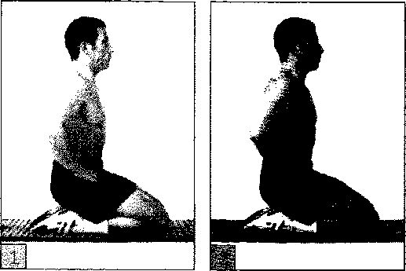
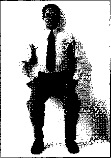
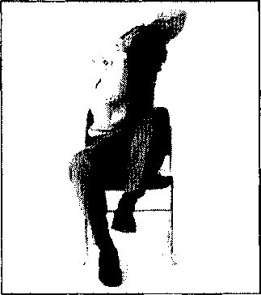

###### CHẠY

Nếu bạn muốn một thử thách mạnh mẽ, không gì có thể bằng một cuộc chạy marathon toàn bộ hay chỉ hơn 58km (26 dặm), mục đích là thay vì phải chạy một cuộc marathon nửa chừng - một mục tiêu mà bạn hoàn toàn có thể hy vọng đạt được trong 8 tuần tập luyện. Giả định rằng bạn khá phù hợp và một tuần chạy 3 lần 3 dặm.

Kế hoạch (xem ô bên dưới) bao gồm chạy nhiều hơn (4 ngày một tuần thay vì 3 ngày), dần dần tăng khoảng cách hàng tuần lên. Đừng lo lắng về tốc độ chạy, từ khi thiết lập mục tiêu - kể cả khi nếu bạn đang tính thi đấu, đơn giản chỉ là hoàn thành quãng đường một cách thoải mái chứ không phải là tốc độ trong một cuộc đua.

###### CHẠY: KẾ HOẠCH MARATHON MỘT NỬA

- **TUẦN 1**: Thêm 5km đường chạy nữa trong ngày thứ 4. Từ đây, bạn sẽ chạy 4 ngày một tuần, thường chạy quãng đường dài hơn. Vạch ra ngày nghỉ ngơi trước và sau ngày chạy quãng đường dài nhất.
- **TUẦN 2**: Chạy 6km ở một trong những ngày chạy.
- **TUẦN 3**: Thêm một phần chạy 6km lần thứ 2, luân phiên thay thế quãng đường 6km với 5km, sao cho lịch trình của quãng đường sẽ là 6-5-6-5. Khi cần thì hãy dành ra một ngày để nghỉ.
- **TUẦN 4**: Đã đến lúc bắt đầu thử thách chính bạn, chạy 6km trong 3 ngày và 8km trong ngày thứ 4. Nghỉ một ngày trước và sau khi chạy quãng đường 8km.
- **TUẦN 5**: Tiếp tục tăng quãng đường chạy, thêm 8km chạy nữa, và biến ngày chạy quãng đường dài nhất là 10km, sao cho lịch trình của quãng đường chạy sẽ là 10-6-8-8.
- **TUẦN 6**: Bạn vẫn đang chạy 6km và 8km, nhưng trong ngày chạy quãng đường dài, hãy cố thành 13km. Lúc này lịch trình sẽ là: 13-6-8-6.
- **TUẦN 7**: Bắt đầu nâng 13km chạy thành 16km - một quãng đường mà chỉ chiếm 2/3 mục tiêu của bạn. Nếu bạn có thể làm bây giờ, tuần sau bạn sẽ khá hơn khi bạn chạy marathon một nửa. Lịch trình sẽ là: 16-6-8-8.
- **TUẦN 8**: Giảm dần ngay khi bạn đạt đến ngày chạy được marathon một nửa ở cuối tuần. Quay lại với quãng đường bạn đã chạy trong tuần 3, 6-5-6-5. Nghỉ ngày thứ 7 và chủ nhật hãy bắt đầu chạy marathon một nửa.

###### BƠI

Trừ khi bạn có sợ lựa chọn ở những vùng nước thoáng, đây là một hình thức luyện tập nơi mà có phong cảnh hơn là sự tẻ nhạt. Nếu bạn đã bơi mỗi lần nửa tiếng, 3 lần trong một tuần ở hồ bơi, thì bạn hoàn toàn có thể muốn bơi mạnh hơn, nhanh hơn, tốt hơn bạn vẫn thường như thế.

Những gì bạn nhắm tới là mốc của cuộc thi, bơi 100-mét tự do. Và đừng chỉ nhắm đến việc đạt được khoảng cách tốt nhất của một người, hãy nhắm đến việc chiến thắng. Điều này sẽ khác biệt gần như là huấn luyện, trong đó kiểu bơi xả hơi, thong thả sẽ không còn nữa. Thay vào đó, bạn cần tập trung vào một cách thức hoàn chỉnh, luyện tập sức mạnh và tăng tốc.

Những kỹ năng bạn sẽ phải cần trợ giúp của huấn luyện viên hay người hướng dẫn. Phần còn lại bạn có thể tự mình làm được. Chương trình dựa trên sự luân phiên giữa những ngày dễ và khó, 5 buổi luyện tập căng trong một tuần. Vào thứ Hai và thứ Tư, tập trung vào aerobic và độ bền tim mạch. Vào thứ Ba và thứ Năm, thì tập độ bền cơ bắp và sức mạnh. Vào thứ Sáu, nỗ lực tập mọi thứ, tất cả trong 1 lần.

Theo sát chương trình trong suốt 8 tuần trước cuộc thi. Ghi lại những hướng dẫn chung đơn giản mỗi tuần. Một ngoại lệ: trong suốt 8 tuần đó, hãy nghỉ 2 ngày trước cuộc thi.

- **Thứ 2 và thứ 4**: Bao quát từ 1,500 đến 2,000 mét trong đoạn mà bạn chọn lựa, chẳng hạn như 100 mét hay 500 mét, nghỉ 30 giây sau mỗi phần. Ví dụ, bạn có thể bơi 1,500 mét trong 15 phần của 100 mét, hay 3 lần 500 mét. Thay đổi khoảng cách đoạn khi bạn đạt được sức bền và thể lực khá hơn. Chẳng hạn, nếu bạn bắt đầu với đoạn 100 mét, sau đó bạn nên bơi thêm đoạn 500-mét. Bơi ở tốc độ khoảng 70% sức lực.
- **Thứ 3 và thứ 5**: Tập trung vào sức bền và tốc độ. Bơi cùng khoảng cách như vào thứ 2 và thứ 4, nhưng cố khoảng 80% toàn lực và nghỉ 15s sau mỗi đoạn.
- **Thứ 6**: Dốc toàn lực: bơi 4 đoạn 100 mét với 90% sức lực, đừng nghỉ giữa các đoạn, thay vào đó, tiếp tục bơi 50 mét với 60% sức lực.

Để bơi tốt ở nội dung 100m tự do, bạn cần phải hoàn thiện kiểu bơi, luyện tập sức bền và tăng tốc.

##### ÍCH LỢI CỦA VIỆC LUYỆN TẬP CHÉO

Luyện tập chéo bao gồm kết hợp 2 hay nhiều kiểu bài tập trong một kế hoạch bơi. Nghe có vẻ hơi đặc biệt, nhưng nó là dạng bài tập mà bạn đã bơi nhiều lần rồi. Nếu bạn đã dịch chuyển bàn ghế trong một ngày nào đó, xoay sang một cửa hiệu và thực hiện làm vườn nữa, nghĩa là bạn đã luyện tập chéo.

###### BÀI TẬP KHÔNG THỜI GIAN

Luyện tập chéo bao gồm bất kỳ dạng nào của hoạt động thể chất mà phù hợp với lịch trình luyện tập của bạn cho dù bạn có đi đến phòng tập hay thậm chí thay đổi quần áo luyện tập. Sau đây là một vài cách:

- Đi bộ đến chỗ làm hay chạy đến ga tàu.
- Dẫn chó đi dạo.
- Dạo bộ với một cái ghế đẩy.
- Đi thang bộ giữa các tầng trong tòa nhà nơi bạn sống hay làm việc.
- Chơi thể thao với con trẻ trong công viên hay vườn.
- Làm một vài việc vặt trong vườn bằng tay hay các dụng cụ bằng tay hơn là các dụng cụ máy móc để cắt cỏ, tỉa xén hàng rào, nhổ cỏ dại, cào lá cây.

###### CỐT LÕI CỦA LUYỆN TẬP CHÉO

Luyện tập chéo pha trộn giữa những dạng bài tập khác nhau, những ai thích thú với luyện tập thể hình toàn diện cần thiết tham gia vào luyện tập chéo vì những dạng bài tập khác nhau thì cần thiết để đạt được sức bền cơ bản.

Trong nhiều năm, các huấn luyện viên và hướng dẫn viên nghĩ rằng luyện tập sức bền và thể lực đồng thời là phản tác dụng theo một cách nào đó. Ý của họ là bằng cách luyện tập cả 2 một lúc, bạn sẽ không làm tốt cái nào cả và một dạng bài tập sẽ ảnh hưởng đến ích lợi mà bạn có được từ bài tập kia.

Cách nghĩ này có cơ sở dựa trên nguyên lý căn bản của sinh lý học gọi là nguyên lý đặc trưng. Nó chỉ ra rằng cơ bắp có thể phát triển tốt nhất trong các hoạt động đặt thù như cử tạ hay đạp xe khi được huấn luyện chỉ theo cách đó. Với lý do này, bạn sẽ không trở thành một chuyên gia đạp xe hay cử tạ, hoặc ngược lại.

Nguyên lý đặc trưng vẫn còn tồn tại như là một huấn lệnh, nhưng ngay cả những vận động viên nghiêm túc ngày nay cũng nhận ra rằng một bất đồng nho nhỏ cũng có thể phá hỏng tính đơn điệu của việc luyện tập quá sức, lộ trình lặp đi lặp lại, tạo cân xứng và ngăn ngừa bị thương. Nghiên cứu chỉ ra rằng luyện tập chéo thực ra không gây trở ngại nhiều lắm đến việc huấn luyện đặc thù trong thể thao. Một nghiên cứu thậm chí còn đề xuất rằng luyện tập sức bền làm giảm tần suất nghỉ ngơi của tim, có ích cho tim (dù trở bên bền bỉ hơn sẽ không cần thiết phải cải tiến việc luyện tập). Ít ra, các huấn luyện viên ngày nay nhận thấy rằng, luyện tập chéo không gây hại. Và đối với toàn bộ việc luyện tập thể hình, thì đây là phương pháp được ưa thích hơn.

Một trong những lợi thế nhất của luyện tập chéo là tỷ lệ đốt cháy mỡ. Tập sức bền và aerobic chung giúp đốt mỡ nhiều hơn là các dạng bài tập khác.

Luyện tập chéo là cơ hội để kết hợp các bài tập hay động tác vào chế độ luyện tập của mình, phù hợp với lịch trình và phong cách sống. Những điều này rất đơn giản. Hãy đi thang bộ ở chỗ làm hơn là đi thang máy và nhổ cỏ dại trong vườn cũng là 2 hoạt động góp phần trong chương trình luyện tập chéo.

###### THẾ NÀO LÀ NGƯỜI ĐÀN ÔNG THÉP

Việc tập luyện chéo có ý nghĩa nhất đối với những người đang chuẩn bị cho một sự kiện nghiêm túc, chẳng hạn như cuộc đua 3 môn phối hợp, một cuộc đua đường dài gồm có các đoạn chạy, bơi và đi xe đạp. Nếu bạn muốn trở thành người đàn ông thép, hãy thử xem chương trình tập luyện của một vận động viên 3 môn phối hợp như thế nào bằng cách thử thói quen hằng ngày của vận động viên mới bắt đầu này.

Ngoài việc thay đổi các khoảng cách như được liệt kê, cũng cần thay đổi nhịp độ. Chẳng hạn, trên các cuộc đi chơi lâu hơn, hãy giảm nhiệt độ để bảo toàn năng lượng. Vào các ngày khác, hãy đi các quãng ngắn với nhịp cường độ cao, sau đó là các quãng dài hơn, cường độ thấp hơn để bạn duy trì nhịp độ vừa phải.

Một vận động viên 3 môn phối hợp chạy vài mét cuối để đến đích. Chương trình tập luyện ở trên cho bạn nếu trải cuộc sống của người đàn ông khác.

| Ngày       | Bơi    | Chạy  | Đạp xe |
|------------|--------|-------|--------|
| Thứ Hai   | 1100m | 6km   | -      |
| Thứ Ba    | -      | -     | 24km   |
| Thứ Tư    | 1600m | 10km  | -      |
| Thứ Năm   | -      | 10km  | 24km   |
| Thứ Sáu   | 1400m | 6km   | -      |
| Thứ Bảy   | -      | 40km  | -      |
| Chủ Nhật  | -      | 8km   | 24km   |

###### THỬ THÁCH CỦA MÔN THỂ THAO 3 MÔN PHỐI HỢP

Vào giữa những năm 1970, một nhóm các vận động viên chạy ở miền Nam California, được truyền cảm hứng từ những huấn luyện cứu đắm ở địa phương, quyết định kết hợp giữa chạy bộ, bơi lội và đạp xe vào trong một chương trình luyện tập. Vậy là môn thể thao 3 môn phối hợp được hình thành. Một trong những người tiên phong đã đem ý tưởng sang Hawaii, nơi mà ông tổ của cuộc thi 3 môn phối hợp, người thép, được sinh ra bằng cách kết hợp 3 cuộc đua nhừ tử vào thành một bài tập 140 dặm. Thật đáng kinh ngạc, ý tưởng đã được truyền lửa vào hiện nay có khoảng 2,000 cuộc thi 3 môn thể thao phối hợp được tổ chức đơn thuần ở Mỹ và nhiều nơi trên thế giới.

Quãng đường của mỗi đoạn rất đa dạng và không có một định nghĩa chắc chắn nào cho việc một môn thể thao 3 môn phối hợp kéo dài bao lâu, dù dạng thức phổ biến là tiêu chuẩn quốc gia, bao gồm bơi 1500-mét, đua xe 40-kilomét, và chạy 10-kilomét. Dù nhiều thử thách tột cùng (nếu không hải là điên rồ) đã diễn ra từ khi phát triển, việc tham gia 3 môn thể thao phối hợp (nhất là cuộc thi Người thép) đã tồn tại như là đỉnh cao thành tựu của các vận động viên.

Khởi đầu môn thể thao 3 môn phối hợp là ở Parana, Brazil từ lúc mới bắt đầu, đến nay đã phát triển và trở nên phổ biến.

###### PHA TRỘN VÀ HÀI HÒA

Khi bạn đến với bài tập pha trộn và hài hòa, điều gì chi phối sự lựa chọn của bạn? Các vận động viên ưu tú nhất có khuynh hướng tham gia vào các động tác trong bài tập có cùng nhóm cơ bắp được sử dụng trong những môn thể thao hàng đầu. Vì thế, ví dụ, một người chạy bộ hàng đầu sẽ luyện tập đạp xe. Nhưng đối với những người đơn thuần như chúng ta, người đơn giản chỉ muốn đưa sự đa dạng vào trong chương trình luyện tập thể hình chung, thì cách tốt nhất là pha trộn những động tác khác nhau.

Mẹo là hài hòa các bài tập mà cân bằng với những bài tập khác, mỗi bài tập sẽ có những lợi thế mà những động tác khác không có. Đó là tất cả mất đề của việc bạn hiểu nghĩa của từ "cân bằng" như thế nào, đây là 3 nguyên lý pha trộn giúp hướng dẫn bạn lựa chọn:

- Hài hòa kỹ năng với sự lặp lại. Có những dạng bài tập cố định, như là chạy và bơi, bao gồm những động tác quen thuộc và lặp lại trong đó tâm hồn trở nên thư thái. Hài hòa chúng với những môn thể thao khác yêu cầu kỹ năng ở cấp độ cao, sao cho cơ thể và tâm hồn hoàn toàn khác hướng. Những hoạt động đòi hỏi kỹ năng cao bao gồm trượt tuyết, đá banh, đạp xe leo núi, quần vợt sân trường và golf.
- Hãy kết hợp cứng và mềm. Những môn thể thao có lực va chạm mạnh cao, như chạy và tennis, có thể gây chấn động khớp. Hãy pha trộn trong những môn thể thao ít lạm dụng cơ thể. Ví dụ tốt nhất là đạp xe, bơi và chèo thuyền.
- Kết hợp trên và dưới. Vấn đề lớn nhất đối với chạy và đạp xe là cả hai đều nhắm đến việc hạ thấp cơ thể, nhưng lại không tận dụng phần cơ thể trên. Mục tiêu là làm sao cho cả cơ thể cùng hoạt động. Những kết hợp có thể bao gồm danh sách bên dưới. Hãy kết hợp bất kỳ môn thể thao nào ở cột bên tay trái với cột bên phải.

- Đi bộ - Bơi lội
- Chạy bộ - Chèo thuyền
- Đạp xe - Bơi xuồng/xuồng kayak
- Trượt tuyết - Tennis

###### BA CÁCH CHO VIỆC TẬP LUYỆN TẬP THỂ DỤC CỦA BẠN TRỞ NÊN THÚ VỊ HƠN

Mặc dù bạn đặt ra hàng loạt dự định hay ho để duy trì được cả khóa tập luyện. Tuy nhiên việc đặt ra kế hoạch luyện tập chiếm phần quan trọng trong suốt một quá trình luyện tập. Những mẹo nhỏ dưới đây sẽ góp phần đạt đến mục tiêu trong quá trình tập luyện của bạn.

1. Hãy viết ra lịch tập luyện của bạn. Ghi lại ngày bạn bắt đầu luyện tập. Việc làm này không chỉ lưu lại ngày luyện tập của bạn diễn ra như thế nào mà còn tạo cho bạn sự nỗ lực để đạt được kế hoạch của mình. Bạn không chỉ ghi lại thời gian luyện tập với cường độ như thế nào mà hãy ghi chép lại chi tiết chẳng hạn ghi lại những suy nghĩ của mình trong quá trình luyện tập hay là việc bạn đã cảm thấy mệt mỏi ra sao. Mẩu ghi chép này hoàn toàn cho bạn thấy được những việc bạn đã đạt được và những việc bạn chưa làm được, từ đó bạn có thể điều chỉnh chương trình luyện tập để đạt được hiệu quả một cách tối ưu nhất.
2. Mời bạn bè cùng tham gia khóa luyện tập. Tập một mình dễ khiến cho bạn lười biếng và nản chí. Tuy nhiên, việc rủ ai đó như bạn bè, đồng nghiệp cùng luyện tập với mình có thể tạo động lực cho bản thân, khắc sâu tình cảm bạn bè, tạo nguồn cảm hứng, kể cả tính cạnh tranh. Việc tập luyện cùng bạn bè cũng thúc đẩy bạn bởi vì bạn sẽ không muốn bỏ lỡ buổi tập hoặc đến trễ nếu bạn bè của mình đang đợi mình đến tập cùng.
3. Đảm bảo thuận tiện cho chương trình tập luyện. Bạn hãy chọn lựa những không gian thích hợp và tiện lợi nhất, ở gần nhà hay gần nơi làm việc của mình chẳng hạn. Việc bạn phải đi càng xa, thậm chí càng nhiều rắc rối phát sinh thì mục tiêu cho việc tập luyện cũng khó mà đạt được.

##### NHỮNG BÀI TẬP DÀNH CHO BỤNG

Bạn hãy suy nghĩ thật kỹ: chỉ tập thể dục thôi cũng chưa đủ giảm béo bụng. Bạn cũng cần kết hợp với những bài thể dục nhịp điệu dành riêng cho bụng. Bên cạnh việc làm bụng thon gọn, các bài tập luyện cũng cần thiết giúp bạn khỏe mạnh bởi lẽ bụng là bộ phận trung tâm đảm nhiệm vai trò di chuyển, vận động của cơ thể.

###### BẠN CÓ BIẾT?

Những bài thể dục được học ở trường không có công dụng bằng những bài thể dục dành cho bụng. Bởi các bài thể dục ở trường chỉ chú trọng ở phần thắt lưng mà không liên quan nhiều đến phần bụng. Chỉ có hoạt động của phần hông chiếm đa phần trong các bài thể dục này.

###### PHẦN BỤNG HOẠT ĐỘNG NHƯ THẾ NÀO?

Các bắp thịt ở phần bụng gồm 4 nhóm được xếp thành lớp ở phía trước và cả phía sau cơ thể. Các bắp thịt này rất cần thiết trong việc giữ cho cơ thể vững chắc, cho phép bạn uốn cong người hay gập người trong việc tạo ra những tác động đòn bẩy với những bộ phận khác của cơ thể. Các bắp thịt này cũng hỗ trợ cho xương sống, vì thế các bắp thịt ở bụng làm giá đỡ hỗ trợ cho lưng và hạn chế các cơn đau thắt lưng. Bắp thịt bụng khỏe mạnh cũng góp phần cho một vóc dáng thẳng, đẹp.

###### BẮP THỊT BỤNG RẮN CHẮC THẬT SỰ NHƯ THẾ NÀO?

Việc tập thể dục cho phần bụng sẽ dần làm eo bạn trở nên thon thả, điều đó có đúng không? Sai hoàn toàn. Ta không thể tin hoàn toàn theo như lý thuyết của các bài thể dục. Tập luyện các bài thể dục dành cho bụng sẽ không đốt cháy hết lớp mỡ quanh bụng, dù cho bạn đã sở hữu được các bắp thịt bụng săn chắc và đẹp bên dưới lượng mỡ thừa.

Bụng là bộ phận đầu tiên tích trữ lượng mỡ của cơ thể và lại là bộ phận cuối cùng chuyển hóa năng lượng. Không chỉ do gen di truyền mà dẫn đến việc sở hữu "mấy chiếc bụng bia" mà còn do quá trình họ đã ăn quá nhiều chất béo trong những năm trước đó, bởi vì quá trình trao đổi chất chậm và nhu cầu tiêu hao calo ít lại gắn liền với chế độ dinh dưỡng cũng dẫn đến tình trạng béo bụng.

Để tống khứ cái bụng mỡ béo, bạn cần phải có một chế độ dinh dưỡng đảm bảo sức khỏe, những bài thể dục nhịp điệu đốt cháy lượng mỡ và một thân hình cơ bắp khỏe mạnh. Tất nhiên bạn cũng phải duy trì việc luyện tập các bài thể dục dành riêng cho bụng nếu bạn luôn muốn sở hữu thân hình thon gọn, bắp thịt rắn chắc.

###### KẾ HOẠCH TẬP LUYỆN NHƯ THẾ NÀO?

Bạn không nhất thiết phải tập hết tất cả các bài tập được mô tả ở phần này, nhưng bạn nên chú ý đến những cơ xiên cũng như các cơ bắp phần bụng. Cũng cần xác định các cơ bắp được mô tả thông qua việc xem các minh họa như "các bắp thịt bụng nằm ở đâu". Khi luyện tập thể dục bạn nên nhớ phải dùng đệm để tránh chấn thương phần lưng.

###### LỊCH LUYỆN TẬP

Khi bạn luyện tập các bài thể dục dành cho phần bụng, bạn sẽ thấy được những cơ bắp này.

1. **Các cơ xiên ở bên trong**: Cơ xiên bên trong nằm ngay bên dưới của các cơ xiên bên ngoài, liên kết bốn xương sườn nằm ở cuối với khung xương chậu. Các cơ xiên cũng giúp bạn có thể uốn cong người, theo sự di chuyển của các cơ xiên bên trong.
2. **Các cơ bụng ngang**: Các cơ ngang này nằm bên dưới các cơ bụng thẳng, tạo nên một phiến cơ chạy dọc thành bụng, hỗ trợ cho các cơ quan bên trong.
3. **Các cơ bụng dọc**: Phần cơ này nằm ở dưới phần ngực và chạy dọc xuống dưới phần khung xương chậu. Chính những cơ bụng này mới liên quan đến khái niệm “cơ bụng”, bởi vì khi các cơ này săn chắc, vùng bụng mới thật sự thon gọn.
4. **Các cơ xiên bên ngoài**: Các cơ này chạy xuống theo các hướng cơ thể giữa phần ngực và phần xương chậu. Phần cơ này làm việc ngược lại với những phần cơ khác (một phần cơ thể bạn nghỉ ngơi, phần khác lại phải hoạt động), các cơ xiên cho phép cơ thể uốn cong người và giúp cho quá trình trao đổi chất.

###### NHỮNG BẮP THỊT BỤNG NẰM Ở ĐÂU?

Các cơ bụng nằm giữa những phần cơ bắp khác của cơ thể phải hoạt động mỗi ngày dù phần bụng được cho là quan trọng nhất.

Các cơ bụng có thể sẽ khỏe hơn, dẻo dai hơn khi ta nâng số phần lặp lại của động tác nhằm tăng cường sức khỏe và sự dẻo dai. Bạn hãy duy trì số nhịp mỗi lần tập và cố gắng tăng số nhịp lên 10% mỗi tuần, bạn hãy cố gắng tập hết sức.

Khi bắt đầu các bài thể dục, bạn hãy cố gắng làm nóng các phần cơ chủ yếu. Bạn cũng nên sáng tạo ra một lịch tập dành riêng cho mình, sau đây sẽ là một ví dụ. Chẳng hạn: thứ 2, thứ 4 và thứ 6 bạn tập các bài tập thắt chặt người và tay không trong khi thứ 3, thứ 5, thứ 7 bạn luyện tập các bài tập cho phần cơ xiên và nghỉ ngơi vào Chủ nhật.

Các cơ bụng chia ra phần trên và phần dưới là một quan niệm không đúng. Các cơ bụng thẳng đứng là phần cơ bắp nhỏ. Tuy nhiên, bạn hoàn toàn có thể lựa chọn những bài thể dục có tác dụng cho vùng trên lẫn dưới của phần cơ này.

Ví dụ, các bài tập vặn người tác động từ 90 đến 100% đến phần dưới của cơ bụng, trong khi đó các bài tập nhấc hông có tác dụng ở mức 30%. Tuy nhiên, khi ta đặt mục tiêu cho phần bụng dưới, chỉ số này hầu như đổi ngược lại.

###### CÁC BÀI TẬP THẮT CHẶT NGƯỜI CƠ BẮP

1. Đặt lưng nằm thẳng, đặt tay lên vùng thái dương hoặc đặt tay sau tai (chú ý không ôm lấy phần sau cổ), cũng có thể đan chéo hai tay và đặt trước ngực. Đặt đầu của bạn cách mặt đệm vài cen-ti-mét, cằm gập hướng về phía trước. Duỗi thẳng chân, kế đó bạn nâng từng chân một lên khoảng 15 cen-ti-mét sao cho tại đầu gối tạo thành góc 45 độ (giữ cho phần cẳng chân có khoảng cách không đáng kể).
2. Nhẹ nhàng đẩy lưng của bạn, từ từ uốn thân dưới của bạn hướng về phía đầu gối, nâng phần xương bả vai của bạn lên (chú ý không vẫn giữ cho lưng nằm yên). Giữ yên khoảng một giây. Đưa trở về tư thế ban đầu, bạn chú ý không được ngừng lại giữa mỗi nhịp. Bạn hãy cố gắng tập hết sức mình, hoặc bạn lặp lại nhiều lần, mỗi lần khoảng 10 nhịp.

> **Lưu ý**: Bạn không cần phải nín thở. Hãy thở ra khi bạn thắt chặt người về phía trước, hít vào khi bạn đưa tư thế trở lại ban đầu.

###### CÁC BÀI TẬP TAY KHÔNG

Việc bạn hóp bụng lại một phần nào đó tác động đến phần bụng của bạn nếu như bạn thực hiện có phương pháp.

1. Ngồi bằng đầu gối, gập chân ra phía sau và đặt tay lên hông hay đùi. Giữ cho phần dưới cơ thể thẳng đứng, hít thật sâu.
2. Hóp bụng vào và thở ra liên tục. Giữ lại trong năm giây rồi lặp lại. Hít thở bình thường, tiếp tục lặp lại. Thực hiện 2 hoặc 3 lần động tác này, mỗi lần 10 nhịp.

###### CÁC BÀI TẬP CUỘN NGƯỜI

Tác động tới phần dưới của cơ bụng.

1. Bạn đặt lưng trên tấm đệm, hai chân chụm lại, hai tay duỗi thẳng đặt hai bên người. Hai chân nâng cao lên khỏi mặt đệm khoảng 15 cen-ti-mét, đầu gối hơi cong, cằm chạm vào ngực.
2. Từ từ cuộn người về phía trước, hai tay duỗi thẳng về phía chân. Giữ nguyên trong vài giây rồi trở lại vị trí ban đầu. Lặp lại nhiều lần.

###### CÁC BÀI TẬP XOẮN NGƯỜI

Tác động tới phần cơ xiên.

1. Nằm ngửa trên đệm, hai chân chụm lại, hai tay đặt sau gáy (không ôm lấy phần sau cổ), đầu gối cong, cằm chạm vào ngực.
2. Từ từ xoắn người về phía trước, khuỷu tay phải chạm vào đầu gối trái. Giữ nguyên trong vài giây rồi trở lại vị trí ban đầu. Lặp lại với khuỷu tay trái chạm vào đầu gối phải.

###### CÁC BÀI TẬP NHẤC HÔNG

Tác động tới phần dưới của cơ bụng.

1. Nằm ngửa trên đệm, hai tay duỗi thẳng đặt hai bên người, hai chân duỗi thẳng nâng cao lên khỏi mặt đệm khoảng 15 cen-ti-mét.
2. Từ từ nâng hông lên khỏi mặt đệm, giữ nguyên trong vài giây rồi hạ xuống. Lặp lại nhiều lần.

###### CÁC BÀI TẬP VẶN NGƯỜI

Tác động tới phần cơ xiên.

1. Nằm ngửa trên đệm, hai chân chụm lại, hai tay đặt sau gáy, đầu gối cong, cằm chạm vào ngực.
2. Từ từ vặn người về phía trước, khuỷu tay phải chạm vào đầu gối trái. Giữ nguyên trong vài giây rồi trở lại vị trí ban đầu. Lặp lại với khuỷu tay trái chạm vào đầu gối phải.

##### CÁC BÀI TẬP TRONG VĂN PHÒNG

Bạn đang mặc chỉnh chu. Có ít không gian và thậm chí không có thiết bị tập luyện. Bạn cũng không muốn bị sếp bắt gặp đang tập luyện ở nơi nào đó. Nhưng văn phòng là nơi cần thiết nên tập thể dục nhất vì bạn làm việc mà ít vận động, thường ngồi một chỗ và bị căng thẳng cả về thể chất lẫn tinh thần.

###### BA THÓI QUEN CẦN TRÁNH

Cổ, lưng và cổ tay là những nạn nhân chính của sự căng thẳng và căng thẳng tại nơi làm việc, và áp lực lên chúng chủ yếu do bạn ở một tư thế làm việc quá lâu.

Dưới đây là một số thói quen xấu:

1. Sử dụng bàn phím với cổ tay cong lại. Góc ở cổ tay càng lớn (thường là vì bàn phím ở vị trí quá cao), bạn sẽ càng cảm thấy căng thẳng. Hãy để bàn tay và cánh tay trong thẳng với nhau.
2. Vươn cổ để nhìn vào màn hình. Có thể màn hình của bạn được đặt quá cao hoặc bạn đeo kính hai tròng và cần nghiêng đầu của bạn để nhìn màn hình. Dù trong trường hợp nào thì cũng hãy điều chỉnh độ cao của màn hình để nó không cao hơn tầm mắt của bạn.
3. Giữ điện thoại bằng vai của bạn. Điều này là ảnh hưởng đến cổ và cơ vai. Nếu bạn thực hiện nhiều cuộc gọi trong thời gian dài, bật điện thoại ở chế độ rảnh tay hoặc đeo tai nghe.

###### ẢNH HƯỞNG CỦA CÔNG VIỆC

Cơ thể chúng ta sinh ra để vận động, nhưng thay vào đó chúng ta lại dành cả ngày ngồi trong các cuộc họp hoặc ngồi rũ trước máy tính thực hiện những công việc lặp đi lặp lại. Ngoài việc con người chúng ta ít vận động thì vị trí chúng ta làm việc cũng có thể làm căng thẳng và mệt mỏi cơ bắp nhất định, trong khi sự căng thẳng tinh thần làm chúng ta trở nên áp lực.

Mục đích của tập thể dục tại văn phòng là không chỉ để bù đắp lại sự thiếu hoạt động thể chất bình thường, mà còn ngăn ngừa chứng vẹo cổ chúng ta thường mắc phải do tư thế làm việc, cũng như ngăn giảm căng thẳng nói chung.

Ngoài các bài tập được đưa ra trong phần này, có những bước thực hiện đơn giản sau đây về thể chất giúp bạn giảm bớt căng thẳng.

- Thay đổi vị trí thường xuyên. Ở yên một vị trí quá lâu là nguyên nhân chính làm các cơ bắp cứng và căng thẳng. Dù cho công việc của bạn chiếm hết thời giờ, hãy nghỉ ngơi một lúc khoảng 10 đến 15 phút để giãn chân, di chuyển cánh tay và uốn những ngón tay của bạn.
- Hãy trò chuyện dù bận rộn. Bất cứ nơi nào có thể, hãy thử nói chuyện với các đồng nghiệp của bạn trong khi đang đi, đặc biệt là nếu bạn biết một chủ đề có thể gây căng thẳng. Nghe có vẻ lạ, nhưng nói chuyện trong khi đi giúp ta cởi mở và vui tươi hơn.
- Đi bộ sau khi ăn trưa. Mặc dù bạn không thể sắp xếp một buổi tập luyện, nhưng ít nhất bạn có thể ra ngoài để đi dạo bộ nhanh, để cho tâm trí của bạn thoải mái và đôi chân của bạn được hoạt động.
- Đứng lên bất cứ khi nào bạn trả lời điện thoại: nó cho phép sự vận động cơ bắp và tuần hoàn thay đổi, cũng như làm cho bạn năng nổ hơn.

###### NGỒI DỰA VÀO TƯỜNG

Đây là một bài tập thể dục chân chung tương đối tốt.

Đứng lưng dựa vào tường, bàn chân cách nhau khoảng chiều rộng vai. Từ từ trượt lưng bạn xuống tường khi bạn đi về phía trước, cho đến khi đầu gối bạn gập xuống làm cho bạn trông như đang ngồi trên ghế. (Để tránh căng thẳng đầu gối, hãy giữ bắp đùi bạn ở trên đầu gối). Giữ cho 5 đến 10 giây, sau đó trượt trở lại vị trí bắt đầu. Làm 5 lần như vậy.

###### ÔM VAI

Để giảm áp lực cho vai và vùng lưng trên, chéo cả hai tay lên ngực của bạn, để tay trái lên bả vai phải và tay phải lên bả vai trái.

###### NHÚNG GHẾ

Việc nhúng ghế này là cách bạn tập luyện phần cơ thể phía trên tuyệt vời.

1. Ngồi trên mép ghế với gót chân phẳng trên sàn nhà. Đặt tay lên cạnh phía trước của ghế và nhích mông ra khỏi ghế một cách cẩn thận cùng với sự hỗ trợ của tay. Giữ cho lưng thẳng.
2. Từ từ hạ thấp mình cho đến khi phần trên cánh tay tầm song song với sàn nhà, sau đó nâng lên. Làm 8 đến 12 lần.

###### CÁC ĐỘNG TÁC CHẠM KHUỶU TAY ĐẾN ĐẦU GỐI

Luyện tập phần bụng.

Ngồi thẳng lưng trên ghế, bàn chân thẳng trên sàn nhà và đan hai với nhau tay sau đầu. Nâng đầu gối trái của bạn, và gập khuỷu tay phải về phía đầu gối. Để chân trái lại xuống sàn nhà, sau đó nâng đầu gối bên phải chạm vào khuỷu tay trái. Lặp lại ít nhất 5 lần.

###### ĐỘNG TÁC NÂNG CHÂN LÊN KHI NGỒI

Vận động đùi.

Ngồi thẳng lưng trên ghế với cả hai chân dang rộng và bàn chân phẳng trên sàn nhà. Nhấc cả hai chân khỏi sàn, giữ chân thẳng, để chân và thân của bạn tạo thành một hình dạng "L". Giữ trong 5 giây và hạ thấp chân của bạn trở xuống. Sau đó lặp lại.

###### VẶN MÌNH

Vận động ngực và bụng.

Ngồi thẳng trên cạnh ghế, giơ hai tay trong tư thế đầu hàng. Giữ hông của bạn ổn định, ngã thân trên và đầu của bạn qua bên trái ra càng xa càng tốt. Giữ cho khoảng 2 giây, sau đó trở về vị trí bắt đầu. Lặp lại 3 lần ở bên trái, sau đó 3 lần bên phải.

###### GIẢM BỚT CĂNG THẲNG VỚI CÁC TRÒ CHƠI TRÍ ÓC

Hạn chót thì sắp hết, chuông điện thoại reo, ông chủ thì tức giận. Nhưng bạn vẫn có thể đôi khi thoát khỏi sự căng thẳng với các bài tập nhỏ giải phóng cơ thể trong suốt cả ngày.

- Tưởng tượng một kỳ nghỉ bằng cách hình dung về một nơi xa xôi. Bạn ở trên đỉnh núi cao, ở trên tất cả. Bạn có thể nhìn ra hàng dặm xung quanh và không có ai trong tầm nhìn. Gió thì rít qua rừng thông bên dưới. Hãy chú ý: một phần của tâm trí của bạn thực sự phải ở đó, và nó sẽ được thư giãn.
- Nhìn ra ngoài cửa sổ, và nhìn vào một cái gì đó - một con chim, một con côn trùng, một cái cây ở xa, một chiếc xe. Hãy để các giác quan của bạn thư giãn trong giây lát: nếu bạn càng nhìn và lắng nghe, bạn sẽ ít suy nghĩ và lo lắng hơn.
- Có óc kiểm soát là điều tuyệt vời đối với những người muốn thoát khỏi căng thẳng. Khi điện thoại đổ chuông, hãy nghĩ rằng, “Họ sẽ phải chờ đợi một lát.” Đầu tiên hãy hít thở sâu, sau đó mới nhấc máy.
- Mỗi giờ hoặc lâu hơn, dừng lại những gì bạn đang làm và quên đi căng thẳng mà cơ thể đang phải chịu. Đặc biệt chú ý đến bàn tay, vai, cổ, và hàm. Sau đó, dành một chút thời gian thư giãn về tinh thần các vùng căng thẳng.
- Nên có một món đồ chơi cầm tay. Nó có thể là một cục nam châm nổi, một đầu quay, một nhân vật hành động, thậm chí có thể là một khẩu súng nước. Chỉ cần nhìn nó nằm trong ngăn kéo cũng khiến bạn vô tư như một đứa trẻ.